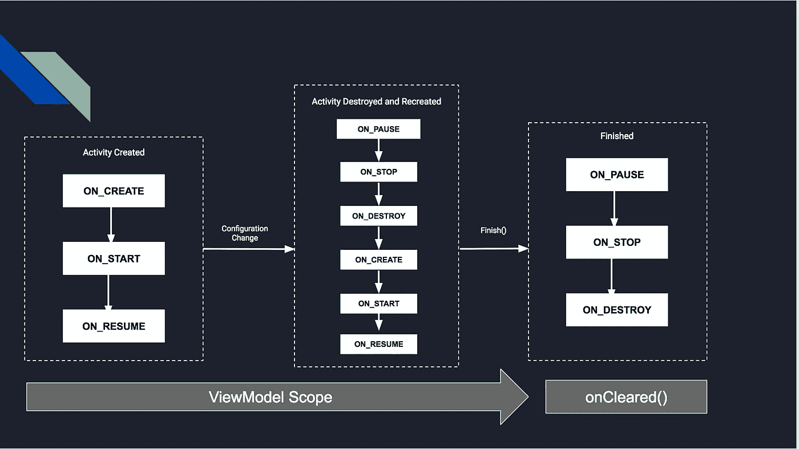

# 引擎盖下的视图模型..

> 原文：<https://medium.com/google-developer-experts/viewmodels-under-the-hood-f8e286c4cc72?source=collection_archive---------1----------------------->

去年在 Google I/O 上，Google 宣布了一组名为 Android Architecture Components 的库。

Android 架构组件是基于以下原因创建的。(这是我对他们的看法，并不反映谷歌或其工程师的实际意见):

1 .给一个关于如何设计 android 应用的观点。有许多不同的方法来设计一个 android 应用程序，其中许多在文档中没有提到。这让许多试图只使用文档来学习的新 Android 开发者感到困惑。

2 .提供工具来帮助解决 android 开发人员发现的常见问题。(生命周期管理、数据持久性、分页)

Android 架构组件是库的组合:Room、ViewModel、LiveData、生命周期感知组件和分页库。

去年，我做了两次关于这些组件的演讲。这些都集中在视图模型和生命周期感知组件上([链接到其中一个记录](https://www.youtube.com/watch?v=uMohC2p8itg&t=804s)

演示结束后，观众通常会有两种感受。为找到解决视图模型问题的解决方案而兴奋，以及想了解它们如何工作的好奇心。

为了回答这个好奇和其他常见的问题，例如:
-为什么我们不应该在视图模型中存储太多的数据？
-为什么我们不能使用视图模型在活动之间进行交流？

我决定写这篇文章，解释在使用视图模型时会发生什么。

这篇文章不会讨论这个库中的其他组件。有这么多可用的资源，其中一些链接将发布在这篇文章的底部。

# 视图模型

> ViewModel 类旨在存储和管理与 UI 相关的数据，以便这些数据在屏幕旋转等配置更改后仍然存在。—developer.android.com

假设您有一个应用程序，它有一个显示电影细节的屏幕。
打开时，该屏幕将显示从源(网络/数据库)加载的信息。如果用户决定旋转设备，将从源重新加载信息。

这是因为 Android 系统将在轮换配置更改时重新创建活动。
如果源是远程服务器，这种小行为重复多次会浪费用户的数据。这是一个非常小的问题，但在更复杂的情况下，会造成更大的损害。
为了解决这个小问题，让我们的应用成为用户设备上的好公民，我们可以尝试以下方法:

1.使类`Movie`成为一个`Parcelable`对象，并将其保存在实例状态`Bundle`中。

2.我们自己改变过程配置。

3.创建一个`ViewModel`，将`Movie`对象保留在`ViewModel`中，让它完成剩下的工作。

第一种解决方案更容易实现，并且最常用于像我们的例子这样的简单情况。然而，如果对象变得太复杂，就很容易达到`Parcelable`的极限大小。

第二个解决方案将阻止`Activity`号重启。这将解决我们的问题，但是我们在这个过程中失去了其他可以从`Activity`重启中获益的特性(为新配置重新加载适当的资源)。

使用`ViewModels`的第三种解决方案是最可靠的，即使在最复杂的情况下也更容易实现。要实施此解决方案，我们需要完成以下步骤:

1.创建一个将`Movie`作为变量的`ViewModel`类的子类。

2.在`ViewModel`上公开一个方法，该方法获取它应该加载的电影细节的 Id。

3.暴露一个`LiveData`，它发出一个加载到`ViewModel`中的`Movie`对象。

4.在`Activity` / `Fragment`中获取`ViewModel`的一个实例。

5.观察`Activity` / `Fragment`内外露的`LiveData`有无变化。

6.从源获取`Movie`并等待`LiveData`发布。

7.最后，当`Movie`对象被发送到我们正在观察的`Activity` / `Fragment`时，显示电影细节。

现在，如果旋转设备，`ViewModel`将在配置更改后继续存在，并且只要与它关联的范围仍然存在，它就会存在。如下图所示，ViewModel 将保持活动状态，直到它的作用域(活动或片段)被破坏。

ViewModel Scope

这意味着我们将获得相同的`ViewModel`实例。我们将开始观察这个实例`LiveData`和旋转发射前最新发射的数据。

这七个步骤相对容易做到。但是它们没有回答我前面提到的问题。要做到这一点，让我们详细看看这个过程是如何发生的。

## 创建/获取视图模型实例的过程

假设我们有一个`MovieDetailsViewModel`类。我们可以通过从片段/活动中执行以下语句来获得它的实例:

`ViewModelProviders.of(this).get(MyViewModel.class);`

上面语句中的链接调用可以分为两个独立的部分:

1st —调用在`ViewModelProviders`类中使用静态方法`of`获得一个`ViewModelProvider`。

2nd —从第一次调用中检索的 ViewModelProvider 获取`ViewModel`的调用。

# 视图模型提供者

`ViewModelProviders`是一个带有助手方法的类，用来获取`ViewModelProvider`。这个类有`DefaultFactory`作为它唯一的私有变量。`DefaultFactory`类用于创建一个`ViewModelProvider`的新实例。
`ViewModelProviders`有一个名为`of`的静态方法的重载。其中一个方法将一个`Activity`和另一个`Fragment`作为参数，如以下签名所示:

`public static ViewModelProvider of(@NonNull FragmentActivity activity)`
`public static ViewModelProvider of(@NonNull Fragment fragment)`

当调用`of`的方法来获取`ViewModelProvider`时，会发生以下情况:

1.  **检查并获取片段/活动** `**Application**`。
    对于一个`Activity`，这个检查和检索是通过调用`checkApplication(Activity)`方法来完成的。
    该方法调用`Activity` `getApplication()`，如果为空，将返回应用程序或抛出异常。
    通过`Fragment`调用`of`方法时，使用类似的过程。在这种情况下，getApplication 参数是对`checkActivity(Fragment)`的包装调用。checkActivity 方法将为`Fragment`获取`Activity`。这将确保`Fragment`首先连接到`Activity`上。
2.  **初始化** `**ViewModelProvider**` **工厂。**
    为此，将调用`initializeFactoryIfNeeded(Application)`方法。该方法将上一步中检索到的`Application`实例作为参数。
    3。**返回** `**ViewModelProvider**` **。**
    `of`方法将创建并返回 ViewModelProvider 的一个新实例。

这一步完成实现得到一个`Activity`的`ViewModelProvider`看起来像这样:

Snippets from take from [ViewModelProviders](https://github.com/aosp-mirror/platform_frameworks_support/blob/313c2be47202f789353ba6e96ae7e1c69b53a3a5/lifecycle/extensions/src/main/java/android/arch/lifecycle/ViewModelProviders.java) implementation.

# 视图模型提供者

顾名思义，`[ViewModelProvider](https://github.com/aosp-mirror/platform_frameworks_support/blob/313c2be47202f789353ba6e96ae7e1c69b53a3a5/lifecycle/extensions/src/main/java/android/arch/lifecycle/ViewModelProvider.java)`是实际提供`[ViewModel](https://github.com/aosp-mirror/platform_frameworks_support/blob/313c2be47202f789353ba6e96ae7e1c69b53a3a5/lifecycle/extensions/src/main/java/android/arch/lifecycle/ViewModel.java)`的类。

这个类包含了静态方法`get(Class<T> modelClass)`。这是在语句的第二部分调用的方法，以获得前面提到的`ViewModel`。

从公开的 API 来看，一切都很简单。但是在我们得到一个`ViewModel`的实例之前，还有更多的事情发生，我们接下来会看到。

`ViewModelProvider`有两个构造函数:
1。`ViewModelProvider(ViewModelStore store, Factory factory)`
2。`ViewModelProvider(ViewModelStoreOwner storeOwner, Factory factory)`

两个构造函数都将`Factory`作为第二个参数来创建一个`ViewModel`类，但是它们的第一个参数不同。

第一个构造函数取一个`ViewModelStore`。A `ViewModelStore`是存储`ViewModels`的类。

为了保存`ViewModels`，`ViewModelStore`将它们存储在一个`HashMap`中。每个`ViewModel`都用一个`String`作为关键字保存在地图中。
关键是`DefaultName`变量和`ViewModel`类规范名称的连接。(`DefaultName`是`ViewModelProvider`类中的一个简单的最终字符串)
用`ViewModelStore`创建的`ViewModelProvider`将通过执行以下操作返回`ViewModel`:

1.将使用`DefaultName`和作为`get`方法的参数传递的类的规范名称创建一个键。

2.使用键从`HashMap`中检索`ViewModel`实例。

3.如果找到，执行检查并确保返回正确的`ViewModel`实例。否则，将创建一个新实例，保存在`ViewModelStore`中并返回。

Snippet from [ViewModelProvider.java](https://github.com/aosp-mirror/platform_frameworks_support/blob/313c2be47202f789353ba6e96ae7e1c69b53a3a5/lifecycle/extensions/src/main/java/android/arch/lifecycle/ViewModelProvider.java) implementation

到目前为止，我们知道了`ViewModels`是如何被创建和存储的，但是
这还不能解释它们如何在配置改变后存活的问题。这是因为`ViewModelProviders`的第一个构造函数采用了一个`ViewModelStore`，并且这个存储本身不属于任何范围。

在解决我们开始的问题的实现中，`ViewModelProvider`将使用第二个构造函数创建。将 a `ViewModelStoreOwner`作为第一个参数的构造函数

# 视图模型存储所有者

`ViewModelStoreOwner`是一个接口，顾名思义，它是`ViewModelStore`的所有者。这可以是实现该接口定义的`getViewModelStore()`的任何类。在库中，`ViewModelStoreOwner`就是`HolderFragment`类。这个类有一个可以通过`getViewModelStore()`方法访问的`ViewModelStore`变量。
`HolderFragment`是正规的安卓`Fragment`。这个`Fragment`使用`setRetainInstanceState(boolean)`方法为 true，以便保留实例状态。正如您所猜测的，state 拥有包含所有`ViewModels`的`ViewModelStore`。

在 Android 架构组件出现之前，这种技术已经被多次用于相同的目的。

`HolderFragment`是`ViewModelStore`内所有视图模型将居住的范围。根据帖子前面显示的带有`ViewModel`范围的图像，如果范围(`HolderFragment`)被破坏，所有视图模型将被清除。

现在我们知道了`ViewModels`是如何经受住配置变化的。然而，这并没有解释我们如何用 ViewModels 在片段之间进行交流，以及为什么我们不能用两个活动做同样的事情。

# 谁拥有 HolderFragment？

## HolderFragmentManager

`HolderFragment`有一个名为`HolderFragmentManager`的内部静态类。`HolderFragmentManager`创建并管理`HolderFragment`实例。
创建实例后，它将它们与一个`Activity`或`Fragment`相关联。
使用`holderFragmentFor(Activity)`和 `holderFragmentFor(Fragment)`方法完成整个过程。
如果有或没有`HolderFragment`的实例，这些方法将以两种不同的方式运行。
对于没有`HolderFragment`实例的情况，这些方法将:
1。创建一个`HolderFragment`的实例。

2.将新实例添加到父实例(`Activity` / `Fragment` ) `FragmentManager`。这将导致`HolderFragment`内视图模型范围的扩大。因此，只要`Activity` / `Fragment`将视图模型存储在它的`FragmentManager`中，视图模型就会一直存在

3.向`Activity` / `Fragment`生命周期`onDestroy()` 回调方法注册一个回调。因为`HolderFragment`在一个`Activity`/`Fragment`/`FragmentManager`中，当`Activity` / `Fragment`被销毁时，它的`onDestroy()`方法将被调用，而`ViewModelStore` 将被清除。最后，当注册的回调被调用时，`HolderFragment`实例将从与`Activity` / `Fragment` 关联的`HolderFragmentManager` `HashMap`中删除。

4.将支架`Fragment`添加到`HashMap`中，其键为`Activity` / `Fragment`。这就是为什么我们不能使用相同的`ViewModel`在两个活动或片段之间进行通信。

对于片段来说，只有当它们可以有相同的父对象时，通信才是可能的。这意味着我们可以通过请求父`Activity`而不是`Fragment`本身来欺骗并获得一个`ViewModel`的相同实例。

5.返回 HolderFragment 实例。

当已经有一个`HolderFragment`的实例时，这些方法将查找并返回已经在`HashMap`中的实例。

知道了`ViewModelStoreOwner`下面的细节，我们可以回到`ViewModelsProviders`来看看我们如何创建创建`ViewModelProvider`实例所需的`ViewModelStoreOnwer`。
`ViewModelProviders`类通过从`ViewModelStores`类调用静态方法`of`来获得`ViewModelStoreOwner`的一个实例。

`ViewModelStores`类的工作是抽象出对`HolderFragmentManager`内部的`holderFragmentOf(Activity/Fragment)`静态方法的调用。如前所述，这个方法将负责返回一个`ViewModelStoreOwner`。

我希望你能愉快地阅读这篇长文，并且现在你对视图模型是如何创建和工作的有了更多的了解。

我希望你能利用这个解释的细节，永远记住:
——在创建`Activity`之前，你不应该试图获取`ViewModel`的实例。如果是为了一个`Fragment`而得到它，你不应该试图在一个没有连接到`Activity`的`Fragment`上得到它。你不应该在你的`ViewModel`上放太多东西。正如你所看到的，它们只是一个常规的`Fragment`，如果系统因为使用太多资源而决定终止，那么它的父模型和你所有的视图模型也会消失。为了避免这类问题，我建议您在使用 savedInstance 状态解决方案的同时使用`ViewModel`。

在我们的示例中，在实例状态中存储电影 id 将确保即使 ViewModel 被终止，我们仍然能够获得正确的电影 Id，并传递它来为适当的电影重新加载数据。

—您只能使用视图模型在共享同一父对象的片段之间进行通信。

如果你觉得有什么不清楚的地方，有什么建议或者要补充的，请在下面留下你的评论，让我们开始对话。

感谢您的时间，并随时与您认为会喜欢阅读这篇文章的开发人员分享。

下次见！

有用的链接:

[架构组件官方指南](https://developer.android.com/topic/libraries/architecture/index.html)

[架构组件介绍—谷歌 IO 17](https://www.youtube.com/watch?v=FrteWKKVyzI&t=1662s)

[建筑构件——GDD 欧洲 2017](https://www.youtube.com/watch?v=Ts-uxYiBEQ8&t=4s) ( [弗洛里纳·蒙特内斯库](https://medium.com/u/d5885adb1ddf?source=post_page-----f8e286c4cc72--------------------------------))

[Android 架构组件—查看视图模型—第 2 部分](https://riggaroo.co.za/android-architecture-components-looking-viewmodels-part-2/) ( [丽贝卡·弗兰克斯](https://medium.com/u/3f9b9c30bec7?source=post_page-----f8e286c4cc72--------------------------------))

[Android 架构组件介绍](https://www.youtube.com/watch?v=9QrFMsihBAo&t=848s) — SSA 空中专家第六集

感谢[弗洛里纳·蒙特内斯库](https://medium.com/u/d5885adb1ddf?source=post_page-----f8e286c4cc72--------------------------------)、[罗萨里奥·佩雷拉·费尔南德斯](https://medium.com/u/60764aad5eb3?source=post_page-----f8e286c4cc72--------------------------------)和[穆斯塔法·阿里](https://medium.com/u/95b3bd440473?source=post_page-----f8e286c4cc72--------------------------------)审阅了帖子的第一版。