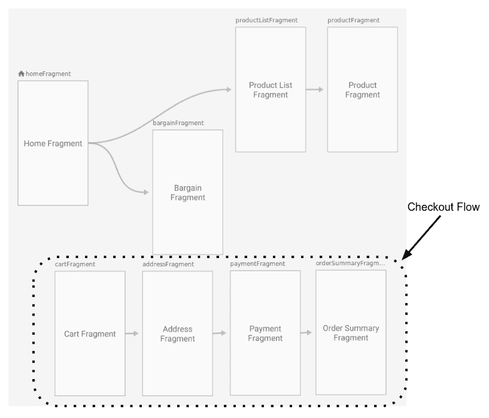
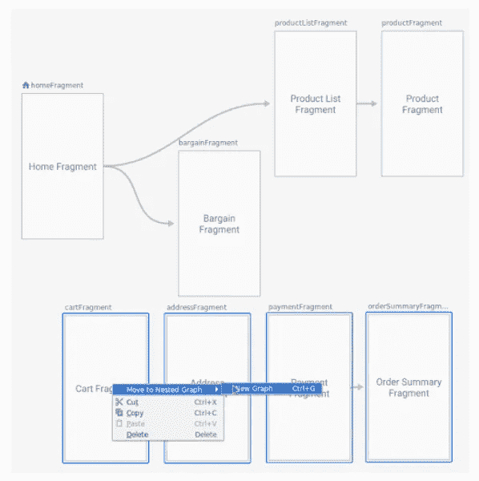

# 具有保存状态、Jetpack 导航、数据绑定和协同例程的视图模型

> 原文：<https://medium.com/androiddevelopers/viewmodels-with-saved-state-jetpack-navigation-data-binding-and-coroutines-df476b78144e?source=collection_archive---------1----------------------->


Illustration by [Virginia Poltrack](https://twitter.com/VPoltrack)

自从推出以来， [ViewModel](/androiddevelopers/viewmodels-a-simple-example-ed5ac416317e) 已经成为最“核心”的 Android Jetpack 库之一。根据我们 2019 年的开发者基准测试数据，超过 40%的 Android 开发者在他们的应用中添加了视图模型。如果您不熟悉视图模型，可能不清楚为什么会这样:视图模型通过将数据从 UI 中分离出来，促进了更好的体系结构，使处理 UI 生命周期变得容易，同时也提高了可测试性。完整的解释请查看[视图模型:一个简单的例子](/androiddevelopers/viewmodels-a-simple-example-ed5ac416317e)和[官方文档](https://developer.android.com/topic/libraries/architecture/viewmodel)。

因为视图模型是如此的基础，所以在过去的几年中已经做了大量的工作来使它们更容易使用，更容易与其他库集成。在本文中，我将介绍四个集成:

1.  **ViewModels 中保存的状态** —后台进程重启后仍存在的 ViewModel 数据
2.  **带视图模型的导航图** —视图模型和导航库集成
3.  **在数据绑定中使用视图模型** —使用视图模型和 LiveData 轻松进行数据绑定
4.  **viewModelScope** — Kotlin 协程和 ViewModels 集成

# ViewModels 中保存的状态:后台进程重启后仍然存在的 ViewModel 数据

在[生命周期-视图模型-保存状态:1.0.0-alpha01](https://developer.android.com/jetpack/androidx/releases/lifecycle#viewmodel-savedstate-1.0.0-alpha01)
中增加了 Java 和 Kotlin

## `onSaveInstanceState`的挑战

当 ViewModels 最初启动时，有一个令人困惑的问题涉及到`onSaveInstanceState`。活动和片段可以通过三种方式销毁:

1.**你的意思是永久导航离开:**用户导航离开或者明确关闭活动——比如按下后退按钮或者触发一些调用`finish()`的代码。这项活动已经永远消失了。

2.**存在配置改变:**用户旋转设备或进行一些其他配置改变。该活动需要立即重建。

3.**应用程序被置于后台，其进程被终止:**当设备内存不足，需要快速释放一些内存时，会出现这种情况。*当用户导航回你的应用程序时，需要重建活动。*

在情况 2 和 3 中，您想要重建活动。视图模型总是帮助您处理第二种情况，因为视图模型不会在配置更改时被破坏；但是在情况 3 中，ViewModel 也被破坏了，所以您实际上需要在活动中使用`onSaveInstanceState`回调来保存和恢复数据。我在[视图模型:持久性、onSaveInstanceState()、恢复 UI 状态和加载器](/androiddevelopers/viewmodels-persistence-onsaveinstancestate-restoring-ui-state-and-loaders-fc7cc4a6c090)中更详细地讨论了这个微妙的区别。

## 保存状态模块

[ViewModel 保存状态模块](https://developer.android.com/topic/libraries/architecture/viewmodel-savedstate)帮助您处理第三种情况:进程死亡。ViewModel 不再需要向活动发送状态和从活动接收状态。相反，您现在可以在 ViewModel 中处理保存和恢复数据。ViewModel 现在可以真正地处理和保存它自己的所有数据。

这是使用一个 [SavedStateHandle](https://developer.android.com/reference/androidx/lifecycle/SavedStateHandle.html) 来完成的，它非常类似于一个[包](https://developer.android.com/reference/android/os/Bundle)；这是数据的键值映射。这个 SavedStateHandle“包”在视图模型中，它在后台进程死亡后仍然存在。您之前必须保存在`onSaveInstanceState`中的任何数据现在都可以保存在 SavedStateHandle 中。例如，用户的 id 可能存储在 SavedStateHandle 中。

## 设置保存状态模块

让我们看看如何使用新模块。请注意，下面显示的代码与生命周期代码实验室的[步骤 6 中的代码](https://codelabs.developers.google.com/codelabs/android-lifecycles/#6)非常相似。那段代码是 Java 的，下面的代码是 Kotlin 的。

**第一步:添加依赖关系**

SavedStateHandle 目前在 alpha 中(这意味着 API 可能会改变，我们正在寻找[反馈](https://issuetracker.google.com/issues/new?component=413132&template=1096619))，它是一个单独的库。要添加的依赖项是:

```
implementation ‘androidx.lifecycle:lifecycle-viewmodel-savedstate:1.0.0-alpha01’
```

注意，如果你想跟上库中发生的变化，请查看[生命周期发布说明](https://developer.android.com/jetpack/androidx/releases/lifecycle#viewmodel-savedstate-1.0.0-alpha01)页面。

**步骤 2:更新对 ViewModelProvider 的调用**

接下来，您想要创建一种具有 SavedStateHandle 的视图模型。在活动或片段的`onCreate`中，将对 ViewModelProvider 的调用更新为:

创建 ViewModel 的类是一个 [ViewModel 工厂](https://developer.android.com/reference/kotlin/androidx/lifecycle/ViewModelProvider.Factory.html)，有一个 ViewModel 工厂使用 SavedStateHandles 创建 ViewModel，称为 [SavedStateVMFactory](https://developer.android.com/reference/kotlin/androidx/lifecycle/SavedStateVMFactory) 。创建的 ViewModel 现在将有一个 SavedStateHandle，与传入的活动/片段相关联。

**注意:**Android x[activity](https://developer.android.com/jetpack/androidx/releases/activity)和 [fragment](https://developer.android.com/jetpack/androidx/releases/fragment) 库即将发布的 alpha 版本将于 7 月发布。在这些版本中(如这里的[所示](https://issuetracker.google.com/issues/135716331)，SavedStateVMFactory 将成为默认的 ViewModelProvider。当您在活动或片段中创建视图模型时。这意味着如果你正在使用最新的 alpha 版本的 Androidx [activity](https://developer.android.com/jetpack/androidx/releases/activity) 或者 [fragment](https://developer.android.com/jetpack/androidx/releases/fragment) ，你将不需要添加 lifecycle-viewmodel-savedstate 依赖或者显式地使用 SavedStateVMFactory。简而言之，当这种变化发生时，如果你使用的是新的 alpha 版本，你可以跳过第 1 步和第 2 步，直接跳到下面的第 3 步。

**第三步:在 ViewModel 中使用 SaveStateHandle**

一旦完成了这些，就可以在视图模型中使用 SavedStateHandle 了。下面是一个在 SavedStateHandle 中保存用户 id 的示例:

1.  **构造:** `MyViewModel`接受 SavedStateHandle 作为构造函数参数。
2.  **Save:**`saveNewUser`方法展示了一个在 SavedStateHandle 中保存数据的例子。你保存`USER_KEY`的键值对，然后保存当前的`userId`。当 ViewModel 中的数据更新时，它应该保存在 SavedStateHandle 中。
3.  **Retrieve:** `savedStateHandle.get(USER_KEY)`是一个获取保存在 SaveStateHandle 中的当前值的例子。

现在，如果活动由于循环**或**被破坏，由于操作系统杀死你的进程来释放内存，你可以确保 SavedStateHandle 将拥有你的数据。

通常您会在视图模型中使用 LiveData。为此你可以使用`[SavedStateHandle.getLiveData()](https://developer.android.com/reference/kotlin/androidx/lifecycle/SavedStateHandle.html#getlivedata)`方法。这里有一个用 LiveData 替换`getCurrentUser`的例子，它允许观察:

要了解更多信息，请查看生命周期代码实验室的[步骤 6 和](https://codelabs.developers.google.com/codelabs/android-lifecycles/#6)[官方文档](https://developer.android.com/topic/libraries/architecture/viewmodel-savedstate)。

# ViewModel 和 Jetpack 导航:带有 ViewModel 的导航图

在[导航 2.1.0-alpha02](https://developer.android.com/jetpack/androidx/releases/navigation#2.1.0-alpha02)
中增加了 Java 和 Kotlin

## 视图模型共享的挑战

[Jetpack 导航](https://developer.android.com/guide/navigation)开箱即用，应用程序设计的活动相对较少——甚至只有一个——包含多个片段。伊恩·莱克的精彩演讲[单一活动:为什么、何时以及如何](https://www.youtube.com/watch?v=2k8x8V77CrU)中涵盖了我们选择这种架构的一些原因。一个特别的原因是，这种架构允许您通过创建一个[活动共享视图模型](https://developer.android.com/topic/libraries/architecture/viewmodel#sharing)来在不同的目的地之间共享数据。您可以使用活动创建一个 ViewModel，然后您可以从活动的任何片段中获得对该 ViewModel 的引用:

现在想象一下，我们有一个活动应用程序，我们有八个片段目的地。其中，四个是购物结账流程:



Navigation Graph with some screens that are in a shopping checkout flow

对于结账流程中的这四个目的地来说，共享数据很重要，比如送货地址或用户是否使用了优惠券代码。我们将把这些信息放在一个视图模型中，但是视图模型与什么相关联呢？这些信息对于应用程序的其余部分并不重要，但是以前我们共享视图模型的唯一选择是将视图模型与活动相关联。这意味着所有八个目的地都可以访问这个视图模型。

## 视图模型导航图集成

[导航 2.1.0](https://developer.android.com/jetpack/androidx/releases/navigation#2.1.0-alpha02) 引入了与导航图相关的视图模型。在实践中，这意味着您可以获取一组关联的目的地，比如入职流程、登录流程或结账流程；将它们放入一个[嵌套导航图](https://developer.android.com/guide/navigation/navigation-nested-graphs)；并在这些屏幕之间共享数据。

要创建嵌套导航图，您可以选择您的屏幕，右键单击，然后选择**移动到嵌套图→新图:**



Screenshot showing how to “Move to Nested Graph”

在 XML 视图中，注意嵌套导航图的 **id** ，在本例中为`checkout_graph`:

一旦完成了这些，您就可以使用`by navGraphViewModels`获得视图模型:

这也适用于 Java 编程语言，使用:

注意，嵌套图是从导航图的其余部分封装而来的。您可以导航到嵌套图形(您将转到嵌套图形的起始目标)，但不能从图形外部直接导航到嵌套图形中的特定目标。因此，它们意味着封装的屏幕集合，像结帐流或登录流。

ViewModel 导航图集成是 I/O 2019 上宣布的新导航功能之一。更多信息，请查看 talk [Jetpack 导航](https://youtu.be/JFGq0asqSuA?t=588)和[文档](https://developer.android.com/guide/navigation/navigation-programmatic#share_)。

# ViewModel 和数据绑定:在数据绑定中使用 ViewModel 和 LiveData

在 [Android Studio 3.1 中添加了](https://developer.android.com/studio/releases#update-data-binding)
Java 和 Kotlin

## 所有这些 LiveData 样板文件

这种整合是老一套，但却是好东西。视图模型通常包含 [LiveData](https://developer.android.com/topic/libraries/architecture/livedata) ，LiveData 的意思是被观察。通常这意味着在 fragment 中添加一个观察者:

[数据绑定库](https://developer.android.com/topic/libraries/data-binding)就是观察你的数据和更新用户界面。通过一起使用 ViewModel、LiveData 和数据绑定，您可以删除以前的 LiveData 观察代码，并直接从布局 XML 中引用您的 ViewModel 和 LiveData。

## 使用数据绑定、ViewModel 和 LiveData

假设在您的 XML 布局中，您想要引用您的视图模型:

要将 LiveData 用于数据绑定，您只需调用`binding.setLifecycleOwner(this)`，然后将您的 ViewModel 传递给绑定，如下所示:

现在，在您的布局中，您可以使用您的视图模型。如下所示，我将文本设置为`viewmodel.name`:

请注意，`viewmodel.name`可能是一个字符串或一个 LiveData。如果是 LiveData，每当 LiveData 发生变化时，用户界面都会更新。

# ViewModel 和 Kotlin 协同例程:viewModelScope

[仅在生命周期 2.1.0](https://developer.android.com/jetpack/androidx/releases/lifecycle#2.1.0-alpha01)
中添加

## Android 上的协同程序

Kotlin 协同程序是一种处理异步代码的新方法。处理异步代码的另一种方法是使用回调。回调是好的，但是如果你正在编写复杂的异步代码，你可能会有很多层次的嵌套回调；这使得你的代码难以理解。协程简化了所有这一切，还提供了一种简单的方法来确保您没有阻塞主线程。如果你是协程的新手，有一个非常深入的博客文章系列，叫做 Android 上的[协程](/androiddevelopers/coroutines-on-android-part-i-getting-the-background-3e0e54d20bb)和在你的 Android 应用中使用 Kotlin 协程的 codelab [。](https://codelabs.developers.google.com/codelabs/kotlin-coroutines/#0)

一个简单的协程看起来就像是完成一些工作的代码块:

这里我只启动了一个协程，但是很容易启动数百个协程，并可能失去对它们的跟踪——如果您失去了对一个协程的跟踪，并且它正在运行一些您想要停止的工作，这就是所谓的**工作泄漏**。

为了避免工作泄漏，你应该通过将你的协同程序添加到一个[协同程序作用域](https://kotlin.github.io/kotlinx.coroutines/kotlinx-coroutines-core/kotlinx.coroutines/-coroutine-scope/index.html)来组织它们，这个作用域是一个跟踪协同程序的对象。协程范围可以取消；当您取消一个作用域时，它们会取消所有相关的协程。上面我使用的是 [GlobalScope](https://kotlin.github.io/kotlinx.coroutines/kotlinx-coroutines-core/kotlinx.coroutines/-global-scope/) ，顾名思义，这是一个全球可用的协同作用域。出于同样的原因，使用全局范围通常不是好的做法，编写全局可访问的变量通常也不是好的做法。所以你需要做一个瞄准镜，或者找到一个。在视图模型中，如果使用[视图模型范围](https://developer.android.com/reference/kotlin/androidx/lifecycle/package-summary.html#(androidx.lifecycle.ViewModel).viewModelScope:kotlinx.coroutines.CoroutineScope)，这很容易。

## 视图模型范围

通常，如果您的 ViewModel 被破坏，那么与 ViewModel 相关联的大量“工作”也应该停止。

例如，让我们说你准备一个位图显示在屏幕上。这是一个在不阻塞主线程*和*的情况下应该做的工作的例子，如果你永久地离开或关闭屏幕，这些工作应该停止。对于这样的工作，您应该使用[视图模型范围](https://developer.android.com/reference/kotlin/androidx/lifecycle/package-summary.html#(androidx.lifecycle.ViewModel).viewModelScope:kotlinx.coroutines.CoroutineScope)。

viewModelScope 是 ViewModel 类上的 Kotlin 扩展属性。一旦 ViewModel 被销毁(当调用`[onCleared()](https://developer.android.com/reference/androidx/lifecycle/ViewModel#onCleared())`时),它就是一个被取消的协同作用域。因此，当您使用 ViewModel 时，您可以使用这个作用域启动所有的协程。

这里有一个小例子:

如果你使用 Kotlin 协同程序和视图模型，Android 中优秀的 blogpost [Easy 协同程序:viewModelScope](/androiddevelopers/easy-coroutines-in-android-viewmodelscope-25bffb605471) 会提供更多细节。关于协程和架构组件的更多信息，请查看[文档](https://developer.android.com/topic/libraries/architecture/coroutines)和讲座[了解 Android 上的 Kotlin 协程](https://www.youtube.com/watch?v=BOHK_w09pVA)。

# 结论

总而言之:

1.  视图模型用 SavedStateHandle 模块处理`onSaveInstanceState`案例。
2.  您可以将 ViewModel 的范围扩展到 Jetpack Navigation NavGraph，以便在片段之间共享更精确和封装的数据。
3.  如果使用数据绑定库和视图模型，可以将视图模型传递给绑定。如果您也在使用 LiveData，请使用`binding.setLifecycleOwner(lifecycleOwner)`。
4.  …如果您将 Kotlin 协同程序与 ViewModel 一起使用，那么当 ViewModel 被销毁时，请使用 viewModelScope 自动取消您的协同程序。

这些集成中有许多来自社区的直接反馈和请求。如果您正在寻找 ViewModel 特性或集成，您可以遵循特性请求[列表](https://issuetracker.google.com/issues?q=status:open%20componentid:413132%20type:feature_request)并考虑[提出您自己的请求](https://issuetracker.google.com/issues/new?component=413132&template=1096619)。

要了解架构和 Android Jetpack 的最新进展，请关注 [Android 开发者媒体博客](https://medium.com/androiddevelopers)并关注 [AndroidX 发行说明](https://developer.android.com/jetpack/androidx/releases)。

对这些功能有疑问吗？留言评论！感谢阅读！

*特别感谢 Ian Lake、Yigit Boyar、Jose Alcérreca、肖恩·麦克奎蓝、Jisha Abubaker 和 Alex Michael Cook 的修改和贡献。*