# 使用 Oracle VirtualBox 转发 Vintage 端口

> 原文：<https://medium.com/oracledevs/vintage-port-for-oracle-virtualbox-aff0341acb52?source=collection_archive---------0----------------------->


## 样机研究

在 Oracle VirtualBox 中构建应用程序原型时，可以使用同一个虚拟机中的 GUI 客户端(如浏览器)。但是，虚拟机需要安装一个桌面环境，X11 或 Wayland。

如果不希望或不方便在虚拟机上安装桌面环境，您可以像这样将应用程序和客户端分开:

—应用程序在虚拟机中执行。

—来自主机的客户端连接到在虚拟机中执行的应用程序。

更简单地说，服务可以在虚拟机之外呈现给主机。这种配置具有以下优点:

*   客户端性能更快，因为它将在裸机主机上运行。
*   更快的应用程序性能，因为虚拟机没有桌面环境的开销。
*   虚拟机所需的内存更少，因为它不支持桌面环境。

另一个好处是，如果主机没有连接到互联网，那么主机上的客户端仍然可以连接到虚拟机。

让我们开始设置…

## 从防火墙开始

虚拟机的防火墙需要重新配置，以打开所需的端口。

我使用 Fedora Linux 发行版作为虚拟机镜像，FirewallD 的完整说明在这里:

[https://docs.fedoraproject.org/en-US/quick-docs/firewalld/](https://docs.fedoraproject.org/en-US/quick-docs/firewalld/)

现在从虚拟机的命令行打开 FirewallD 应用程序:

```
# firewall-config&
```

我们需要选择需要对虚拟机外部世界可用的连接。

特别是，我们对开放 HTTP 连接感兴趣，但我们也可以添加其他协议来满足未来的需求。

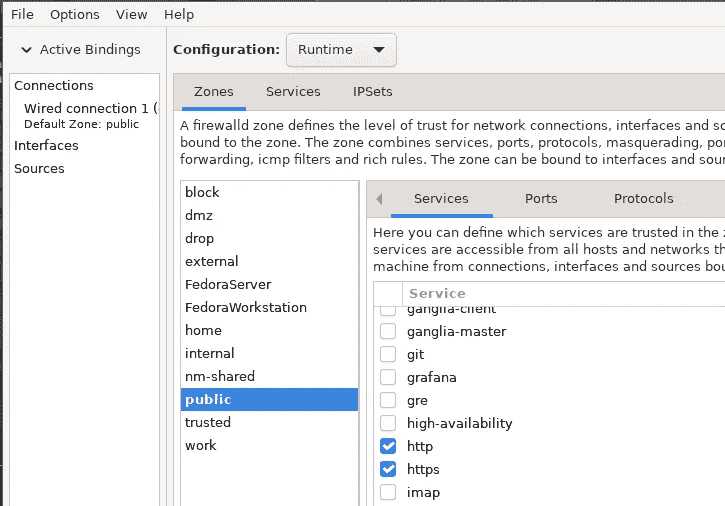

让我们打开到端口 5000 和 8080 的连接，因为虚拟机上将会有应用程序侦听这些端口。

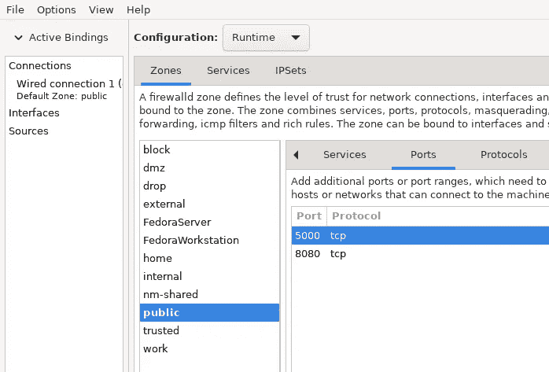

因为对防火墙的所有更改都是实时的，所以我也可以从命令行确认打开的端口:

```
# firewall-cmd --list-all
```

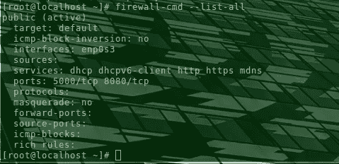

因此端口 5000 和 8080 被设置用于连接。

如果您希望永久保留这些规则，请使用以下命令:

```
# firewall-cmd --runtime-to-permanent
```

接下来是配置 Oracle VirtualBox。

## 网络地址转换(NAT)

从技术上讲，在 Oracle VirtualBox 中，有不止一种方法可以在虚拟机之外呈现服务。

Oracle VM VirtualBox 用户手册解释了:

> 但是，与物理路由器一样，Oracle VM VirtualBox 可以通过端口转发将选定的服务提供给客户机之外的世界。

事实上，网络地址转换(NAT)连接的端口转发是最简单的设置方式，因为网络适配器已经由 Oracle VirtualBox 默认设置。

Oracle VM VirtualBox 管理器显示了每个虚拟机的网络配置，您应该会看到 NAT 设置。

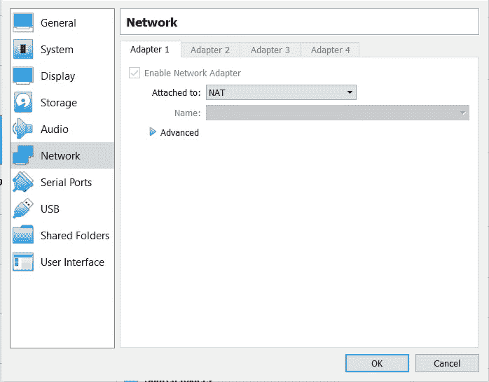

默认设置 NAT 后，接下来是本地端口转发的设置。

## NAT 的本地端口转发

从' C:\ Program Files \ Oracle \ VirtualBox '目录中，我们可以使用 vboxmanage 获取端口转发规则的列表:

```
vboxmanage showvminfo "<VM_name>"| find "Rule"
```

默认情况下，不会定义任何端口转发规则。

所以让我们创建一些规则。

“VBoxManage controlvm”命令将允许对端口转发规则进行运行时更改。

我们需要添加为防火墙配置的端口。例如端口 5000 和 8080。

```
> VBoxManage controlvm "<VM_name>" natpf1 "http,tcp,,5000,,5000"
> VBoxManage controlvm "<VM_name>" natpf1 "http8080,tcp,,8080,,8080"
```

现在，要获得此特定虚拟机的所有端口转发规则的列表，请运行以下命令:

```
vboxmanage showvminfo "<VM_name>"| find "Rule"
```

清单应如下所示:

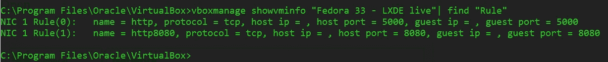

可以在 Oracle VM VirtualBox 管理器中查看相同的列表，因此选择“高级”下拉菜单。

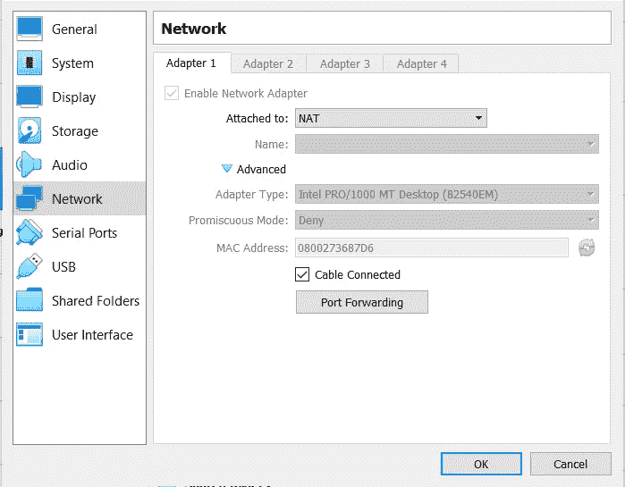

然后点击“端口转发”。

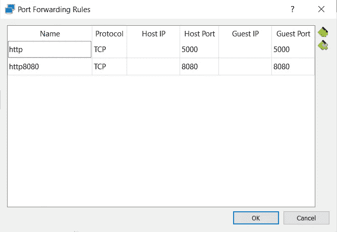

这些是被创造出来的规则。

## 测试连通性

我们将使用用 Python Flask 编码的应用程序。

**安装烧瓶**

假设之前安装了 Python，并创建了虚拟环境，然后按如下方式安装 Flask:

```
$ pip install Flask
```

安装的详细说明如下:

https://flask.palletsprojects.com/en/2.0.x/installation/

**带烧瓶的快速入门**

[https://flask.palletsprojects.com/en/2.0.x/quickstart/](https://flask.palletsprojects.com/en/2.0.x/quickstart/)

Flask 提供了如下的最小应用:

```
**from** flask **import** Flask

app = Flask**(**__name__**)**

@app.route**(**"/"**)**
**def** hello_world**():**
    **return** "<p>Hello, World!</p>"
```

将应用程序保存为“test.py ”,然后正常运行 Flask 应用程序:

```
$ export FLASK_APP=test
$ flask run
```

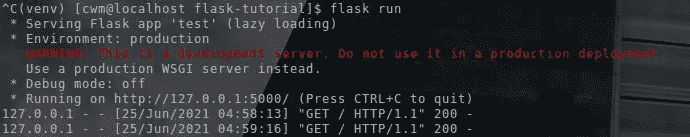

现在，在虚拟机内部运行一个浏览器，以确认应用程序正在运行。

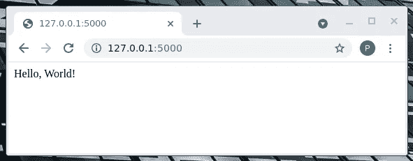

现在，在主机内部运行浏览器，测试 127.0.0.1:5000 的连通性。

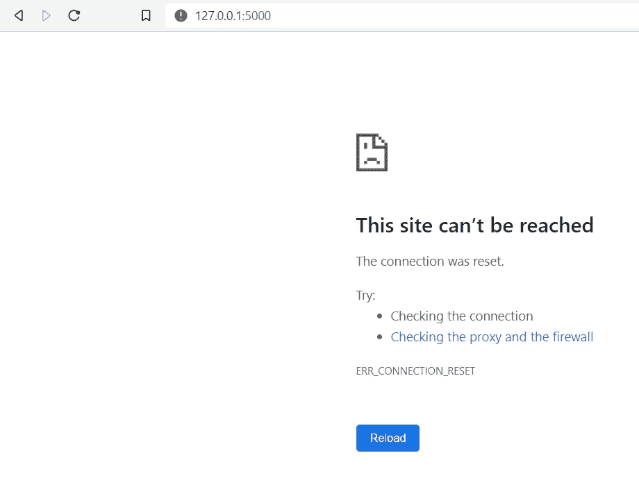

所以我们仍然没有从主机到虚拟机的连接。

解决方案是将 Flask 应用程序作为外部可见的服务器运行:

```
$ flask run --host=0.0.0.0
```

这告诉你的操作系统监听所有公共 IP。

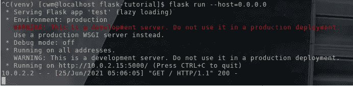

现在在主机内部再次运行浏览器 127.0.0.1:5000。

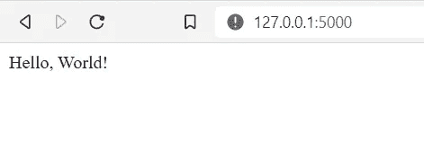

这是现在所期望的，证明我们已经通过本地端口转发连接到主机。

*Paul Guerin 是一名专注于 Oracle 数据库的国际顾问。此外，他还出席了一些世界领先的甲骨文会议，包括甲骨文 2013 年世界开放大会。自 2015 年以来，他的工作一直是 IOUG 最佳实践技巧小册子以及 AUSOUG、Oracle Technology Network、Quest 和 Oracle Developers (Medium)出版物的主题。2019 年，他被授予 My Oracle 支持社区最有价值贡献者。他是一名 DBA OCP，并将继续参与 Oracle ACE 计划。*