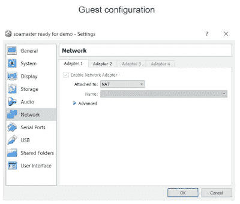

# VirtualBox 网络解释

> 原文：<https://medium.com/oracledevs/virtualbox-networking-explained-ff3a996ef50e?source=collection_archive---------2----------------------->

VirtualBox 网络非常灵活。这种灵活性带来了做出正确选择的挑战。在这篇博客中，解释了不同的选项，并阐述了一些示例用例。解释了来宾、主机和网络其他成员之间的访问，并显示了所需的配置。该信息也可在报告后的[中获得。](https://www.slideshare.net/MaartenSmeets1/virtualbox-networking-explained)

Overview of networking options

# 网络选项

## 内部网络

**概述**

VirtualBox 在 guest 虚拟机内部提供了一个可用的网络接口。如果多个 guests 虚拟机共享同一个接口名称，它们就像交换机一样连接在一起，可以相互访问。

**好处**

*   好用。几乎不需要配置
*   不需要 VirtualBox 虚拟主机网络接口(设备+驱动程序)
*   客人可以互相访问
*   安全(不可能从主机外部访问)

**弊端**

*   主人不能访问客人
*   来宾无法访问主机
*   客人不能访问互联网
*   VirtualBox 内部 DHCP 服务器没有 GUI 支持，只有 CLI

**配置**

## 精灵

**概述**

VirtualBox 在 guest 虚拟机内部的网络接口上提供单个虚拟隔离 NAT 路由器。每个客人都有自己的虚拟路由器，不能访问其他客人。接口上的 DHCP(动态主机配置协议)请求会得到 guest 虚拟机的 IP 和作为网关的 NAT 路由器的地址的响应。可以使用 CLI 配置 DHCP 服务器(不支持 GUI)。NAT 路由器使用主机的网络接口。不需要创建特定的 VirtualBox 网络接口。外部各方只能看到一个主机接口。NAT 路由器在主机接口上打开一个端口。内部地址被转换为主机 IP。对目的地 IP 的请求已完成。响应被转发回 guest 虚拟机(路由器保存了一个外部端口到内部 IP 的表)。可以进行端口映射，以允许特定端口上的主机请求被转发到 guest 虚拟机。

**好处**

*   好用。几乎不需要配置
*   孤立无援。每个客人都有自己的虚拟路由器
*   不需要 VirtualBox 虚拟主机网络接口(设备+驱动程序)
*   互联网接入
*   固定 IP 是可能的

**弊端**

*   来宾不能相互访问或访问主机
*   只能使用 CLI 配置虚拟 NAT 路由器 DHCP 服务器
*   要从主机访问 guest 虚拟机，需要进行端口转发配置，并且可能需要在主机 hosts 文件中为特定的 web 接口添加一个条目

**配置**

## NAT 网络

**概述**

VirtualBox 在网络接口上为所有使用 NAT 网络的来宾提供虚拟 NAT 路由器。客人可以互相访问。需要创建 NAT 网络。接口上的 DHCP(动态主机配置协议)请求会得到 guest 虚拟机的 IP 和作为网关的 NAT 路由器的地址的响应。可以配置 DHCP 服务器。NAT 路由器使用主机的网络接口。不需要创建特定的 VirtualBox 网络接口。外部各方只能看到一个主机接口。NAT 路由器在主机接口上打开一个端口。内部地址被转换为主机的 IP 地址，到达每台主机的特定端口。对目的地 IP 的请求已完成。响应被转发回 guest 虚拟机(路由器保存了一个外部端口到内部 IP 的表)。可以进行端口映射，以允许特定端口上的主机请求被转发到客户机。

**好处**

*   客人可以互相访问
*   不需要 VirtualBox 虚拟主机网络接口(设备+驱动程序)
*   可以使用 GUI 配置 DHCP 服务器
*   互联网接入
*   固定 IP 是可能的

**弊端**

*   要从主机访问 guest 虚拟机，需要进行端口转发配置，并且可能需要在 hosts hosts 文件中为特定的 web 接口添加一个条目
*   需要额外的 VirtualBox 配置来定义网络/ DHCP 服务器

**配置**

## 仅限主机

**概述**

VirtualBox 创建主机接口(主机上可见的虚拟设备)。该界面可以在来宾之间共享。客人可以互相访问。接口上的 DHCP(动态主机配置协议)请求会得到来宾 IP 和主机专用适配器地址的响应。DHCP 服务器可以使用 VirtualBox GUI 进行配置。虚拟主机界面在主机外部是不可见的。来宾无法通过此接口访问互联网。主机可以通过 IP 访问来宾。不需要端口映射。

**好处**

*   客人可以互相访问
*   您可以创建单独的来宾网络
*   可以使用 GUI 配置 DHCP 服务器
*   固定 IP 是可能的

**弊端**

*   要从主机访问 guest 虚拟机，需要进行端口转发配置，并且可能需要在 hosts hosts 文件中为特定的 web 接口添加一个条目
*   需要额外的 VirtualBox 配置来定义网络/ DHCP 服务器
*   需要 VirtualBox 虚拟主机网络接口(设备+驱动程序)
*   不能上网

**配置**

## 架桥

**概述**

来宾使用主机接口。在主机接口上，应用网络过滤器驱动程序以允许 VirtualBox 向来宾发送数据。这要求适配器使用所谓的混杂模式。混杂模式意味着适配器可以有多个 MAC 地址。大多数无线适配器不支持这一点。在这种情况下，VirtualBox 会替换对适配器可见的软件包的 MAC 地址。使用外部 DHCP 服务器。与主机获取 IP /网关的方式相同。不需要额外的配置。如果 DHCP 服务器只允许注册的 MAC(一些公司网络)轻松访问，它可能不起作用。guest 虚拟机可从主机连接的网络(每台主机)直接访问。不需要端口映射。主机可以通过 IP 访问来宾。来宾可以通过 IP 访问主机。

**好处**

*   客人可以互相访问
*   主机可以访问来宾，来宾也可以访问主机。主机网络上的任何人都可以访问来宾
*   不需要虚拟 DHCP 服务器
*   易于配置/使用
*   与主机具有相同的互联网访问权限

**弊端**

*   不能将来宾拆分到单独的网络中(不隔离)
*   有时不起作用；依赖于外部 DHCP 服务器和在主机网络接口上过滤数据包的能力。公司网络可能会阻止您的界面
*   因为主机网络是可变的，所以固定 IP 不是一个简单的选择
*   不安全。guest 虚拟机暴露在主机网络上

**配置**

# 用例示例

**案例 1:麋鹿栈**

我正在试用 ELK stack 的新版本(Elasticsearch、Logstash、Kibana)要求:

*   我不需要在来宾内部访问互联网
*   我想从我的主人那里访问我的客人
*   我不希望我的客人在我的主人之外
*   我不想手动配置端口映射

解决方案:仅主机适配器

**案例 2:面向安全研讨会的 SOA 套件**

我正在使用 Oracle SOA 套件进行安全研讨会。SOA 套件由 3 个独立的虚拟机、数据库、管理服务器和托管服务器组成

要求:

*   虚拟机需要固定(内部)IP
*   虚拟机需要能够相互访问
*   课程参与者需要从同一个网络调用我的服务
*   我只想公开特定的端口

解决方案:仅 NAT +主机(可能是 NAT 网络)

**案例 3:在课程期间用于分发的虚拟机**

我为一门课程创建了一个 Ubuntu / Spring 工具套件虚拟机。虚拟机将分发给参与者。

要求:

*   要分发的虚拟机需要访问互联网。在这个过程中，需要下载几样东西
*   我不知道主机上存在由 VirtualBox 创建的接口，也不希望参与者必须手动选择适配器
*   我希望参与者尽可能少地进行网络配置。VirtualBox 网络不是本课程的目的。

解决方案:NAT

**案例 4:服务器托管应用**

我在虚拟机中创建了一个服务器来托管应用程序。

要求:

*   虚拟机的 MAC 是在路由器的 DHCP 服务器中配置的，因此它将总是获得相同的 IP。使用外部 DHCP 服务器获取 IP
*   该应用程序将由网络上的不同人使用(因此需要可供不同人访问)。
*   该应用程序使用许多不同的端口来实现不同的功能。这些端口定期更换。一些功能使用随机端口。手动端口映射不是一个选项
*   应用程序访问主机网络上的不同资源(如打印服务器)

解决方案:桥接

*原载于 2018 年 7 月 27 日*[*【javaoraclesoa.blogspot.com】*](https://javaoraclesoa.blogspot.com/2018/07/virtualbox-networking-explained.html)*。*