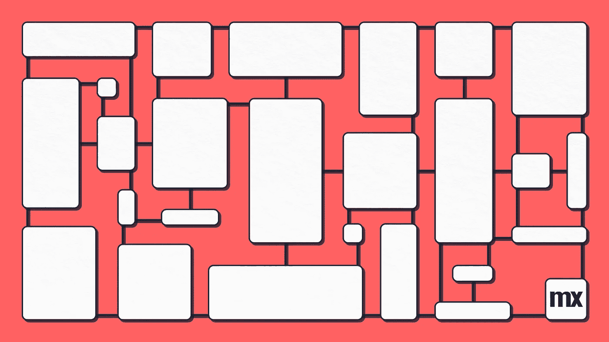

# Mendix 中的视觉对齐

> 原文：<https://medium.com/mendix/visual-alignment-in-mendix-badafe42dbc0?source=collection_archive---------0----------------------->

## 下载 sass [这里](https://www.dropbox.com/s/yu36gd4cx8k5bk2/_helper_rowcol.scss?dl=0)

> 使开发人员能够在 Mendix 中使用风格的一个困难是平衡自由和一致性。
> 我认为应该从整合最佳实践开始。

在 html 中对齐元素可能有点困难，Mendix 也不能避免这个问题。

为了给这种疯狂创造一些结构，我们创建了“对齐类”,它们是 flex 类，但是具有对开发人员有意义的命名约定。

[https://bit.ly/MXW21](https://bit.ly/MXW21)

对于̶l̶a̶z̶y̶效率高的人，也有一个小抄。

# 如何使用

下载 sass 文件([此处](https://www.dropbox.com/s/yu36gd4cx8k5bk2/_helper_rowcol.scss?dl=0))并将其添加到您的项目
(如果您不知道如何做，这并不难，但您确实需要了解一些 sass 基础知识，以及如何[将它们导入到您的应用程序](https://docs.mendix.com/refguide8/migration-atlas#2-2-2-additional-css-files)，并运行 [calypso](https://docs.mendix.com/howto/front-end/calypso) 。**另请注意，此方法仅适用于 Mendix studio pro 8 及以下版本**。

创建一个容器，并添加主修改器+子修改器，使元素按照您的要求工作。

# 结束了

*来自发布者-*

*如果你喜欢这篇文章，你可以在我们的* [*媒体页面*](https://medium.com/mendix) *或者我们自己的* [*社区博客网站*](https://developers.mendix.com/community-blog/) *找到更多喜欢的。*

*希望入门的创客，可以注册一个* [*免费账号*](https://developers.mendix.com/meetups/#meetupsNearYou) *，通过我们的* [*学苑*](https://academy.mendix.com/link/home) *获得即时学习。*

*有兴趣更多地参与我们的社区吗？你可以加入我们的* [*slack 社区频道*](https://join.slack.com/t/mendixcommunity/shared_invite/zt-hwhwkcxu-~59ywyjqHlUHXmrw5heqpQ) *或者那些想要更多参与的人，看看加入我们的* [*聚会*](https://developers.mendix.com/meetups/#meetupsNearYou) *。*