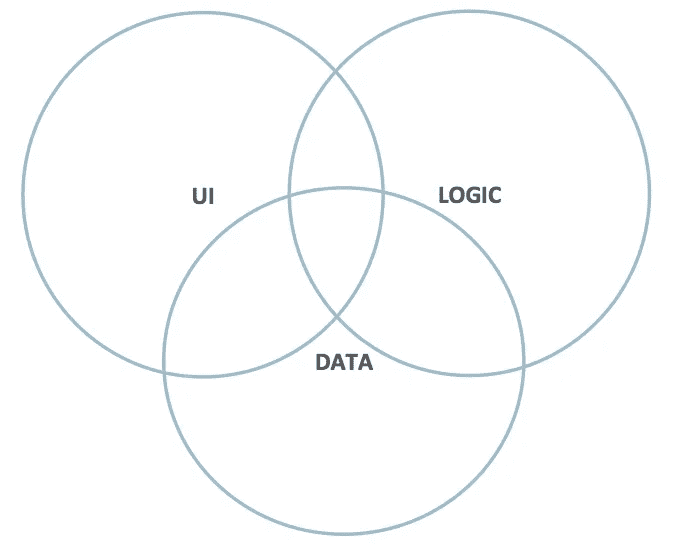

# Oracle Visual Builder 云服务的应用程序开发概念

> 原文：<https://medium.com/oracledevs/visual-builder-app-development-concepts-8cae101715e4?source=collection_archive---------1----------------------->

如果您是应用程序开发的新手，或者更具体地说，是可视化开发的新手，本文将介绍一些与这两者相关的关键概念。可视化开发也被称为低代码和/或快速应用程序开发(RAD)。Oracle Visual Builder Cloud Service(VBCS)是一个低代码环境，用于快速构建和托管响应迅速的 web 和移动应用。

首先，我们来说说什么是视觉开发。可视化开发是拖放式的，它是所见即所得的，它是声明式的，它很快！基本上，这意味着你的应用程序的大部分(或全部)可以可视化地创建，而不必编写代码，通过使用设计器来布局用户界面，定义数据模型，并表达业务逻辑。有时需要代码，但通常情况下，可视化设计工具可以让你在几个小时内(或一路)完成一个生产应用，而不是几周或几个月。

每个(有用的)应用程序都需要三个组件。它需要数据、业务逻辑和用户界面。数据指的是存储和/或检索的信息以及数据元素之间的关系。业务逻辑是应用程序在用户或系统采取行动时表现出来的自定义行为。用户界面是最终用户直接与之交互的应用程序的一部分。

现在我们已经掌握了应用程序的这些基础知识，让我们来讨论一些关于可视化应用程序开发的关键概念。下一节将定义这些关键领域中的 10 个关键概念，数据、业务逻辑和用户界面。让我们从用户界面概念开始。

**用户界面概念**

**1) UX 第一**

*   UX 优先是一种设计方法，应用程序开发人员首先关注用户体验，即用户界面如何向最终用户呈现数据和逻辑。
*   在可视化开发环境中，数据和逻辑是 UX 设计选择的结果。

**2)拖拽**

*   视觉设计环境包含三个主要方面:
*   形式
*   组件面板
*   财产检查员
*   **从组件面板中拖动**一个组件
*   **将**拖放到您想要显示的表单上
*   **设置组件的**属性以改变外观和感觉

**3)响应式用户界面**

*   **响应能力**是应用程序用户界面根据设备外形改变外观的能力
*   布局和组件大小由应用程序自动管理，并随外形而变化
*   可以为每个组件和外形规格设置特定行为

**4)动作**

*   **动作**是从用户界面捕获的事件，并作为该事件的结果驱动一系列行为
*   例如，当按下指定的按钮时

—从另一个用户界面字段中读取一个值，并将其显示在消息“Hello World”中

—发送电子邮件

—创建新的业务对象

—运行一些自定义代码

**数据概念**

**5)经营对象**

*   **业务对象(BO)** 是一组**字段**，用户可以在这些字段上执行一组 **CRUD** 操作
*   **自定义业务对象**存储在后端的本地数据库中
*   **外部业务对象**代表外部服务，因此数据存储在该服务中，但是您可以在您的应用程序中与之交互

**6)积垢**

*   **可以对业务对象采取的操作**:
*   **创建**向业务对象添加新行
*   **读取**从业务对象中检索一行、一组行或整个数据集
*   **更新**以更改业务对象中现有行(或一组行)的值
*   **删除**从业务对象中删除一行(或一组行)或整个数据集

7)人际关系

*   业务对象，即数据，彼此之间可以有关系
*   **父子**或主-详细关系是指一个业务对象可以“包含”另一个业务对象的关系

–一些数据来自父母，一些来自孩子

*   **参考业务对象**是连接到其他业务对象字段的字段

–数据存在于参考业务对象中

**业务逻辑**

**8)工作流程**

*   **业务逻辑工作流**是流程遵循的一组步骤
*   一个**工作流**有一个**开始**状态，和**结束**状态，以及中间的几个状态
*   开始状态称为**触发**或**动作**
*   一个**触发器**在**数据**中，一个**动作**在 **UI** 中

**9)条件和标准**

*   工作流如何从开始到结束在状态间移动是基于**条件逻辑**

**–如果是这样，那么…**

*   **标准**指定如何检查条件

–如果**字段**等于**真**

–如果**数量**大于数量 **$$$**

–如果字符串**包含**子字符串

**10)应用生命周期**

*   **应用生命周期**是一个应用从**开发**，通过**测试**，最后到**生产**的一系列阶段

**—开发/测试/生产**

*   要**发布**一个应用，请在应用生命周期中移动该应用
*   开发应用程序是流动的，变化很大
*   **测试**应用程序被**分阶段**并可供其他人访问
*   **Prod**app 是 **Live** 并且不能被开发者修改

—必须创建一个新的**版本**