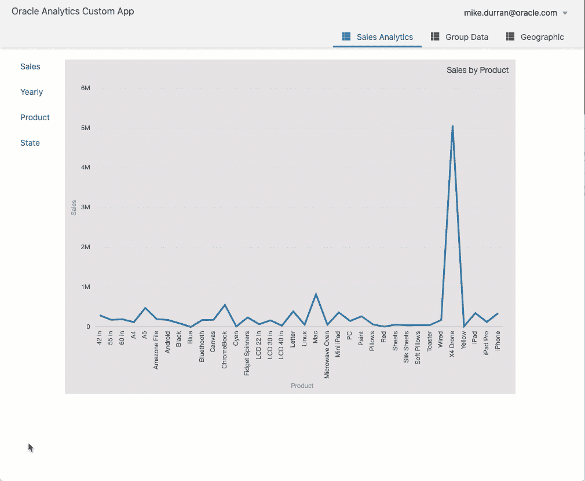
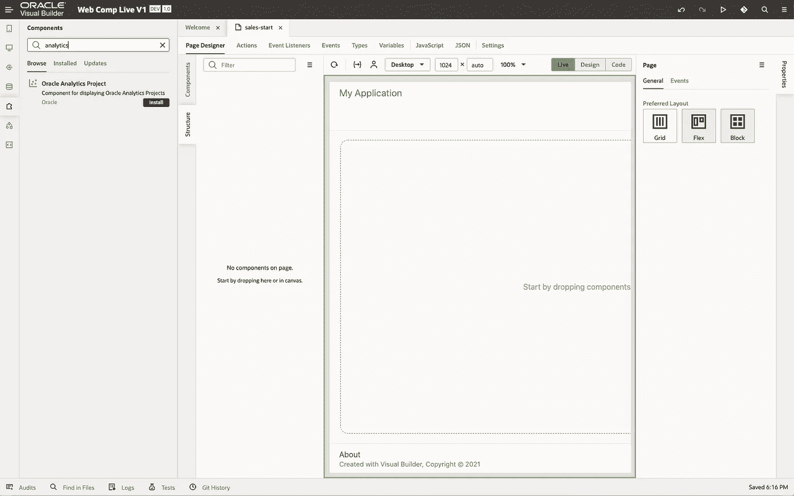
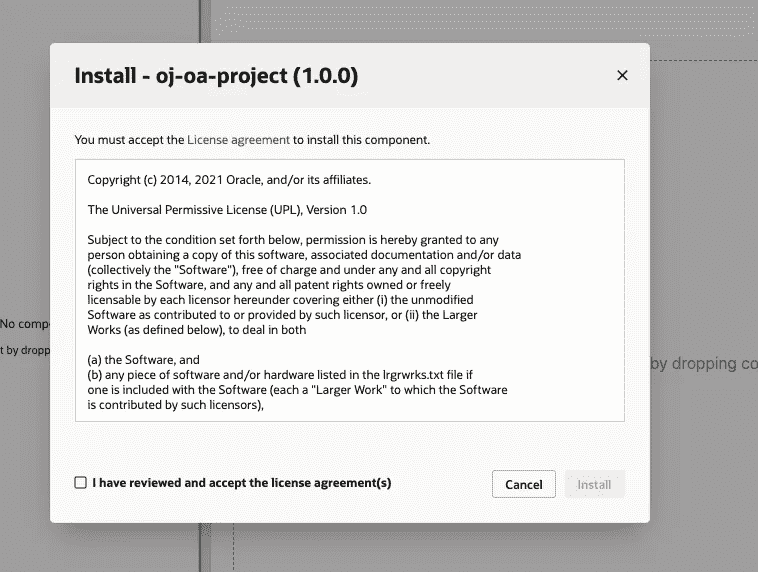
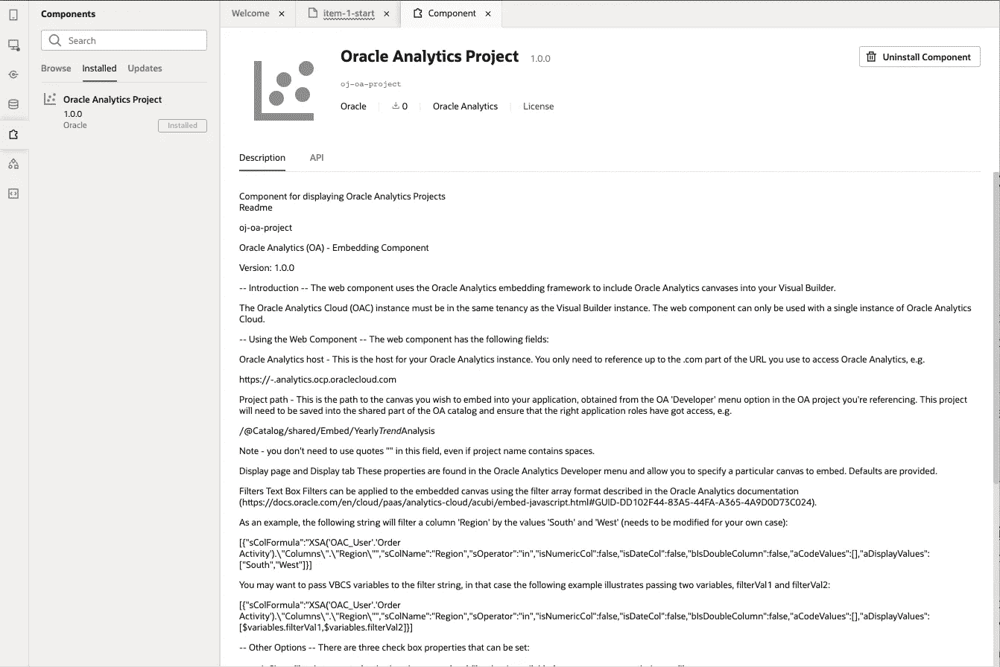
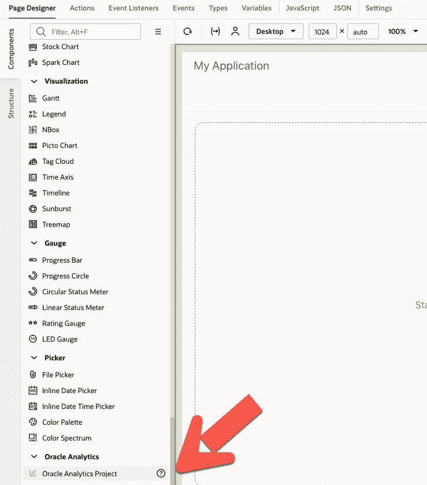
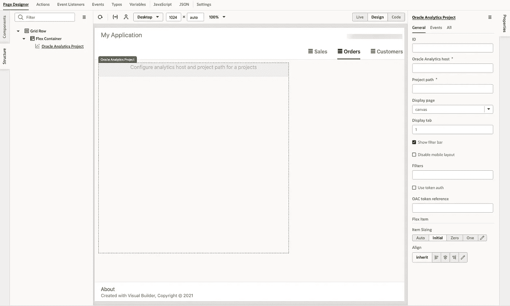
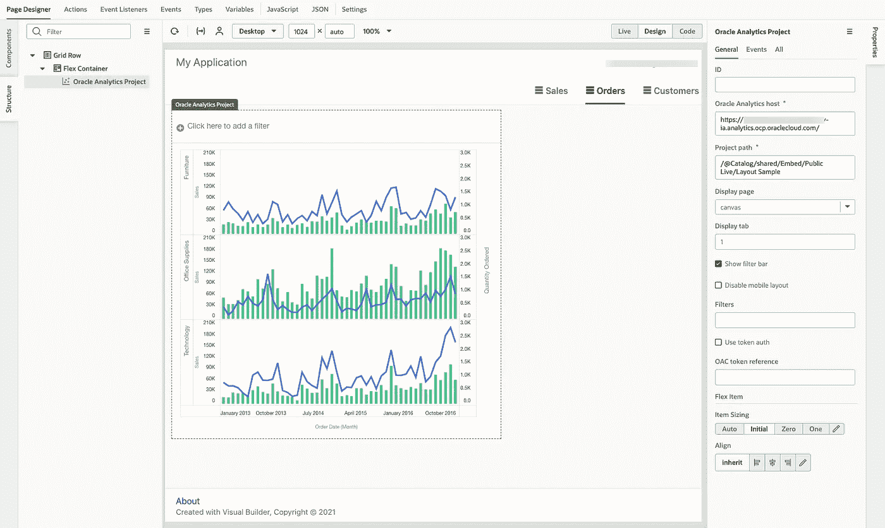

# 用于嵌入 Oracle 分析的可视化构建器组件—第 1 部分

> 原文：<https://medium.com/oracledevs/visual-builder-component-for-embedding-oracle-analytics-part-1-6de32b327d08?source=collection_archive---------0----------------------->

# 介绍

这是解释应用程序开发人员如何使用 Oracle Visual Builder ( [VB](https://docs.oracle.com/en/cloud/paas/app-builder-cloud/index.html) )组件嵌入 Oracle 分析云(OAC)数据可视化项目的系列博客中的第一篇。

第 1 部分—简介
[第 2 部分](https://insight2action.medium.com/visual-builder-component-for-embedding-oracle-analytics-part-2-layout-and-sizing-5a45709075fe) —布局和大小
[第 3 部分](https://insight2action.medium.com/visual-builder-component-for-embedding-analytics-part-3-filters-44a3b4a2af89) —使用滤镜
[第 4 部分](https://insight2action.medium.com/visual-builder-component-for-oracle-analytics-part-4-navigation-344a282b0893) —导航
[第 5 部分](https://insight2action.medium.com/visual-builder-component-for-oracle-analytics-part-5-mobile-996b8e4d5e10) —移动应用
[第 6 部分](https://insight2action.medium.com/visual-builder-component-for-oracle-analytics-part-6-token-auth-e28f87bf1fe4) —令牌认证
[第 7 部分](https://insight2action.medium.com/visual-builder-component-for-oracle-analytics-part-7-events-437e1c5b6161) —事件

使用该组件，可以使用 Visual Builder 创建定制的 web 和移动分析应用程序，其可视化效果直接来自 Oracle Analytics Cloud。

Example of a Custom Analytic Application with Navigation

我假设你已经有一些 VB 的经验，但是如果你刚刚开始，有很多优秀的资源和教程可以帮助你快速上手。如果您的 Oracle 云租赁中还没有可用的 VB 实例，请参见“[Visual Builder 入门](https://docs.oracle.com/en/cloud/paas/integration-cloud/visual-developer/get-started-visual-builder-cloud-service.html)”。

Web [组件](https://blogs.oracle.com/groundside/cca)是通过创建定制 HTML 标签来简化 Web 开发的标准方式。用于 VB 的 OAC web 组件在 VB 应用程序的上下文中专门管理现有的 OAC 嵌入框架(embedding.js 和< oracle-dv >)。

如果你是嵌入 OAC 项目的新手，我有一个介绍性的[博客](https://insight2action.medium.com/oracle-analytics-cloud-developer-experience-fe510b5507e9)可以帮助你开始。

# 使用组件的先决条件

Oracle Analytics Cloud 实例和 Oracle Visual Builder 实例必须位于同一个 Oracle Cloud 租户中，并使用相同的 Oracle Identity Cloud Service(IDCS)进行身份管理。任何需要使用 VB 应用程序的用户必须拥有 OAC 和 VB 的适当访问权限。

在将分析内容嵌入 VB 应用程序之前，需要进行一些配置。您需要将域添加到。com)作为 OAC 控制台中的安全域条目。例如，添加:

**https://<Your-VB-Instance>. builder . OCP . Oracle cloud . com**

并选中该条目的“嵌入”框。

在 VB 中，选择设置，并将 OAC 实例 URL 添加到“允许的来源”部分。您还需要添加 OAC 和 VB 都使用的 IDCS 实例的 URL。找到 IDCS 网址的一个方法是导航到你用来登录 OAC 的链接，你会被重定向到 IDCS 登录页面。捕获此 URL(直到。com)并将其添加到 VB“允许的原点”中。

如果您在登录和查看内容时遇到任何问题，您可能还需要将实例 URL 添加到 Oracle [IDCS 配置](https://docs.oracle.com/en/cloud/paas/identity-cloud/uaids/change-session-settings.html)允许跨来源资源共享(CORS)中。

# 安装组件

假设您已经在 VB 中创建了一个 web 应用程序，例如，使用一个应用程序模板，您将通过搜索“分析”在 VB 的“组件交换”部分找到 OAC 组件。您将看到一个名为“Oracle 分析项目”的组件。

The Oracle Analytics Component in the Visual Builder Cloud Service Component Library

在你的 VB 应用程序中安装这个组件。

Installing the Oracle Analytics Component

安装后，您可以从 VB 产品的这个区域管理该组件的任何可用更新。安装完成后，如果您点击组件名称，您还可以看到组件的描述以及如何使用它的详细信息。

*注意:你需要为你想要嵌入分析项目的每个新应用程序安装分析组件。*

# 使用组件

导航回您的 web 应用程序，您将看到“Oracle Analytics Project”列在可用组件中。

最简单的开始方式是向您的应用程序页面添加一个' [Flex 容器](https://docs.oracle.com/en/cloud/paas/integration-cloud/visual-developer/work-pages-and-page-layouts.html)'组件，然后将分析组件拖到容器中。您将看到一条消息，提示“配置分析主机和项目路径”。

Adding an OAC Component to a VBCS application page

您需要引用您的分析云实例的主机，例如，

**https://<your-oac-instance>analytics . OCP . Oracle cloud . com**

你可以从 OAC 的开发者菜单的嵌入标签中获得分析项目路径参考。通常，当嵌入到一个旨在供多个用户访问的应用程序中时，您会希望确保嵌入一个存储在目录的“共享”区域中的 OAC 项目。

An OAC Canvas Embedded into a VBCS Application Page

您会注意到“Oracle 分析项目”组件中提供了许多选项。最容易尝试的选项是显示或隐藏过滤栏的复选框。如果您没有看到任何分析画布，请确保您有一个类似于上面截图的页面结构，即具有行、容器、组件层次结构。

另请注意，VB 有一个“实时”模式，如果您想查看嵌入画布的变化/交互性，您可能需要选择该模式。

在后续的博客中，我将介绍如何添加多个画布和定义布局，并更详细地描述如何使用组件的过滤器和标记选项。