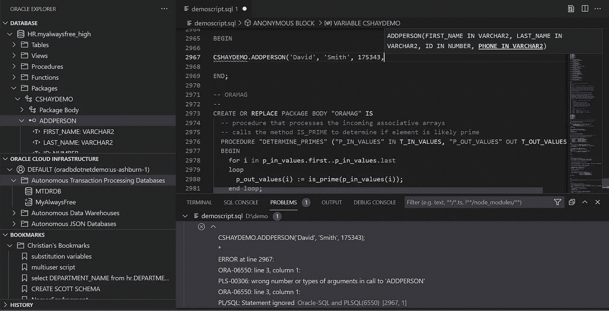
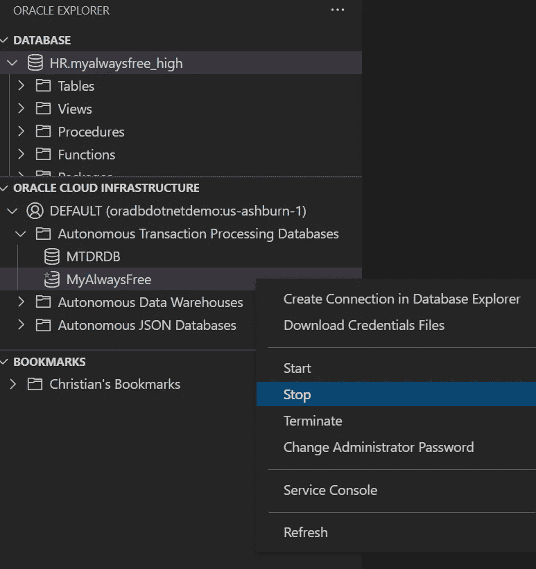
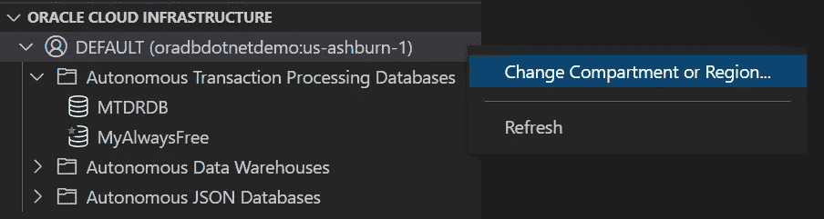
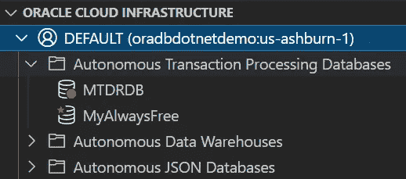
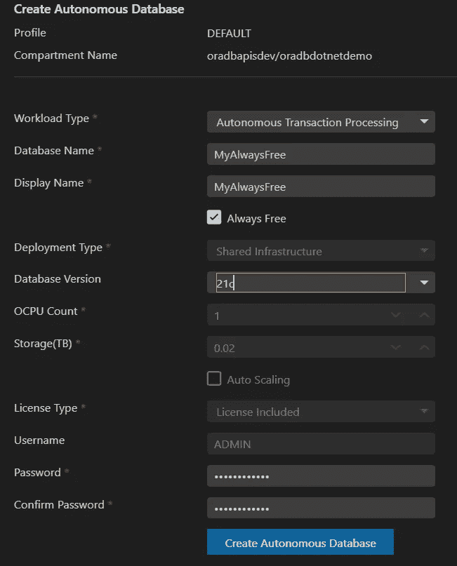
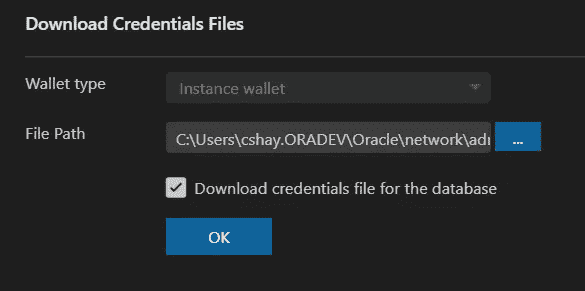
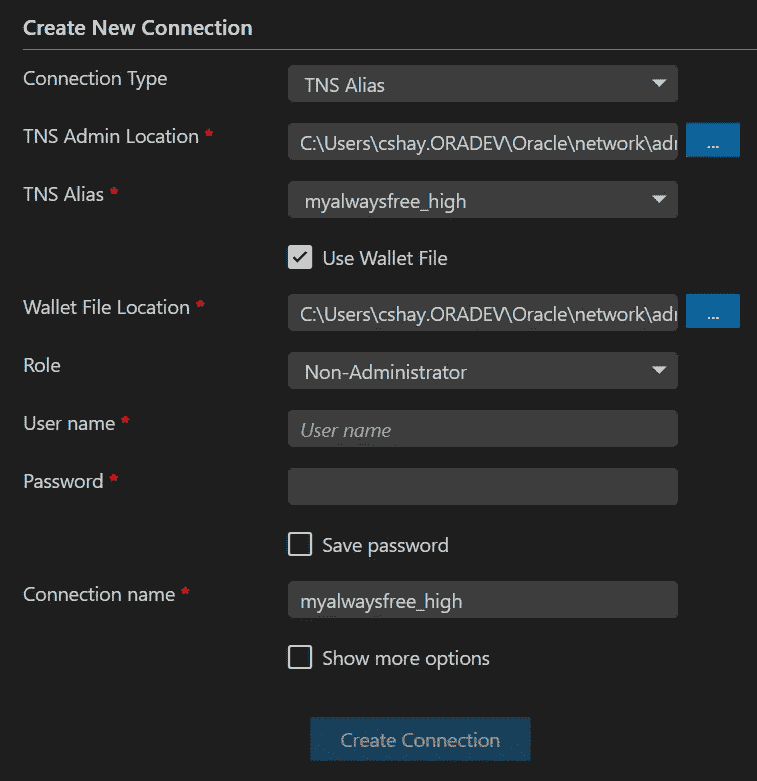

# Visual Studio 代码与 Oracle 自治数据库的集成

> 原文：<https://medium.com/oracledevs/visual-studio-code-integration-with-oracle-autonomous-database-9c558cd761fc?source=collection_archive---------2----------------------->

## 面向 VS 代码 21.3.0 的 Oracle 开发人员工具

在[我的上一篇博文](/oracledevs/oracle-developer-tools-for-vs-code-f26d31535925)中，我给出了[Oracle Developer Tools for VS Code](https://marketplace.visualstudio.com/items?itemName=Oracle.oracledevtools)的特性概述。它是 Visual Studio 代码的免费扩展，支持为 Oracle 数据库和 Oracle 自治数据库编辑和执行 SQL 和 PL/SQL。

Editing PL/SQL in Visual Studio Code with the free Oracle Developer Tools for VS Code extension

我们刚刚发布了一个新版本(21.3.0 ),其中包含一些非常酷的特性，这些特性是由我们在甲骨文论坛上的[不断增长的社区提出的。我希望你能加入我们的论坛，让我们知道你的想法。](https://community.oracle.com/community/groundbreakers/database/developer-tools/oracle-developer-tools-for-vs-code)

这个 21.3.0 版本的主要特性是与 Oracle 自治数据库(ADB)的集成。当然，您始终可以从我们的 Oracle Database Explorer 树控件、SQL 脚本或您正在编写的应用程序连接到您的 ADB。现在，我们可以在 Visual Studio 代码中查看、管理和创建 ADB。我们几乎毫不费力地获取了您的凭证文件并建立了数据库连接。

## Oracle 云基础架构浏览器树控件

当您在安装了 Oracle Developer Tools for VS 代码扩展的情况下启动 Visual Studio 代码时，您会立即注意到新的 Oracle 云基础架构浏览器(OCI)树控件。它与我们的 Oracle 数据库浏览器在同一个窗格中。

Oracle Cloud Infrastructure Explorer and ADB menu items

第一次使用时，您需要[按照这个快速入门](https://www.oracle.com/database/technologies/appdev/odtvscodecloudsetup.html)进行快速设置，然后 OCI 浏览器才能连接到您的 ADB 资源。(如果您忘记了快速入门链接，不要担心，树控件旁边有一个齿轮/链轮/设置图标，它将在浏览器中为您启动该快速入门)。

这种一次性设置包括:

*   如果您还没有免费的 Oracle 云帐户，请创建一个
*   将私钥文件和配置文件下载到您的机器上

就是这样！这应该只需要几分钟的时间，并且您只需执行一次此设置—之后，当您打开 Visual Studio 代码时，OCI 资源管理器将始终处于连接状态。

## 改变隔间或区域

一旦您的概要文件显示出来(通常命名为 *DEFAULT)* ，您可以右键单击概要文件名称并使用菜单项 ***更改区间或区域*** 如果需要的话*来查找任何已经存在的自治数据库资源。*

**

*在打开的对话框中，使用 ***选择新区间*** 树形控件找到您想要的区间和/或 ***选择新区域*** 下拉列表切换到新区域。一旦您获得了正确的区间和区域组合，您将在 ***自治事务处理数据库*** 、 ***自治数据仓库*** 或 ***自治 JSON 数据库*** 文件夹下看到您的 ADB 实例(如果有的话)。*

*看一下数据库图标，您可能会注意到它们是彩色编码的。右下角带红球的数据库图标被停止或终止。黄色球表示正在开始或停止。而那些根本没有球的人已经准备好了。将鼠标悬停在图标上，可以获得有关数据库实例状态的更多信息。你可能还会注意到其中一些上面有一个绿色的星形图标。这表明它是一个永远免费的 T21 实例。由于您获得的免费实例数量有限，这有助于提醒您哪些实例总是免费的。*

**

*Database instance icons are color coded*

## *创建一个新的始终免费的 Oracle 自治数据库*

*还没有 ADB？没问题。让我们创建一个总是免费的自治事务处理数据库实例。这不花一分钱！*

*右键点击 ***自治事务处理数据库*** 文件夹，从菜单中选择 ***新建*** 。在打开的对话框中，勾选 ***总是空闲*** 复选框。填写 ***数据库名称******显示名称*** 并提供 ***密码*** 然后点击 ***创建自治数据库*** 按钮。您将立即看到标有黄色球的新 ADB 数据库图标，表明它正在启动。当黄色球从图标上消失时，ADB 就启动了，可以使用了。(如果遇到问题，会有一个日志文件输出到 Visual Studio 代码输出窗格。)*

**

*Create Autonomous Database dialog*

## *连接并浏览您的 ADB 模式*

*现在您已经有了一个 ADB 实例，让我们连接到它，这样您就可以针对它运行脚本，并在 Oracle Database Explorer 树控件中浏览它。*

*你所需要做的就是右击代表你的实例的 ADB 图标，并在数据库浏览器中选择 ***创建连接。****

*这将最初打开一个 ***下载凭证文件*** 的对话框。在您按下 ***OK*** 之后，它将下载这些凭证并打开一个数据库连接对话框，其中除了用户名和密码之外，所有内容都已预先填充。一旦您提供了这些并按下 ***创建连接*** ，您就可以开始比赛了！从 Oracle Database Explorer 中，您可以在树控件中浏览实例的模式，并且可以右键单击连接名来打开新的或现有的 SQL 文件。查看我以前的博客或[快速入门](https://www.oracle.com/database/technologies/appdev/dotnet/odtvscodequickstart.html)获得更多关于你能做什么的提示。*

****

*Connection Dialog is prepopulated with credentials files. You just provide the username and password*

## *停止、开始、终止等等*

*最后但同样重要的是，您可以右键单击 ADB 实例图标，并从菜单中选择 ***停止*** 、 ***启动*、或 ***终止*** 来控制您的资源使用。(同样，如果遇到问题，请检查输出窗格中的日志)。***

*还有一个 ***更改管理员*** 密码菜单项和 ***服务控制台*** 调出 Oracle 云服务控制台 web 界面。和往常一样，随着这篇博文的发表，你可能会注意到菜单中增加了这里没有提到的新功能！*

*请关注这个博客，了解更多即将推出的 Visual Studio 代码技巧和窍门..同时，请在论坛上加入我们的[提问或让我们知道你的想法。那里见！](https://community.oracle.com/tech/developers/categories/oracle-developer-tools-for-vs-code)*