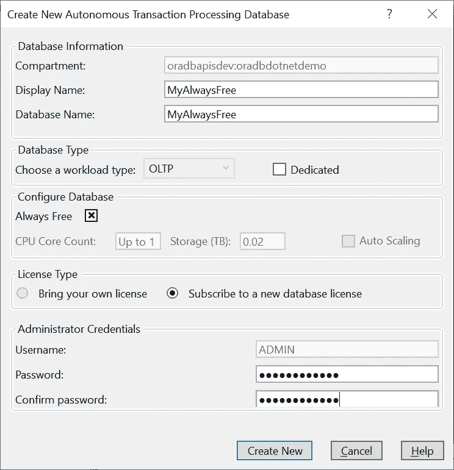

# 新版本:Visual Studio 与 Oracle 自治数据库的集成

> 原文：<https://medium.com/oracledevs/visual-studio-integration-with-oracle-autonomous-database-7c6243eca329?source=collection_archive---------1----------------------->

## 面向 Visual Studio 19.3 的 Oracle 开发人员工具

Oracle Developer Tools for Visual Studio(ODT)19.3 的新版本[可免费下载](https://www.oracle.com/database/technologies/net-downloads.html)。在这个版本中，我们增加了对 Visual Studio 2019 的支持，并引入了一些很酷的新功能来集成 Visual Studio 和 Oracle 自治数据库——允许 VS 开发人员轻松直观地连接、浏览和管理自治数据库(ADB)资源。

开发人员可以从 Visual Studio 快速创建始终免费的 ADB 实例，自动下载凭证文件，并在几分钟内连接到数据库以处理代码。

Visual Studio 2019 Integration with Oracle Autonomous Database: Managing an Always Free ADB instance in Oracle Cloud Explorer (top), and exploring the ADB schema (bottom)

在这篇博文的后面，我会一步一步地引导你开始。但是首先:ODT 已经存在很多年了，所以让我们回顾一下它到底是怎么回事。它是集成在服务器资源管理器中的 Microsoft Visual Studio 2019 和 Visual Studio 2017 的免费扩展，让您可以轻松连接到 Oracle 数据库和 Oracle 自治数据库，并使用集成的可视化设计器浏览和编辑 Oracle 模式对象。开发人员可以轻松地修改表数据、执行 Oracle SQL 语句、编辑和调试 PL/SQL 代码以及生成 SQL 脚本。还有许多其他特性，但主要思想是将大量 Oracle 功能引入到我们熟悉的 Visual Studio 开发环境中。

在 19.3 版本中，ODT 现在添加了 Oracle Cloud Explorer，您可以在上面的屏幕截图中看到。

在 Oracle Cloud Explorer 中，开发人员可以做一些事情(我们将很快介绍其中的一些内容):

*   注册 Oracle 云
*   使用简单的自动生成的配置文件和密钥文件快速连接到云帐户
*   创建新的或克隆现有的始终免费的 ADB、自治数据库专用和自治数据仓库实例
*   自动下载凭证文件(包括钱包)并快速连接、浏览和操作自治数据库模式
*   无需重新连接即可轻松更换隔间和区域
*   启动、停止或终止 ADB 实例
*   扩大/缩小亚行资源
*   从备份恢复
*   更新实例凭据，更新使用的许可证类型
*   旋转钱包
*   将始终免费的 ADB 实例转换为付费实例
*   一键连接到服务 web 控制台

# 入门:循序渐进

在开始使用这个新版本之前，请确保您的计算机上还没有安装 ODT。查看 Visual Studio 菜单中的*帮助- >关于*，查看是否列出了 Oracle Developer Tools。如果是，请使用“添加/删除程序”或 Oracle Universal Installer 卸载它，这取决于您最初是如何安装的。

另外，确保 Visual Studio 2019 是 16.4.2 或更高版本(同样，你可以查看 *Help- >关于*的内容，如果需要的话进行更新)。

1.  下载[压缩的 ODT VSIX 文件](https://www.oracle.com/database/technologies/dotnet-odtvsix-vs2019-downloads.html)如果你使用的是 Visual Studio 2019，或者下载 [MSI exe](https://www.oracle.com/database/technologies/dotnet-odacmsi-vs2017-downloads.html) 如果你使用的是 Visual Studio 2017。您还可以使用 Visual Studio 扩展管理器在 Visual Studio Marketplace 中搜索“Oracle Developer Tools for Visual Studio ”(博客的寿命很长，我必须提醒您，在将来的某个时候，它可能只能在 Marketplace 中使用)。确保 Visual Studio 已关闭，然后双击该文件并按照提示进行安装。
2.  安装完成后，启动 Visual Studio 并打开服务器资源管理器(*视图- >服务器资源管理器*)。您应该会看到 Oracle 云基础架构节点。

Oracle Cloud Explorer Menus

3.如果您还没有 Oracle Cloud 帐户，右键单击 Oracle Cloud Infrastructure 节点，然后单击 S *ign up for Oracle Cloud* 。这将打开一个 web 浏览器，带您完成注册过程。

4.现在，您已经准备好连接到您的 Oracle 云帐户。在 Visual Studio 中右键单击 Oracle Cloud Explorer 并选择*添加新帐户条目*。这将打开名副其实的“添加新 OCI 帐户条目”对话框:

Add new OCI Account Entry Dialog: Note the OCI CLI tool link at the top of the dialog

5.连接到您的帐户的最佳方式是使用配置文件和相关的密钥文件。这两者都可以使用 OCI CLI 工具轻松地自动生成。该对话框包含一个指向网页的便捷链接，一步一步地说明如何安装和运行该工具。继续并遵循这些步骤。完成后，您将拥有一个指向密钥文件的配置文件。返回到对话框，浏览到新创建的配置文件以加载它，然后按 OK。

6.下一个对话框将要求您选择默认的隔离专区。(您可以随时更改区间和区域，无需重新连接)

Choosing the default compartment

7.现在是时候创建一个永远免费的 ADB 实例了。单击自治事务处理数据库节点，并从菜单中选择*创建新的*。

这是将打开的对话框:

Creating an Always Free ADB

8.提供显示名称和数据库名称。勾选*始终自由*复选框并提供密码。完成后，按下*创建新的*，实例将开始旋转。当服务器资源管理器中的图标不再显示黄色时，意味着它可以使用了。

9.要连接到数据库并开始处理模式，您将需要凭证文件。这些身份证明文件包括一个钱包文件和数据库连接描述符文件。有了 ODT，下载和设置这些文件是自动的。你只需右击你创建的永远免费的实例，并从菜单中选择*创建数据连接*。

Use the Create Data Connection menu item to connect to and explore your Always Free Database instance

10.这将打开一个对话框，显示凭证文件将被放置的位置，如果您以前已经下载过这些文件，还会有一个复选框允许您选择跳过下载。按下*继续*。

Here we provide the location for the credentials files

11.将打开一个连接对话框，预先配置为指向凭据文件。你所需要做的就是提供数据库用户名和密码，然后你就可以进入了！

Connecting to my Always Free ADB instance

12.连接后，您可以浏览现有的模式对象(如果您已经有)，或者您可以使用查询窗口或 SQL*Plus 脚本执行对话框创建新的模式对象。

Opening the Oracle Developer Tools Query Window and running SQL Plus Scripts

# 后续步骤

我将在这里写关于自治数据库的博客。NET、Visual Studio、Visual Studio 代码和相关主题，所以请关注这个空间。在此期间，请访问[神谕。NET 开发者中心](https://www.oracle.com/database/technologies/appdev/dotnet.html)，在[甲骨文开发者工具论坛](https://community.oracle.com/community/groundbreakers/database/developer-tools/windows_and_.net/oracle_developer_tools_for_visual_studio)上提问，在 Twitter 上关注我们:@oracledotnet