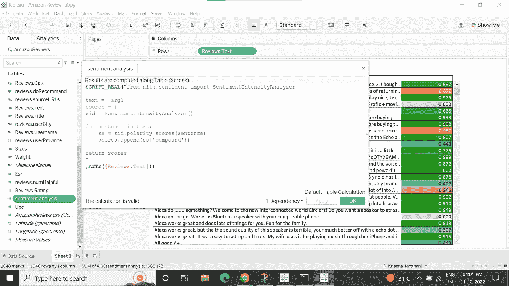
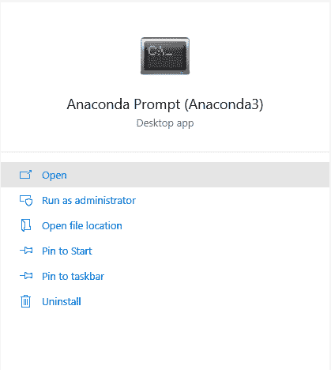
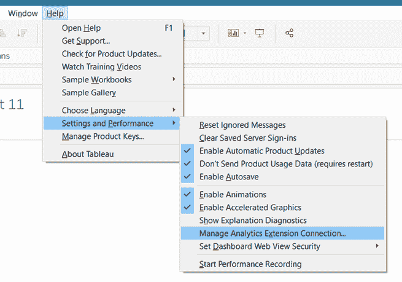
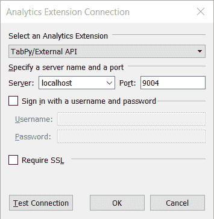

# 机器学习可视化

> 原文：<https://medium.com/globant/visualization-with-ml-671be5fbebcf?source=collection_archive---------1----------------------->


商业智能(BI)和机器学习(ML)是解决业务驱动的高级分析挑战的最佳技术之一。虽然 BI 可视化处理复杂的计算，但与 Python 驱动的 ML 相比，它有局限性。这就是 ML 可视化的用武之地。它允许您将更高级的分析和 ML 算法合并到您已经强大的可视化中。在这个博客中，我们将讨论 ML 与数据可视化的集成。

## 什么是数据可视化？

数据可视化是将信息转换成可视化的上下文，如地图或图形，使数据更容易被人脑理解，并从任何类型的数据中获得洞察力。

数据可视化的主要目标是使识别大型数据集中的模式、趋势和异常值变得更加容易。

## BI 能为企业做些什么？

BI 技术使用高级统计和预测分析来帮助企业从数据分析中得出结论，发现模式并预测业务运营中的未来事件。BI 报告不是线性的实践；相反，它是一个持续的、多方面的数据访问、探索和信息共享的循环。

## **ML 能为企业做什么？**

ML 可以管理企业获得核心绩效所需的繁重数据提升。例如，ML 算法可以通过从各个角度分析您的数据来识别有助于和有损于您的品牌健康的因素。ML 是独一无二的，因为它可以快速识别对人类来说可能不是立即明显或直观的关系。

为什么我们需要将 ML 集成到 BI 可视化工具中？

*   BI 软件为清理、管理和可视化数据提供了一个强大的出口。与 ML 技术相结合，它可以帮助业务用户发现甚至是最有经验的分析师经常忽略的一层洞察力。
*   ML 可以轻松快速地执行人类无法完成的繁琐任务。图像和语音识别是这类任务最生动的例子。一旦暴露于足够的训练阶段，ML 在执行这些任务方面已经取得了相当好的结果。

以下是 ML 算法在集成后的商业智能报表上的优势:

*   **任务自动化** : ML 可以处理日常任务，解放分析师和顾问，提高他们的工作效率。
*   **数据质量** : ML 系统可以在有限的人工干预下运行，因此可以做出决策来自动纠正错误和处理问题。
*   **自助服务**:商业智能工具集将达到自助服务的新水平，减少对技术知识的需求，并提供更简单的数据交互方式。系统将能够根据用户的偏好和先前的活动进行学习，为每个用户提供量身定制的服务。

# 在 BI 工具中集成机器学习

将 Python 集成到 BI 工具中是一个非常好的特性，因为您可以以可视化的形式展示您的 Python 代码正在做什么，以及它如何连接到数据。随着跨职能团队的增长，这对于 BI、数据分析师和科学家角色来说是一个突破。

[Power BI](https://powerbi.microsoft.com/en-au/) 和 [Tableau](https://www.tableau.com/) 是解决业务驱动的高级分析挑战的最佳 BI 可视化工具。

这里我们重点关注 Tableau Python 与业务用例的集成及其在系统中的安装。

[**Tabpy(Tableau Python integration)**](https://help.tableau.com/current/prep/en-us/prep_scripts_TabPy.htm)**:**Tabpy 允许您将更高级的分析(如时间序列和 ML 算法)合并到您已经强大的可视化中。这是一个非常好的特性，因为您可以显示您的 Python 代码做了什么，以及它如何通过可视化连接到数据。跨职能团队的发展是商业智能、数据分析和数据科学角色的突破。


Tableau + Python integration

**那么 Tabpy 到底是什么？**这是一个分析扩展实现，允许用户通过 Tableau 的表计算来执行 python 脚本和保存的函数，从而扩展了 Tableau 的功能。

**你什么时候用 Tabpy？**我们可以在 Python 中定义计算字段。我们可以直接从您的可视化平台利用大量 ML 库的能力。Python 与 Tableau 的集成实现了一个极其强大的场景。

## **tabby 的好处**

Tabpy 使用流行的 [Anaconda](https://www.anaconda.com/products/distribution) 环境，该环境已经预装并准备好使用许多 Python 包 [Pandas](https://pandas.pydata.org/) 、 [NumPy](https://numpy.org/) 和 [Sklearn](https://www.tutorialspoint.com/scikit_learn/index.htm) ，但是您可以在我们的脚本中安装任何 Python 库。

# **tabby 用例**

TabPy 使得在 Tableau 计算的字段中使用 Python 脚本成为可能。当您将 Python 的 ML 功能与 Tableau 的强大功能结合起来时，您可以快速开发高级分析应用程序，帮助完成各种业务任务。

## 使用 TabPy 进行情感分析

如今的企业严重依赖文本数据。这些数据的大部分是非结构化文本，来自电子邮件、聊天、社交媒体、调查、文章和文档等来源。虽然分析对监控这些属性很重要，但它有助于发现客户的情绪。
不使用传统的标注，我们可以使用来自 python 的自然语言处理。使用来自[自然语言处理(NLP)](https://www.lexalytics.com/blog/machine-learning-natural-language-processing/) 的[自然语言工具包(NLTK](https://www.nltk.org/) )让计算机理解非结构化文本并检索有意义的信息片段，如情感和观点。

## 拟议解决方案

[Valence Aware 字典和情感推理器(Vader)](/mlearning-ai/vader-valence-aware-dictionary-and-sentiment-reasoner-sentiment-analysis-28251536698) 是 NLTK 中的一个开源包。在处理社交媒体文本时，它相当成功。它使用情感词典的组合，情感词典是词汇特征(例如，单词)的列表，这些词汇特征通常根据它们的语义取向被标记为正面或负面。词典方法意味着该算法构建了包含情感特征的综合列表的词典。

## Tableau 计算字段中的 VADER

我们可以创建一个外部服务计算，这在 tableau 中称为脚本函数。我们不需要进行任何训练就可以使用这个库，我们将创建一个句子列表，这里是我们将使用 [polarity_scores()](https://stackoverflow.com/questions/39462021/nltk-sentiment-vader-polarity-scorestext-not-working) 方法从[SentimentIntensityAnalyzer](https://www.nltk.org/api/nltk.sentiment.html)类对其应用情感分析的评论文本。极性得分返回基于输入文本的情感强度的浮动值，范围从-1 到 1。



Calculated filed for Sentiment Intensity Analyzer

## 基于 Tabpy 的亚马逊商品评论情感分析

通过 Tabpy，我们可以对亚马逊产品评论数据进行 Vader 情感分析。我们使用评论文本的极性得分来了解客户对以下反馈的看法。通过使用过滤器只查看负面评论，并审查其内容，以了解背后的原因。从 ML 中，我们得到了一个用于情感分析的 NLP 算法，我们可以在 Tableau 可视化上对这些分数进行颜色编码，以便更好地理解。


Sentiment Analysis on Tableau

## 在 Windows 上安装 Anaconda

我们使用 Anaconda 是因为它有一个包管理器、一个环境管理器和一个包含许多开源包的 Python 发行版。当你在从事数据科学项目时，这是有利的；您会发现您需要许多不同的软件包(NumPy、Sklearn、Pandas)，Anaconda 的安装会预装在这些软件包中。

访问 Anaconda 网站，选择 Python 3 图形安装程序(A)或 Python 图形安装程序(B)。如果您不确定要安装哪个 Python 版本，请选择 Python 3。不要两者都选。

*   内存:最小内存大小为 16 GB。
*   存储:建议最少 100 GB。

通过在本地机器上安装 Anaconda，我们可以运行 Jupyter 和 Spyder 进行 Python 编码。从开始菜单中，搜索 Anaconda 提示符并打开它。执行以下命令创建一个虚拟环境，然后激活它。



Anaconda command prompt for tabpy installation

在激活的 TabPy 环境中，执行以下命令。您必须确认第一个命令的流程。

```
create - - name virtualenv
python -m pip install - - upgrade pip
pip install tabpy
```

最后一步是让 Tableau 桌面与运行 TabPy 的本地进程通信。打开您的 [Tableau 桌面](https://www.tableau.com/products/desktop) +并导航到帮助>设置&性能>管理外部服务连接。



Connecting Tableau with an extension connection

终端窗口中的 TabPy 确认消息提到“web service listening on port 9004”提供了“localhost”和端口“9004”的服务器。如果你点击“测试连接”并得到消息“成功连接到外部服务”，那么恭喜你！您已经准备好在 Tableau 中使用 Python 了。



Tabpy Local Host setup

# C **结束语**

通过将 BI 与 ML 集成，我们将打开无限可能性的大门，以自动化和改进您当前的数据分析设置。我们还可以使用它将深度学习模型集成到分析仪表板中，执行复杂的统计任务，并实施持续集成和开发。

## **参考链接**

*   [Tableau 和 Python 集成:Tabpy](https://www.tableau.com/blog/leverage-power-python-tableau-tabpy-62077)