# 在 Airbnb 可视化数据及时性

> 原文：<https://medium.com/airbnb-engineering/visualizing-data-timeliness-at-airbnb-ee638fdf4710?source=collection_archive---------1----------------------->

由[克里斯·威廉姆斯](/@ccardwilliams)、[肯·陈](https://kenchen.design/)、[克里斯特·翁苏巴斯瓦特](https://twitter.com/kristw)和[西尔维亚·富山](https://twitter.com/SylviaTomiyama)

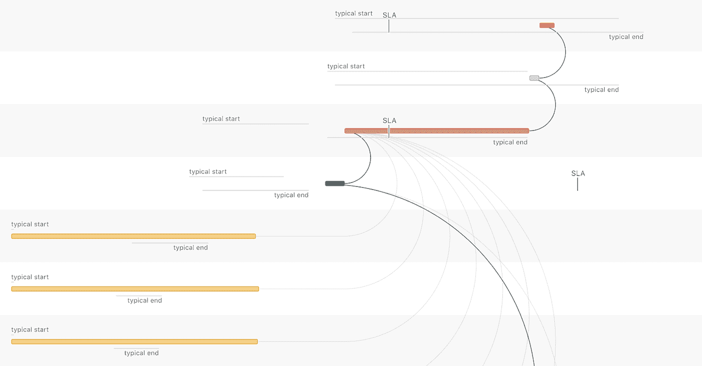

想象一下，你是一位准备开始一天工作的商业领袖，但你醒来后发现你的每日商业报告是空的——数据晚了，所以现在你是盲目的。

在过去的一年里，多个团队共同构建了 SLA Tracker，这是一个可视化分析工具，旨在促进 Airbnb 的数据及时性文化。该数据产品使我们能够应对以下数据及时性挑战并使之系统化:

1.  *何时*数据集应被视为迟交？
2.  *数据集迟到* *多频繁*？
3.  *为什么*一个数据集晚了？

该项目是我们努力实现高数据质量的关键部分，需要克服许多技术、产品和组织方面的挑战。在本文中，我们重点关注*产品设计*:我们如何设计和构建数据可视化的旅程，这些数据可视化可以理解数据及时性的复杂数据。

# 是的，数据可能会延迟

为了避免业务受阻，及时交付数据至关重要。然而，这可能很难做到，因为从数据收集到最终数据输出通常需要许多步骤。在 Airbnb——以及任何有大规模数据处理管道的地方——“原始”数据集被清理、合并并转化为结构化数据。然后，结构化数据为产品功能提供支持，并使分析能够为业务决策提供信息。

为了确保最终输出数据的及时性，我们的目标是让每个中间步骤的所有者承诺在某个时间之前提供其数据的*【SLA】。例如，数据集所有者承诺“bookings”指标将在 UTC 时间上午 5 点之前获得最新数据，如果到这个时间还没有获得，则被认为是“晚了”*

# *我的数据集迟交的频率有多高？*

*作为第一步，我们开始让数据生产者了解数据何时到达*，以及*在 ***报告视图*** 中满足 SLA 的*频率(图 1)。在这种情况下，生产者可以跟踪他们拥有或关心的多个数据集的实时和历史趋势。我们还确保了即使没有正式的 SLA，生产者也能通过展示典型的登陆时间来获得价值。当我们第一次启动该工具时，没有设置 SLA，对于没有广泛使用的数据集，SLA 可能是不需要的。**

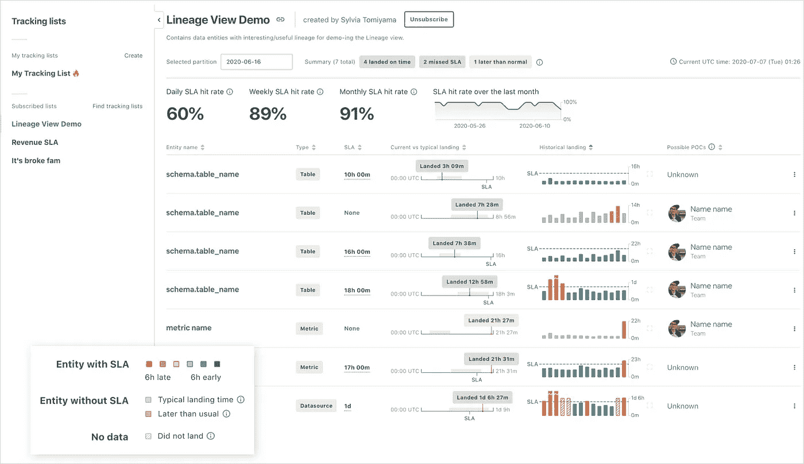

**Figure 1** SLA Report view provides a high-level overview of SLA performance across lists of datasets. Each row includes a status indicator of the latest data partition and bar charts that display historical landing times (red bars show the days when datasets missed SLAs).

报告视图利用传统的数据实体列表，嵌入简明总结典型和历史着陆时间数据的小图像。数据生产者可以跨列表组织他们的数据集，并在列表上与其他人(例如，他们的团队)协作。

有了这份数据丰富的总结，理解着陆时间和 SLA 性能变得*像管理数据集列表*一样简单。

# 报道只是冰山一角

虽然报告视图极大地简化了对数据集是否迟到的理解，但它没有解决 SLA 的两个主要挑战:

*   数据集的合理 SLA 是什么？
*   当一个数据集延迟时，如何理解原因？

这些问题很有挑战性，因为*数据集不是相互独立的*。相反，数据集是按照特定的顺序逐步派生出来的，其中一个或多个转换必须在另一个转换之前发生(图 2)。

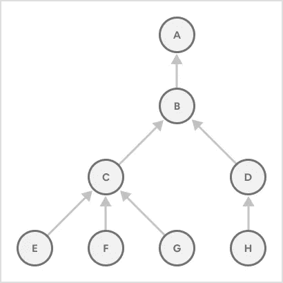

**Figure 2** An example of data lineage for creating dataset “A.” “A” depends on “B,” which depends on “C” and “D” and so on.

因此，一个数据集的可用性与数据祖先的复杂分层“血统”有着内在联系。要为数据集设置一个现实的 SLA，必须考虑它的整个依赖关系树(有时包含数百个实体)及其 SLA。

更复杂的是，当事情出错时，试图将层次依赖关系与时间顺序匹配起来会使 SLA 失误在没有视觉帮助的情况下难以推理。Airbnb 现有的工具使数据工程师能够识别他们自己的数据管道中的问题，但是在通常由不同团队拥有的管道之间做这件事要困难得多。

# 为什么我的数据集晚了？

为了使数据生产者能够识别跨数据管道的 SLA 命中或未命中*的根本原因，并通过考虑完整的数据谱系来设置现实的 SLA，我们设计了 ***谱系视图*** 。*

**早期设计尝试**

为了取得成功，沿袭视图需要使数据生产者能够对数据集依赖关系和这些依赖关系的时间表进行推理。由于数据谱系可以包括 10 到 100 个表，每个表包含 30 天的历史数据、SLA 以及它们之间的关系，我们需要简明地表示大约 1，000 到 10，000 个单独的数据点。

在我们最初的探索中，我们着重强调了*血统*超过了着陆时间序列(图 3)。尽管很容易理解小谱系的依赖关系，但它无法突出在给定的运行中哪些依赖关系导致了整个管道中的延迟，并且很难理解产生整个数据集所花费的时间。

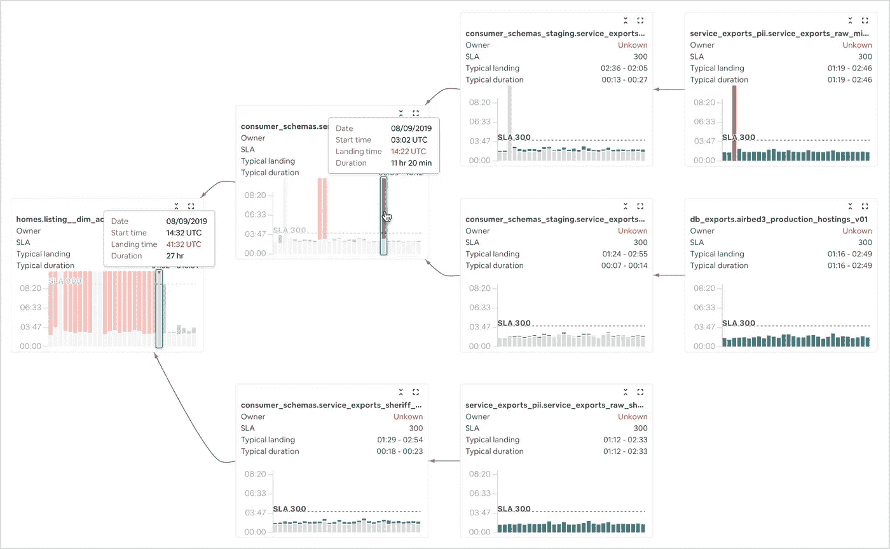

**Figure 3** Early exploration with emphasis on dataset lineage. Each box shows historical landing times for each dataset in the larger data pipeline.

## 通过时间线视图关注时间

然后我们转向强调*时序*而不是血统。为了做到这一点，我们设计了一个包含*依赖关系的甘特图*(图 4)，它具有以下特点:

*   每行代表谱系中的一个数据集，感兴趣的“最终”数据集位于顶部。
*   每个数据集都有一个水平条，代表其数据处理作业在所选日期或时间的开始时间、持续时间和结束时间。
*   如果数据集有 SLA，则用垂直线表示。
*   *典型的*开始和结束时间的分布被标记，以帮助数据生产者评估数据处理作业是提前还是滞后，从而使其下游数据集处于风险之中。
*   父数据集和子数据集之间画有弧线，因此数据生产者可以追踪谱系，并查看延迟是否是由上游依赖性引起的。
*   强调弧线代表最重要的“瓶颈”路径(如下所述)。

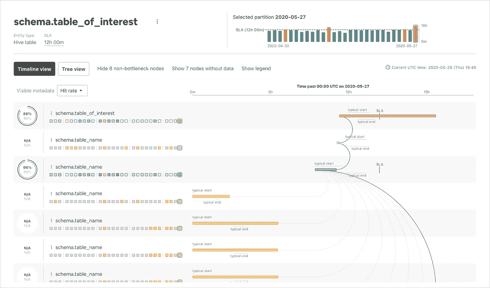

**Figure 4** The Timeline view gives a clear sense of sequence and the duration of data transformations, while preserving important hierarchical dependencies which provide sequence context. Historical landing times are displayed for each dataset row, to the left of the current run.

通过这种设计，很容易找到有问题的步骤——通常是长的红色条——或识别系统范围的延迟，其中所有步骤都比通常花费更长时间(许多黄色条，每个都超过了其典型的着陆时间)。如今，Airbnb 的许多团队都在使用这种可视化技术来调试数据延迟。

## 大海捞针——“瓶颈”

对于具有非常大的依赖树的数据集，我们发现很难找到延迟整个数据管道的相关的、缓慢的“瓶颈”步骤。通过开发“瓶颈”路径的概念，我们能够大幅减少噪音并突出显示这些有问题的数据集，瓶颈路径是指最近到达的数据祖先的序列，它阻止了子数据转换的开始，从而延迟了整个管道(图 5)。

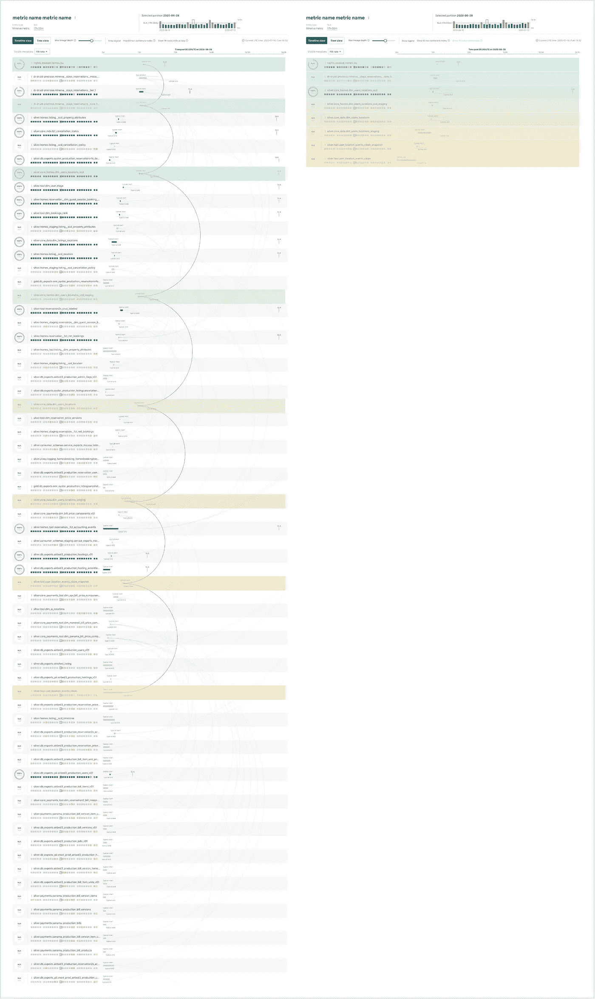

**Figure 5** Comparison of a full data lineage (left, n=82) versus just the filtered “bottleneck” path (right, n=8). Bottleneck paths significantly improve signal-to-noise, and make it easy to find problematic steps of large data pipelines possible.

# 是我还是你？深入历史观

一旦确定了瓶颈步骤，下一个重要问题就变成了该步骤中的延迟是由于*长运行时间*还是*上游依赖关系中的延迟。*这有助于数据生产者了解他们是需要优化自己的管道，还是需要与上游数据集的所有者协商更早的 SLA。为了实现这一点，我们构建了单个数据集的详细历史运行时视图，显示了它们运行的时间和持续时间(图 6)。

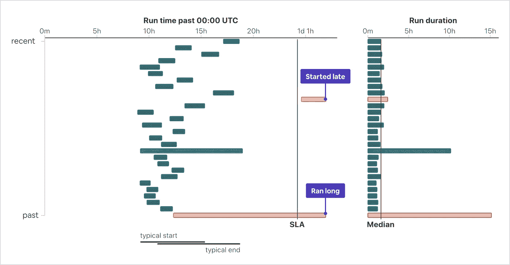

**Figure 6** Historical runtimes and duration distributions quickly distinguish whether SLA misses (red) are due to starting late (top) versus long runtime durations (bottom).

通过在 SLA Tracker 中组合这些互补的视图，我们能够提供数据及时性的完整视角(图 7)。

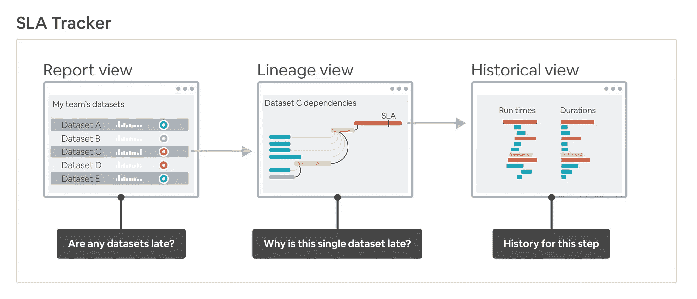

**Figure 7** SLA Tracker is comprised of multiple views. The Report view provides an overview of dataset status, the Lineage view enables root cause analysis of data landing times, and the Historical view captures historical trends in detail.

# 流程和工具

我们花了大约 12 个月的时间来构思、设计、制作原型和生产 SLA 跟踪器。大部分时间都花在了开发支持 UI 的数据 API，以及迭代*沿袭视图*上。

对于更简单的*报告视图* ***，*** ，我们利用静态设计和带有通用*模拟数据*的点击原型。在整个 alpha 和 beta 产品发布中，我们迭代视觉语言，并使数据更加可视化，以提高理解能力(图 8)。

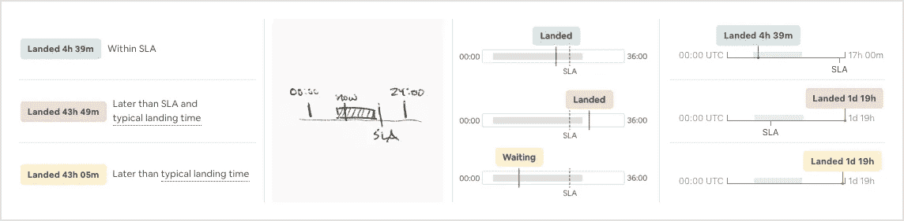

**Figure 8** Evolution of making the “current vs typical” landing time visual.

我们在设计 ***谱系视图*** 时使用了完全不同的方法。它的*信息层次由数据*的形状决定，这使得用*真实数据*样本进行原型制作变得至关重要。我们使用 React 的底层 [visx](https://airbnb.io/visx) 可视化组件套件在 TypeScript 中构建了这些原型，这允许在生产过程中重用部分代码(图 9)。

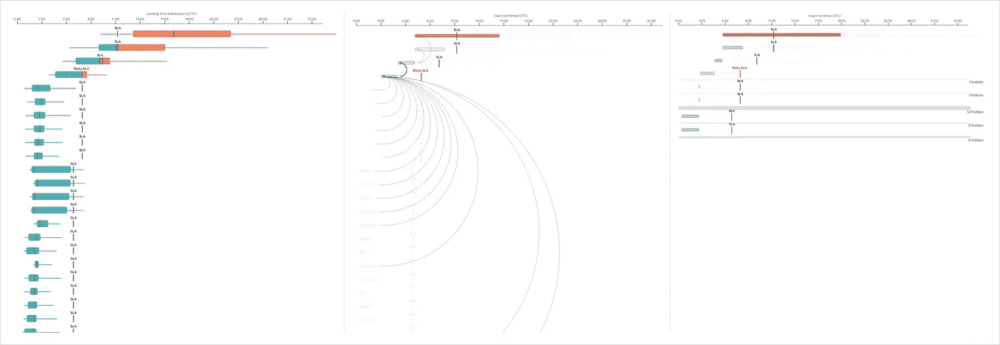

**Figure 9** Evolution of the Lineage Page gantt chart (left to right): early multi-run summary boxplots; single run tracks with dependency arcs; “bottleneck” simplification.

在我们对我们的可视化充满信心之后，我们在生产之前在 Figma 的静态模拟中提炼了可视化元素(图 10)。

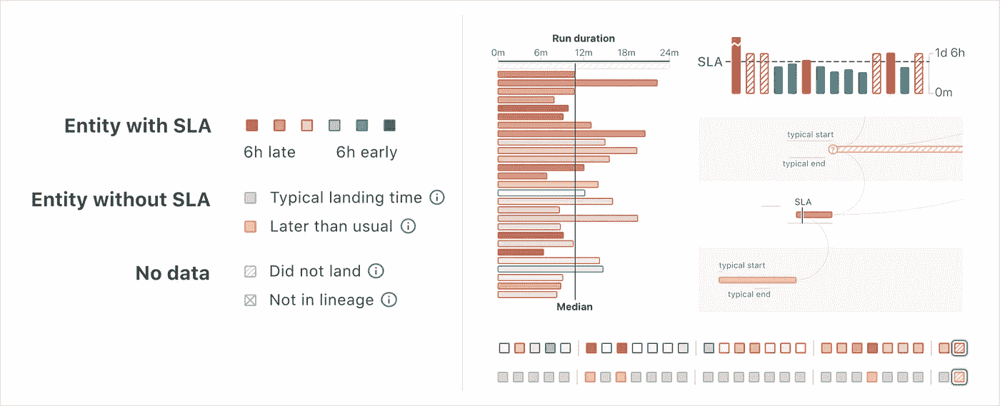

**Figure 10** Developing a simple but coherent design language (left) across SLA Tracker views (right) helped balance information density by making elements more quickly understandable.

# 结论

在这个项目中，我们将数据可视化和 UI/UX 设计(我们称之为“数据体验”的跨学科技术)应用于需要深入理解复杂的时间和层次信息的重要数据及时性问题。这使我们能够获得数据及时性见解，即使是在大规模公司的复杂数据生态系统中。开发复杂的可视化分析工具需要时间和迭代，但最终的产品可以为您的组织提供巨大的价值。

# 鸣谢❤️

SLA 跟踪者是许多人和团队努力的结果。虽然我们在本文中关注的是数据可视化方面，但是为了使分析工具成为可能，我们还必须克服其他一些重要的挑战。感谢整个团队在前端、后端和数据工程方面的努力，使这一产品成为可能:[石丛磊](https://www.linkedin.com/in/conglei-shi-bb1b1b2b/)、[埃里克·里特](https://github.com/etr2460)、[叶佳鑫](https://www.linkedin.com/in/jiaxin-ye-b249b259/)、[约翰·博德利](https://github.com/john-bodley)、[米歇尔·托马斯](https://github.com/michellethomas)、[塞丽娜·江](https://github.com/serenajiang)、[邵燮](https://www.linkedin.com/in/shao-xie-0b84b64/)、[肖斌·郑](http://www.linkedin.com/in/xiaobin-zheng)和[祖扎娜·韦杰拉兹科娃](https://www.linkedin.com/in/zuzanavejrazkova/)。

所有商标都是其各自所有者的财产。这些的任何使用仅用于识别目的，并不意味着赞助或认可。