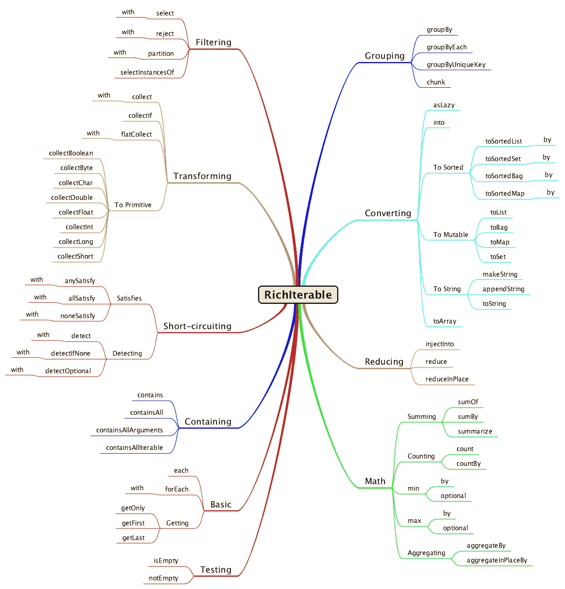
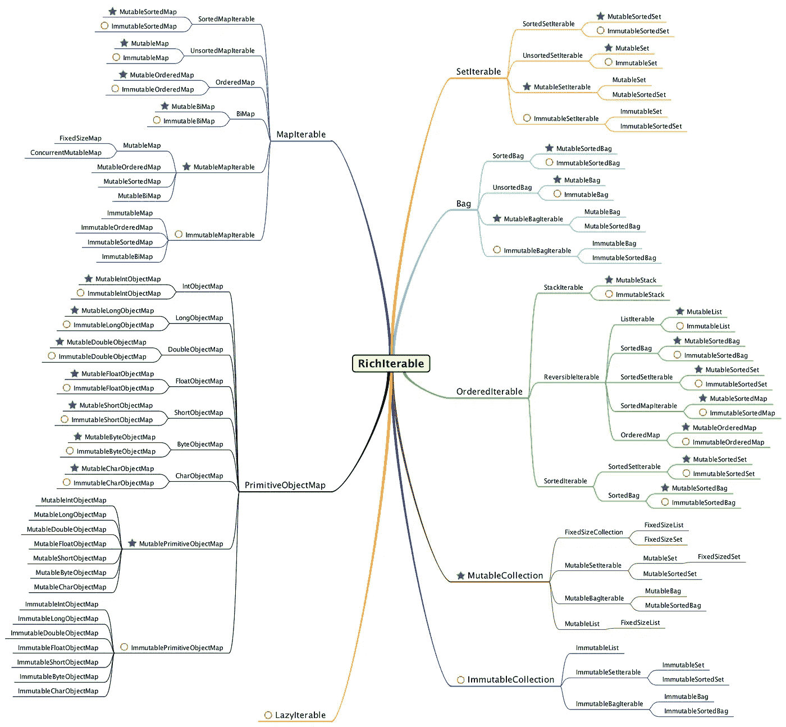
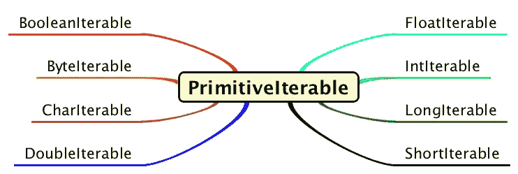
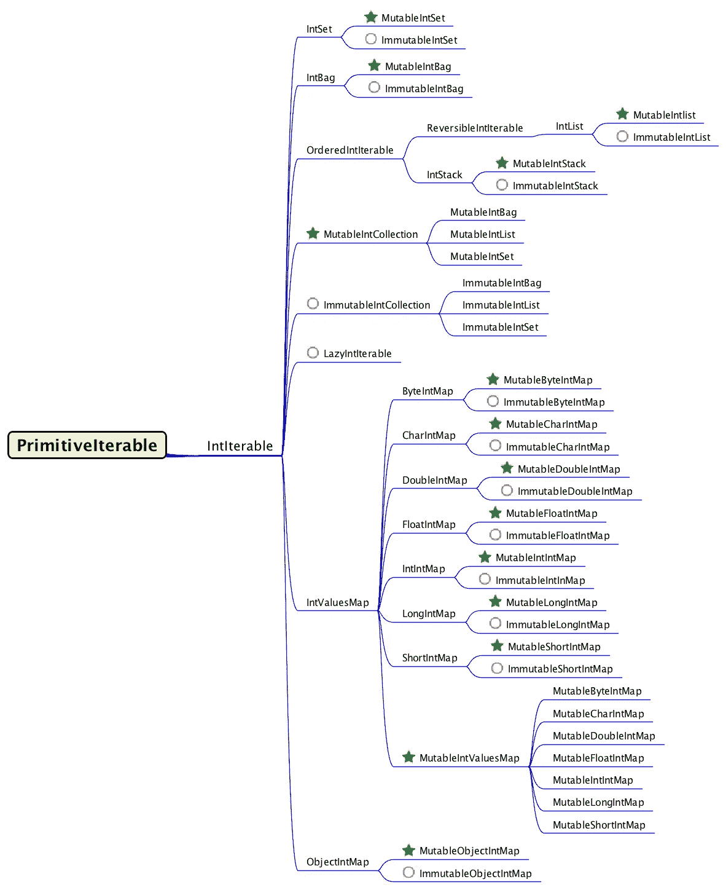
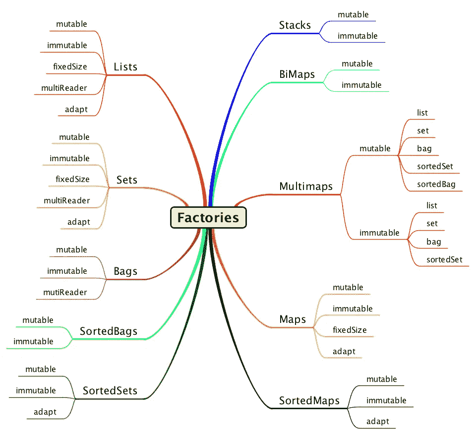
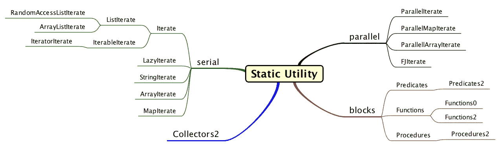
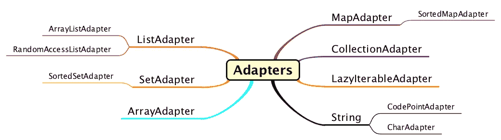

# 可视化 Eclipse 集合

> 原文：<https://medium.com/oracledevs/visualizing-eclipse-collections-646dad9533a9?source=collection_archive---------0----------------------->

使用思维导图对 [Eclipse 集合](https://github.com/eclipse/eclipse-collections)中的 API、接口、工厂、静态实用程序和适配器进行可视化概述。

# 一幅画胜过千言万语

我不确定一幅思维导图值多少个单词，但它们对信息分块很有用。 [Eclipse Collections](http://www.eclipse.org/collections/) 是一个功能非常丰富的库。思维导图有助于组织和分组概念，它们有助于传达 Eclipse 集合中的对称感。

## [对称共鸣](/@donraab/symmetric-sympathy-2c59d4541d60)


A High-level view of the Eclipse Collections Library

# 可丰富的 API

`RichIterable` API 是 Eclipse 集合中所有容器类之间共享的一组公共方法。一些方法重载了带有附加参数的表单。在下面的图片中，我已经将这些独特的方法按照它们所提供的功能进行了分类。



RichIterable API

## API 示例

下面是几个博客的链接，涵盖了`RichIterable`上可用的各种方法。

1.  [过滤](/@donraab/ec-by-example-filtering-4f14b906f718) ( [分区](/@donraab/ec-by-example-partitioning-d2704f826e66))
2.  转换([收集](/@donraab/ec-by-example-collect-262a46030c49) / [平收集](/@donraab/ec-by-example-flatcollect-3efe24e43da2))
3.  [短路](/@donraab/ec-by-example-short-circuiting-methods-e60121bc5a)
4.  [计数](/@donraab/ec-by-example-counting-688dfaaf513c)
5.  [滤镜/贴图/缩小](/@donraab/the-sum-of-all-reductions-d46dfd334704)
6.  [Eclipse 集合 API 与流 API 的比较](/@donraab/a-rose-by-any-other-name-e15060d4c98e)

# 丰富的接口层次结构

`RichIterable`是 Eclipse 集合中大多数容器类型的基本类型。甚至对象赋值的`Map`类型也在 Eclipse 集合中扩展了`RichIterable`。类型为`K`(键)和`V`(值)的`Map`，将是`V`(值)的`RichIterable`的扩展。这为`Map`类型的值提供了丰富的行为集。您仍然可以对键、键和值一起进行迭代，为此有不同的方法。



RichIterable Interface Hierarchy — Green Star=Mutable, Red Circle=Immutable

# 原始可编辑接口层次结构

Eclipse 集合为所有八种 Java 原语提供了容器支持。有一个名为`PrimitiveIterable`的具有通用行为的基本接口。



PrimitiveIterable Interface Hierarchy

下图显示了上图中的`IntIterable`分支。还有其他七个类似的分支。



IntIterable Interface Hierarchy — Green Star=Mutable, Red Circle=Immutable

每个基本类型的接口层次结构与`IntIterable`非常相似。

# 工厂

如果您想在 Eclipse 集合中创建一个集合，有几个选项可供选择。一种选择是在想要创建的具体可变类型上使用构造函数或静态工厂方法。这需要你知道具体可变类型的名称(例如`FastList`、`UnifiedSet`或`UnifiedMap`)。然而，对于不可变类型，这个选项是不存在的。如果要创建可变和不可变容器，最方便、一致和对称的选择是使用提供的工厂类之一。工厂类遵循使用类型名加一个 s 的模式，使其成为复数。因此，如果您想要一个可变或不可变的`List`，您将使用`Lists`类，然后指定您是否想要该类的*可变*或*不可变*工厂。



Factory Classes available in Eclipse Collections for Object Containers

原始容器有单独的工厂类。在容器类型前面加上基元类型的前缀，以找到正确的基元工厂类。

## [可变工厂示例](/@donraab/as-a-matter-of-factory-part-1-mutable-75cc2c5d72d9)

```
MutableList<T> list = Lists.***mutable***.empty();
MutableSet<T> set = Sets.***mutable***.empty();
MutableSortedSet<T> sortedSet = SortedSets.***mutable***.empty();
MutableMap<K, V> map = Maps.***mutable***.empty();
MutableSortedMap<K, V> sortedMap = SortedMaps.***mutable***.empty();
MutableStack<T> stack = Stacks.***mutable***.empty();
MutableBag<T> bag = Bags.***mutable***.empty();
MutableSortedBag<T> sortedBag = SortedBags.***mutable***.empty();
MutableBiMap<K, V> biMap = BiMaps.***mutable***.empty();
```

## [不可变的工厂实例](/@donraab/as-a-matter-of-factory-part-2-immutable-8cb72ff897ee)

```
ImmutableList<T> list = Lists.***immutable***.empty();
ImmutableSet<T> set = Sets.***immutable***.empty();
ImmutableSortedSet<T> sortedSet = SortedSets.***immutable***.empty();
ImmutableMap<K, V> map = Maps.***immutable***.empty();
ImmutableSortedMap<K, V> sortedMap = SortedMaps.***immutable***.empty();
ImmutableStack<T> stack = Stacks.***immutable***.empty();
ImmutableBag<T> bag = Bags.***immutable***.empty();
ImmutableSortedBag<T> sortedBag = SortedBags.***immutable***.empty();
ImmutableBiMap<K, V> biMap = BiMaps.***immutable***.empty();
```

# 静态实用程序类

在 Eclipse 集合开发的早期，一切都是通过静态实用程序类完成的。我们后来添加了自己的接口类型。随着时间的推移，Eclipse Collections 已经积累了相当多的静态实用程序类，用于各种目的。当您想要将 Eclipse 集合 API 与扩展 JDK 集合接口(如`Iterable`、`Collection`、`List`、`RandomAccess`和`Map`)的类型一起使用时，静态实用程序类非常有用。



A collection of useful static utility classes

## 静态实用程序示例

```
Assert.*assertTrue*(
        Iterate.*anySatisfy*(
                Collections.*singleton*(**"1"**),
                **"1"**::equals));Assert.*assertTrue*(
        ListIterate.*anySatisfy*(
                Collections.*singletonList*(**"1"**),
                Predicates.*equal*(**"1"**)));Assert.*assertTrue*(
        MapIterate.*anySatisfy*(
                Collections.*singletonMap*(1, **"1"**),
                Predicates.*notEqual*(**"2"**)));String[] strings = {**"1"**, **"2"**, **"3"**};
Assert.*assertTrue*(
        ArrayIterate.*anySatisfy*(strings, **"1"**::equals));
Assert.*assertTrue*(
        ArrayIterate.*contains*(strings, **"1"**));
```

# 适配器

有一些适配器将 Eclipse 集合 API 扩展到 JDK 类型。



Adapters for JDK types

## 创建适配器

```
MutableList<String> list = 
        Lists.*adapt*(new ArrayList<>());
MutableSet<String> set = 
        Sets.*adapt*(new HashSet<>());
MutableMap<String, String> map = 
        Maps.*adapt*(new HashMap<>());
MutableList<String> array = 
        ArrayAdapter.*adapt*(**"1"**, **"2"**, **"3"**);
CharAdapter chars = 
        Strings.*asChars*(**"Hello Chars!"**);
CodePointAdapter codePoints = 
        Strings.*asCodePoints*(**"Hello CodePoints!"**);
LazyIterable<String> lazy = 
        LazyIterate.*adapt*(new CopyOnWriteArrayList<>());
```

# 其他类型

像`Multimap`这样的类型在 Eclipse 集合中更多。`Multimap`将在单独的博客中介绍。`Multimap`是今天的类型之一，和`ParallelIterable`一样，不直接延伸`RichIterable`。

# 链接

1.  [Eclipse 收藏参考指南](https://github.com/eclipse/eclipse-collections/blob/master/docs/0-RefGuide.adoc)
2.  [月食收藏卡塔斯](https://github.com/eclipse/eclipse-collections-kata)
3.  [Eclipse 集合的 API 设计](http://eclipse.github.io/eclipse-collections-kata/api-design)
4.  [重构 Eclipse 集合](https://www.infoq.com/articles/Refactoring-to-Eclipse-Collections)
5.  [UnifiedMap](/oracledevs/unifiedmap-how-it-works-48af0b80cb37) 、 [UnifiedSet](/oracledevs/unifiedset-the-memory-saver-25b830745959) 和 [Bag](/oracledevs/bag-the-counter-2689e901aadb) 说明

*我是*[*Eclipse Collections*](https://github.com/eclipse/eclipse-collections)*OSS 项目在*[*Eclipse Foundation*](https://projects.eclipse.org/projects/technology.collections)*的项目负责人。* [*月食收藏*](https://github.com/eclipse/eclipse-collections) *为* [*投稿*](https://github.com/eclipse/eclipse-collections/blob/master/CONTRIBUTING.md) *。如果你喜欢这个库，你可以在 GitHub 上让我们知道。*