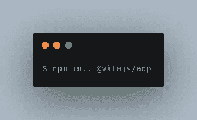
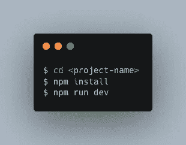
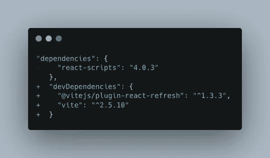
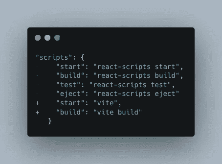
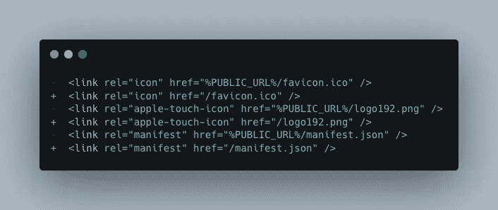
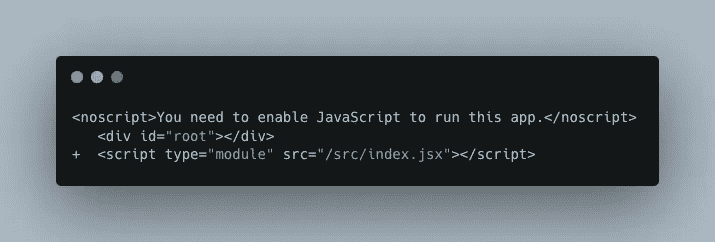
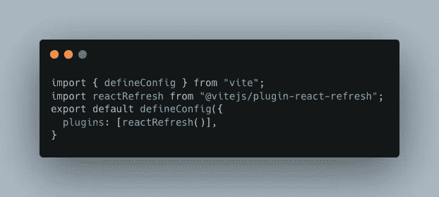

# Vite —下一代闪电般快速的前端工具

> 原文：<https://medium.com/globant/vite-next-generation-lightning-fast-front-end-tool-3b5257abb6d0?source=collection_archive---------0----------------------->

# Vite 是什么？

Vite 是一种新型的前端构建工具。它显著改善了前端开发体验。使它成为前端开发的绝佳选择的关键部分是— **开发服务器**和**构建命令**。开发服务器提供了比本地支持更丰富的特性。然而，build 命令将您的代码与 [Rollup](https://rollupjs.org/guide/en/) 捆绑在一起。此外，为生产提供高度优化的静态资产。

Vite 在幕后使用令人惊叹的 [esbuild](https://esbuild.github.io/) 。esbuild 是一个用 Golang 编写的 JavaScript(和 TypeScript)捆绑器，这也是它如此快速的原因之一。

# 为什么要 Vite？

传统的构建过程提供了一种机制，可以将源模块处理并连接成文件。这些文件可以很容易地在浏览器中运行。捆扎机，如网袋、包裹、扫雪包等。很大程度上提高了开发效率。然而，当我们转向更雄心勃勃的应用程序时，它增加了项目的复杂性以及代码量和模块数量。

问题是巨大的代码量会导致性能问题。启动一个开发服务器经常需要不合理的长时间等待，即使使用 HMR，文件编辑也需要几秒钟才能在浏览器中反映出来。Vite 使得开发过程中的反馈循环速度超快。

# Vite 的主要特点:

💡即时服务器启动

⚡️闪电般的快速 HMR

🛠️富有特色

📦优化构建

🔩通用插件接口

🔑完全类型化的 API

# 如何设置 Vite？

你需要在系统上安装 Node.js 和 NPM/YARN。

它将要求一个项目名称，选择一个框架和变量。要运行一个基本应用程序，您可以选择*普通*。这将创建您开始构建网页所需的基本文件，包括 index.html、main.js、package.json 和 style.css。这个简单的网页可以在任何 web 服务器上运行。

现在进入目录，安装软件包并运行脚本，用以下命令启动 dev 服务器:

最后，我们有一个运行 [http://localhost:3000](http://localhost:3000/) 的本地服务器。

# **如何将 create-react-app 迁移到 Vite？**

1.  替换`package.json`中的依赖项

2.运行 **npm 安装** / **纱线安装**。

3.更新 package.json 脚本。

4.将包含 JSX 的文件从`*.js`重命名为`*.jsx`。

5.将`public/index.html`移动到`index.html`(项目根文件夹)。

6.从`index.html`上取下`%PUBLIC_URL%`:

7.在`index.html`添加入口点:

8.最后添加`vite.config.js`文件。

# **结论**

下一代工具正在取代前端工具。Vite 就是其中一个经典的例子。Vite 消除了配置的复杂性，让您可以在几秒钟内创建应用程序。现在试试 Vite。