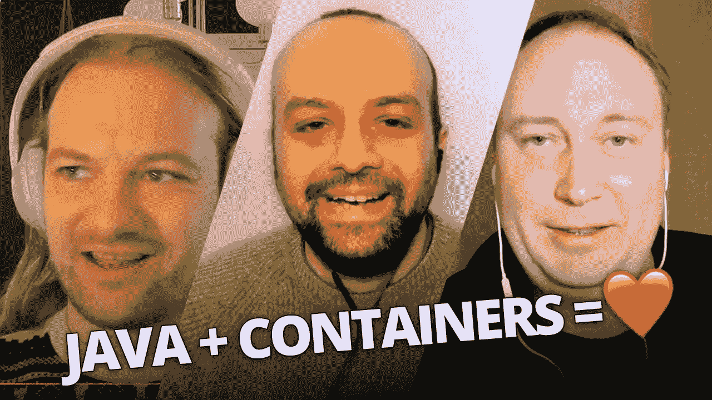

# Vlog: Java +容器= ❤

> 原文：<https://medium.com/compendium/vlog-java-containers-b7923efc375e?source=collection_archive---------8----------------------->

## 想开始使用 Java 应用程序的容器或对其进行改进吗？

想开始使用 Java 应用程序的容器或对其进行改进吗？Rustam Mehmandarov 和 Mads Opheim 有幸与 OpenJDK 委员 Dmitry Chuyko 聊天。他们讨论了容器中的 Java、微型容器、本机映像，并略微谈到了监控和 JDK 飞行记录器的话题。

