# Excel 中的 VLOOKUP 是什么，如何使用？

> 原文：<https://medium.com/edureka/vlookup-in-excel-and-how-to-use-it-dd44c18e8c0f?source=collection_archive---------0----------------------->

在这个数据驱动的世界里，人们需要各种工具来管理数据。实时数据是巨大的，获取某些特定数据的详细信息肯定是一项累人的任务，但使用 Excel 中的 VLOOKUP，只需一行命令就可以完成这项任务。在这篇文章中，你将学习 Excel 的一个重要函数，即 VLOOKUP 函数。

在继续之前，让我们快速浏览一下这里讨论的所有主题:

*   Excel 中的 VLOOKUP 是什么？
*   它是如何工作的？
*   精确匹配
*   近似匹配
*   第一场比赛
*   区分大小写
*   错误
*   #姓名
*   #不适用
*   #REF
*   #值
*   双向查找
*   使用通配符
*   多个查找表

# Excel 中的 VLOOKUP 是什么？

在 excel 中，VLOOKUP 是一个内置函数，用于从 Excel 表中查找和获取特定数据。v 代表垂直，为了在 Excel 中使用 VLOOKUP 函数，数据必须垂直排列。当您有大量数据，并且实际上不可能手动搜索某些特定数据时，这个函数非常方便。

# 它是如何工作的？

VLOOKUP 函数获取一个值，即查找值，并开始在最左边的列中查找它。当查找值第一次出现时，它开始在该行中向右移动，并从您指定的列中返回一个值。该函数可用于返回精确匹配和近似匹配(默认匹配是近似匹配)。

## 语法:

该函数的语法如下:

*VLOOKUP(查找值，表数组，列索引号，[范围查找])*

在哪里，

*   **lookup_value** 是给定表格第一列中要查找的值
*   **table_index** 是要从中提取数据的表格
*   **col_index_num** 是要从中提取值的列
*   **range_lookup** 是一个逻辑值，确定查找值应该是完全匹配还是近似匹配( **TRUE** 将找到最接近的匹配；**假**检查精确匹配)

# 完全匹配:

当您希望 VLOOKUP 函数查找查找值的精确匹配时，您必须将 *range_lookup* 值设置为 FALSE。看一下下面的例子，这是一个包含雇员详细信息的表:

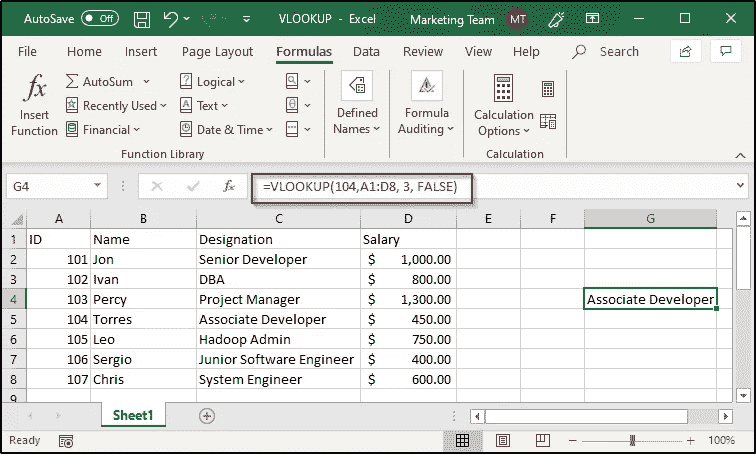

如果您想要查找这些员工的名称，您可以执行以下操作:

*   选择要显示输出的单元格，然后键入“=”号
*   使用 VLOOKUP 函数并提供 **lookup_value** (这里，它将是雇员 ID)
*   然后传入其他参数，即 **table_array** 、 **col_index_num** ，并将 **range_lookup** 的值设置为 FALSE
*   因此，函数及其参数将为:=VLOOKUP(104，A1: D8，3，FALSE)

VLOOKUP 函数开始查找雇员 ID 104，然后在找到值的行中向右移动。它一直进行到 col_index_num，并返回该位置的值。

# 近似匹配:

VLOOKUP 函数的这个特性允许您检索值，即使您没有 loopup_value 的精确匹配。如前所述，为了让 VLOOKUP 寻找近似匹配，您需要将 *range_lookup* 值设置为 TRUE。看一下下面的例子，在这个例子中，分数和他们的分数以及他们所属的班级对应在一起。

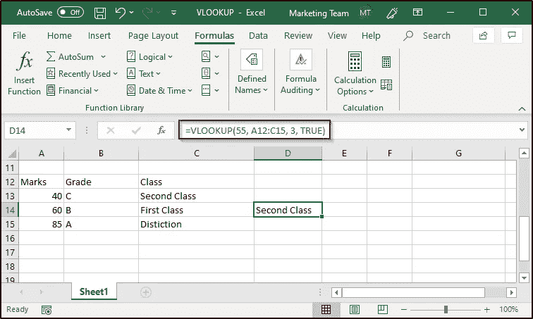

*   就像您如何进行精确匹配一样，遵循相同的步骤
*   使用 TRUE 而不是 FALSE 来代替 range_lookup 值
*   因此，该函数及其参数将为:=VLOOKUP(55，A12: C15，3，TRUE)

在按升序排序的表中，VLOOKUP 开始查找近似匹配，并在小于您输入的查找值的下一个最大值处停止。然后，它在该行中向右移动，并返回指定列中的值。在上面的示例中，查找值是 55，第一列中第二大的查找值是 40。所以输出是二等的。

# 第一场比赛:

如果您有一个包含多个查找值的表，VLOOKUP 会在第一次匹配时停止，并从指定列的该行中检索一个值。

请看下图:

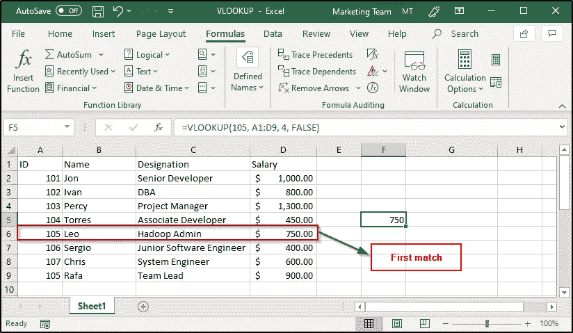

ID 105 被重复，当查找值被指定为 105 时，VLOOKUP 从查找值第一次出现的行返回该值。

# 区分大小写:

VLOOKUP 函数不区分大小写。如果您有一个大写的查找值，并且表中的值很小，VLOOKUP 仍然会从该值所在的行中获取该值。请看下图:

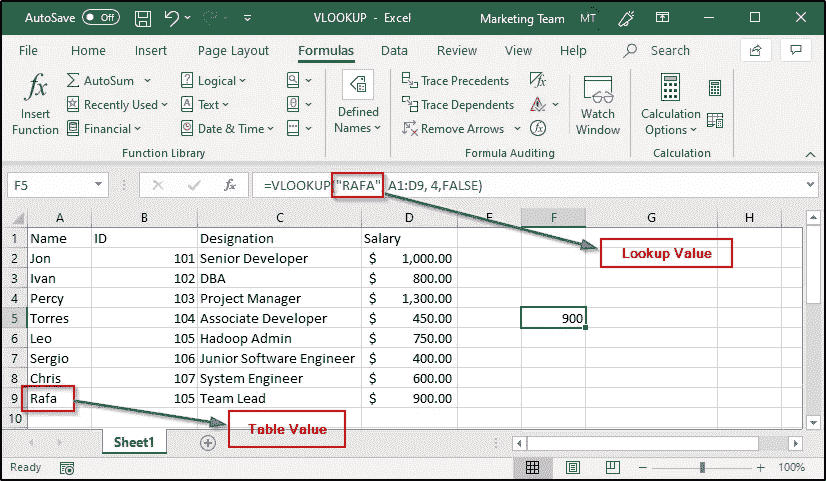

如您所见，我指定的参数值是“RAFA ”,而表中显示的值是“拉法”,但是 VLOOKUP 仍然返回指定的值。即使大小写完全匹配，VLOOKUP 仍然会返回查找值的第一个匹配项，而不考虑使用的大小写。请看下图:

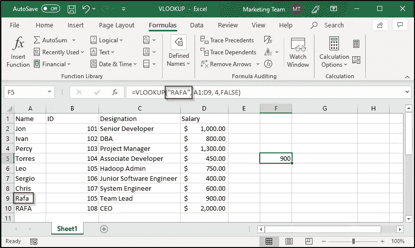

# 错误:

每当我们使用函数时，遇到错误是很自然的。同样，使用 VLOOKUP 函数时也会遇到错误，一些常见的错误有:

*   #姓名
*   #不适用
*   #REF
*   #值

## #名称错误:

这个错误主要是通知你在语法上犯了一些错误。为了避免语法错误，最好使用 Excel 为每个函数提供的函数向导。函数向导帮助您了解每个参数的信息以及您需要输入的值的类型。请看下图:

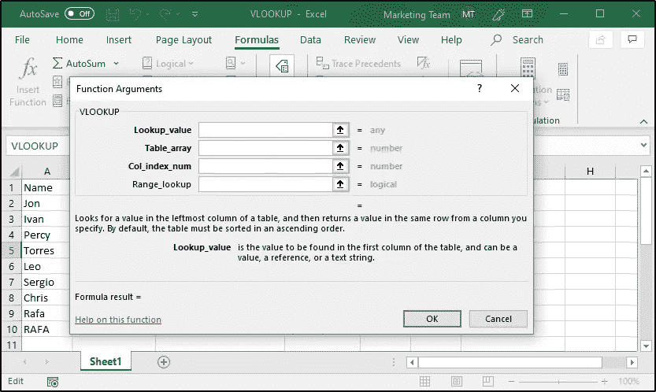

正如您所看到的，函数向导通知您输入任何类型的值来代替 lookup_value 参数，并给出了相同内容的简要描述。同样，当您选择其他参数时，您也会看到关于它们的信息。

## #N/A 错误:

如果找不到给定查找值的匹配项，将返回此错误。例如，如果我输入“AFA”而不是“RAFA”，我将得到#N/A 错误。

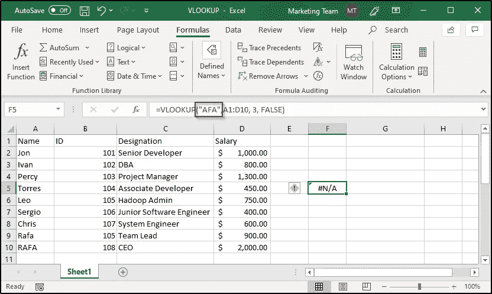

为了给上述两个错误定义一些错误信息，你可以使用 IFNA 函数。例如:

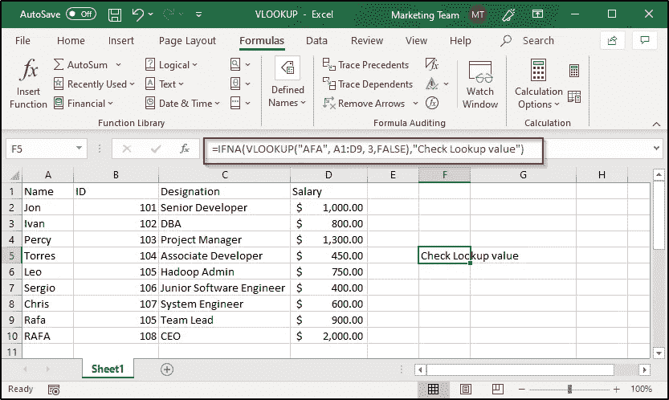

## #REF 错误:

当您引用了表中不存在的列时，会遇到此错误。

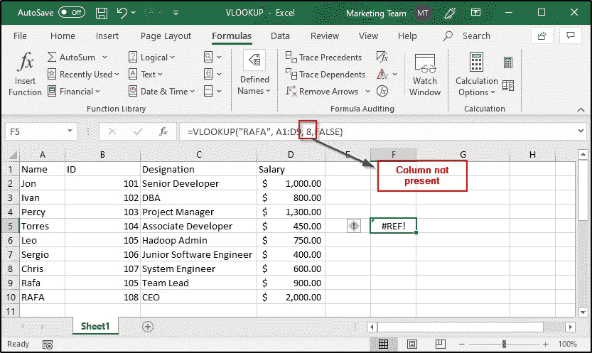

## #数值误差:

当您将错误的值放入参数或遗漏某些强制参数时，会遇到此错误。

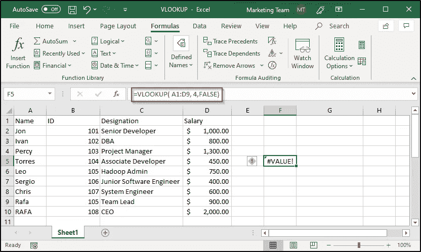

# 双向查找:

双向查找是指从被引用表的任何单元格中提取二维表中的值。为了使用 VLOOKUP 执行双向查找，您需要配合使用 MATCH 函数。

MATCH 的语法如下:

*匹配(查找值，查找数组，匹配类型)*

*   **lookup_value** 是要搜索的值
*   **lookup_array** 是由查找值组成的单元格区域
*   **match_type** 可以是一个数字，即 0、1 或-1 分别代表精确匹配、小于和大于

除了在 VLOOKUP 中使用硬编码的值，您还可以使它动态地绕过单元格引用。考虑下面的例子:

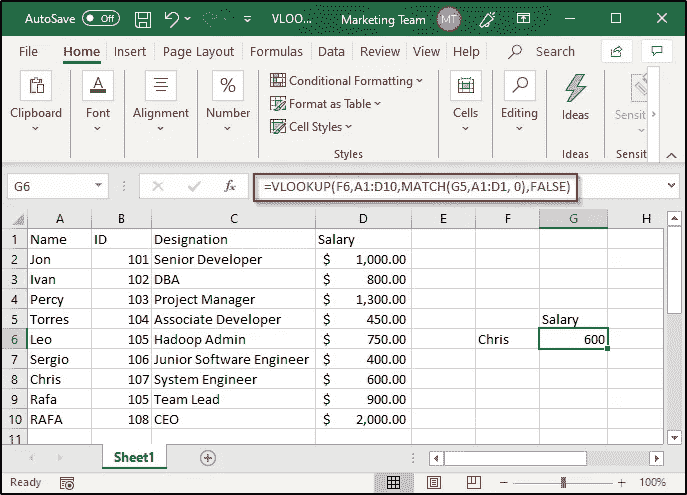

如上图所示，VLOOKUP 函数将单元格引用作为查找值的 F6，列索引值由 MATCH 函数确定。当您更改这些值中的任何一个时，输出也会相应地更改。请看下图，我已经将 F6 的当前值从 Chris 更改为 Leo，输出也相应地进行了更新:

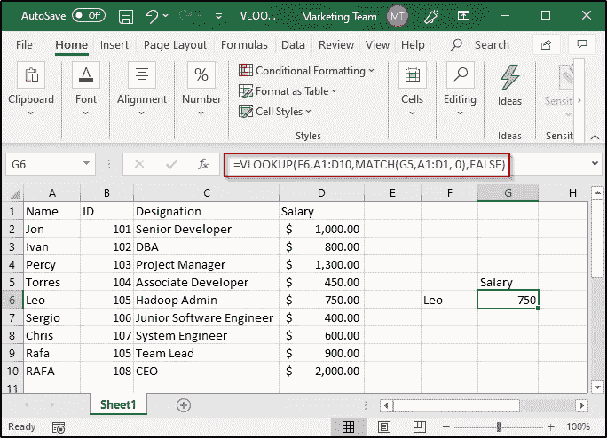

如果我改变了 G5 的值，或者 F6 和 G5 的值，该公式将相应地显示相应的结果。

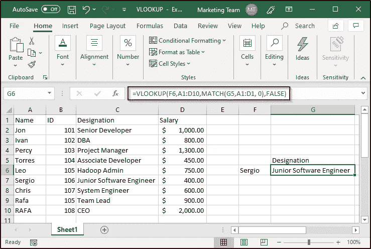

您还可以创建下拉列表，使更改值的任务变得非常方便。在上面的例子中，应该对 F6 和 G5 这样做。以下是创建下拉列表的方法:

*   从功能区选项卡中选择数据
*   从数据工具组中，选择数据验证
*   打开设置窗格，从允许中选择列表
*   指定源列表数组

以下是创建下拉列表后的外观:

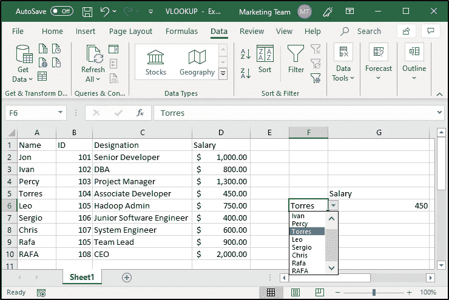

# 使用通配符:

如果您不知道确切的查找值，而只知道它的一部分，您可以使用通配符。在 Excel 中，“*”符号代表通配符。此符号通知 Excel 必须搜索之前、之后或之间的序列，并且在它们之前或之后可以有任意数量的字符。例如，在我创建的表中，如果输入“erg”以及两边的通配符，VLOOKUP 将返回“Sergio”的输出，如下所示:

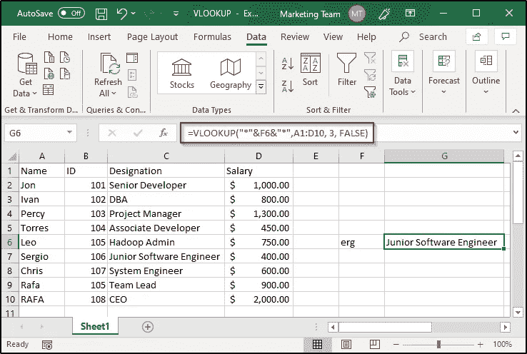

# 多个查找表:

如果您有多个查找表，您可以使用 IF 函数来根据给定的条件查找任何一个表。例如，如果有一个保存两家超市数据的表，您需要根据销售额找出每家超市的利润，您可以执行以下操作:

按如下方式创建主表:

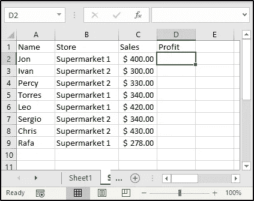

然后创建两个表，从中提取利润。

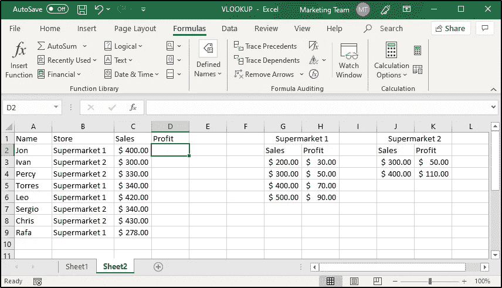

完成后，为每个新创建的表创建一个命名范围。要创建命名范围，请按照以下步骤操作:

*   选择要为其指定名称的整个表格
*   从功能区选项卡中，选择公式，然后从定义的名称组中，选择定义名称
*   您将看到以下对话框

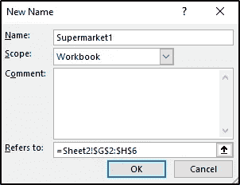

*   给出你选择的任何名字
*   单击确定

一旦对两个表都完成了这一步，就可以在 IF 函数中使用这些命名范围，如下所示:

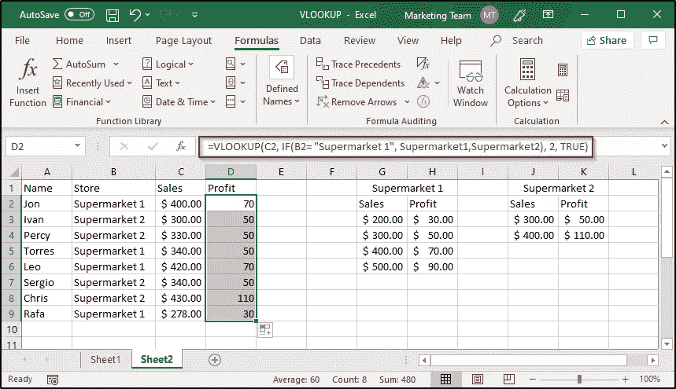

正如您所看到的，VLOOKUP 已经根据它们所属的超市返回了适当的值来填充利润列。为了节省时间和精力，我只是复制了公式，而不是在利润列的每个单元格中编写公式。

这就把我们带到了这篇关于 Excel 中 VLOOKUP 的文章的结尾。我希望你清楚已经与你分享的一切。确保你尽可能多地练习，恢复你的经验。 如果你想查看更多关于人工智能、DevOps、道德黑客等市场最热门技术的文章，那么你可以参考 [Edureka 的官方网站。](https://www.edureka.co/blog/?utm_source=medium&utm_medium=content-link&utm_campaign=excel-vlookup-function)

请留意本系列中解释 Excel 其他各方面的其他文章。

> *1。* [*利用 Excel 进行数据可视化*](/edureka/data-visualization-using-excel-724b96a8f85e)

*原载于 2019 年 11 月 18 日*[*https://www.edureka.co*](https://www.edureka.co/blog/excel-vlookup-function/)*。*