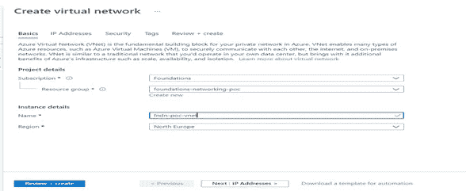
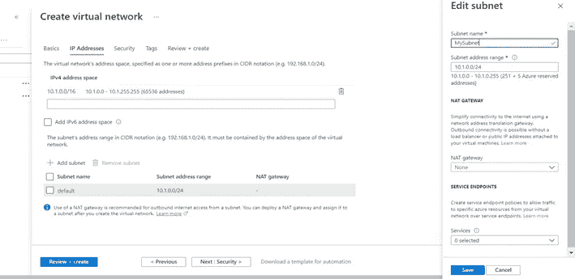
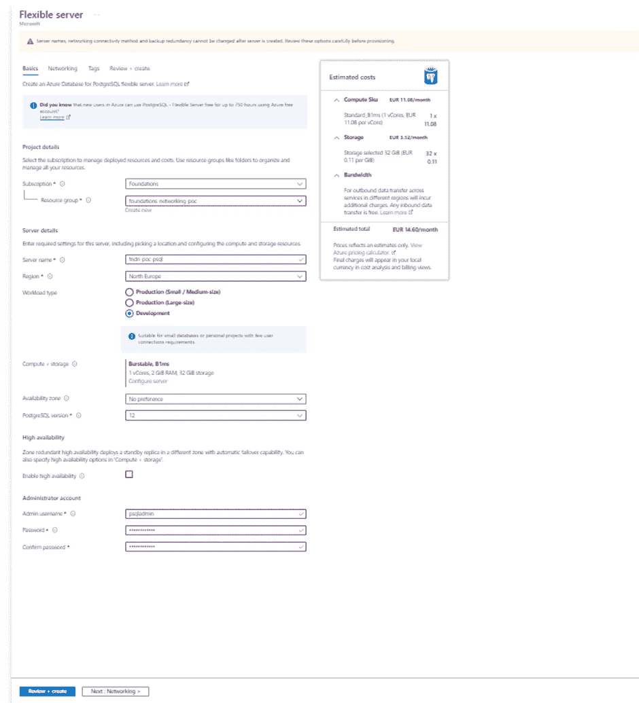
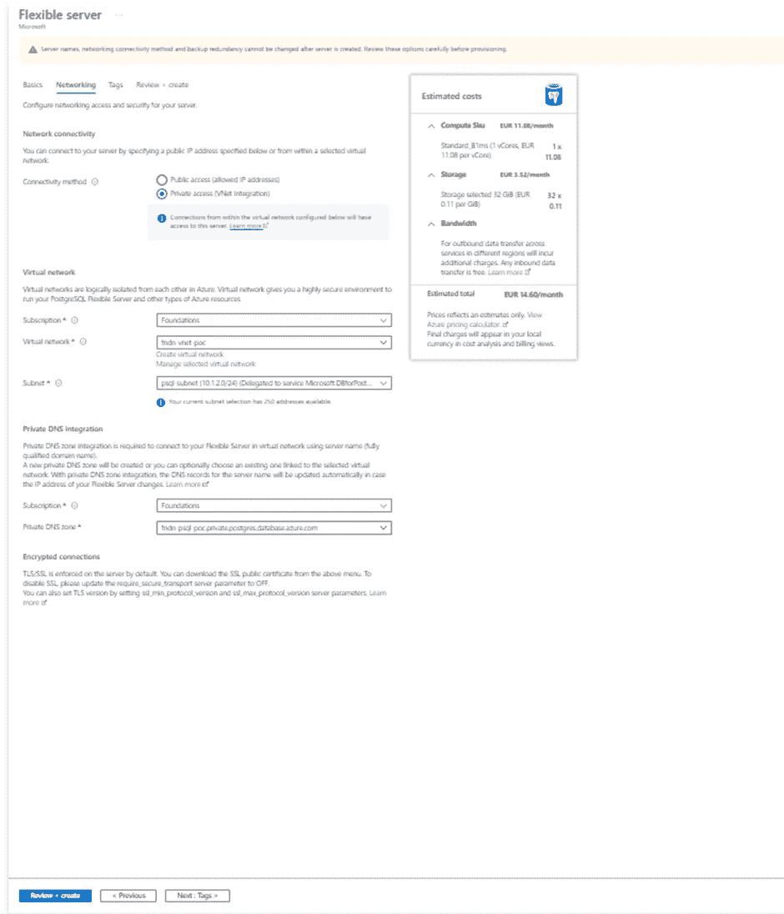

# Vnet 集成 PostgreSQL 与 Power BI 应用程序集成

> 原文：<https://medium.com/version-1/vnet-integratedpostgresql-integration-with-power-bi-app-12950039e687?source=collection_archive---------2----------------------->

**案例场景**

这是一个案例场景，我们有一个运行在 Azure 上的数据库(PostgreSQL ),它启用了 VNET 集成，我们需要从 Power BI 访问同一个数据库。

**我们将流程总结为四个不同的部分，概述如下:**

1.[第 1 部分—创建虚拟网络和 PostgreSQL](/version-1/vnet-integratedpostgresql-integration-with-power-bi-app-12950039e687)
2。[第 2 部分—创建和配置虚拟网络网关(点对点)](/version-1/creating-and-configuring-virtual-network-gateway-point-to-site-using-azure-certification-7a5b61839e54)
3。[第 3 部分—安装远程连接 PostgreSQL 数据库的 ODBC 驱动程序](/version-1/installing-odbc-driver-for-remote-connection-to-postgresql-db-9b8d496e50e4)
4。[第 4 部分—在 Power BI 中配置数据网关](/version-1/configuring-of-data-gateway-in-power-bi-f7f95882f19)

# **创建虚拟网络和 PostgreSQL 灵活服务器**

azure Database for PostgreSQL Flexible Server 支持两种互斥的网络连接方法。

*   公共访问(允许的 IP 地址)
*   私人访问(VNET 集成)

在这篇博客中，我们将关注使用 Azure 门户创建一个具有**私有访问(VNet 集成)**的 PostgreSQL 灵活服务器。通过私有访问(VNet 集成)，我们可以将灵活的服务器部署到我们自己的 [**Azure 虚拟网络**](https://docs.microsoft.com/en-gb/azure/virtual-network/virtual-networks-overview) 。Azure 虚拟网络提供私有和安全的网络通信。使用私有访问，到 PostgreSQL 服务器的连接被限制在我们的虚拟网络中。

**注意:**我们可以在创建服务器时将灵活的服务器部署到虚拟网络和子网中。部署灵活服务器后，我们不能将其移动到另一个虚拟网络、子网或*公共访问(允许的 IP 地址)*。

*   **创建虚拟网络**

1.登录 Azure 门户网站([https://portal.azure.com/)](https://portal.azure.com/)。

2.在门户左上角选择**创建资源**。

3.在搜索框中，输入**虚拟网络**。在搜索结果中选择**虚拟网络**。

4.在**虚拟网络**页面上，选择**创建**。

5.在**创建虚拟网络**中，在**基本信息**选项卡中输入或选择所需信息:

6.选择 **IP 地址**选项卡或选择页面底部的**下一步:IP 地址**按钮。

7.在 **IPv4 地址空间**中，选择已有的地址空间，将其更改为 **10.1.0.0/16** 。

8.选择 **+添加子网**，然后输入合适的**子网**名称(例如: **MySubnet)** 作为**子网名称**和 **10.1.0.0/24** 作为**子网地址范围**。

9.选择**保存**。

10.选择**安全**选项卡或选择页面底部的**下一步:安全**按钮。

***BastionHost** :禁用

***DDoS 防护标准**:禁用

***防火墙**:禁用

11.选择**标签**选项卡或选择页面底部的**下一步:标签**按钮。

12.选择**评审+创建**选项卡或选择**评审+创建**按钮。

13.选择**创建**。

*   **在现有虚拟网络中为 PostgreSQL 灵活服务器创建 Azure 数据库**

**先决条件:**

*虚拟网络和子网应该与我们的灵活服务器位于相同的区域和订阅中。

* [将一个子网](https://docs.microsoft.com/en-gb/azure/virtual-network/manage-subnet-delegation#delegate-a-subnet-to-an-azure-service)委托给**Microsoft.DBforPostgreSQL/FlexibleServers**。这种委托意味着只有 PostgreSQL 灵活服务器的 Azure 数据库可以使用该子网。委派子网中不能有其他 Azure 资源类型。

*添加微软。存储到委派给灵活服务器的子网的服务端点。

1.  在 azure 门户的左上角选择**创建资源** (+)。
2.  为 PostgreSQL 选择**数据库** > **Azure 数据库**。我们也可以在搜索框中输入 **PostgreSQL** 来查找服务。
3.  选择**灵活服务器**作为部署选项。
4.  填写**基础知识**表格。

5.转到**网络**选项卡来配置到我们服务器的连接选项。

6 **。**在**连接方式**中，选择**私有接入(VNET 集成)**。转到**虚拟网络**并点击**管理选定的虚拟网络。**

7.选择 **+添加子网**，然后输入 **psql-subnet** 作为**子网名称**，输入 **10.1.1.0/24** 作为**子网地址范围**。点击**保存。**

8.在**私有 DNS 集成**下，默认情况下，将使用服务器名称创建一个新的私有 DNS 区域。或者，我们可以从下拉列表中选择*订阅*和*私有 DNS 区域*。

9.选择**查看+创建**来查看我们灵活的服务器配置。

10.选择**创建**来配置服务器。设置可能需要几分钟时间。

如果你对此感兴趣或有任何反馈，请在评论区告诉我。

**关于作者:** *Raghavendra BN 是一名 DevOps 工程师，目前在 Version 1 的 Foundation 的团队工作。关注版本 1 和 Raghavendra BN，了解更多关于 Microsoft Azure 和 Azure DevOps 的博客。*