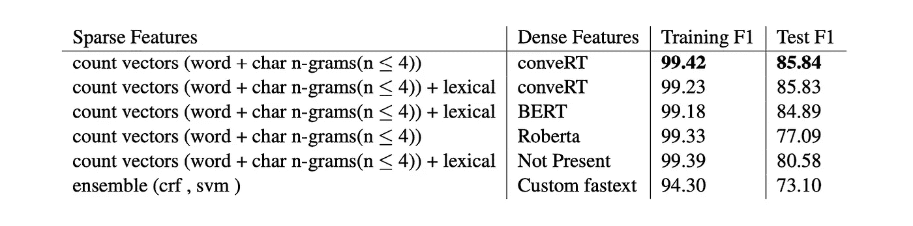

# 语音订购体验:将多个产品添加到您的购物车

> 原文：<https://medium.com/walmartglobaltech/voice-reorder-experience-add-multiple-product-items-to-your-shopping-cart-59d20fc61797?source=collection_archive---------7----------------------->

Credit: [Voice reorder your grocery shopping](https://pixabay.com/illustrations/grocery-shopping-groceries-app-5987164/)

电子商务语音订购系统需要从订购话语中识别多个产品名称实体。现有的语音订购系统，如亚马逊 Alexa，只能捕获单个产品名称实体。这限制了用户用一句话订购多个项目。近年来，预训练的语言模型，如 BERT 和 GPT-2，在超级胶水等 NLP 基准上显示出有希望的结果。然而，由于语音订购话语的模糊性，他们不能完美地概括这种多产品名称实体识别(MPNER)任务。为了填补这一研究空白，我们提出了实体转换器(ET)神经网络结构，它可以识别一个话语中多达 10 个项目。在我们的评估中，与非神经模型相比，最佳 ET 模型(conveRT + ngram + ET)在测试集上的性能提高了 12%,并且在 ET 方面也优于 BERT。这有助于客户通过语音对话完成购物车，从而提高购物效率和体验。

# 问题定义

A Sample Utterance

以一个示例话语为例，如“在一加仑牛奶中加入七个苹果，两袋葵花籽、新鲜大蒜和一次性湿巾”。产品名称实体识别的任务是识别诸如“苹果”、“牛奶”、“葵花籽”、“新鲜大蒜”、“一次性湿巾”等产品实体。产品名称的数量和多样性对于分割和提取它们是一个挑战。通常，自动语音识别(ASR)系统在将语音翻译成文本时，由于其局限性，不会产生标点和符号。这大大增加了区分相邻产品名称的难度。由于这些障碍(例如，实体数量、缺失标点和产品多样性)对于传统的 NER 任务来说是不常见的，现有的方法可能不能很好地推广到 MPNER。

# 模型架构

Entity Transformer architecture

一种称为实体变换器(ET)的编码器-解码器架构是针对受( [Bunk 等人，2020](https://arxiv.org/abs/2004.09936) )启发而提出的模型而开发的。在这种设计中，输入序列由变压器层的堆叠进行编码( [Vaswani 等人，2017](https://arxiv.org/abs/1706.03762) )。编码器映射输入序列(x₁，…，xₙ)到一系列连续的表现 E =(e₁，…，eₙ).从 e，条件随机场(CRF)解码器产生输出实体标签预测序列(l₁，…，lₙ).

## 特征

对于密集特征，我们从各种预先训练好的语言模型([抱脸](https://huggingface.co/))中提取输入序列特征，如来自 PolyAI 的 conveRT(【Henderson et al .，2020 )、BERT(【Devlin et al .，2019 )、Roberta ( [Liu et al .，2019](https://arxiv.org/abs/1907.11692) )。侧面稀疏特性是一个热令牌级编码和多个热字符 n 元语法(n≤4)特性。稀疏特征被传递到前馈层，其权重通过输入序列共享。前馈神经网络(FNN)层输出和密集序列特征在传递到变换器编码器层之前被连接。

## 变形金刚(电影名)

为了对输入序列进行编码，我们使用了具有相对位置注意的堆叠变压器层(N ≤6)。每个变换器编码器层由多头注意层和逐点前馈层组成。这些子层产生维度 dₘₒ𝒹ₑₗ = 256 的输出。注意力头的数量:Nₕₑₐ𝒹ₛ = 4。变压器的单元数:S = 256。

## 条件随机场

命名实体识别任务的解码器是条件随机场(CRF) ( [Lample et al .，2016](https://arxiv.org/abs/1603.01360) )，它联合对输入序列的标记决策序列进行建模。我们使用了 BILOU 标记方案。

## 模型训练和推理

模型训练和推理的细节在发表于 WeCNLP(西海岸 NLP)2021 峰会( [Gubbala 和
Zhang，2021](https://arxiv.org/pdf/2110.14843.pdf) )的论文中给出

# 估价

我们创建了一个 MPNER 数据集，由来自语音订单购物话语的大约 100 万个产品名称实体组成。该数据集具有 500k 训练子集和 65k 测试子集话语。每个数据示例中的话语具有随机数(在 1 和 10 之间)的乘积。该数据是从 70 个种子语音顺序话语变体中生成的，使用了来自各个部门的最受欢迎的 40k 产品的基于同义词的数据扩充。测试数据是由来自相同类别的 5k 个未知产品创建的。表 1 显示了 MPNER 数据集上的模型评估结果。我们的最佳模型配置是具有单词计数向量、char n-gram 计数向量(n≤4)的稀疏特征，并且转换预先训练的密集嵌入。

Table 1: Model Performance on MPNER task

在未来，我们计划研究为 MPNER 任务定制的预训练模型。

# 参考资料:

[1]普拉尼思·古巴拉和张璇。2021.[从对话框](https://arxiv.org/abs/2110.14843)中提取多个产品
名称实体的序列
到序列模型。

[2]塔尼娅·邦克、达克什·瓦什涅亚、弗拉迪米尔·弗拉索夫和
艾伦·尼科尔。2020. [Diet:轻量级语言 un-
理解对话系统](https://arxiv.org/abs/2004.09936)。

[3]马修·亨德森，I·̃nigo·卡萨努埃瓦，尼古拉·姆尔克西奇，
佩-苏浩，温宗贤，和伊万·武利奇. 2020。
[转换:来自变形金刚](https://arxiv.org/abs/1911.03688)的高效、准确的对话表达。

[4] Devlin，j .，Chang，m .，Lee，k .，& Toutanova，K. (2018 年)。 [BERT:用于语言理解的深度双向转换器的预训练](https://arxiv.org/abs/1810.04805)。

[5]刘、Myle Ott、Naman Goyal、杜、Man-dar Joshi、陈、Omer Levy、、Luke Zettlemoyer 和 Veselin Stoyanov。2019. [Roberta:一种稳健优化的 BERT 预训练
方法](https://arxiv.org/abs/1907.11692)。更正，abs/1907.11692

【6】抱脸。[https://huggingface.co/](https://huggingface.co/)