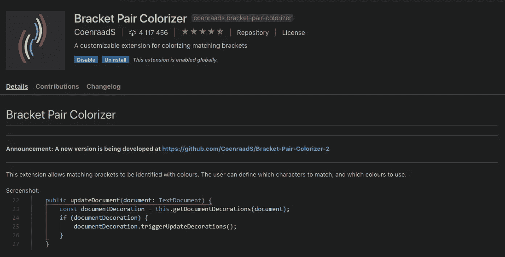

# VS 前端开发的代码设置

> 原文：<https://medium.com/quick-code/vs-code-setup-for-front-end-development-b22214a3c39a?source=collection_archive---------1----------------------->

[Duomly — programming online courses](https://www.duomly.com)

本文原载:
[https://www . blog . duomly . com/13-useful-vs-code-extensions-for-front-end-development/](https://www.blog.duomly.com/13-useful-vs-code-extensions-for-front-end-development/)

一段时间以来，Visual Studio 代码成为 Javascript 开发人员非常流行的 IDE。我两年前开始使用它，在我看来，它是一个非常棒的代码编辑器。它让我可以随心所欲地定制它。VS 代码也有内置的 git 集成和终端，所以你不用从一个窗口跳到另一个窗口。

有各种各样的插件甚至主题，每个人都可以在那里找到自己需要的东西。VSC 的合理设置可以提高我们的生产率；此外，有一些插件将帮助开发人员创建更好的，干净的代码。

因为有如此多的插件可以用于 Visual Studio 代码，所以很容易迷失和忘记一些有用的扩展。这就是为什么我想与你分享马最喜欢的前端开发的扩展的原因。

# 1.HTML 代码段(Visual Studio 代码 HTML 代码段)

这是每个前端开发者必不可少的扩展。你不必浪费更多的时间来手工编写每一个 HTML 标签；只输入标签名就足够了，比如 **div** ，然后按回车键。或者你甚至可以添加一些你想要嵌套的标签，比如 **ul > li > a** 然后按回车键。重要的是，这个扩展拥有所有的 HTML5 片段。

[Duomly — programming online courses](https://www.duomly.com)

# **2。JavaScript (ES6)代码片段**

在前一点中，您可能会注意到代码片段非常方便，有助于防止大量拼写错误，并且可以使编码速度更快。每个前端开发人员主要使用 JavaScript。为了加速我的 Javascript 编码，我使用 Javascript 代码片段。它还支持。ts，。tsx 和。jsx 文件。

这里的工作方式类似，例如，创建**导出默认类*类名* {}** 代码，放入 **ecl** 并按 tab 就足够了。很简单，对吧？要找到更多的代码快捷方式，请看一下扩展文档。2021 年[最佳 ECMAScript 课程](https://blog.coursesity.com/best-ecmascript-courses/)在线学习 ES6+ JavaScript。

[Duomly — programming online courses](https://www.duomly.com)

# 3.CSS Peek

正如我们有 HTML 和 Javascript 的东西一样，CSS 的东西对于前端开发也是有用的。CSS Peek 是一个支持。html 和。js 文件。它有助于快速查找和检查应用于选定类别或 id 的样式。这对于不喜欢在不同文件之间切换或分割屏幕的开发人员来说是有益的。

[Duomly — programming online courses](https://www.duomly.com)

# **4。角度/反应/空穴**

如果我们在代码片段区域，提到所选框架的扩展也是很好的。这很大程度上取决于您使用的框架。

–对于 Angular，有一个名为 **Angular Snippets(版本 8)** 的扩展，因为目前我们有 Angular 8，但 Angular 对框架的每个版本都有新的发布。它为我们提供了 Typescript 和 HTML 的代码片段。

[Duomly — programming online courses](https://www.duomly.com)

–对于 React.js，有一个优秀的扩展**ES7 React/Redux/graph QL/React-Native snippets。**它使用 ES7 为 React 和 Redux 提供代码片段，其工作方式类似于带有 tab 按钮的 JavaScript 片段。

[Duomly — programming online courses](https://www.duomly.com)

–对于 Vue.js 开发，有一个很棒的扩展叫做 **Vetur。它有近 2000 万次下载，并带来了许多功能，如代码片段、链接和错误检查、格式化、调试或突出语法。看起来印象非常深刻。通过[最佳 VueJs 教程](https://blog.coursesity.com/best-vuejs-tutorials/)在线学习 VueJs，以处理大量的用户交互和动态数据。**

[Duomly — programming online courses](https://www.duomly.com)

# 5.埃斯林特

如果你想创建一个友好的、可读的、干净的代码，在你的 VS 代码中安装 ESLint 是一个很好的主意。这将有助于你坚持标准的做法，比如缩进。

[Duomly — programming online courses](https://www.duomly.com)

# **6。更漂亮—代码格式化程序**

如果我们谈论漂亮的代码，在你的代码编辑器中安装漂亮的扩展是值得的。更漂亮是极好的，尤其是如果你和其他开发者一起工作的话。它移除了原始的样式，并加入了一致的代码样式。由于格式一致，代码可读性更好。

[Duomly — programming online courses](https://www.duomly.com)

# 7.吉特朗斯

正如我在开头提到的，Visual Studio 代码有一个 git 集成。我们可以安装 GitLens extension 使它变得更好。它允许检查每一行代码是由谁创建的，并允许我们快速提交细节。如果在开发团队中工作，很容易理解代码历史是有益的。

[Duomly — programming online courses](https://www.duomly.com)

# **8。自动导入**

自动导入是一个伟大的扩展，可以自动导入文件；你再也不用手动操作了。如果您从事基于组件的项目，这是非常好的。放组件名就够了，插件会导入。

[Duomly — programming online courses](https://www.duomly.com)

# **9。路径自动完成**

如果我们在导入领域，有另一个很棒的扩展可以帮助你，如果你需要手动导入一些东西或者放置一个链接到一个不同的文件。路径自动完成扩展提供路径完成。当你开始用**输入你的路径时。/** 您会注意到一个下拉列表，其中有可供选择的文件夹。这非常有帮助，因为你不需要在文件中寻找正确的路径。

[Duomly — programming online courses](https://www.duomly.com)

# 10.最后换行符

有时您必须记住在文档中添加一个新行，final-newline 在这方面有所帮助。每次保存文件时，它都会在文档末尾插入一个新行。

[Duomly — programming online courses](https://www.duomly.com)

# 11.括号对着色机

括号对着色帮助我们找到当前代码块的右括号。有时在你的文件或函数的末尾，你会有不止一两个右括号，要找到正确的括号并不容易。如果你正在使用括号对着色插件，每个开始和结束括号对一个代码块有相同的颜色。所以如果你的开始标签是蓝色的，你的结束标签也是蓝色的。

[Duomly — programming online courses](https://www.duomly.com)

12.识别符

Indeticator 是 VS 代码的一个扩展，它在视觉上突出了当前想要的深度。它允许容易地区分不同代码块的不同级别。深度是用小点和线标记的。

[Duomly — programming online courses](https://www.duomly.com)

# 13.Chrome 调试器

最后是一个优秀的调试插件。如果我们可以像在 Chrome 浏览器中一样在控制台中调试，那岂不是很完美？有了 Chrome 插件的调试器，这是可能的；它支持设置断点，单步执行，调试邪恶的脚本，等等。如果你厌倦了从代码编辑器中的文件切换到浏览器中的调试控制台，这是一个很好的插件。

[Duomly — programming online courses](https://www.duomly.com)

# 结论

在上面的文章中，我与你分享了我最喜欢的 Visual Studio 代码扩展。我希望这是一个关于如何设置代码编辑器和提高开发性能的很好的技巧。此外，如果你是一个初学者，它可能会帮助你集中精力学习编程，然后寻找一个结束标签，或结束括号。

好好编码！

[Duomly — programming online courses](https://www.duomly.com)

感谢您的阅读！

本文由我们的队友安娜提供。