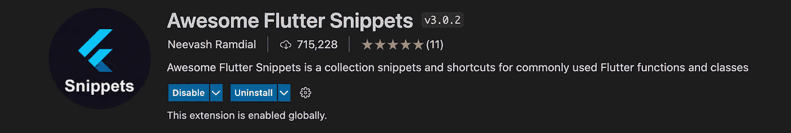

# 面向生产性开发的 Top VS 代码扩展— Flutter💙

> 原文：<https://medium.com/google-developer-experts/vscode-extensions-flutter-cec72b1faf06?source=collection_archive---------0----------------------->

## VS 代码是广泛使用的颤振 IDE 之一。但是有很多方法可以使用 VS 代码的扩展来提高生产力！


## 1.可怕的颤动片段

Awesome Flutter Snippets 是一个常用的 Flutter 类和方法的集合。它通过消除与创建小部件相关的大部分样板代码来提高开发速度。分别输入快捷键`streamBldr`和`singleChildSV`就可以创建`StreamBuilder`和`SingleChildScrollView`等小部件。

请随意从[市场](https://marketplace.visualstudio.com/items?itemName=Nash.awesome-flutter-snippets)获取扩展，或者在 VS 代码的扩展部分搜索！



## 2.Pubspec 辅助

Pubspec Assist 是一个 Visual Studio 代码扩展，允许您轻松地将依赖项和开发依赖项添加到 Dart 和 Flutter 项目的 pubspec.yaml 中，而无需离开编辑器。
**注意:在 Dart 版本> 2.5 中，该特性默认可用！**

请随意从[市场](https://marketplace.visualstudio.com/items?itemName=jeroen-meijer.pubspec-assist)获取扩展，或者在 VS 代码的扩展部分进行搜索！


## 3.集团

如果您使用 bloc 进行状态管理，这个扩展将会对您大有用处。它将帮助您创建所有需要的文件(事件，状态和封锁文件)！

请随意从[市场](https://marketplace.visualstudio.com/items?itemName=FelixAngelov.bloc)获取扩展，或者搜索 VS 代码的扩展部分！


## 4.材料图标主题

这个扩展将主要有助于改变你的 Flutter 项目的默认无聊文件夹和文件图标！

请随意从[市场](https://marketplace.visualstudio.com/items?itemName=PKief.material-icon-theme)获取扩展，或者在 VS 代码的扩展部分进行搜索！


## 5.Git 历史

当您使用 git 进行版本控制时，这个扩展非常有用。它为您提供 git 日志、文件历史、提交日志等等。

请随意从[市场](https://marketplace.visualstudio.com/items?itemName=donjayamanne.githistory)获取扩展，或者在 VS 代码的扩展部分搜索！


## 6.GitLens — Git 增压

GitLens 帮助您检查谁最后提交了特定的代码片段，从而发现很容易解决错误！

```
GitLens supercharges the Git capabilities built into Visual Studio Code. It helps you to visualize code authorship at a glance via Git blame annotations and code lens, seamlessly navigate and explore Git repositories, gain valuable insights via powerful comparison commands, and so much more.
```

请随意从[市场](https://marketplace.visualstudio.com/items?itemName=eamodio.gitlens)获取扩展，或者搜索 VS 代码的扩展部分！


## 7.误差透镜

开发过程中总会出现错误。但是为了检查我们有什么错误，我们需要向下滚动到 VS 代码的错误部分。错误镜头会突出显示出现错误或警告的行，并在旁边显示错误或警告。从而使它真正有助于快速解决错误！

请随意从[市场](https://marketplace.visualstudio.com/items?itemName=usernamehw.errorlens)获取扩展，或者在 VS 代码的扩展部分搜索！


这篇文章只是一篇信息丰富的小文章，让你在使用 Flutter 时更有效率！

希望你喜欢这篇文章🎉！

# 🤝不要忘记通过以下方式与我联系:

*   [**Instagram**](https://www.instagram.com/abhishekdoshi26/)
*   [**推特**](https://twitter.com/AbhishekDoshi26)
*   [**LinkedIn**](https://www.linkedin.com/in/AbhishekDoshi26)
*   [**GitHub**](https://github.com/AbhishekDoshi26)

> 不要停止，直到你呼吸！💙阿布舍克·多希