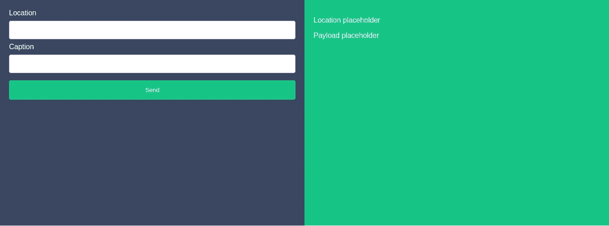

# Vue 作为活动巴士——生活更快乐

> 原文：<https://medium.easyread.co/vue-as-event-bus-life-is-happier-7a04fe5231e1?source=collection_archive---------1----------------------->


“photo of yellow bus park on parking lot” by [Damian Carr](https://unsplash.com/@corbycarr?utm_source=medium&utm_medium=referral) on [Unsplash](https://unsplash.com?utm_source=medium&utm_medium=referral)

在我之前的[文章](https://hackernoon.com/messaging-system-hands-on-7dda1afded37)中，我写了我如何在微服务架构上实现一个消息系统，并且我使用了 [RabbitMQ](https://www.rabbitmq.com/) 作为消息代理。消息传递系统的主要概念是发布-订阅模式。简单地说，在发布-订阅模式中，有发布消息的服务，也有订阅消息的服务。消息可以是事件、对象或其他类型。

然而，发布-订阅模式不仅在后端实现。在前端，像 web 应用和移动应用一样，我们也可以实现发布-订阅模式。如果在后端世界，消息通过服务发送到服务，而在前端世界，消息通过组件发送到组件。

在后端世界中，我们可以使用 RabbitMQ、Apache Kafka 和 Google PubSub 作为消息代理，但是我们可以使用什么作为前端世界的消息代理呢？有许多图书馆可供我们使用。如果我们想要实现发布——订阅 Android 应用程序，我们可以使用 [EventBus](https://github.com/greenrobot/EventBus) ,对于 iOS 应用程序，我们可以使用 [SwiftEventBus](https://github.com/cesarferreira/SwiftEventBus) 。那么 Vue JS app 可以用什么呢？

# Vue JS 就够了——让我展示给你看

在我们跳到代码之前，最好先了解问题陈述。这是问题陈述。

> 我有两个组件。我将把数据从一个组件传递到另一个组件。接收器应显示接收到的数据。

我觉得问题陈述够清楚了。所以让我们写代码，看看 Vue 作为一个消息代理。

## 创建新的 Vue 应用

要创建新的 Vue CLI 应用程序，请运行以下命令。确保您已经安装了 Vue CLI。

```
// Install Vue CLI, if you not installed it yet
$ npm install -g @vue/cli// Create Vue App
$ vue init webpack <project-name>// Start the project
$ npm run dev
```

## 创建组件

现在我将创建两个组件。其中一个是发布者，另一个是订阅者。发布者的组件名为`Leftside.vue`，订阅者的组件名为`Rightside.vue`。

这里的代码为`Leftside.vue`

这里是`Rightside.vue`的代码

然后我需要用这些组件在我的`Helloword.vue,`上生成文件。



下一步是创建 Vue 实例作为事件总线。现在，在您的`/src`目录下创建一个新文件，命名为`eventBus.js`。js 非常简单，我们只需要两行代码😃

接下来我们将在组件中使用这个`eventBus.js`。看看下面更新的代码

下面是更新后的`Leftside.vue`。

这里是更新后的`Rightside.vue`。

你可以在代码中看到，在每个组件中我都导入了`eventBus.js`。用作消息代理的`EventBus`对象。

## 出版

在`Leftside.vue`里，你可以看看

```
EventBus.$emit(‘DATA_PUBLISHED’, payload) 
```

`emit()`方法用于发布消息。它接收两个参数。第一个是事件名称，第二个是要传递的数据。

## 订阅

在`Rightside.vue`中，你可以看看

```
EventBus.$on('DATA_PUBLISHED', (payload) => {
  this.updateData(payload)
})
```

`on()`方法用于监听在`EventBus.`上接收两个参数的事件。第一个是事件名，第二个是回调方法。

`DATA_PUBLISHED`是用于标识发布者发布和订阅者订阅哪个事件的事件名称。当我们使用 RabbitMQ 时，它与主题名称相同。就这么简单😄

实际上，我们还可以使用另外两种方法，分别是`off()`和`once().`。其中`off()`用于删除订阅的事件，而`once()`用于订阅一个事件，但只触发一次。订阅者触发后，订阅将被删除。更多细节，你可以查看官方文档[这里](https://vuejs.org/v2/api/#Instance-Methods-Events)。

我用 Vue 作为事件总线做的另一件很酷的事情是触发另一个组件通过从服务获取数据来重新加载它的数据。我不需要重新加载所有页面来更新数据，这将由组件本身来完成。

事实上，在我们的日常项目中，我们还可以使用其他的沟通模式。我自己也仍在学习其他模式，并寻找可以实现发布-订阅模式的地方。如果你知道我可以在哪里实现它，请随时通过`ecojuntak@gmail.com.`联系我，哦，你可以在我的知识库中找到完整的代码。

[](https://github.com/ecojuntak/vue-event-bus) [## ecojuntak/vue-事件-总线

### 通过在 GitHub 上创建帐户，为 ecojuntak/vue-event-bus 开发做出贡献。

github.com](https://github.com/ecojuntak/vue-event-bus) 

下一篇文章再见，希望你会喜欢。

卡皮·霍丁！😎 💻 ☕️