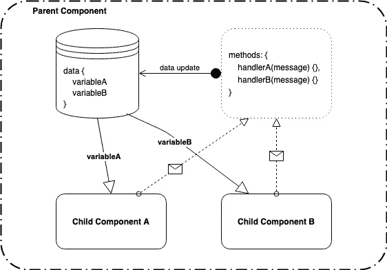

# Vue 沟通模式:介绍“道具向下”和“事件向上”模式

> 原文：<https://medium.com/quick-code/vue-communication-patterns-an-intro-to-props-down-and-events-up-pattern-d53340d2c94?source=collection_archive---------1----------------------->

Photo by [Louis Moncouyoux](https://unsplash.com/@louis_moncouyoux?utm_source=medium&utm_medium=referral) on [Unsplash](https://unsplash.com?utm_source=medium&utm_medium=referral)

当在一个大文件中开发 Vue 应用程序时，我们的优势是将整个应用程序状态放在一个地方——在 Vue 组件实例的数据对象中。一旦我们开始通过将应用程序分割成子组件来模块化应用程序，我们就面临着父组件和子组件之间以及兄弟组件之间的状态管理的挑战。

在我以前的文章中，我已经解释了这个挑战的解决方案之一——一个 [EventBus 模式](/@andrejsabrickis/https-medium-com-andrejsabrickis-create-simple-eventbus-to-communicate-between-vue-js-components-cdc11cd59860)。尽管 EventBus 的设置和开始使用非常简单，但我发现它更适合更复杂的应用程序。例如，在应用程序中，应该在具有不同祖先和更深嵌套的组件之间进行通信。

在简单的应用程序中，只有一个由子组件组成的父组件，对于处理简单的事件来说，EventBus 可能太多了。相反，我们可以使用 Vue 的内置特性，如道具和事件——一种道具向下而事件向上的通信模式。

The flow of props and events inside a Vue.js component

首先，每个 Vue 组件在`data`属性中维护自己的状态。在 props-down 和 events-up 模式中，父组件的数据对象是整个应用程序的唯一真实来源。子组件应该通过 props——“props-down”从父组件的数据对象接收数据。并且父组件应该通过处理从子组件发出的事件来更新其状态——“事件启动”。

这里你可以看到这个模式的一个实现，它是一个计数器应用程序。

 [## AndrejsAbrickis/游乐场

### 此时您不能执行该操作。您已使用另一个标签页或窗口登录。您已在另一个选项卡中注销，或者…

github.com](https://github.com/AndrejsAbrickis/playground/blob/master/props-down-events-up/src/App.vue) 

`App.vue`是父组件或根组件，它保存关于当前计数、两个按钮的标签和消息数组的信息或状态。此外，它还定义了两个处理程序消息，这两个消息通过事件名`@buttonClicked`绑定到子组件。因此，每次子组件发出按钮点击事件时，它都将由 App.vue 组件处理，它将减少或增加来自子组件的当前计数和日志消息。

这两个子组件做同样的事情。首先，它们接收要显示的文本标签和一个计数——在本例中，该计数增加或减少并添加到消息中，以证明消息也可以是非原始类型。

子组件的职责是处理@click 事件并发出`buttonClicked`事件。通过在实现按钮组件的任何地方使用`this.$emit("buttonClicked")`，父组件现在可以绑定到`@buttonClicked`并在事件发生时动作。

这就是了。现在，您的 Vue.js 工具箱中有了另一个工具，通过接收道具和发出事件，经由父组件在组件之间进行通信。

**干杯！**

如果你觉得这篇文章很有用，并且想了解更多关于随机网络开发的话题，请为这篇文章鼓掌或者在这里发表评论。一如既往，你可以在 Twitter@andrejsabrickis 上找到我

在我离开你之前，这里有一个快速无耻的插件。
我正在寻找一名优秀的前端或全栈开发人员，他们将帮助我们在 Mintos 的工程团队将我们的客户端 web 应用提升到一个新的水平。如果你对 [*高级前端开发人员*](https://mintos.workable.com/j/B0575F2DF3) *职位或我们的任何其他空缺职位(https://mintos.workable.com)感兴趣，或者你知道谁会感兴趣，请不要犹豫，告诉我。*