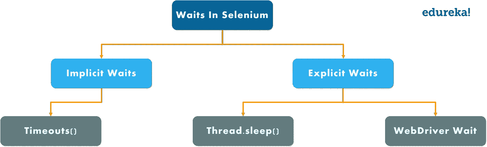
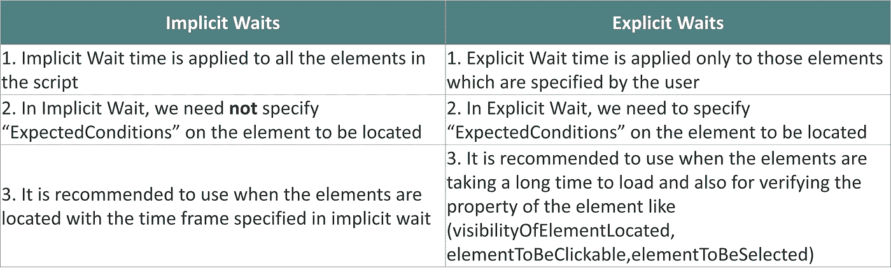

# Selenium 等待教程——关于 Selenium 中的等待，您需要了解的一切

> 原文：<https://medium.com/edureka/waits-in-selenium-5b57b56f5e5a?source=collection_archive---------0----------------------->


Waits in Selenium — Edureka

在编写第一个 selenium 程序时，您可能遇到过 wait 命令。但是，你知道硒等待到底是什么吗？嗯，selenium 中的等待是执行测试用例所需的一段重要代码。在本文中，我将简要介绍实践中广泛使用的不同类型的等待命令。

以下是本文将要涉及的主题:

*   什么是硒等？
*   为什么我们在 Selenium 中需要等待？
*   **等待类型**

1.  隐式等待
2.  显式等待

*   隐式与显式等待

# 什么是硒等？


等待帮助用户在重定向到不同的网页时解决问题。这是通过刷新整个网页并重新加载新的 web 元素来实现的。有时，也可能有 Ajax 调用。因此，在重新加载网页和反映网页元素时，可以看到时间延迟。

用户经常被发现来回浏览各种网页。因此，由 web 驱动程序提供的 navigate()命令/方法通过参考 web 浏览器的历史在网页之间导航来帮助用户模拟实时场景。

# 为什么在 Selenium 中需要等待？

大多数 web 应用程序都是使用 Ajax 和 JavaScript 开发的。当浏览器加载页面时，我们想要与之交互的元素可能会在不同的时间间隔加载。这样，不仅识别元素变得困难，而且如果元素没有被定位，它将抛出一个“**ElementNotVisibleException**异常。通过使用等待，我们可以解决这个问题。

现在让我们进一步了解不同类型的等待。

# 等待的类型

Selenium 支持两种类型的等待，如下所示

1.  隐式等待
2.  显式等待

**注意:** *最广泛使用的等待是隐式和显式等待，流畅等待对于实时项目并不可取。*



首先，让我们了解一下 Selenium 中有哪些隐式等待。

## 隐式等待

隐式等待将告诉 web 驱动程序在抛出“没有这样的元素异常”之前等待一段时间。隐式等待的默认设置为零。一旦设置了时间，web 驱动程序将在抛出异常之前等待特定的时间。

```
***Syntax:*** driver.manage().timeouts().implicitlyWait(TimeOut, TimeUnit.SECONDS);
```

让我们以隐式等待为例，了解它是如何工作的。

```
package Edureka;
import java.util.concurrent.TimeUnit;
import org.openqa.selenium.By;
import org.openqa.selenium.WebDriver;
import org.openqa.selenium.WebElement;
import org.openqa.selenium.chrome.ChromeDriver;
import org.openqa.selenium.support.ui.ExpectedConditions;
import org.openqa.selenium.support.ui.WebDriverWait;

public class ImplicitWait{
public static void main(String[] args) throws InterruptedException{
System.setProperty("webdriver.chrome.driver", "C:\\Selenium-java-edureka\\chromedriver_win32\\chromedriver.exe");
WebDriver driver = new ChromeDriver();
driver.manage().window().maximize();
driver.manage().deleteAllCookies();
driver.manage().timeouts().pageLoadTimeout(40, TimeUnit.SECONDS); // pageload timeout
driver.manage().timeouts().implicitlyWait(20, TimeUnit.SECONDS);    // Implicit Wait for 20 seconds
driver.get("[https://login.yahoo.com/](https://login.yahoo.com/)");
driver.findElement(By.xpath("//input[[@id](http://twitter.com/id)='login-username']")).sendKeys("[edureka@yahoo.com](mailto:edureka@yahoo.com)"); //Finding element and sending values
Thread.sleep(1000);
driver.findElement(By.xpath("//input[[@id](http://twitter.com/id)='login-signin']")).click(); //Clicking on the next button if element is located
}
}
```

在上面的代码中，我将隐式等待时间设为 20 秒，这意味着特定元素加载或到达输出的最大等待时间是 20 秒。

**注意:** *隐式等待是全局应用的，这意味着它始终可用于整个驱动程序实例中的所有 web 元素。这意味着如果驱动程序与 100 个元素交互，那么隐式等待适用于所有 100 个元素。*

这都是关于隐式等待的。现在深入研究等待，理解什么是显式等待。

## 显式等待

这是动态等待特定条件的动态等待的概念。可以通过 ***WebDriverWait*** 类实现。要理解 Selenium Webdriver 中的显式等待，您应该知道我们为什么在程序中使用等待语句的要求。我将给出几个例子，在这些例子中，您将完全理解为什么等待在 selenium 中很重要。

***在 selenium web 驱动中显式等待的条件***

**这个页面是动态的，这意味着有时需要 10 秒来加载主页，有时需要 15 秒，以此类推。在这种情况下，显式等待有助于我们一直等到特定页面不存在。**

***条件 2 —*** 您正在处理一个旅行申请，您已经填写了一个 web 表单，并点击了提交按钮。现在你要等到具体数据没有显示出来。在这种情况下，您可以再次使用显式等待，在这种情况下，您可以让*等待*，直到不显示特定的或一组元素。

```
***Syntax:*** WebDriverWait wait=new WebDriverWait(WebDriveReference,TimeOut);
```

在上面的语法中，我创建了一个 WebDriver wait 的对象，并将驱动程序引用和超时作为参数传递。这就是您需要编写显式等待的方式。现在让我们举一个例子来理解显式等待是如何工作的。让我们看看下面的代码。

```
package Edureka;
import java.util.concurrent.TimeUnit;
import org.openqa.selenium.By;
import org.openqa.selenium.WebDriver;
import org.openqa.selenium.WebElement;
import org.openqa.selenium.chrome.ChromeDriver;
import org.openqa.selenium.support.ui.ExpectedConditions;
import org.openqa.selenium.support.ui.WebDriverWait;

public class Locators {
public static void main(String[] args) throws InterruptedException {
System.setProperty("webdriver.chrome.driver", "C:\\Selenium-java-edureka\\chromedriver_win32\\chromedriver.exe");
WebDriver driver = new ChromeDriver();
driver.manage().window().maximize();
driver.manage().deleteAllCookies();
driver.manage().timeouts().pageLoadTimeout(40, TimeUnit.SECONDS);
driver.manage().timeouts().implicitlyWait(30, TimeUnit.SECONDS);
driver.get("[https://www.facebook.com/](https://www.facebook.com/)");
WebElement firstname= driver.findElement(By.name("firstname"));
WebElement lastname= driver.findElement(By.name("lastname"));
sendKeys(driver, firstname, 10, "Edureka");
sendKeys(driver, lastname, 20, "Edureka");
WebElement forgotAccount= driver.findElement(By.linkText("Forgotten account?"));
clickOn(driver,forgotAccount, 10);
driver.manage().timeouts().implicitlyWait(30, TimeUnit.SECONDS);
}
public static void sendKeys(WebDriver driver1, WebElement element, int timeout, String value){
new WebDriverWait(driver1, timeout).until(ExpectedConditions.visibilityOf(element));
element.sendKeys(value);
}
public static void clickOn(WebDriver driver1, WebElement element, int timeout){
new WebDriverWait(driver1, timeout).until(ExpectedConditions.elementToBeClickable(element));
element.click();
}
}
```

在上面的例子中，我使用了 facebook 注册凭证，并使用名称定位器定位它们。此外，我还创建了一个实用程序或一个通用函数，所有元素都可以使用它来提供显式等待。在上面的例子中，我编写了自己的 *sendKeys()* 方法。该方法将在特定的文本字段中输入值，但是在内部它也将显式地提供 wait。在 *sendKeys()* 方法中，我已经给出了元素可见性的预期条件。也就是说，我要求驾驶员等待 20 秒，直到该元件的预期条件可见。此外，如果条件得到满足，那么您可以将 *sendKeys()* 应用于该方法。现在，假设我想输入我的名和姓。我要做的是，我将使用这个 *sendKeys()* 方法，并将驱动程序、名字、超时(即 10 秒)和值作为 edureka 传递。姓氏也是如此。

当你执行该程序时，chrome 驱动程序将启动谷歌 Chrome 浏览器，在 facebook.com 导航，并输入代码中提到的值。不强制显式设置等待特定值的超时，基于您的需求，您可以更改它。这是使用显式等待的主要优势，但对于隐式等待，一旦你定义了 10 秒，它将适用于网页上的所有元素，并且不能修改。 *clickOn()* 方法也是如此。但是，这种方法只对网页上的链接有用。这就是你如何使用显式等待。

**注:** *含蓄、外显、流畅的内侍，都是动态内侍。* ***什么是动态等待？*** *考虑一个你给定超时值为 20 秒的情况。如果元素在 5 秒内被加载，那么剩余的 15 秒将被忽略。它不会等到超时值完成，即 20 秒。这就是为什么所有的等待都被认为是动态等待。*

让我们进一步区分隐式和显式等待。

# 隐式与显式等待



我希望您理解隐式和显式等待的区别。这就把我们带到了关于 Selenium 中的等待的文章的结尾。

如果你想查看更多关于人工智能、DevOps、道德黑客等市场最热门技术的文章，那么你可以参考 [Edureka 的官方网站。](https://www.edureka.co/blog/?utm_source=medium&utm_medium=content-link&utm_campaign=waits-in-selenium)

请留意本系列中的其他文章，它们将解释硒的各个方面。

> 1.[硒教程](/edureka/selenium-tutorial-77879a1d9af1)
> 
> 2.[Selenium web driver:TestNG For Test Case Management&报告生成](/edureka/selenium-webdriver-tutorial-e3e6219f21ad)
> 
> 3.[构建数据驱动、关键字驱动的&混合 Selenium 框架](/edureka/selenium-framework-data-keyword-hybrid-frameworks-ea8d4f4ce99f)
> 
> 4.[硒中的定位器](/edureka/locators-in-selenium-f6e6b282aed8)
> 
> 5. [XPath 教程](/edureka/xpath-in-selenium-cd659373e01a)
> 
> 6.[为分布式硒测试设置硒网格](/edureka/selenium-grid-tutorial-ef342799c484)
> 
> 7.[硒使用 Python](/edureka/selenium-using-python-edc22a44f819)
> 
> 8.[使用 LambdaTest 进行跨浏览器测试](/edureka/cross-browser-testing-9299b04ce277)
> 
> 9.[使用 Selenium 进行跨浏览器测试](/edureka/cross-browser-testing-using-selenium-90b1911c6d60)
> 
> 10.[在 Selenium 中处理多个窗口](/edureka/handle-multiple-windows-in-selenium-727ba5f8f6a7)
> 
> 11.[硒中页面对象模型](/edureka/page-object-model-in-selenium-bc4d7c8c4203)
> 
> 12.[硒项目](/edureka/selenium-projects-b2df15d35fe2)
> 
> 13. [QTP vs 硒](/edureka/qtp-vs-selenium-338f3d3bbfa7)
> 
> 14.[硒 vs RPA](/edureka/selenium-vs-rpa-84159dbcd0f2)
> 
> 15. [Selenium WebDriver 架构](/edureka/selenium-webdriver-architecture-565e2db26dd5)
> 
> 16.[在 Selenium 中处理异常](/edureka/exceptions-in-selenium-369c38155e7d)
> 
> 17.[使用黄瓜&硒](/edureka/cucumber-selenium-tutorial-aefec05f4733)进行网站测试

*原载于 2019 年 2 月 8 日 www.edureka.co**T21*[。](https://www.edureka.co/blog/waits-in-selenium/)