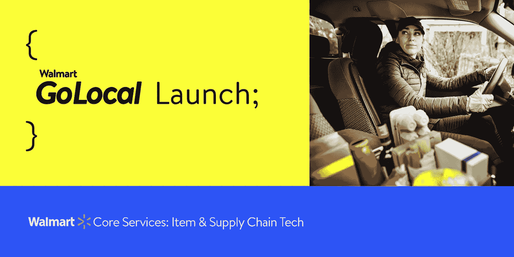

# 沃尔玛 GoLocal Tech:为企业送货提供动力

> 原文：<https://medium.com/walmartglobaltech/walmart-golocal-tech-powering-delivery-for-businesses-73e7775e8029?source=collection_archive---------0----------------------->

(Image designed and owned by Walmart Global Tech)

沃尔玛经营着技术最复杂，但效率最高的供应链之一。我们最近推出了 [Walmart GoLocal](https://one.walmart.com/content/go-local/home-page.html?&adid=22222222220450672199&wmlspartner=wmtlabs&wl0=e&wl1=g&wl2=c&wl3=540798711783&wl4=kwd-1408546240030&wl5=9057160&wl6=&wl7=&wl8=&veh=sem&gclid=EAIaIQobChMIo9j-ir2y8wIVHXFvBB13Xgk2EAAYASAAEgJk4vD_BwE&gclsrc=aw.ds) ，将该技术和专业知识扩展到各种各样的企业。

沃尔玛 GoLocal 支持任何规模和类型的企业轻松使用我们的技术，通过标准化的 API(由沃尔玛 go local Delivery as a Service platform 提供支持)向客户提供最后一英里交付能力，包括交付绩效和进度的实时视图。

将这项技术扩展到其他业务的基本要求是多租户架构、简单的 API 接口、云原生技术、专用沙盒环境、严格的安全协议、自助服务工具、客户端中心 UI 和分析仪表板。

***多租***

我们知道，从头开始开发一个多租户系统至关重要，该系统具有强大的基础设施，通过资源共享实现多种用途的硬件效率，而无需跨客户端共享数据。我们在整个架构中提供了数据分割和隔离，包括模式定义、API 和面向客户端的 ui。

***简单的 API 接口***

另一个关键方面是开发简单的 API 接口和自我解释的契约。我们希望确保提供一流的功能，旨在适应各种行业和规模。除了 API 接口，我们还支持使用 Webhooks 的回调。这些 Webhooks 对于拥有自己的界面并希望将沃尔玛 GoLocal 的活动信息或反馈整合到其系统中的客户非常有用。

我们创建了行业标准的 API 订阅、认证和授权工具，允许我们在前端定义和应用安全策略。我们的 API 使用 Oauth 2.0 的实现来保护，我们的客户在入职期间订阅我们的外部 API。客户端首先使用 client_credentials 授权类型调用我们的令牌 API，以获得基于 JWT (JSON Web 令牌)的承载令牌。这个不记名令牌在所有随后的 API 调用中传递。我们使用仅活跃 15 分钟的短期不记名令牌。

***云-原生技术***

我们知道我们的系统需要使用松散耦合的微服务架构和云原生技术来构建，并部署在多个地区。这一开发战略使我们能够提供弹性、自动扩展、零停机部署和多云。我们的微服务作为 Docker 工作负载部署到 Kubernetes 集群中。我们还确保所有面向终端的服务遵循同步模型，而服务内部和服务之间的交互遵循异步模型，使用 Kafka 进行解耦。

***专用沙盒环境***

我们有一个专用的沙箱环境，供我们的客户用于他们的开发、测试和持续集成需求。这种环境允许我们推出测试版变更，并使客户能够进行端到端和用户接受度测试。它还具有复制驱动程序动作的模拟功能，允许我们的客户在整个生命周期中跟踪交付，这使我们的客户能够独立测试集成。

***严谨的安全协议***

作为全球最大的零售商，我们知道严格的安全协议也至关重要。我们的服务经过并将继续经过细致的信息安全和隐私审查程序，以确保我们的客户及其顾客免受未经授权的访问和使用。Walmart GoLocal 本地支持加州消费者隐私法(CCPA)访问和删除请求、特定于客户的数据保留和模糊政策。

***自助工具***

我们还专注于提供自助工具，用于用户管理、交付服务设置、订阅和审计跟踪，我们的客户可以使用这些工具自行管理，而无需依赖我们的集中运营团队。

我们必须使用一个外向的视角来构建，这样就可以明确区分沃尔玛特有的术语和任何先决条件。这将使任何企业能够整合到我们的送货服务中，而无需遵守沃尔玛特定的系统要求。作为更广泛的商业化战略的一部分，服务将以“照单全收”或“全无”的模式进行消费。

在我们构建这个平台的过程中，我们牢记着小型、中型和大型业务合作伙伴的需求。我们希望确保入职体验尽可能无缝，新客户能够通过 API 或设计良好、直观且响应迅速的 UI 进行集成。

***客户中心 UI***

Client Center UI 为防火墙和身份验证/授权层保护的所有配置、报告和发票提供了一站式位置。我们构建的 UI 遵循响应式 web 设计，以便可以通过桌面或移动设备访问它，并且我们确保它将得到最先进的审计技术的支持，以跟踪和监控变化，并且还支持白色标签。在审查用例并执行初始集成审查之后，任何新的客户端都被授予访问平台的权限。如果客户需要对某些应用程序进行定制，或者需要改变外观和感觉，那么只需对代码进行最少的修改就可以实现这些更新。该平台有严格的访问控制，因此没有客户可以查看或编辑其他任何人的数据。存在多个微服务来管理用户、客户端、交付源和目的地取货点。

***分析仪表盘***

除了构建客户中心 UI 之外，我们还希望为客户提供一个分析仪表板，让他们能够轻松访问重要数据，以支持他们监控和了解绩效，而无需依赖客户经理和支持团队。

分析仪表板为企业提供制定短期、中期和长期战略决策所需的数据，以产生卓越的运营和交付成果，以及建立对服务提供商的信任所需的透明度。这种灵活的功能允许在一次性数据链接过程后调整报告和仪表板视图，而无需工程定制。

我们创造了最先进的最后一英里技术，已经被证明对沃尔玛是成功的。现在，我们正在扩展这项技术——使各种各样的企业能够提供可靠的交付服务，保证我们所熟知的同样出色的客户体验。感谢所有参与沃尔玛 GoLocal 活动的人。你们的努力巩固了我们作为一家真正灵活、敏捷、以客户为中心的技术公司的地位。