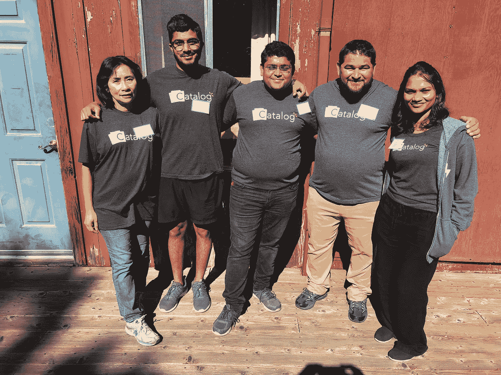

# 沃尔玛实验室志愿者参加社会工程项目的通宵 STEM 露营会议

> 原文：<https://medium.com/walmartglobaltech/walmart-labs-volunteers-at-the-social-engineering-projects-overnight-stem-camping-conference-5353e44b1a92?source=collection_archive---------9----------------------->

Catalog Engineers pause for a photo.

在沃尔玛实验室，我们喜欢帮助激励下一代软件工程师。这就是为什么目录团队最近志愿参加了社会工程项目(TSEPs)的夜间 STEM 露营会议。每年，TSEP 都会带大约 150 名高中生去卡扎德罗学习数学、科学和工程。TSEP 的总体目标是通过为代表性不足的群体提供项目，解决科技行业缺乏多样性的问题。

我们团队的任务是组织和教授一个基于工程的研讨会，但有一个警告——他们不能使用任何技术。Ramya，Anthony，Lan，Dip 和 Nadar 花了几个小时设计了一个很棒的工作室。

他们在卡片上使用“错误代码”，通过洗牌和抽牌随机产生错误。学生被分成小组，必须从列表中找到相应的代码，然后在给定的 SLA 内解决与代码相关的数学或工程问题。

“他们非常积极，兴奋，在我们做的所有活动中积极主动，”Dip Shah 谈到研讨会时说。"他们中的许多人甚至说，他们是受到激励才加入沃尔玛实验室的."

营地利用了没有 wi-fi 或信号的事实，这鼓励孩子们亲近自然，建立友谊，在没有短信和 Instagram 等常见干扰的情况下学习。

这个项目对学生来说很棒，但对志愿者来说也很重要。迪普回忆起他在那里的时光时说，“我们去帮助学生规划他们的职业生涯，但作为回报，我们也学到了这一代人是如何思考和行动的。对于聪明的头脑来说，这是一种非常有趣和互动的方式，可以与经验丰富的头脑会面，并交流许多伟大的想法和策略。”