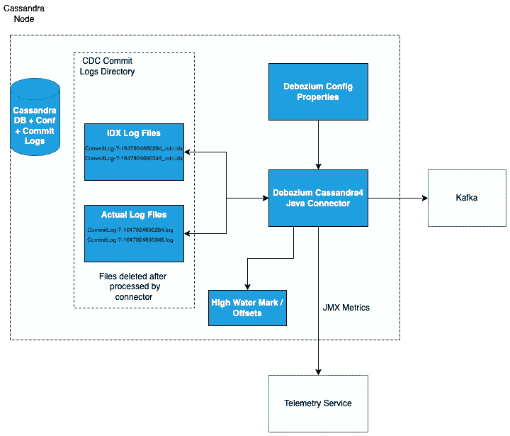
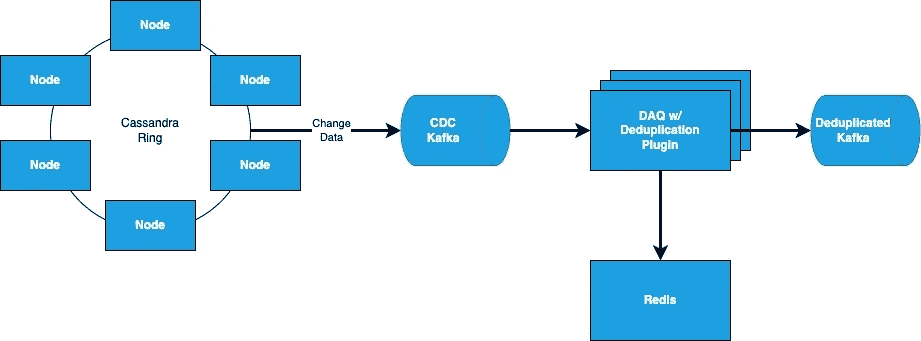
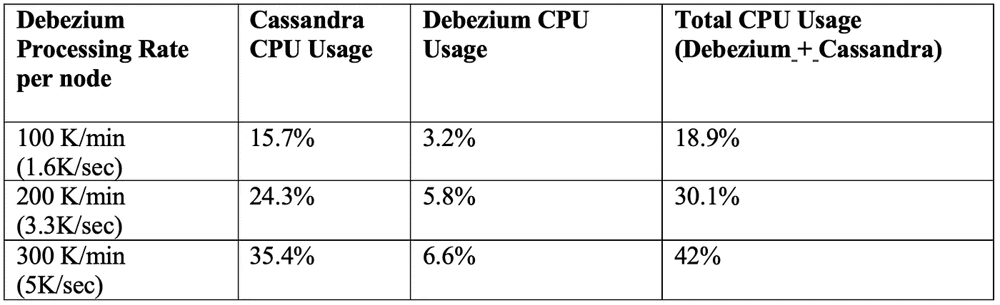
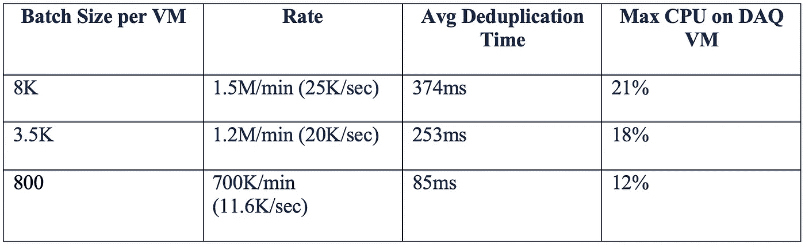
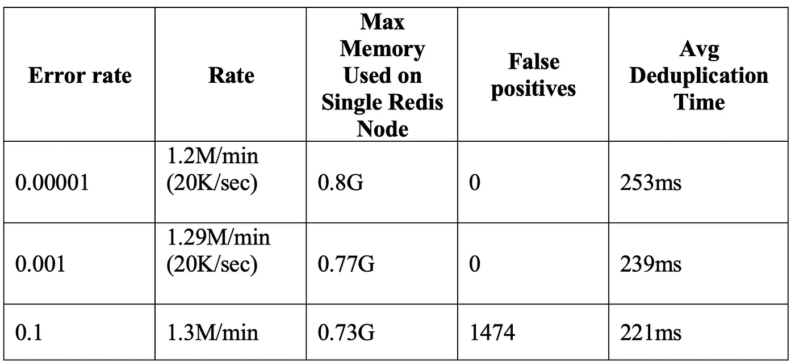

# 沃尔玛的 Cassandra CDC 解决方案

> 原文：<https://medium.com/walmartglobaltech/walmarts-cassandra-cdc-solution-6fc650031a3?source=collection_archive---------1----------------------->

让我们看看由 [Scott Harvester](https://medium.com/u/dc06a7dcace9?source=post_page-----6fc650031a3--------------------------------) 和 [Nitin Chhabra](https://medium.com/u/b1aa4bb4f125?source=post_page-----6fc650031a3--------------------------------) 用 Cassandra 捕获的变更数据。

# 数据采集

“释放我的数据”可能是沃尔玛在构建其现代数据平台时的口号。该平台的目标之一是提供集成的、高性能的、自动化的变更数据捕获(CDC)解决方案，这些解决方案从事务性数据库中提取数据，并将这些数据交付给企业数据湖。解决方案是逐个数据库地打破数据孤岛。例如，Google Spanner 的实现将启用数据管道的时间从几天减少到了几个小时。

沃尔玛的团队最近解决了从 Cassandra 捕获数据变化的问题。在本文中，我们将探讨 Cassandra CDC 面临的挑战、选择和方法。具体来说，我们将重点关注 Cassandra 4.x。

# 挑战

尽管 Cassandra 4.x 比 Cassandra 3.x 提供了显著的 CDC 改进，但与其他数据库技术相比，Cassandra CDC 仍处于起步阶段。有几个挑战需要解决。其中包括:

**重复数据** —随着数据在 Cassandra 节点之间复制，单个更改(CRUD 操作)会生成多个 CDC 记录。这意味着下游处理将需要支持比源系统上生成的更多的数据更改。例如，如果 Cassandra 跨 3 个区域部署(3 个环，每个区域 1 个),复制因子为 3(沃尔玛的典型部署),则每个更改将在 3 个区域环中的每个环中复制 3 次。这意味着一个更改将生成 9 个 CDC 日志记录。我们将在“我们的方法”一节中讨论如何处理重复。

**仅更改列**—Cassandra CDC 的一个限制是 CDC 日志仅包含已更改的列。如果您的系统需要交付整个数据库对象，您将需要开发一种方法来填充该对象。幸运的是，我们的数据管道可以只处理变更列，并合并整个对象。

**无序【Cassandra CDC 不保证变更的顺序。下游系统将需要支持接收无序的数据更改。同样，我们的下游系统已经支持这个用例。**

**运行本地** — CDC 由 Cassandra 通过 CDC 提交日志公开。要读取提交日志，最好在本地运行代理。这意味着您需要在 Cassandra 部署的每个节点上运行 CDC 日志阅读器。此外，您需要确保 CDC 日志阅读器正在主动删除 CDC 提交日志，因为如果本地文件系统被 CDC 提交日志填满，它将[关闭 Cassandra 节点](https://cassandra.apache.org/doc/latest/cassandra/operating/cdc.html#warnings)。

**遗漏变更** —请注意，并非所有的数据变更都不会被捕获。CDC 提交日志中既不会捕获 TTL、范围删除、静态列、触发器、实体化视图、辅助索引，也不会捕获轻量级事务。由于我们不使用这些功能，所以我们不必担心这一点。

# 选项

当我们第一次开始查看 Cassandra 4.x CDC 时，只有几个选项— [Cassandra 提交日志阅读器](https://github.com/apache/cassandra/blob/trunk/src/java/org/apache/cassandra/db/commitlog/CommitLogReader.java)和[Apache Cassandra 的数据税务变更代理](https://github.com/datastax/cdc-apache-cassandra)。Cassandra 提交日志读取器要求我们为读取器实现一个代理，并为数据更改创建处理程序。DataStax 解决方案走得更远，但它与 Pulsar 而不是沃尔玛大量投资的 Kafka 结合在一起。

幸运的是，我们注意到一个将 Cassandra 4.x 提交日志阅读器添加到 [Debezium](https://debezium.io/) 的 pull 请求。Debezium 是最流行的开源 CDC 平台之一。pull 请求被合并到 Debezium 1.9 版本中。

这对我们来说是一个完美的解决方案，因为我们一直在积极使用 Debezium 作为其他数据库技术的 CDC 框架来发布对 Kafka 的更改。这给了我们捕捉 Cassandra 的变化并将这些变化发布到 Kafka 的能力，但是仍然有一些我们必须跨越的障碍，如下一节所述。

# 我们的方法

Debezium 提供了一种机制来读取 Cassandra 生成的 CDC 提交日志，并将这些更改发布到 Kafka，但是我们仍然有两个障碍:接近实时的处理和重复的数据更改。

# 近实时处理

图 1 概述了我们如何在 Cassandra 节点上运行 Debezium。Debezium 监控 Cassandra CDC 提交日志目录的变化。特别是卡珊德拉 4 号。X Debezium 连接器等待。在处理实际提交日志文件之前要标记为完成的 idx 文件。的。idx 文件在其名称中引用了原始日志文件。例如，在下图中。idx 文件 Commit Log-7–1647924600284 _ cdc . idx 跟踪 CDC 提交日志文件 Commit Log-7–1647924600284 . Log 的状态。

Diagram 1: Debezium on Cassandra Node

我们对现有的 Debezium Cassandra 方法进行了改进，修改了代码，以便在新数据可用时继续处理提交日志，参考: [Cassandra4 CDC](https://cassandra.apache.org/doc/latest/cassandra/operating/cdc.html#overview) 。这意味着在将 CDC 消息发送到 Kafka 之前，该过程不会等待 CDC 提交日志被标记为完成。

将来，我们计划修改实现来并行处理文件。这将有助于 CDC 处理在处理高数据量或追赶情况时跟上 Cassandra。

# 重复数据更改

重复数据消除的关键要求是规模和状态保留。因为我们每秒可以接收 60，000 次数据更改。状态保留，因为我们不想发送已经处理过的数据，即使我们的进程因为崩溃而丢失了状态。

Flink 似乎是一个合理的解决方案，但我们决定采用一种更简单的方法。我们的内部数据采集工具(简称 DAQ)已经通过数据划分支持流程扩展。这种能力使 DAQ 能够扩展以捕捉沃尔玛最关键和高容量电子商务数据库的数据变化。DAQ 也支持定制插件。问题是，我们能否利用 DAQ 体系结构并使用插件来处理重复数据消除？

答案是肯定的。通过在缓存中维护状态，我们能够向 DAQ 添加重复数据消除逻辑。我们用来维护状态的缓存是 Redis。我们将在后面讨论 Redis 的优点。

图 2 显示了从 Cassandra 开始，通过 DAQ 进行重复数据删除，然后将数据发送到 Kafka 的更改数据流。

Diagram 2: Cassandra to Kafka Data Flow

Redis 帮助我们使用 RedisBloom 来处理规模，RedisBloom 是 Bloom 过滤器的一种实现。布隆过滤器是可以确定元素是否是集合成员的存储器结构。布隆过滤器的最大优点是内存非常小。在 Redis 中使用 Bloom filter 的另一个很大的优点是，我们可以进行批量调用来检查是否已经发现了数据更改。这减少了我们的进程和 Redis 之间的网络对话。

这种方法有缺点。首先，不可能从布隆过滤器中删除数据。为了避免删除数据，我们按事务时间对 Bloom 过滤器进行了分区。我们使用 Redis 的 TTL(生存时间)设置来自动删除旧的 Bloom 过滤器。这意味着如果我们保留 3 天的布隆过滤器，我们将有 72 个布隆过滤器(3*24)。但是，Bloom filters 占用的内存如此之小，我们没有看到按小时划分 Bloom filters 的任何负面影响(例如，根据配置，我们看到 72 个 Bloom filters 占用 Redis 中大约 5 GB 的内存)。事实上，与长时间使用布隆过滤器相比，它有助于减少我们可能会看到的误报数量。

这给我们带来了另一个缺点——错误率。布隆过滤器是一种概率数据结构。这意味着布隆过滤器可以认为它看到了以前没有看到的数据变化。在我们的例子中，通过使用 Bloom filter，我们的进程可以确定它已经看到了以前从未处理过的数据更改。为了降低错误率，如上所述，我们每小时轮换布隆过滤器，并且我们设置非常高的错误率(例如:1/1000000)。在我们的测试中，我们可以处理大量的数据，而不会遗漏任何数据。但是因为仍然存在丢失数据的可能性，我们小心地确保我们使用 Bloom filter 的用例可以接受一些丢失的数据。如果用例不能接受任何数据丢失，我们建议使用最近最少使用的(LRU)缓存来代替布隆过滤器。

# 绩效结果

# Debezium Cassandra4 CDC 性能

我们通过使用 [cassandra-stress-tool](https://cassandra.apache.org/doc/latest/cassandra/tools/cassandra_stress.html) 运行不同的负载和流量模式来分析 Debezium Cassandra4 连接器，并测量 Cassandra 节点上的性能和资源利用率。cassandra-stress 工具仅在一个 cassandra 节点上运行，以生成更高的工作负载。所有集群都在 Azure 中提供。下面是测试环境设置:

**CDC 卡夫卡:** 24 分区

**Cassandra 节点:** 3 个节点，复制因子:3，每个节点有 8 个内核/28G 内存

从从 Cassandra 复制接收更改/CDC 数据的节点之一获得结果。结果如下:

其中:

1.Debezium Processing Rate 是 Debezium 处理邮件的吞吐量。

2.Cassandra CPU 使用率:Debezium 停止运行，以测量 Cassandra CPU 的最大使用率。

3.Debezium CPU 使用率:第四名的总 CPU 使用率和 Cassandra CPU 使用率之间的差异

4.总 CPU 使用率是 Cassandra Replication 和 Debezium 运行/处理消息时的最大 CPU 使用率。

Debezium 的 JVM 堆内存使用率低于 1.75G，速率为 300K/min。

# 重复数据删除性能结果

为了演示重复数据消除解决方案的性能，我们将看 3 个实验。实验 1 改变了重复数据删除处理的批量大小。实验 2 考察了更改错误对性能和重复数据删除结果的影响。实验 3 测试扩展重复数据删除流程。

对于这些测试，所有集群都在 Azure 中提供。为简单起见，为了对基于 Redis 的重复数据删除进行压力测试(每分钟 150 万条已删除重复的记录)，我们在前两个实验中禁用了写入已删除重复的 Kafka(参见图 2)。下面是测试环境的设置方式:

**CDC 卡夫卡:** 15 分区

**DAQ 重复数据删除虚拟机配置:** 2 个节点，8 个核心虚拟机，24GB 内存

**Redis 实例:** 6 节点集群(3 个主节点+ 3 个副本节点)，每个节点配置 8 个核心/16GB。

# 实验 1:错误率固定的不同 CDC Kafka 批量

对于这个测试，我们配置布隆过滤器错误率= 0.00001，布隆过滤器容量= 1000 万。下表显示了结果:

其中:

速率是重复数据消除过程的吞吐量

Avg Deduplication Time 是一个批处理通过重复数据删除过程的平均时间

DAQ 虚拟机上的最大 CPU 使用率是性能测试期间观察到的最大 CPU 使用率

在上述测试运行中，我们将误报率配置为 1/100K(0.00001)，在上述 3 个场景中，误报率为 0。

# 实验 2:固定 CDC Kafka 批量的不同错误率

对于这个测试，我们配置了 Bloom Filter 容量= 1000 万，Kafka 批量大小=3.5K

当我们设置了一个较低的错误率(1/10)时，我们确实看到了假阳性。此外，请注意，重复数据删除处理时间略有下降，因为我们降低了错误率以提高准确性。

# 实验 3:扩展重复数据删除流程

在这个实验中，我们启用了 24 个分区的重复数据删除 Kafka，并将 CDC Kafka 中的分区数量增加到 24 个。我们在 3 台 Azure 虚拟机上运行了重复数据删除应用，布隆过滤器错误率为 1/100 万，容量= 2000 万。下表显示了结果:

**每批加工时间:** 2 秒

**速率:** 623K/min

其中:

每批处理时间:所有 3 个 DAQ 节点的第 95 个百分位数的平均总处理时间(从 CDC Kafka 读取+重复数据删除+加载到重复数据删除的 Kafka)

速率是流程的吞吐量。

这些数字表示从 Kafka 提取 Debezium 记录，通过基于 Redis 的 bloom filter 对其进行重复数据删除，并将经过重复数据删除的记录加载到 Kafka。该解决方案通过向 Kafka 添加分区和添加 DAQ 虚拟机进行线性扩展。

# 布隆过滤器内存使用

在我们的实验中，错误率为百万分之一(0.000001)，bloom filter 容量为 2000 万，bloom filter 每小时旋转一次，每个 Bloom Filter 使用的内存约为 67MB，与 [Bloom Filter 计算器](https://hur.st/bloomfilter)报告的内存大致相同。具有上述配置的 72 个布隆过滤器将在分布式 Redis 节点中占用 5.2GB 的内存，这是非常小的。

# 结论

卡珊德拉疾控中心是一个有趣的挑战。我们开始这个项目时，没有一个好的解决方案来从 Cassandra 中提取变更，也没有一个非常复杂的设计来删除重复的数据变更。本着奥卡姆剃刀的精神，我们将需求和设计精简为最简单的解决方案。结果是一个可扩展的解决方案，我们可以针对新的使用情形不断增强。

展望未来，我们将通过添加对从提交日志文件中读取增量更改的[支持，计划添加用于重复数据删除的 LRU 缓存选项，并继续优化流程，为 Debezium 项目做出贡献。](https://issues.redhat.com/browse/DBZ-5410)