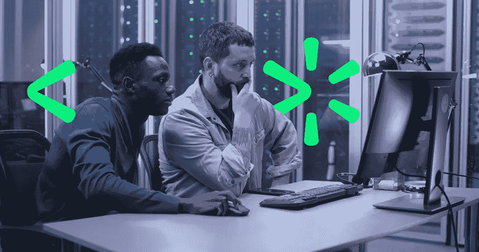
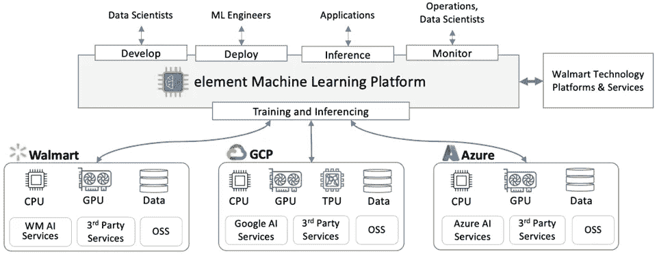
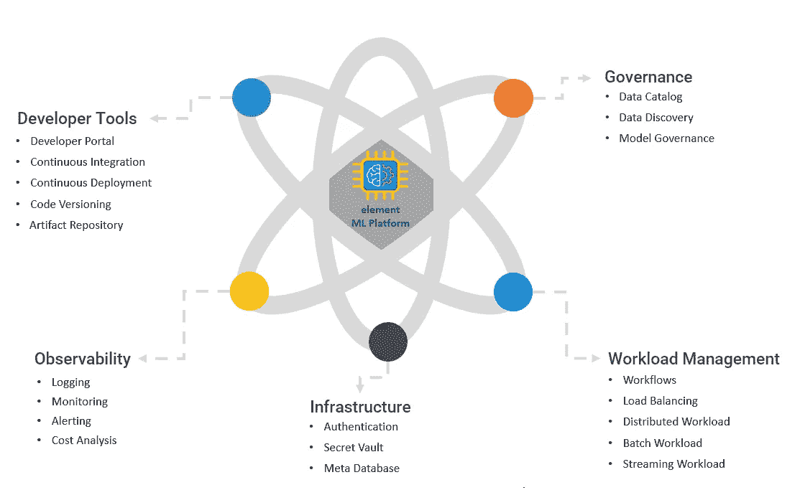

# 沃尔玛的“元素”多云端机器学习平台

> 原文：<https://medium.com/walmartglobaltech/walmarts-multi-cloud-machine-learning-platform-a1ab08ff1e4a?source=collection_archive---------4----------------------->

*作者:* [*帕米迪*](https://medium.com/u/dcbb9f38bd57?source=post_page-----a1ab08ff1e4a--------------------------------) *&* [*托马斯·文戈尔*](https://medium.com/u/c0baa07f7a16?source=post_page-----a1ab08ff1e4a--------------------------------)

# 对云计算的需求

在过去的几十年里，我们的星球见证了快速变化的业务需求和技术采用。随着云基础设施的商品化和后疫情时代人类行为模式的改变，发生了重大的技术转变。这些模式的变化迫使大型企业重新思考和重新定义他们的长期战略，以扩展和适应不断变化和苛刻的业务需求，包括 24x7x365 运营的 IT(信息技术)基础架构可用性。

作为世界财富排名第一的公司，沃尔玛一直走在技术应用的前列。沃尔玛的数据系统规模是全球最大的。尽管沃尔玛以其最大的零售连锁店而闻名，但除了大规模经营的纯零售领域之外，还有许多其他独特的功能需要服务，如金融、物流、电子商务、客户服务、供应链等。沃尔玛需要规模经济，才能在竞争激烈、价格敏感、波动和通胀成本水平较高的市场中运营。

随着数字化转型的加速，云服务的采用越来越多。这为按需计算能力的基础架构管理提供了优势，并降低了资本支出。这带来了第一个挑战，即决定为企业选择哪个云提供商。越来越多的公司开始对可用的商业云供应商进行标准化，以提高运营效率，最终降低成本、提高执行速度并缩短上市时间。如果有任何顾虑，在短时间内切换到另一家云提供商是一个巨大的障碍。这包括在特定云服务上设置解决方案所需的大量成本、时间和精力，以及应用程序拦截和在此过程中积累的技术债务。因此，当务之急是考虑建立一个多云部署策略，特别是对于在任务关键型应用程序下部署的较新的机器学习项目。

# 挑战和要求

最主要的需求是利用各种云技术提供商的服务，以最大限度地发挥企业的优势，而不会产生大量的成本和时间。将机器学习(ML)和人工智能(AI)所需的高端技术组件添加到组合中，体现了复杂性。对于大数据规模，随着对复杂算法计算的需求不断增长，人工智能解决方案越来越成为资源密集型。企业面临的一个主要挑战是整合来自不同供应商的产品和服务以满足业务期望，因为一个供应商无法解决所有问题。它需要确保选定的解决方案能够经得起未来考验，并且足够灵活，能够满足不断发展的人工智能工作负载以及不断增长的高科技企业的所有其他需求。

云解决方案需要满足两个基本要求:

> **1。** **可移植性:**一次构建，随处部署。其中一个主要挑战是确保解决方案可以部署到任何云提供商，而不会产生迁移成本和时间延迟，降低对供应商的依赖性或锁定，同时能够灵活选择性价比最高的提供商。
> 
> **2。** **同类最佳:**利用各种第三方供应商(开源软件、商业打包软件供应商和云供应商)提供的最佳服务。

考虑到技术使用的规模和广度，利用人工智能为更新的技术需求创建单一平台一直是一个重大挑战。因此，在沃尔玛建立物流平台之前，必须考虑以下要求:

> 1) **生命周期:**管理数据科学生命周期的端到端生命周期包括从数据摄取到模型部署、模型训练和模型评估等阶段。模型部署后，需要定期监控模型的公平性和偏差以及再培训流程，以避免模型随着时间的推移而衰减。
> 
> **2)** **开发工具**:需要多种技术工具，如
> 
> a.编程语言支持(Python、PySpark、Scala、R、SQL 等等)
> 
> b.开发者工具的可用性(Jupyter、忒伊亚、PyCharm、RStudio 等等)
> 
> c.最新的 AI/ML 算法和库(TensorFlow、Keras、PyTorch 等)
> 
> d.报告工具(Grafana、RShiny 等)
> 
> **3)** **数据:**能够快速方便地访问所需数据
> 
> **4)** **地点:**开发和部署基础设施的实际地点，
> 
> a.云基础架构在不同地区以高可用性、弹性需求和灾难恢复要求运行。
> 
> b.边缘基础设施在远程商店运行，具有低功耗、高可用性和最少维护
> 
> 5) **计算类型:**跨 CPU(中央处理单元)、GPU(图形处理单元)和 TPU(张量处理单元)运行训练和推理作业的大规模计算需求。
> 
> 6) **规模:**使用数百万 ML 模型，这些模型需要针对不同的预测算法并行运行。
> 
> 7) **可用性:**跨多个地区和多个服务提供商的冗余基础设施上运行的 IT 系统的灾难恢复。
> 
> 8) **治理:**拥有简单统一的流程和工具的方法，拥有对大规模运营影响最小的控制程序
> 
> 9) **规模经济:**随着数据量规模和算法复杂性的增加，保持低成本

# 解决办法

几乎不可能找到一个单一的云供应商来满足沃尔玛的所有要求(如上面提到的 9 项要求)。此外，由于对供应商的依赖，依赖单一供应商对于长期生存来说是一个灾难性的策略。因此，解决方案是构建一个 AI/ML 平台，在这个平台上可以托管和管理多个第三方供应商。多家云供应商提供了同类最佳技术的组合。就可移植性而言，该平台在一个名为 [**三元模型**](https://www.linkedin.com/pulse/blazing-trail-cloud-computing-how-walmart-built-one-/) 的保护伞下提供了多种云技术的灵活性，该模型包含三种不同的云技术——沃尔玛云、GCP(谷歌云平台)& Azure 云。

Fig: Multi-cloud Triplet Deployment Architecture from element Machine Learning Platform

在多云战略的驱动下，沃尔玛开发了一个内部 AI/ML 平台，称为 [' **元素** '](https://one.walmart.com/content/globaltechindia/en_in/blog-case-study/blog-case-study2.html) 机器学习平台。ML 平台以统一的方式构建在多云中，能够在三元模型上运行。element ML 平台一直在帮助数据科学家快速扩展和构建解决方案。它引入了来自云提供商、开源和第三方提供商的同类最佳工具。现在，数据科学家可以专注于解决方案，而元素平台提供了对工具的访问，并标准化了流程，以提高效率、速度和降低成本。

在这个多云部署过程中，ML 开发可以在一个云上进行，ML 运行时间可以在另一个云上进行，使用沃尔玛的云原生平台(WCNP)，一个云“ [**抽象层**](https://www.infoworld.com/article/3666468/how-walmart-abstracts-its-hybrid-cloud-for-developers.html) ”这个 AI/ML 平台是使用同类最佳的开源技术构建的，可以即插即用云技术的任何外部开源技术。在开发环境中编写的任何代码都被转换为对称部署，并跨不同的区域和云提供服务，这解决了可移植性问题。在这里，运行成本仅用于计算的基础设施；不以更高价值的 AI/ML 工具为代价。element 平台具备用 Python、Scala、R、SQL 等各种编程语言开发代码的能力，使开发者能够使用 Jupyter Notebooks、忒伊亚、RStudio、Google Vertex、PyCharm 等各种工具。element platform 为二十多个数据源系统提供直接的数据连接，这有助于数据科学家为数据科学项目解锁数据。element platform 还集成了二十多个内部 IT 工具和系统，这些工具和系统是管理完整的 MLOps(机器学习操作)生命周期所必需的，例如代码版本控制、CI/CD 流程、认证、监控、警报、日志记录等。作为 element platform 的一部分，上述所有集成都需要进行定制，以便可以使用三元组操作。

Fig: element integration with various IT tools and products within Walmart

在 element 上开发的任何代码都可以部署在沃尔玛的私有云或 edge 系统、谷歌云和微软 Azure 云上。element ML 平台可以抽象出[跨多个云供应商](https://www.wsj.com/articles/walmart-amps-up-cloud-capabilities-reducing-reliance-on-tech-giants-11656000000)供应资源以及简化管理这些资源的流程的复杂性。作为一个平台，element ML 平台能够针对不同项目的不同 ML 工作负载优化资源使用和基础设施共享。

总之，element ML 平台有助于沃尔玛的数据科学团队快速加入，利用同类最佳工具的培训优势和可移植性，在高性能、低成本、高可用性和高可扩展性方面部署到最佳云上。