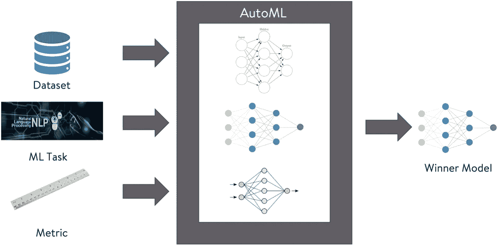
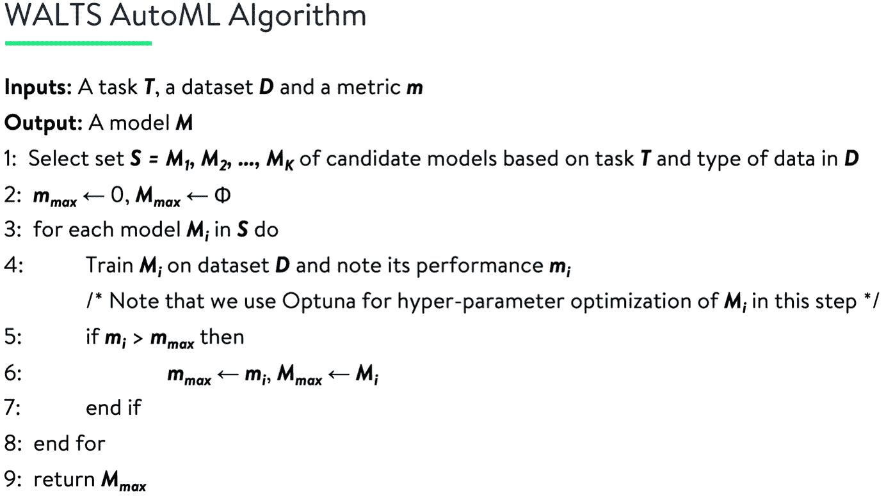
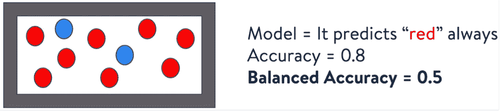
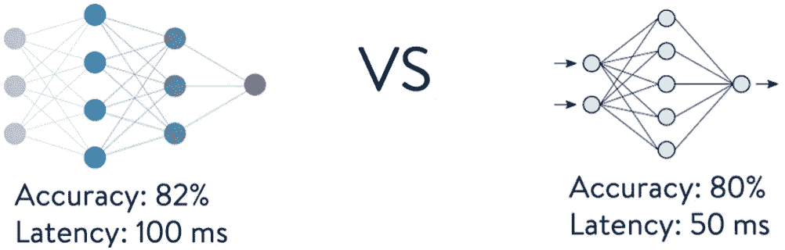
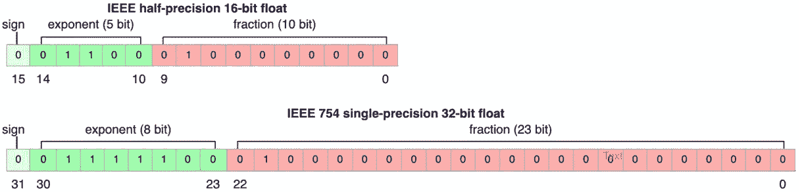
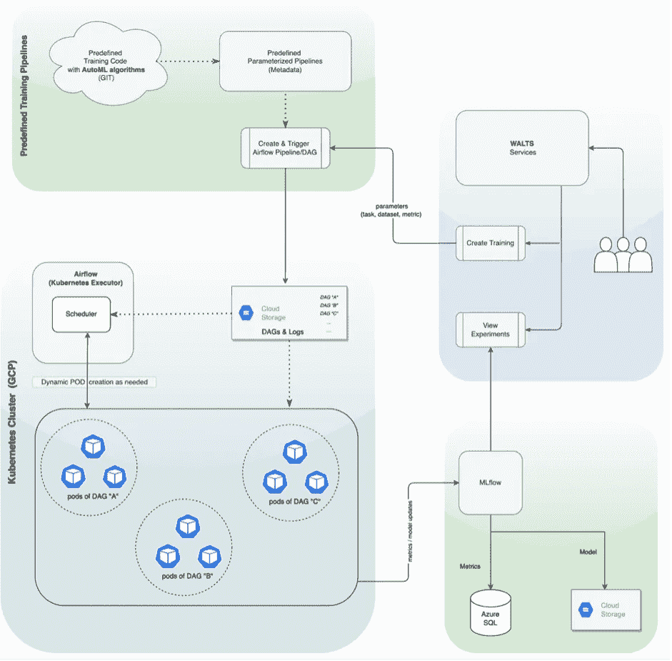

# WALTS: Walmart AutoML 图书馆、工具和服务

> 原文：<https://medium.com/walmartglobaltech/walts-walmart-automl-libraries-tools-and-services-936c73e5ec67?source=collection_archive---------0----------------------->

Fig. 1: Overview of an AutoML system.

作者:[库纳尔·班纳吉](https://kunalbanerjee.github.io/)，[拉胡尔·巴杰](https://www.linkedin.com/in/rahul-bajaj-b70713136/)，[萨钦·帕尔马](https://www.linkedin.com/in/sachinparmar/)

自动机器学习(AutoML)是机器学习(ML)中一个即将到来的领域，它在候选模型空间中搜索给定的任务、数据集和评估度量，并根据给定的度量在所提供的数据集上返回最佳性能的模型。AutoML 不仅减少了开发 ML 模型所需的人力和专业知识，而且大大缩短了 ML 模型的上市时间。我们设计了一个名为 WALTS 的企业级 AutoML 框架，以满足在零售或任何其他感兴趣的业务中使用 ML 的不断增长的需求，从而帮助在我们的组织内实现 ML 的民主化。在这篇博客中，我们详细阐述了我们如何从候选人中探索模型，并强调了它如何帮助我们处理业务用例。

为了概述 AutoML 流程及其当前状况，并展示 WALTS 的优势，我们将介绍:
什么是 AutoML？
AutoML 有什么优势？
目前这个领域的玩家有哪些？
什么是沃尔特斯？
沃尔特斯有什么优点？
沃尔特斯的建筑概况是什么？
沃尔特斯如何帮助一个组织？

## **什么是 AutoML？**

AutoML 通过自己提出合适的模型，减轻了用户为其数据集设计 ML 模型的压力。如上面的图所示，AutoML 通常从用户那里获得三个输入:(I)数据集，(ii)要在该数据集上执行的 ML 任务，以及(iii)用于确定哪个模型执行得最好的度量。例如，数据集可以是 *ImageNet* ，任务可以是*图像分类*，度量可以是*准确度*。

一旦给定输入，AutoML 工具将探索各种 ML 算法-这些算法可能从经典算法(例如，线性回归、支持向量机、决策树)到高级神经网络。在探索结束时，该工具将根据用户提供的指标报告性能最佳的型号。然而，这种算法探索部分在大多数当前的 AutoML 工具中是作为黑盒保存的。

## **AutoML 有什么优势？**

采用 AutoML 有多种好处，如下所述。

1.将 AI 民主化:这也许是 AutoML 最大的贡献，也是将其概念化的主要动机。*现在你不需要成为一个 ML 专家来使用 ML！*在 AutoML 的帮助下，任何人都可以获得适合自己需求的 ML 模型，而无需投入复杂的模型开发过程。

2.**缩短上市时间:**这是 AutoML 带来的第二个优势，如下所述。

a.更少的开发时间: AutoML 减轻了用户调查单个 ML 模型并随后进行比较分析以挑选最佳模型的痛苦。此外，调整 ML 模型的超参数是提取最佳性能的关键任务——通常，人类模型开发人员在这一步花费了大量时间；此外，AutoML 还负责调整它所研究的每个模型的超参数。

b.**修复代码中的错误花费的时间更少:**因为在 AutoML 的情况下，模型是以自动化的方式开发的，所以与人类开发的模型相比，在代码中引入错误的机会要少得多。因此，花在修复错误和测试代码上的时间更少了。

3.**实现卓越运营:**采用 AutoML 可能会对卓越运营产生以下额外的积极影响。

a. **AutoML 为模型的生成注入了更多的标准化:**如上所述，由于 AutoML 中的所有模型生成都遵循标准化的流程，因此更容易确保/执行某个行业可能想要的一些策略。

b.**模型的生成要考虑到可伸缩性:**一些 AutoML 工具可能适合开发可大规模部署的模型的技术。另一方面，数据科学家可能不得不花费额外的精力在模型开发后对其进行缩放。

4.**降低成本:**投资 AutoML 可能会降低一个行业的总体运营成本，如下所述:

a.**需要的人数更少:** AutoML 可能会在很大程度上缓解行业对雇佣数据科学家和数据工程师的需求。此外，数据科学家因难以留住而臭名昭著；AutoML 绝对可以帮助解决这个痛点[1]。

b.**高效的模型导致更少的推理成本:**AutoML 开发的模型通常比公民数据科学家开发的模型更高效(针对规模而构建，针对底层硬件而优化)。一个有效的模型总是会导致更少的推理成本，从而增加公司的收入。

## 目前这一领域的参与者有哪些？

Auto-WEKA [2]试图同时搜索最佳学习算法和最佳执行超参数值，被认为是第一个 AutoML 工具。然而，它的范围仅限于分类任务，而且与今天相比，所探索的模型和数据集都相当小。然而，从那时起，许多成熟的公司和初创公司已经涉足这一领域，并在 ML 任务、模型、超参数调整等方面取得了很大进展。一些大玩家包括谷歌、微软、数据库、数据机器人和 H2O。

## **什么是沃尔特斯？**

WALTS 是沃尔玛的内部框架，扩展为“沃尔玛自动化图书馆、工具和服务”。其算法如下:注意，我们使用 Optuna [7]进行超参数优化。

Fig 2\. WALTS AutoML algorithm.

为了理解 WALTS 的显著特征是什么，以及为什么这些不同的特征值得为任何组织构建，我们需要深入研究下面的问题。

## **沃尔特斯的优点是什么？**

考虑到已经有这么多的 AutoML 工具，有必要再创建一个吗？我们研究了一些现成的 AutoML 工具，发现了一些我们希望用 WALTS 来填补的空白。下面我们列出了 WALTS 相对于其他类似工具的优势。

**1。可定制性:**

可定制性是 WALTS 带来的最大好处。为了说明这一点，让我们看看下面的例子。

Fig. 3: An example to illustrate customizabitlity of metrics in WALTS.

假设有一个球的集合，其中 80%的球是红色的，而剩下的 20%是蓝色的。现在考虑有一个模型，它总是预测从这个集合中选出的球的颜色是红色。显然，这个模型将有 80%的准确性；然而，同样明显的是，这个模型没有学到任何东西，因为它每次都盲目地做出相同的预测。然而，看着 80%的准确率，用户可能会倾向于选择这个模型，这对于没有经验的观众来说似乎是不错的。然而，这种做出错误决策的情况可以通过选择更合适的度量来避免。在存在类别不平衡的情况下(例如，在这种情况下，红球的数量比蓝球的数量多得多)，平衡精确度是比更常见的精确度更好的度量选择。平衡准确度被定义为每个类别的召回值之和除以类别总数。在这种情况下，红色球的召回值是 1(因为我们对红色球的所有预测都是正确的)，而蓝色球的召回值是 0(因为我们对蓝色球的所有预测都是正确的)，因此这种情况下的平衡准确度是(1+0)/2 = 0.5(或 50%)。显然，50%没有 80%好，因此用户不太可能选择这个模型。

目前，我们探索的所有现成的 AutoML 服务都提供了一组固定的指标，用户无法扩展该组指标。其中一些有时甚至会误导，例如，当类别不平衡时的准确性，如上所述。基于客户的需求，我们可以很容易地引入新的度量标准，比如平衡精度，它更适合不平衡的类。

**2。透明度:**

透明度是 WALTS 带来的第二大好处。我们用下面的例子再次说明这一点。

Fig. 4: An example to illustrate transparency offered by WALTS.

让我们考虑这样一种情况，我们向 AutoML 工具提供一个数据集，我们对分类任务感兴趣，并选择准确性作为决定获胜模型的度量。此外，假设最佳执行的 ML 模型给出 82%的准确度，而每次预测花费 100ms。第二好的最大似然模型与最好的模型相比在精确度上相差 2%,但是每次预测花费一半的时间，即 50 毫秒。

*现在，如果客户端有一些硬延迟需求怎么办？*

在这种情况下，如果第二好的模型符合客户的延迟需求，客户可能会满意。

通常，AutoML 框架只报告获胜的模型。相反，WALTS 提供了所有探索模型及其性能的细节。因此，这种客户可能愿意在模型的不同性能指标之间进行权衡的支持只能由 WALTS 提供。

**3。低精度型号:**

一些读者可能不熟悉“低精度模型”这个术语，因此我们借用维基百科[中的插图来解释这个术语。](https://en.wikipedia.org/wiki/Bfloat16_floating-point_format)

Fig. 5: Difference between IEEE single-precision (FP32) and half-precision (FP16) datatypes.

按照惯例，当我们训练 ML 模型时，我们用来表示实值的数据类型是“float”——根据 IEEE754 标准，我们使用 32 位来捕获浮点数；这 32 位分为符号(1 位)、指数(8 位)和分数(23 位)。为了方便起见，IEEE754 单精度数据类型缩写为 FP32。

对于低精度数据类型，我们指的是使用少于 32 位来表示实数的任何数据类型，对于低精度模型，我们指的是使用低精度数据类型来计算和存储其参数的任何模型。IEEE754 半精度数据类型(FP16)使用 16 位来表示实数，如上图所示。使用低精度模型的想法在[3]中提出。

使用低精度模型可以减少内存占用和延迟。例如，在 Nvidia V100 中，峰值 FLOPS 是 15 TF，而峰值 OPS(在 FP16 中)是 120 TF[4]——因此，如果使用 FP16 而不是 FP32，就有可能将您的工作负载提高 8 倍；同样，在 Nvidia A100 中，峰值 FLOPS 为 19.5 TF，而峰值 OPS(在 FP16 中)为 312 TF[5]——因此，在采用 FP16 后，该硬件的范围已增加到 32 倍。可以注意到，在 A100 中存在其他低精度数据类型，例如 BFLOAT16 [6]，其可以提供相等甚至更多的加速。根据我们的经验，其他 AutoML 框架只生成 FP32 数据类型的模型，并且需要一个单独的工具，例如 TensorFlow Lite，来进行后续的低精度转换。另一方面，WALTS 基于可用的硬件生产低精度模型，例如，如果提供 Nvidia V100，则生产 FP16 数据类型的模型。

**4。独特增强的范围:**

WALTS 是一个内部框架，我们可以很容易地对其进行扩展，以包含一些独特的增强功能。下面描述了一个这样的例子。

Fig. 6: An example to illustrate how sparsity may be handled in WALTS.

经常会遇到缺少数据的表格数据集。处理这种数据集的一种方法是删除丢失数据的行，然后在其上训练模型；另一种方法是用可能的值智能地估算缺失数据，然后在此基础上训练模型。如果数据的稀疏程度相当大，后一种方法可能是优选的。我们发现 AutoML 工具倾向于删除缺少条目的行——我们打算用我们的智能数据插补算法来缓解这一缺点。我们还在探索其他一些独特的增强功能，例如在存在噪声数据的情况下进行标签校正，以使 WALTS 成为更好的产品。

**5。数据敏感度:**

为了遵守政府政策，公司可能会被禁止将敏感数据上传到云中或与第三方供应商共享。为了开发这种数据集的 ML 模型，我们可以使用在本地设备上运行的 WALTS。

**6。缩短探索时间:**

商业 AutoML 工具的复杂搜索算法可能会以尝试不同参数(层、连接等)的组合数量为代价找到特定的架构。).相反，WALTS 遵循一个简单的策略，即只探索一组预定义的模型，这可能更省时。此外，WALTS 探索的模型已经很受欢迎，客户可能更愿意采用这些模型。

**7。性价比:**

商业 AutoML 工具有最低收费的概念，尽管你可能会使用他们的服务几分钟。但是，我们不打算对 WALTS 设置最低收费，而是遵循按使用付费的政策。

## **沃尔特斯的建筑概况是什么？**

沃尔特斯的建筑概述如下。

Fig. 7: Architectural overview of WALTS.

如图所示，培训作业是通过 WALTS Services 的用户界面触发的，该界面将常用参数(要完成的 ML 任务、数据集和指标)作为输入。此外，我们提供预定的配置(可由专家用户定制)，包括训练的最大历元数、计算能力(即 CPU、GPU 的数量)、输出文件位置等。为了实现可靠性、效率和可扩展性，我们使用 Kubernetes [8]和配置了 Kubernetes executor 的 Airflow [9]。培训工作中的每个实验都作为气流工人在 Kubernetes pod 上运行一个容器化的应用程序。带有参数(例如，任务、要探索的模型)的训练请求被转换成气流管道(也称为有向非循环图或 DAG ),其中节点对应于实验。这些节点中的每一个都配置了一个定制的 Git 操作符，该操作符通过使用来自 Git 的 AutoML 算法检查预定义的训练代码来设置容器，并安装执行代码所需的库。在执行过程中，它根据资源的可用性并行运行几个算法。每个实验的执行都在一个遵循预定义配置的 pod 内进行。这些 Kubernetes pods 是动态创建的，这使我们能够处理突发工作负载。由于系统是多租户的，可能会有作业并发运行，因此可能会出现单个作业/租户试图过度消耗资源的情况。为了避免这种情况，系统需要为租户的资源消耗设置一个上限。使用 Kubernetes 中的名称空间级别的 ResourceQuota 来控制每个租户的资源限制。如果租户的培训作业的资源不可用，作业将排队，并在为租户添加资源或已经运行的实验完成其执行并释放资源后立即开始执行。Kubernetes 基础设施由所有租户共享，我们依靠 Kubernetes 集群自动缩放器实现可伸缩性。有时系统会经历更大的负载，在这种情况下，Kubernetes 可以自动增加集群节点，并根据需要部署 pod 来处理增加的需求。当负载减少时，Kubernetes 可以动态减少节点和 pod。一旦实验完成，所有性能日志都保存在 Azure SQL 数据库中，可以通过用户提交的查询轻松检索到这些日志——这通常是由用户完成的，以比较各种实验的指标；其他工件如模型存储在 Google 云平台的 GCS 桶中。存储由 MLflow [10]管理，它也是用户检索所需日志和工件的桥梁。

## 沃尔特斯如何帮助一个组织？

WALTS 可用于为组织内的许多问题探索和推荐合适的 ML 模型——让它成为分类或回归或实体识别问题；此外，数据可以是结构化的(表格)或非结构化的(图像、文本)。例如，在沃尔玛，它已被用于垃圾邮件过滤和我们的卖家和其他人的争议分类。我们的客户团队已经认可了 WALTS 在其运营中做出的以下贡献:
提高了生产率和可扩展性。
高效的资源和基础设施管理。
更快的实验和更短的上市时间。
弥合技能差距，减少应用机器学习算法的错误范围。

事实上，对于一些团队来说，开发时间减少了 2 个月。在一项详细的实验中，我们比较了 WALTS 开发的九个模型和人类专家编码的精确模型，发现给定模型的开发时间最小减少了 7.4%，而最大减少了 15.1%；所有车型的平均降幅为 10.4%。我们期望在开发时间上有类似的节省，并且在其他用例上也有增强的性能。

## **结论**

对于沃尔玛来说，通过利用机器学习的力量，提供卓越的客户体验和增强我们的运营有着巨大的潜力。AutoML 可以在最少人工干预的情况下帮助处理数据的指数增长。WALTS 旨在成为训练流行机器学习模型的一站式商店，以执行分类、回归、实体识别等一般任务。我们计划在未来根据我们的用户需求增加更多的任务和模型。团队可以利用 WALTS 以最小的努力构建快速原型，而不是试图重新发明轮子。这将有助于弥合技能差距，减少错误/错误，并节省资源/基础设施成本。WALTS 使用最先进的优化技术来更快地训练模型，从而缩短上市时间。我们已经看到了它对各种沃尔玛业务用例的好处，如垃圾邮件检测和沃尔玛卖家的争议分类，并希望看到它的进一步增长。

## **参考文献:**

[1] Dataiku，“AutoML 对于增强分析的重要性”，技术。众议员，2020。可用:[https://pages . data iku . com/hub fs/PDF/white paper/Importance _ of _ AutoML-for-Augmented-analytics . PDF](https://pages.dataiku.com/hubfs/PDF/Whitepaper/Importance_of_AutoML-for-Augmented-Analytics.pdf)

[2] C. Thornton，F. Hutter，H. H. Hoos 和 K. Leyton-Brown，“Auto- WEKA:分类算法的组合选择和超参数优化”，KDD，2013 年，第 847-855 页。

[3] P. Micikevicius，S. Narang，J. Alben，G. F. Diamos，E. Elsen，D. García，B. Ginsburg，M. Houston，O. Kuchaiev，G. Venkatesh，H. Wu，“混合精确训练”，2018。

[4]英伟达，《英伟达特斯拉 V100 GPU 加速器》，2018。可用:[https://images . NVIDIA . com/content/technologies/volta/pdf/Tesla-volta-v100-data sheet-letter-fnl-web . pdf](https://images.nvidia.com/content/technologies/volta/pdf/tesla-volta-v100-datasheet-letter-fnl-web.pdf)

[5]英伟达，“英伟达 A100 张量核 GPU”，2020 年。可用:[https://www . NVIDIA . com/content/dam/en-ZZ/Solutions/Data-Center/a100/pdf/NVIDIA-a100-Data sheet . pdf](https://www.nvidia.com/content/dam/en-zz/Solutions/Data-Center/a100/pdf/nvidia-a100-datasheet.pdf)

[6] D. D. Kalamkar，D. Mudigere，N. Mellempudi，D. Das，K. Banerjee，S. Avancha，D. T. Vooturi，N. Jammalamadaka，J. Huang，H. Yuen，J. Yang，J. Park，A. Heinecke，E. Georganas，S. Srinivasan，A. Kundu，M. Smelyanskiy，B. Kaul，P. Dubey，" BFLOAT16 深度学习培训研究"，载于

[7] T. Akiba，S. Sano，T. Yanase，T. Ohta 和 M. Koyama，“Optuna:下一代超参数优化框架”，KDD，2019 年，第 2623-2631 页。

[8] Kubernetes，“生产级容器编排”，2022 年。可用:【https://kubernetes.io/】T4

[9]气流，“阿帕奇气流”，2022 年。可用:[https://airflow.apache.org/](https://airflow.apache.org/)

[10] MLflow，“机器学习生命周期的开源平台”，2022 年。可用:[https://mlflow.org/](https://mlflow.org/)