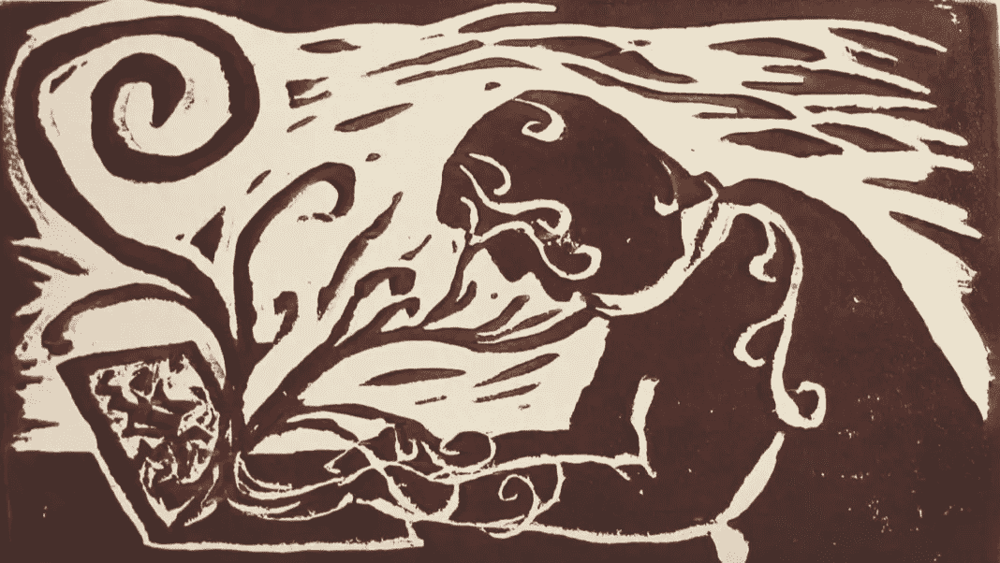
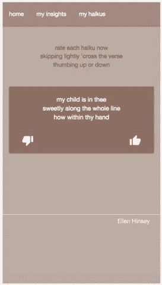
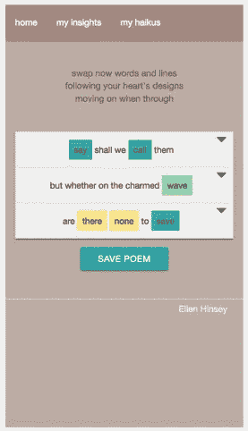

# 沿着连续体跳华尔兹——一个关于诗歌、音乐和机器学习的故事

> 原文：<https://medium.com/capital-one-tech/waltzing-along-the-continuum-a-story-about-poetry-music-machine-learning-24f2f5be60bb?source=collection_archive---------5----------------------->

## 一个写作实验如何演变成一次旅程，以了解工具如何弥合人类和机器智能之间的差距。

“React”, by Anna Johnson (2017)

## **背景故事**

几年前，一个朋友邀请我去西海岸和他一起为第一资本实验室工作。我和妻子认为这是一个大冒险的好时机，所以我们在明尼苏达州扎根，搬到了旧金山。我加入了 Capital One 数据科学家的一个小团队，他们在一个致力于“打击坏人”的伞式项目中工作，其中包括开发检测信用卡欺诈的系统。我们的一位同事保罗·梅尔比(Paul Melby)对这个系统的复杂性表示认可，并对已经在这个领域工作的领域专家深表敬意，他想出了一个绝妙的主意，用一个*融合细胞*来解决这个问题。融合单元模型出现在军队中，在这种模型中，从事情报工作的分析师和技术专家与收集情报的人员一起部署在前沿。在这种模式下，可以即时创建新的工具，并向侦察小组提供新的指导，从而创建一个可爱的反馈循环。

在我们的特定案例中，我们不仅仅是为了建立新的预测模型或调查工具，而是尝试参与欺诈调查人员本身的工作。我们意识到这种方法会产生我们无法通过其他方式获得的领域知识。当我们开始构建工具时，我们实际上首先是在为自己构建工具，以支持我们新生的专业知识。

在同一时期，我开始了一个更个人化的项目。我有很深的音乐背景，但当我和妻子抚养两个了不起的女儿时，我生活的这一部分在明尼苏达州基本上处于休眠状态。今年夏天，随着一个女儿结婚，另一个女儿面临着再上一年大学，我决定我终于有时间重新激发我生活中艺术的一面。

我对重新创作歌曲很感兴趣，但我的首都一号旅行日程让我远离了作曲时唯一让我感到舒适的地方:一架钢琴。所以，我决定接一个诗歌项目——我可以在任何地方追求的东西。我的灵感来自摄影作品集，*“被光追逐”，*自然摄影师，[吉姆·布兰登伯格](http://www.jimbrandenburg.com/)。为了这个项目，他连续三个月每天拍摄一张原始照片。所以，我给自己设定的挑战是连续 100 天每天写一首诗。我选择俳句是因为它们的简单和形式上的约束。此外，虽然我想成为这个项目的主导者，但我也想引入一些随机性的元素。

但这与我作为数据科学家的工作完全无关。

# **盗梦空间**

然后，去年秋天，Capital One 宣布员工有机会在 SXSW 举办会议。很明显，这可能是一种结合我工作内外的激情的方式。

在我为了更深入地了解欺诈调查人员的专业知识和工具而进行的研究中，我有了一个顿悟。虽然这些活动发生在完全不同的领域，但一些真正有趣的共同点将调查欺诈的人和写诗的人联系在一起。这很大程度上与专业知识本身的性质有关。我想进一步探索这种联系，这引出了关于人类/机器婚姻边界的问题:

*   我们如何分工，发挥各自的优势？
*   我们如何设计开放的体验，为创造力留下空间？
*   我们如何定义接口，以便人类能够理解和信任机器刚刚做的事情？
*   我们如何在这个*间隙智能*中建立反馈循环，以便它在使用中变得更加有效？

所以，我招募了我的好朋友基兰·唐顿和克里斯·莫拉迪加入我。我们开始追求这样的想法:通过探索一个领域的概念，我们可以学到很多为另一个领域的专家设计的方法。虽然这些天你听到了很多关于*机器学习*和*人工智能*的消息，但我们想对支持这些系统的间质智能进行实验。

> 事实上，我们希望专注于智能系统的新定义:由联网的人和计算机组成的系统，其边界被设计成放大智能、支持创造力和培养社区。

我们用写诗的行为来探索简单的选择可以导致复杂系统的方式，这些复杂系统利用用户的知识随着使用而不断改进。当然，学习如何设计工具的最佳方式是构建一些工具，然后将它们放到人们的手中——这就是为什么我们决定创建工作软件来支持我们的 SXSW 2017 会议，题为， [*欺诈者和诗人:为专家设计*](http://schedule.sxsw.com/2017/events/PP95812) 。我们创建了一个基于网络的应用程序，它利用一些轻量级的机器学习(马尔可夫链)来摄取 20 世纪早期的公共领域诗歌，并生成俳句诗。

为了关注人与机器的结合，我们为观众提供了两种与诗歌互动的机制。

首先，我们允许人们简单地评价我们创作的诗歌:赞或赞。这引发了一场关于语言、集体学习以及用户和诗歌相似性度量的讨论。

其次，我们允许用户简单地通过从下拉列表中换入新词或新行来编辑这些相同的诗歌。在这里，我们深入探讨了*特性化*——讨论了如何创建、组合和部署这些指标，以使系统在使用时更加智能。

我们的会议非常成功，它吸引了来自各种背景的人们——从软件工程师到只是喜欢写诗的人。虽然与会者是使用随机分配的一位著名诗人的名字自动登录该应用程序的，但我们确实在会议中引入了一个社会角度，即当我们叫到以相似和不同方式排列诗歌的名字对时，请人们举手。观众对只需简单点击几下就能写出俳句的方式印象深刻——展示了约束的力量。仅仅用 17 个音节就能创造出一个小而独立的世界，这真是令人难以置信！

## **下一步**

我相信我们在 SXSW 成功地创造了一个令人信服的、有教育意义的、公共的体验——一个展示简单选择的力量的体验。然而，当涉及到设计智能系统时，我们的应用程序只是触及了可能的表面。我们还计划探索许多其他技术，包括特征的自动编码、交互式进化计算以及复杂适应系统中基于代理的建模。我们也希望探索不同的用户交互体验，包括虚拟现实和互动聊天。

在应用方面，我们也希望将这些填隙式设计的原则带到其他领域。有许多需要人工监督的自动化系统的例子，对于我们在欺诈和诗歌写作中使用的相同融合细胞方法来说，这些已经成熟。请继续关注本文的第二部分，它描述了我们对非营利世界的尝试，这些非营利世界正在利用人工智能和艺术来应对源于贫困的深层挑战。

声明:这些观点是作者的观点。除非本帖中另有说明，否则 Capital One 不属于所提及的任何公司，也不被其认可。使用或展示的所有商标和其他知识产权都是其各自所有者的所有权。本文为 2017 首都一。

*欲了解更多关于 Capital One 的 API、开源、社区活动和开发者文化，请访问我们的一站式开发者门户 DevExchange。*[*developer.capitalone.com/*](https://developer.capitalone.com/)