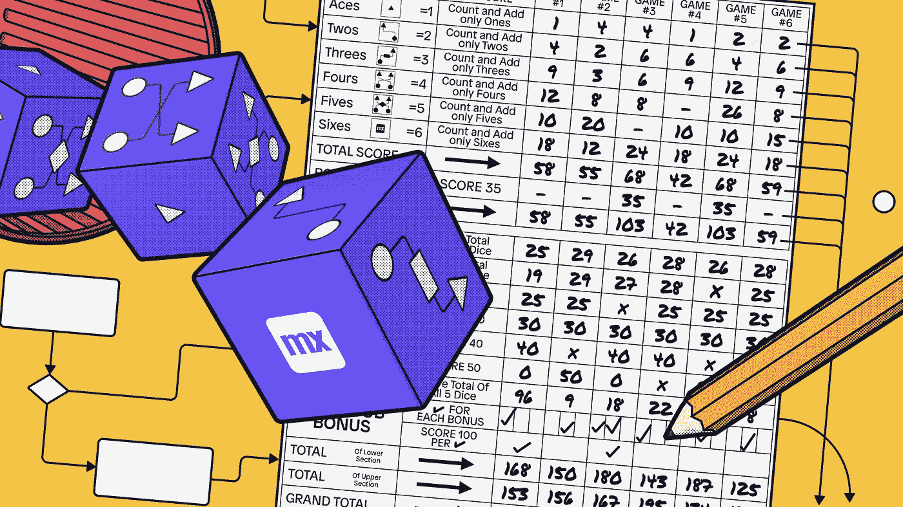
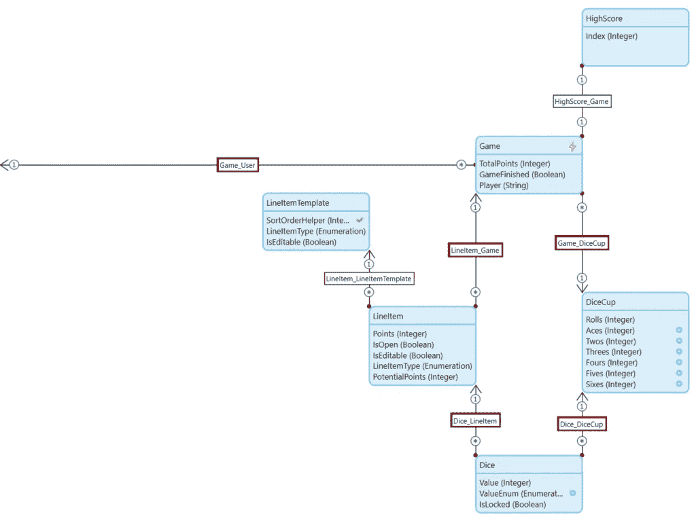
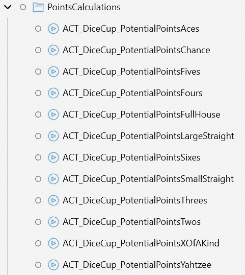
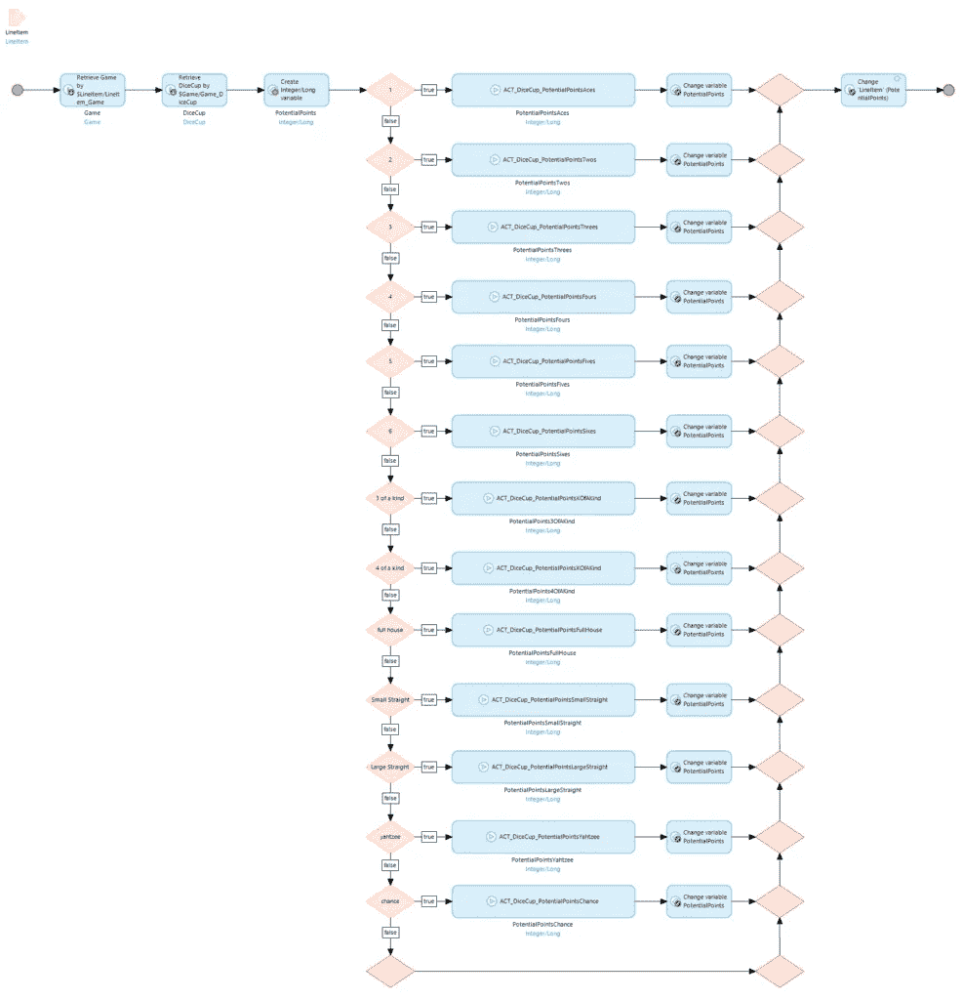
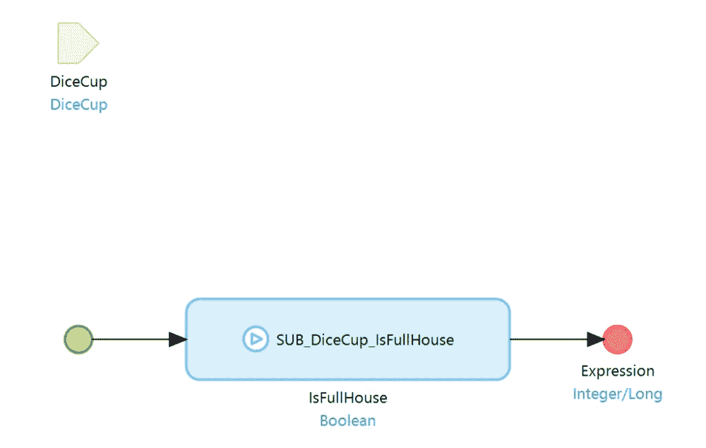

# 想玩游戏吗？——门迪克斯和我

> 原文：<https://medium.com/mendix/want-to-play-a-game-mendix-and-me-4dda62c08931?source=collection_archive---------5----------------------->



# 这篇文章比其他文章更有趣。这不是关于大性能或最佳实践的问题。可能实际上更多的是在午休时间消磨时间。


一天，我坐在办公桌前，寻找打发时间的方法。我的桌子上有一个骰盅。我认为骰子是一个伟大的东西；它们是随机性的象征，因此遵循严格的数学规则。这启发了我在一个 Mendix 应用程序中实现一个最流行的骰子游戏。当然，我说的是 Yahtzee(或者德国人说的" *Kniffel"* )。如果你不知道它，你可以在这里阅读[和如何玩它。](https://en.wikipedia.org/wiki/Yahtzee)

由于这是一个 Mendix 博客，我不能不跳过技术细节。所以这里有一个引擎盖下的小看看。当然，如果你想测试你的技能，你可以跳过这一部分直接进入游戏！

 [## 门迪克斯

### 门迪克斯的叶赫切！

my100108-sandbox.mxapps.io](https://my100108-sandbox.mxapps.io) 

## 领域模型



是的，当然，我本可以让整个事情变得更简单，但那样就没什么意思了，不是吗？

**游戏**是中央实体。它代表一个单一的游戏。每个游戏实体持有几样东西。首先 Game 与 **DiceCup** 关联，必要时也与**骰子**关联。此外，您需要 **LineItems，**哪些表示 Yahtzee 块上的条目。在每个游戏中，根据存储在 **LineItemTemplates** 中的配置创建物品。如你所见，骰子与产品有关联。为了更好地跟踪游戏，当输入分数时，骰子被附加到行项目，并且骰盅被重新装载“新鲜的”骰子。最后是 **HighScore 实体**。这种商品最多有 10 件。一个经典的街机高分。

我知道你在想什么，“一个对象上有这么多计算属性？这不是个坏主意吗？”。

当然是啦！在这种情况下，为了简单起见，我还是决定这样做。尤其是因为每个游戏中总是只有一个骰子。因此要计算的属性数量仍然很少。你敢在家里做那件事！


Good guy developer meme

## 计算点数

在每一次掷骰子后，系统计算所有开放的行项目的点数，如果玩家决定该行项目，则该点数将被记录。对于每种类型的行项目，都有一个单独的计算微流。



LineItem 类型用在中央微流中，以决定将执行这些计算微流中的哪一个。



计算本身很简单，并且基于骰子的频率，这可以在 DiceCup 的计算属性中找到。作为一个例子，我想展示一下满堂彩的计算。完整的房屋微流看起来像这样:



端点中的表达式返回掷骰子在满堂红行中将达到的点数。它基于 **IsFullHouse** 布尔值。

```
if   $IsFullHouse
then 25
else 0
```

IsFullHouse 布尔值由以下表达式确定。

```
(
  $DiceCup/Aces = 2
  or
  $DiceCup/Twos = 2
  or
  $DiceCup/Threes = 2
  or
  $DiceCup/Fours = 2
  or
  $DiceCup/Fives = 2
  or
  $DiceCup/Sixes = 2
)
and
(
  $DiceCup/Aces = 3
  or
  $DiceCup/Twos = 3
  or
  $DiceCup/Threes = 3
  or
  $DiceCup/Fours = 3
  or
  $DiceCup/Fives = 3
  or
  $DiceCup/Sixes = 3
)
```

一旦玩家输入他的点数，将要达到的可能点数被记录为点数，锁定行项目，骰子与之相关联，DiceCup 被填充新的骰子，并且 DiceCup 的计数器被设置为 0。

## 游戏结束

当所有行项目都填满时，游戏结束。系统检查玩家是否已经达到高分。在这种情况下，游戏被保存，所有玩家都可以欣赏他的分数。

在所有情况下，玩家现在都可以选择再试一次。

## 打破最高分

现在就看你能否进入前 10 名了！你不需要用户账号，甚至不需要插入硬币。只要点击这个链接，让我们看看你有多好。玩得开心！

 [## 门迪克斯

### 门迪克斯的叶赫切！

my100108-sandbox.mxapps.io](https://my100108-sandbox.mxapps.io) 

## 阅读更多

 [## 门迪克斯论坛

### 在 Mendix 论坛上，您可以与像您一样的创客交流，获得问题的答案并发表想法…

forum.mendix.com](https://forum.mendix.com/link/questions/85957)  [## 开发 Mendix 应用程序的游戏化、娱乐化和协作化

### 这个博客是关于“在 Mendix 中通过合作游戏设计寻找宝藏”的视频..可以看视频…

www.clevr.com](https://www.clevr.com/blog/gamification-fun-and-collaboration-in-developing-mendix-applications) 

*原文于 2022 年 1 月 20 日* [*以德语发表 https://mendixamme . de*](https://mendixandme.de/index.php/2022/01/20/willst-du-ein-spiel-spielen/)*。*

*来自发布者-*

*如果你喜欢这篇文章，你可以在我们的* [*中页*](https://medium.com/mendix) *找到更多喜欢的。对于精彩的视频和直播会话，您可以前往*[*MxLive*](https://www.mendix.com/live/)*或我们的社区*[*Youtube PAG*](https://www.youtube.com/c/MendixCommunity/community)*e .*

*对于希望入门的创客，您可以注册一个* [*免费账户*](https://signup.mendix.com/link/signup/?source=direct) *，并通过我们的* [*学院*](https://academy.mendix.com/link/home) *获得即时学习。*

*有兴趣加入我们的社区吗？加入我们的* [*松弛社区频道*](https://join.slack.com/t/mendixcommunity/shared_invite/zt-hwhwkcxu-~59ywyjqHlUHXmrw5heqpQ) *。*