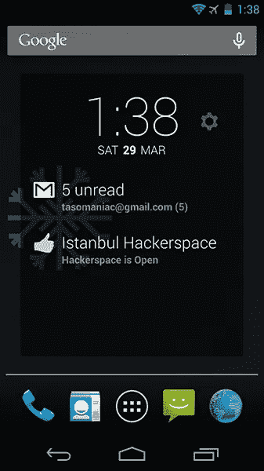
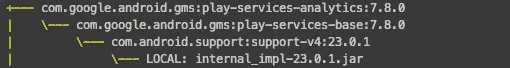
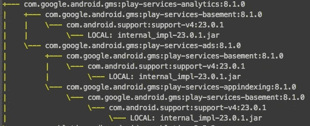
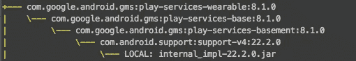
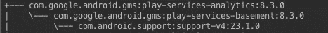

# 警告！对于谷歌分析用户

> 原文：<https://medium.com/google-developer-experts/warning-for-google-analytics-users-44b0096084e2?source=collection_archive---------2----------------------->



我有一个非常小的开源应用，叫做 [**HackDash**](https://github.com/tasomaniac/spaceapi_dashclock) 。它只是在 [DashClock](https://play.google.com/store/apps/details?id=net.nurik.roman.dashclock&hl=en) 中显示全球各[黑客空间](http://hackerspaces.org/)的开启/关闭状态。

实现真的很简单。它只是使用 [SpaceAPI](http://spaceapi.net/) 来获取所有黑客空间的目录，并使用它们的内部 API 来显示这些黑客空间的状态。

除了支持库和各种助手库，我只使用 Google Play 服务中的*Play-Services-Analytics*来与 Google Analytics 集成。

今天我刚刚将 Play 服务从版本 *7.8.0* 升级到 *8.1.0* ，我意识到我的应用程序大小从 **1.7Mb** 增加到了 **1.9Mb** 。200Kb 只为了一个没有更新日志的库更新。是的。我使用*progguard*。

作为 Android 世界的好公民，我很注意我的应用程序的大小。你也应该这样做。为什么？这里有一篇很棒的文章详细解释了它的重要性:[让你的宠物节食](http://cyrilmottier.com/2014/08/26/putting-your-apks-on-diet/)

在这里我还写了一篇关于我在土耳其航空安卓 app [看到的问题的文章。他们最终将 APK 大小从 **20.5Mb** 降低到了~ **8Mb。**](http://blog.tasomaniac.com/baska-bir-acidan-ux-ve-thy-android-incelemesi/)

让我们回到问题上来调查一下。

我先跑

```
**./gradlew** androidDependencies
```

查看所有依赖项的详细信息和可传递依赖项。结果如下:



Transitive dependencies of GMS 7.8.0



Transitive dependencies of GMS 8.1.0

哇哦。发生什么事了？我们现在有谷歌广告和应用程序索引作为分析的一部分。我们有*游戏服务基地*而不是*游戏服务基地。*

> *地下室*到底是什么？

当我第一次在[这篇文章](https://plus.google.com/+SebastianKaspari/posts/9LUZVJMnXeB)中看到这个*地下室*时，我认为他们只为分析和广告做了另一个轻量级依赖，我希望它能减少我的 APK 的大小。

当我看到下面的内容时，这正是我所期望的。*地下室*在*底座*下面，所以应该小一些吧？



basement is also a dependency of base.

即使它可能更小，有广告包的分析破坏了好处。

# 解决办法

我对这个问题的快速解决方案是使用下面的方法来删除 Ads 依赖:

```
**compile** "com.google.android.gms:play-services-analytics:8.1.0") {
    **exclude module:** 'play-services-ads'
}
```

如果你正在使用*progguard*，它会警告你移除。 *ProGuard* 错误实际上表明分析中的标签管理器 API 使用了一些与来自 Ads 包的广告 id 相关的方法。如果您没有使用 Tag Manager，将其排除是安全的。

将此添加到您的*progguard*配置中以忽略警告。

```
**-dontwarn** com.google.android.gms.ads.**
```

瞧啊。我们的 APK 大小现在回到了 1.7Mb

真正的解决方案(我认为)是谷歌应该发布另一个名为*Play-Services-tag-manager*的 Play Services 依赖项，这将使我们的生活变得更加轻松。

# 结论

如果您有一个仅使用 Google Play 服务中的 Google Analytics 的小应用程序，当您将依赖性升级到 *8.1.0 时，您的 APK 将立即变大。*

做我上面做的，从你的 APK 中排除不必要的谷歌广告包。

**更新:**谷歌刚刚宣布这是一个错误，他们将在下一个版本中修复它。[https://plus.google.com/+GoogleDevelopers/posts/HsSNWEQ6H4e](https://t.co/rLPKoP7JMI)

**更新二:** Google Play Services 8.3 本周发布。这是一个真正快速的释放。现在依赖项看起来如下。它现在只对*基底*有依赖性。现在比以往任何时候都好！你的应用程序大小和索引大小现在应该更小了。



Dependencies of Analytics SDK in GMS 8.3

关注我的[@塔斯曼尼亚克](https://twitter.com/tasomaniac)和 [+SaidTahsinDane](https://plus.google.com/+SaidTahsinDane/posts)