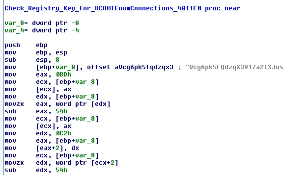
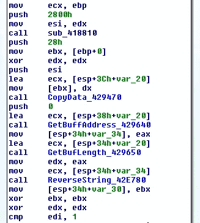
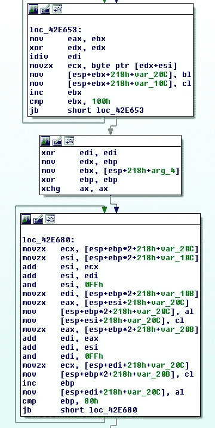

# WastedLoader 还是 DridexLoader？

> 原文：<https://medium.com/walmartglobaltech/wastedloader-or-dridexloader-4f47c9b3ae77?source=collection_archive---------9----------------------->

作者:杰森·里维斯和约书亚·普拉特


最近，BitDefender 写了一份非常详细的关于加载器的报告，该加载器与通过 RIG exploit kit 提供的 WastedLocker 有相似之处[1]。在我研究 Dridex 链的时候，由于 WastedLocker 与 Dridex[2]有代码相似性，并且被 EvilCorp[2，3，4，5，6]利用，我快速浏览了一下报告中的散列。

在报告的散列中，只有一个似乎是公开可用的，6ee 2138d 5467 da 398 e 02 AFE 2 baea 9 FBE。在 BitDefender 的报告中，他们提到了与 WastedLocker 在他们标记为“layer1”的地方重叠，这实际上是加密程序层，这意味着如果加密程序是一个组的私有程序，那么重叠将出现在与该组相关的已知恶意软件中。



Crypter Registry Check

拆开恶意软件后，我们只剩下一个符合 BitDefender 报告的样本，但一些特征也符合与该组相关的其他恶意软件家族，例如喜欢使用 40 字节的反向密钥隐藏 RC4 加密字符串，Dridex 和 DoppelPaymer 也使用该密钥。



Copy key and reverse it



RC4

在开始解码一些字符串后，我开始注意到它看起来越来越像一个 Dridex Loader。下面是解码字符串的一小段:

```
Starting path:
ShellFolder
v0vajEOvEWKQf2dajlupVdyIEZlAQX1T7H994Q;HJPM4qNHuqGU3XeDOkMccS1IZyjev70FCelRDHTXLJszFZqshgVlsiV27SrJbCO3LMap
<autoElevate>true
true
false
<Task ae kg" href="http://schemas.microsoft.com/windows/2004/02/mit/task" rel="noopener ugc nofollow" target="_blank">http://schemas.microsoft.com/windows/2004/02/mit/task" version="1.3"><RegistrationInfo>
</RegistrationInfo><Triggers><LogonTrigger><Enabled>true</Enabled><UserId>
ROOT\CIMV2
SELECT * FROM Win32_Fan
*.dll
*.exe
Program Manager
Progman
AdvApi32~PsApi~shlwapi~shell32~WinInet
/run /tn "%ws"
"%ws" /grant:r "%ws":F
\NTUSER.DAT
winsxs
x86_*
amd64_*
*.exe
\Sessions\%d\BaseNamedObjects\
SOFTWARE/TrendMicro/Vizor\VizorUniclientLibrary.dllProductPath
```

所以我决定检查一下 CAPE sandbox yara 规则是否可能匹配这个作为 Dridex Loader 的未打包样本[7]，我使用了 CAPE 解码器中的规则，它命中了未打包样本。随着解码器即将解码出 Dridex 加载器配置，我相信可以肯定地说这是 Dridex 加载器，让人们猜测其他两个样本是否也是 Dridex 加载器？

```
{'C2': ['51.68.224.245:4646', '188.165.17.91:8443', '173.255.246.77:691'], 'RC4_Key': 'v0vajEOvEWKQf2dajlupVdyIEZlAQX1T7H994Q', 'BOTNET': '10111'}
```

# 参考

1:[https://www . bit defender . com/files/News/case studies/study/397/bit defender-PR-white-RIG-creat 5362-en-en . pdf](https://www.bitdefender.com/files/News/CaseStudies/study/397/Bitdefender-PR-Whitepaper-RIG-creat5362-en-EN.pdf)

2:[https://blog . fox-it . com/2020/06/23/wasted locker-a-new-ransomware-variant-developed-by-the-evil-corp-group/](https://blog.fox-it.com/2020/06/23/wastedlocker-a-new-ransomware-variant-developed-by-the-evil-corp-group/)

3:[https://www . wired . com/story/provided-Russian-hacker-evil-corp-provided/](https://www.wired.com/story/alleged-russian-hacker-evil-corp-indicted/)

4:[https://home.treasury.gov/news/press-releases/sm845](https://home.treasury.gov/news/press-releases/sm845)

5:[https://www . belling cat . com/news/uk-and-Europe/2020/02/17/v-like-vympel-fsbs-secretary-department-v-behind-assessment-of-zelimkhan-khangoshvili/](https://www.bellingcat.com/news/uk-and-europe/2020/02/17/v-like-vympel-fsbs-secretive-department-v-behind-assassination-of-zelimkhan-khangoshvili/)

6:[https://www . RF erl . org/a/in-living-wedding-photos-clues-to-a-an-problem-Russian-cyber thief-FSB-family-ties/30320440 . html](https://www.rferl.org/a/in-lavish-wedding-photos-clues-to-an-alleged-russian-cyberthief-fsb-family-ties/30320440.html)

7:[https://github . com/kevoreilly/cape v2/blob/1 e66d 2460276 b 28 b 45 bea 8123 cc 74 DAA 83295 f 68/modules/processing/parsers/mwcp/dridexloader . py](https://github.com/kevoreilly/CAPEv2/blob/1e66d2460276b28b45bea8123cc74daa83295f68/modules/processing/parsers/mwcp/DridexLoader.py)