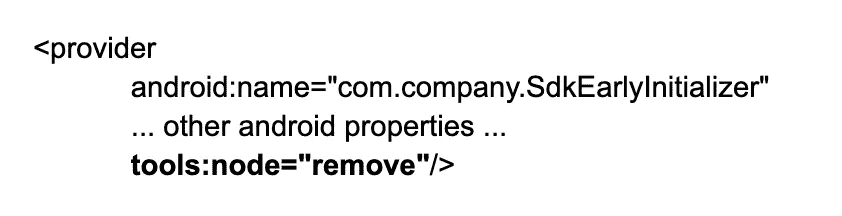

# 注意你的清单

> 原文：<https://medium.com/pinterest-engineering/watch-your-manifest-4be40f1dfc8e?source=collection_archive---------2----------------------->

王麟|安卓性能工程师

Designed by AJ Oxendine | Software Engineer

对于 Android 开发人员来说，众所周知，一个应用程序的[清单(AndroidManifest.xml)](https://developer.android.com/guide/topics/manifest/manifest-intro) 包含了至关重要的应用程序声明。它在建立后很少被监控，因为我们认为它几乎不会改变。然而，在 Pinterest，我们在意识到清单确实经常变化后，一直在积极监控清单。

在构建一个应用程序时， [Gradle](https://gradle.org/) 下载所有的依赖库来编译并与应用程序链接。这些依赖库都有自己的迷你清单。在构建过程中， [Android Gradle 插件](https://developer.android.com/studio/releases/gradle-plugin#updating-plugin) (AGP)将它们与应用程序的主清单合并，形成最终清单。由于这种合并过程，最终的清单通常看起来与原始清单非常不同，并且包含额外的声明。在大多数情况下，这些额外的声明对于依赖库的运行是必要的。然而，有时他们会有意想不到的行为。

它首次引起我们的注意是在一次冷启动回归调查中。我们发现一个第三方软件开发工具包(SDK)在其清单中声明了一个特殊的 [ContentProvider](https://developer.android.com/reference/android/content/ContentProvider) 来尽早预热自己。这是因为内容提供者在应用程序启动时很早就被初始化了，甚至在应用程序的 onCreate()方法被调用之前。然而，我们希望控制每个第三方库的初始化，只在必要时才初始化它们。因此，我们添加了以下声明:

将此声明添加到清单将导致 SdkEarlyInitializer 从最终合并的清单中移除。这一变化使冷启动时间缩短了 130 毫秒。

从那时起，我们创建了以下流程，以便在提交之前定期监控合并清单的更改，首先是获取当前合并清单的快照，并将其保存在代码库中:

1.  作为 PR 构建的一部分，我们将合并的清单与快照进行比较。
2.  如果检测到差异，我们将使构建失败。
3.  如果有必要进行更改，PR 开发人员必须调整快照清单，或者添加适当的“remove”标记，以将新组件排除在最终清单之外。

一小组审查人员将审查每一个明显的变化。

# 有用的案例

*   发现了由工作管理器库添加的[workmanagerinializer](https://cs.android.com/androidx/platform/frameworks/support/+/androidx-main:work/work-runtime/src/main/java/androidx/work/WorkManagerInitializer.java?q=WorkManagerInitializer)(content provider)。我们首先删除了它，并通知了 Google，Google 最终添加了对使用[自定义配置](https://developer.android.com/topic/libraries/architecture/workmanager/advanced/custom-configuration)初始化工作管理器的支持。
*   发现一个新的意图是通过升级 exoplayer 库到 2.15.0。然后，我们参与了与谷歌正在进行的[问题讨论](https://android-review.googlesource.com/c/platform/frameworks/support/+/1411627)，最终删除了这个不必要的意图。
*   检测到库添加了 [AD_ID](https://developers.google.com/android/reference/com/google/android/gms/ads/identifier/AdvertisingIdClient.Info) 权限。

# 经验教训

*   常规的 cshell diff 足以比较清单
*   [AGP](https://developer.android.com/studio/releases/gradle-plugin#updating-plugin) 有时会在不改变内容的情况下对清单中的项目进行重新排序，在这种情况下，需要调整快照
*   忽略空白和换行符是必要的
*   需要显式忽略清单中频繁更改的项目(例如 UUIDs、版本代码)

# 结论

通过这种方法，当任何新组件添加到我们的应用程序中时，我们都会收到警报，并且每当我们添加新的依赖项时，我们都会感到更加自信。

# 承认

安卓性能团队:阿伦 K、埃内斯托杜哈特、王麟、刘胜、汤姆哈曼

特别感谢:沙沙初(She 她)

*要在 Pinterest 了解更多工程知识，请查看我们的* [*工程博客*](https://medium.com/pinterest-engineering) *，并访问我们的*[*Pinterest Labs*](https://www.pinterestlabs.com?utm_source=medium&utm_medium=blog-article-link&utm_campaign=wang-oct-18-2022)*网站。要探索 Pinterest 的生活，请访问我们的* [*职业*](https://www.pinterestcareers.com?utm_source=medium&utm_medium=blog-article-link&utm_campaign=wang-oct-18-2022) *页面。*