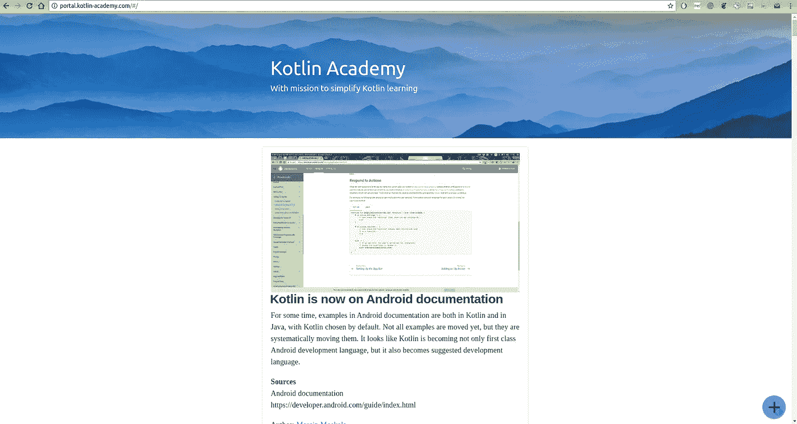
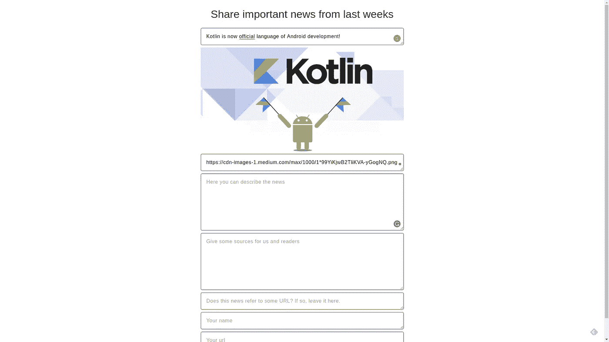

# 我们自豪地介绍卡帕头。学院门户

> 原文：<https://blog.kotlin-academy.com/we-proudly-present-kotlin-academy-portal-7d0194be8764?source=collection_archive---------3----------------------->

卡帕头。Academy 发展迅速，拥有越来越多不同的作者、评论者和社区成员。虽然我们喜欢写好文章，但我们也考虑如何满足科特林社区的其他需求。因此，我们发现了一些重要的问题，并决定帮助解决这些问题:

*   与科特林的新闻保持联系并不容易——你可以在 Twitter 上观察，但这很耗时，而且充满噪音。此外，博客大多描述新的想法和一些问题的解决方案，而不是提供关于技术状态的新闻。我们更喜欢的是关于科特林的一些重要新闻。
*   我们喜欢挑战，我们希望感觉我们在编程中发展——这种需求可以通过一些困惑者或具有编程挑战的门户来满足。虽然字谜游戏通常被收集在一些 Github repos 中，但在乘坐地铁或等待五分钟时，我们不会搜索它们。类似地，编程挑战入口更像是一场大型游戏，而不是一次旅程中填满 5 分钟的捷径。我们更喜欢一个小应用程序，让新的难题一次一次。

从 Kt 开始。Academy 已经有了作为多平台 Kotlin 应用示例的门户网站[，我们发现这两个功能可以很容易地添加到那里！这就是为什么今天我们自豪地宣布卡帕头？学院现在支持来自科特林的新闻和谜题。以下是一个链接:](/architecture-for-multiplatform-development-in-kotlin-cc770f4abdfd)

 [## 卡帕头。学院

### 以简化 Kotlin 学习为使命的站点

portal.kotlin-academy.com](http://portal.kotlin-academy.com/) 

看起来怎么样:

News on [Kt. Academy portal](http://portal.kotlin-academy.com/)

Puzzler on [Kt. Academy portal](http://portal.kotlin-academy.com/)

Puzzler with shown answer on [Kt. Academy portal](http://portal.kotlin-academy.com/)

# 提议

每个人都有所贡献。这就是为什么我们决定允许每个人提出信息或难题(以及[提交文章](/write-for-kotlin-academy-abebd70937ce))。程序非常简单。你只需要在右下角使用 FAB:

然后，您将能够使用该表单提交您的新闻或难题。一旦提交，它等待我们的认可。别担心，我们会在不到 24h 内确认并发布或拒绝；)

# 开源

是的，这个项目是开源的[你可以在 Github](https://github.com/MarcinMoskala/KotlinAcademyApp) 上找到它。如果你想找点事做，就去看看我们的华夫饼吧。

# 提示如何使用它

1.  如果你的项目编译成功，并且你有 5 分钟时间想用来娱乐，而不是政治或有趣的图片，考虑一下 Kt 上的新闻和谜题。学院门户。你会有更少的压力，很可能你会学到一些重要的东西；)
2.  当你在等什么的时候，比如你坐公交车的时候，与其浪费时间，不如考虑在 Kt 上挑战自己。学院门户。检查你是否能解决最新的难题，或者你是否知道来自科特林世界的重要消息。
3.  另外，登录时事通讯,这样你就可以在自己的时间查看新闻，并且确保不会错过任何内容。
4.  成为作者！如果你有一个关于 puzzler 的想法，或者你听说了一些在 Kt 上没有描述过的重要事情。学院门户网站，建议并成为一名作者。每个作者都可以签上自己的名字，并留下自己网站的链接(Twitter、Github 或任何你想给别人看的东西)。