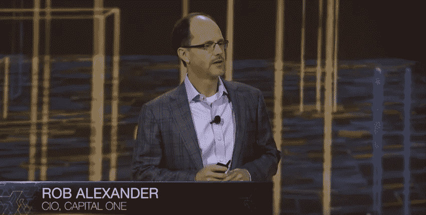

# 我们是一家颠覆性的银行

> 原文：<https://medium.com/capital-one-tech/we-re-a-disruptive-bank-a21f7cce25b6?source=collection_archive---------3----------------------->

## 我们的首席信息官 Rob Alexander 的几句话

大多数人都知道 Capital One 是一家信用卡公司，我们是美国最大的信用卡公司之一，拥有超过 6500 万个账户。有些人还知道我们是美国最大的银行之一，按资产计算在美国排名第七。

然而，很少有人意识到，支撑我们信用卡和银行服务的是一家科技公司。我们的产品是无形的:软件和数据。我们的客户绝大多数通过数字渠道申请我们的产品，并通过这些渠道获得服务。数字正在真正改变我们与金钱互动的方式，尤其引人注目的是移动设备已经成为我们客户首选的互动渠道。事实上，我们的客户现在使用我们的移动应用的频率是我们的网络应用的两倍。

# 我们是一家创新的技术公司

由于我们的业务实际上是构建数字体验，我们必须擅长构建软件和利用数据，才能成为数字银行的领导者。在 Capital One，仅拥有比其他银行稍好的 it 部门是不够的。我们必须成为一家伟大的科技公司。这意味着我们要以最好的技术组织为榜样，包括:

*   大规模投资顶尖工程人才；
*   协作构建软件，利用开源软件并回馈社区；
*   使用敏捷方法交付软件，实施 DevOps 以加速我们的软件交付过程；
*   在 REST API 微服务架构上开发软件，以及
*   利用大数据和快速数据技术实现实时决策。

# 为什么我们会被云吸引

在过去几年中，云已经成为我们技术战略的核心。像许多大企业一样，我们开始在实验室和开发团队中以更具实验性的方式(草根和开发者驱动)使用云。我们很快意识到，我们可以更广泛地利用云进行开发和测试，并开始在其上运行更关键的生产工作负载。

我们认为云改变了游戏规则，因为它允许我们投资于为客户构建优秀的应用程序，而不是构建基础设施。云技术的广度和深度为我们提供了重要的优势，即:

*   **速度** —动态配置的能力对我们的生产效率和上市速度有巨大的帮助。
*   **弹性** —随着需求的大幅波动(如黑色星期五和网络星期一)，动态扩张的能力至关重要。
*   **安全性** —因为我们所处的行业吸引了各种各样的网络罪犯，所以安全性对我们来说至关重要，我们现在可以在更精细的层面上管理数据安全性。
*   **可用性** —我们致力于高可用性，云技术能够提供多层弹性。
*   **工具/产品** —创新的步伐对我们有很大的吸引力，尤其是为大型企业开发服务。
*   **人才** —我们前瞻性的云技术方法帮助我们吸引了优秀的人才，我们有数千个职位需要云工程师来填补。

Capital One CIO Rob Alexander speaks at AWS re:Invent 2015

# 有兴趣了解更多信息吗？

Capital One 已经大步迈向成为顶级软件技术公司；利用云技术只是其中之一。随着行业转型，我们也在通过增加内部工程团队和减少对第三方构建的许可软件的依赖来转变我们的技术组织。我们的工程师使用现代技术和数据解决方案，如开源、云、大数据、API 等，创建推动银行业未来发展的解决方案。[此处](https://youtu.be/D5-ifl7KJ00?t=1089)。

> 如果您对与一些最好的技术领导者一起解决挑战感兴趣，请查看我们目前提供的一些[激动人心的职位](https://www.linkedin.com/company/capital-one/careers)。

*欲了解更多关于 Capital One 的 API、开源、社区活动和开发人员文化的信息，请访问我们的一站式开发人员门户网站 DevExchange。*[*https://developer.capitalone.com/*](https://developer.capitalone.com/)