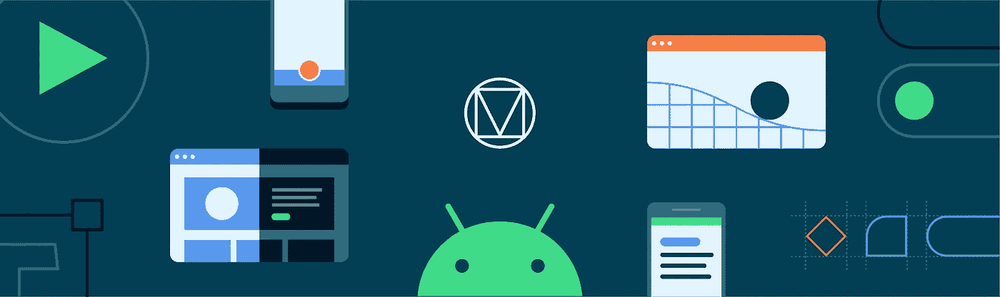
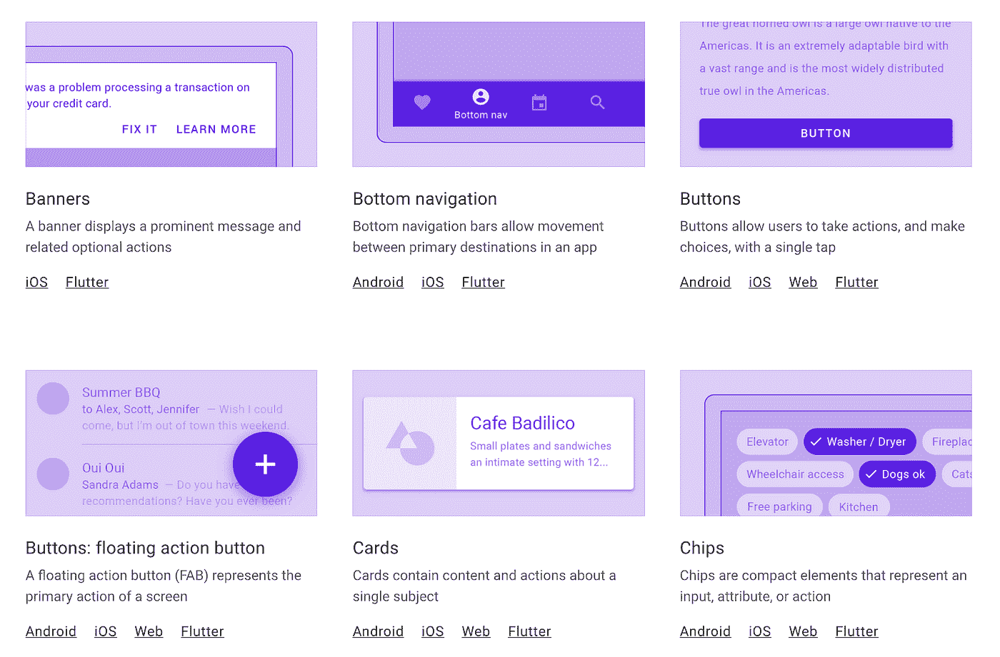
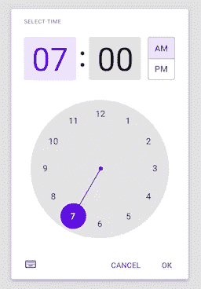
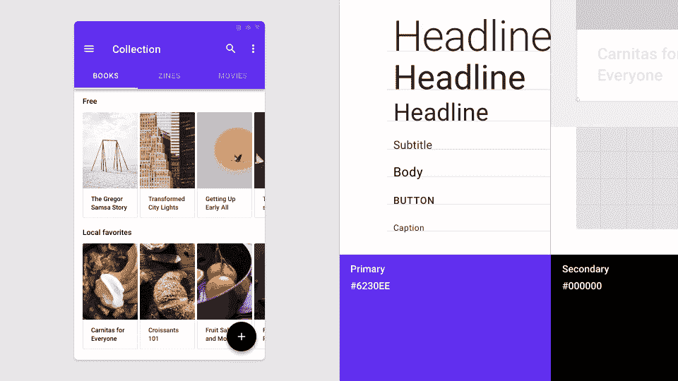
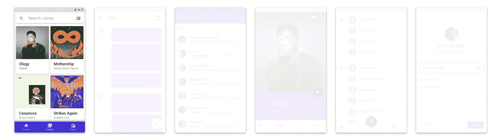

# 我们推荐材料设计组件

> 原文：<https://medium.com/androiddevelopers/we-recommend-material-design-components-81e6d165c2dd?source=collection_archive---------2----------------------->

## 原因如下

您的应用程序与安装在用户手机上的其他应用程序共存。因此，我们**建议**应用程序遵循[材料设计指南](https://material.io/design/introduction)以确保应用程序运行一致，在一个应用程序中学习的模式可以用于另一个应用程序。

> Android 用户希望你的应用程序的外观和行为与平台保持一致。你应该遵循视觉和导航模式的材料设计指南……——[d.android.com/design](https://developer.android.com/design)

为了**实现**这一点，使用[材料设计组件](https://github.com/material-components/material-components-android) (MDC)库。这篇博客文章概述了使用 MDC 的许多好处，解释了为什么它是我们推荐的解决方案。

# 小工具

MDC 提供了标准小部件的样式版本，使得实现材质样式变得容易。例如，Material 提供了`[Buttons](https://material.io/develop/android/components/buttons)`、`[Toolbars](https://material.io/develop/android/components/app-bars-top)`、`[CheckBox](https://material.io/develop/android/components/checkboxes)`等风格的版本。如果你使用一个`MaterialComponents`主题，那么当你膨胀一个布局(通过 MDC 的[视图膨胀器](https://developer.android.com/reference/com/google/android/material/theme/MaterialComponentsViewInflater))时，材质部件将被实例化，而不是股票组件，所以不用对你的布局进行大的更新就可以很容易地实现材质样式:

所有材料部件都扩展了它们相关的`AppCompat`对应部件，因此它们受益于相同的后端口功能或错误修复。

Material widgets 在平台或`AppCompat`对应物上提供了额外的样式和功能，例如`[MaterialButton](https://material.io/develop/android/components/buttons)`提供了许多不同的显示样式:

我最喜欢的一个新增功能是用`[MaterialTextView](https://material.io/develop/android/components/material-text-view)`代替`TextView` s，其中[增加了](/androiddevelopers/whats-your-text-s-appearance-f3a1729192d)对在`TextAppearance` s 中指定行高的支持。

除了添加到现有的小部件之外，MDC 还提供了许多平台或`AppCompat`中没有的新部件。你可能见过[底部导航](https://material.io/develop/android/components/bottom-navigation-view/)、[底部表单](https://material.io/develop/android/components/bottom-sheet-behavior/)和[浮动动作按钮](https://material.io/develop/android/components/floating-action-button/)但可能没见过[芯片](https://material.io/develop/android/components/chip/)、[日期拾取器](https://material.io/develop/android/components/picker)或[时间拾取器](https://github.com/material-components/material-components-android/blob/master/docs/components/TimePicker.md)。

有关该库提供的组件的完整列表，请参见组件部分[此处](https://material.io/components)。

# 材料主题化

[材料主题化](https://material.io/design/material-theming/)是一种系统化的方式来**定制**材料设计以反映你产品的品牌。一个素材主题包括[颜色](https://material.io/design/color/)、[版式](https://material.io/design/typography/)和[形状](https://material.io/design/shape/)属性。自定义这些将自动反映在您用于构建应用程序的组件中。

你可以把材质主题化看作是一个创建设计系统的设计系统🤯。您配置颜色、类型和形状输入，并为您的品牌获得一个完整的设计系统。

[Nick Rout](https://medium.com/u/37290b859aca?source=post_page-----81e6d165c2dd--------------------------------) 在以下文章中深入探讨了这三个子系统:

 [## 使用 MDC 的材质主题:颜色

### 使用 MDC 库的 Android 颜色主题

medium.com](/androiddevelopers/material-theming-with-mdc-color-860dbba8ce2f)  [## 使用 MDC 的材质主题:类型

### 使用 MDC 库在 Android 上输入主题

medium.com](/androiddevelopers/material-theming-with-mdc-type-8c2013430247)  [## 使用 MDC 的材质主题:形状

### 使用 MDC 库在 Android 上设计主题

medium.com](/androiddevelopers/material-theming-with-mdc-shape-126c4e5cd7b4) 

# 黑暗主题

MDC 小部件实现了 Material 的[深色主题指导](https://material.io/design/color/dark-theme.html)，许多小部件使它们的颜色适应深色主题，并提供高程叠加，以便在阴影不可见时传达高程。

[Chris Banes](https://medium.com/u/9303277cb6db?source=post_page-----81e6d165c2dd--------------------------------) 在本文中深入探讨了 MDC 的黑暗主题支持:

 [## MDC 的黑暗主题

### 使用材料设计组件实现黑暗主题

medium.com](/androiddevelopers/dark-theme-with-mdc-4c6fc357d956) 

# 物质运动🆕

材质设计为屏幕过渡提供[指导](https://material.io/design/motion/the-motion-system.html)。MDC now *比单独的指南更好地实现了*这些模式，作为准备放入您的应用程序的过渡。

[Hunter Stich](https://medium.com/u/ad867d5f3515?source=post_page-----81e6d165c2dd--------------------------------) 在本帖中向您介绍材料运动库:

 [## 使用 MDC 的材料运动

### 为 Android 构建带有材质运动的美丽过渡

medium.com](/androiddevelopers/material-motion-with-mdc-c1f09bb90bf9) 

# 冷静下来

[Jetpack Compose](https://developer.android.com/jetpack/compose) 是 Android 的下一代 UI 工具包，目前在 alpha 中。虽然它还不稳定，但它将提供材质组件和材质主题的实现。现在采用 MDC 将为以后采用 Jetpack Compose 准备代码库——它使用相同的概念、设计词汇和组件。甚至有可能使用像[MDC-Android Compose Theme Adapter](https://github.com/material-components/material-components-android-compose-theme-adapter)这样的库来简化您的迁移，该库将 MDC XML 主题转换成 Compose [MaterialTheme](https://developer.android.com/reference/kotlin/androidx/compose/material/package-summary#materialtheme) 。

# 材料推荐

希望你能明白为什么我们**推荐**用[材料设计组件](https://github.com/material-components/material-components-android)构建 Android UI。我们最近[更新了 Android Studio 中的`File > New Project`模板](https://developer.android.com/studio/preview/features#mdc-templates)，以使用 MDC 并为您设置一个材质主题，使您更容易上手。如果您尚未迁移到 MDC，请查看我们的迁移指南:

 [## 迁移到 Android 的材料组件

### 来自设计支持库👉MDC 1.0.0👉MDC 1.1.0 及更高版本

medium.com](/androiddevelopers/migrating-to-material-components-for-android-ec6757795351)