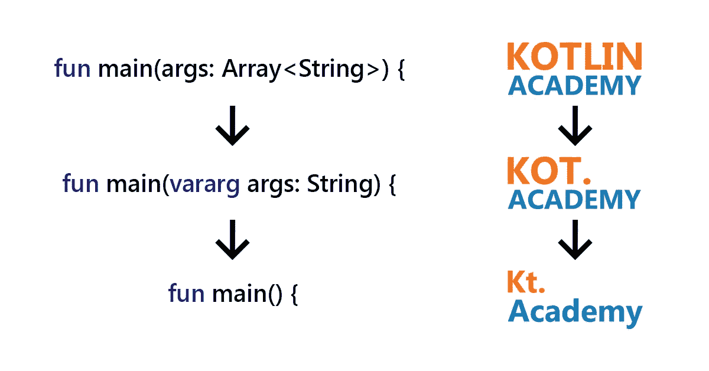

# 我们把名字简化成 Kt。学院

> 原文：<https://blog.kotlin-academy.com/we-simplified-our-name-to-kt-academy-eb1baf11a90b?source=collection_archive---------3----------------------->

你好 Kotliners，

我们有一些重大消息要告诉你——我们把我们的名字简化为 **Kt。学院。**我们在 medium 上的域名保持不变(【blog.kotlin-academy.com】T2)，但是我们把我们官方网站的域名改成了[T5【www . kt . academy](http://www.kt.academy/)。

我们就像科特林入口点一样进化；)

另一个消息是，在 17.12.18，我们将在华沙为 Android 开发者组织一次 Kotlin 研讨会。将由 Marcin moska a 用波兰语主持。

对于那些正在等待有效的科特林书的人，请查看我们关于该书现状的文章:

# [有效的 kot Lin——为什么这么久？](/effective-kotlin-why-so-long-a6e28413321c)

谢谢你和我们在一起，

卡帕头。学院团队