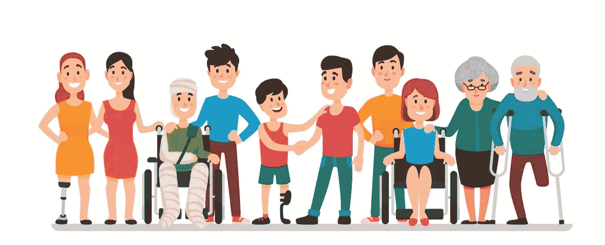
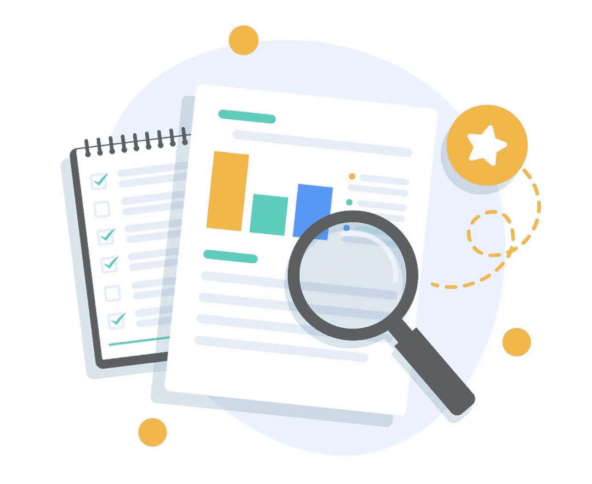
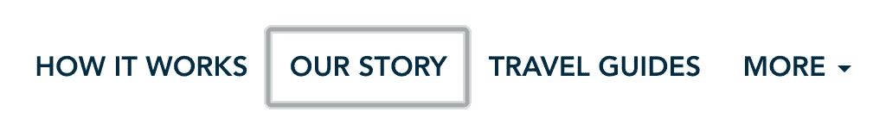
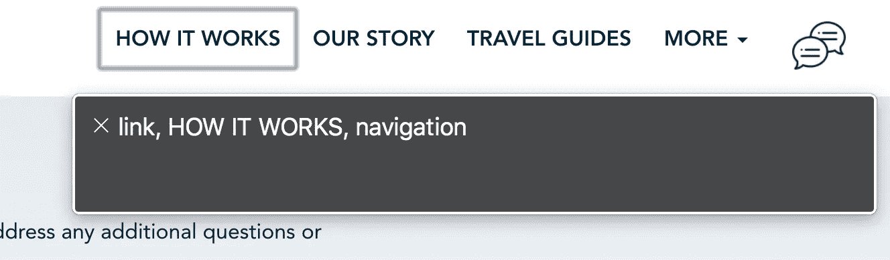
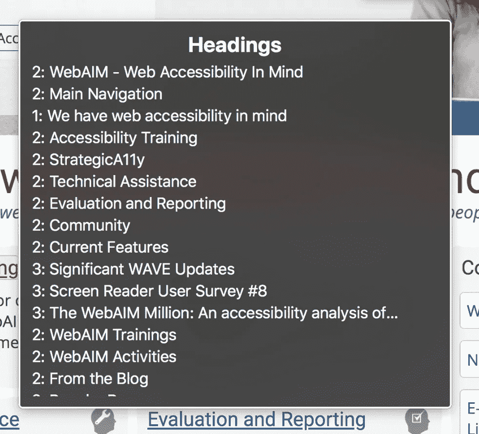
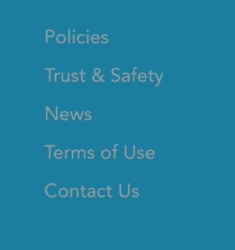
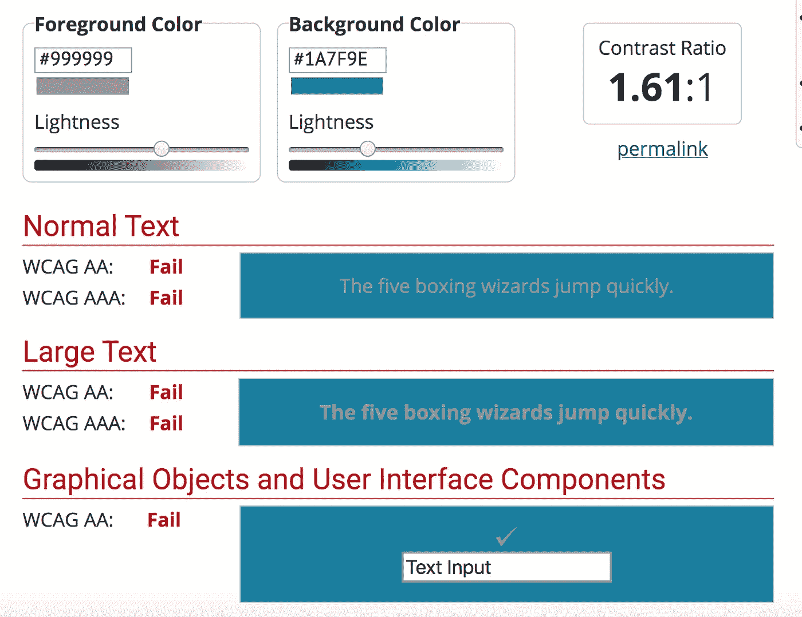

# 网页可及性审核——自己动手——5 个快速提示

> 原文：<https://medium.com/globant/web-accessibility-audit-do-it-yourself-5-quick-tips-204e2109b92f?source=collection_archive---------1----------------------->

Differently-abled people. Source: Internet

> 网络无障碍意味着有特殊困难的人可以使用网络。

从教育到就业，从政府到商业，从医疗保健到娱乐等等，智能设备已经成为生活中不可或缺的一部分。这些设备上的 web 应用程序应该具有可访问性和包容性，这一点至关重要。*包容而言* ***平等准入*******平等*** ***机遇*** *给人以* ***特殊挑战*** *。**

*作为一名开发人员，我们将如何确保我们照顾到包容性？答案很简单——通过可访问性审计。*

# *什么是可访问性审计？为什么需要它？*

**

*source: vectorStock*

*辅助功能审核是一个评估过程，旨在评估您的数字产品在多大程度上满足有特殊需求(如听力或视力障碍)的人的独特需求。在审核过程中，每个模块都经过专家的检查和测试，因此您可以确信，报告已经确定了在可访问性方面需要改进的所有领域。*

*审计是为了提高你的数字产品对所有人的用户友好性。这无疑会增加你的客户满意度，并导致销售增加。*

*作为一个易访问性爱好者，我一直在为我的组织中的许多产品做审计过程。在这里，我给你 5 个快速审计检查的技巧。*

# ***提示 1***

> *所有可点击的项目都应该通过键盘导航来访问。*

***为什么**:让人们只用键盘就能浏览你的网络应用程序是提高可访问性的好方法。许多有运动障碍的用户依赖键盘。视障用户也是如此。他们通常使用键盘进行导航。有些人没有精细的运动控制。很少有人要么有先天性手异常，要么可能遭受了一些外伤，导致他们的手变形。*

***如何做**:我们可以通过对聚焦元素进行特殊处理来解决这个问题。你们中有多少人做了 **outline: 0** 来移除锚标签周围的蓝色边框？我们很多人。对吗？如果我们不想要蓝色边框，我们可以根据你的网页的主题来定制，就像下面的截图一样，但是永远不要删除这个轮廓属性。*

**

*custom coloured outlined border*

*通过键盘导航可获得的最佳网站是[https://webaim.org/](https://webaim.org/)*

# ***提示 2***

> *网页应该是屏幕阅读器友好的。*

***原因:**试图通过键盘访问我们网站的人通常会使用屏幕阅读器来更好地了解我们的产品。视障人士。*

***如何做:**至少熟悉一种屏幕阅读器，(windows 爱好者可以试试 JAWS，mac 爱好者可以试试 voiceover)*

**

*How Voiceover reads the navigation link*

*当我们将焦点从一个元素转移到另一个元素时，屏幕阅读器会阅读这些动作。这对视障人士非常有用。*

# ***提示三***

> *网页应该包含经过验证的语义标记*

***原因:**这也是为了那些试图在屏幕阅读器的帮助下阅读我们的网络应用的人。如果网页太长而无法阅读，而有特殊挑战的客户想要直接跳转到特定链接或标题，那么他应该能够在画外音的“ ***转子窗口*** ”的帮助下完成。*

***如何:**我们可以使用[**标记验证服务**](https://validator.w3.org/) **来验证标记。**如果我们使用了语义标记，那么“转子窗口”会向用户显示所有选项来导航到网页的特定部分。“转子”是 VoiceOver 中的一个菜单窗口，由标题、链接、图像等元素列表组成。*

*好吧，好吧，但是怎么打开这个？—答案很简单，在 mac 上打开画外音，按 **(control + Option + U)，**就会看到一个类似下图截图的窗口，左右箭头我们可以在转子菜单之间切换。*

**

*Using Rotor window, one can see all the headings in webpage.*

# ***提示 4***

> *向所有媒体内容添加可选文本。*

*原因:在大多数网站中，英雄区或横幅区是用来展示促销、优惠、折扣或其他一些重要通知的，用一些生动活泼的图片来吸引客户的注意力。然而，如果视障人士无法访问主横幅部分，那么这种促销活动有什么用呢？*

***怎么做:**有两种类型的图像——功能性的和装饰性的。装饰性图像就是在页面上没有任何用途的图像。另一方面，功能图像的存在是有原因的。它们是图标、按钮、产品图片。*

**

*Image without alt tag, how people with low vision would understand that there is Upto 50% sale. Image Credit : vectorStock*

# ***提示 5***

> *查看颜色对比度。*

*颜色必须在文本颜色和背景颜色之间有足够的对比度。这包括图像上的文本(包括图表、图表)、图标和按钮。*

***为什么:**有视觉障碍或色盲的人很难阅读这样低对比度的文字。你觉得下面的文字很难读懂吗？现在想象一下有视觉障碍或色盲的人会如何发现这一点。*

**

*Low color contrast image*

*如何做:我们可以通过在文本颜色和背景颜色之间保持足够的对比度来解决这个问题。根据 WCAG 2.0 AA 标准，普通文本需要至少 4.5:1 的对比度，大文本需要 3:1。而更高的符合性 WCAG AAA 级要求——对于普通文本，对比度至少为 7:1，对于大文本，对比度至少为 4.5:1。*

**

*Derived through color contrast analyzer of webAim.org*

*这是检查网页可访问性的 5 个快速审核技巧。一般来说，可访问性审计不是一个简单的过程，它需要很大的耐心，用手工测试或自动化工具测试每一个模块。因为我们可能不知道谁会访问我们的 web 应用程序，所以我们应该始终包容有特殊需求的用户。*

# *敬请关注 A11Y 更多文章！！😌 👋*