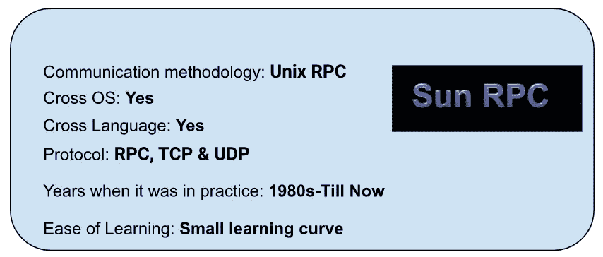
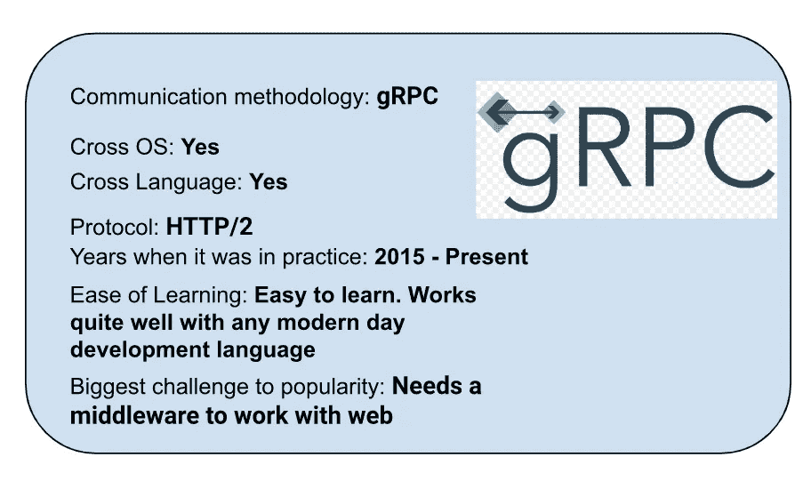

# 多年来的 Web 通信框架

> 原文：<https://medium.com/globant/web-communication-frameworks-over-the-years-ececd4ae8061?source=collection_archive---------2----------------------->

> 合著者:  [阿比涅什·古尔](https://medium.com/u/b6431df99193?source=post_page-----ececd4ae8061--------------------------------)[尼萨尔·纳达夫](https://medium.com/u/10e2f33714e9?source=post_page-----ececd4ae8061--------------------------------)[尼泰什·凯萨卡尔](https://medium.com/u/8ac331c88250?source=post_page-----ececd4ae8061--------------------------------)和[拉贾旺特·普拉贾帕蒂](https://medium.com/u/61ea19f31ff6?source=post_page-----ececd4ae8061--------------------------------)

Photo by [Taylor Vick](https://unsplash.com/@tvick?utm_source=unsplash&utm_medium=referral&utm_content=creditCopyText) on [Unsplash](https://unsplash.com/?utm_source=unsplash&utm_medium=referral&utm_content=creditCopyText)

# 介绍

远程过程调用作为网络操作模型的实际实现可以追溯到 20 世纪 80 年代早期。多年来，我们已经看到了相当多的框架演变。在本文中，我们将回顾这些框架的发展，它们的特性，以及导致新框架发展的一些限制。当我们浏览这些框架时，我们的重点是 gRPC，一个 Google 的 RPC 框架，以及它的优点。

# **Unix RPC — SUN RPC**

**简介**

Unix RPC 首先由 Sun RPC 实现，或者至少是第一个众所周知的实现。网络文件系统的整个生态系统都围绕着它。由 Sun 公司开发，目前被称为开放网络计算(ONC)。多年来，越来越多的组织提出了他们的 RPC 版本，例如，微软开发的 MSRPC 和 Apache Avro。

**历史**

这最初是在 20 世纪 80 年代开发的，最后一次更新版本发布于 2009 年。尽管 RPC 作为一个框架仍然被广泛用于网络通信。

**主要特点**

Unix RPC 有一个名为 rpcgen 的 RPC 编译器，用于自动生成客户机和服务器存根。然后，它使用外部数据表示(通常称为 XDR)来表示客户机和服务器存根之间共享的数据。

它本质上支持基本的数据类型，如 int、float、char 等。，并提供了用于指定其他复杂数据类型的声明性语言。

它可以在 UDP 或 TCP 上工作，UDP 的参数大小限制为 8192 字节。如果使用 UDP 协议，并且客户端对其计时，那么如果出现错误，它将重新发送请求。如果使用 TCP 并且出现错误，则不会重新发送请求。

**优点**

它允许在分布式环境中使用应用程序，并且不将其使用限制在单个机器/环境中。此外，这些分布式系统的开发非常简单，因为 Unix RPC 使用简单的语义。过程调用确保始终保留适用于应用程序的业务逻辑。由于其简单性，重新开发/重新编写代码只需要很少的工作。

**缺点**

虽然 Unix RPC 提供了许多优势，如使用分布式系统，但它也有一些限制。它产生了更多的开销，并且不能解决大多数由发行版产生的问题。它在硬件架构方面没有提供任何灵活性。

# **Java — RMI**

**简介**

RMI 是 RPC 的面向对象等价物。使用 RMI，我们可以从一台机器调用或访问另一台机器的方法/对象。在分布式计算的早期，它被广泛使用。

JAVA RMI 是用于 RMI 的 JAVA 实现 API，它允许托管在两个分布式系统上的两个 JVM 之间的通信，它支持序列化 JAVA 类的传输。

**历史**

Java RMI 在 1997 年与 Java JDK 1.1 一起发布。尽管 EJB 仍在使用 RMI，但自 2014 年 Java 8 发布以来，Java RMI API 已被弃用。

**关键特性**

RMI 使用两个对象 Stub 和 Skeleton 提供应用程序之间的远程通信。存根是客户机在其上构建信息块并将该信息发送给服务器的对象。另一方面，骨架对象将请求从存根传递到远程对象。使用这些存根和骨架 RMI 允许一个对象从一个 JVM 调用方法到另一个 JVM 中运行的对象。

**优点**

Java RMI 的一个主要优点是它是面向对象的，使用它可以传递完整的对象作为参数和返回值，而不仅仅是预定义的数据类型。
此外，由于它在 Java 生态系统中，它可以作为 RMI/JDBC 系统移植到任何 Java 虚拟机，这使得它只需编写一次，就可以在任何地方执行。此外，它节省了开发人员的精力，因为所有与网络相关的功能都由 Java RMI API 处理。

**缺点**

Java RMI 最大的缺点是它需要用 Java 编写客户机和服务器。此外，它还需要许多额外的配置，包括对象注册和遵从 rmic 以支持远程方法调用。由于安全限制，它提供的功能有限。此外，使用 RMI 处理本地和远程对象时，很难区分哪些对象是本地的，哪些是远程的。

# CORBA- **公共对象请求代理架构**

**简介**

公共对象请求代理体系结构是由对象管理组织(OMG)定义的标准，旨在促进部署在不同平台上的系统之间的通信。它支持不同操作系统、编程语言和计算硬件上的系统之间的协作。它使用面向对象的模型，尽管使用 CORBA 的系统不一定是面向对象的。CORBA 是分布式对象范例的一个例子。

它使用接口定义语言(IDL)来指定对象呈现给外部世界的接口。然后，CORBA 指定了从 IDL 到特定实现语言(如 C++或 Java)的映射。

**历史**

CORBA 标准是由对象管理小组在 1991 年定义的。最新版本发布于 2021 年 2 月。CORBA 仍然在遗留系统中使用。

**主要特点**

CORBA 使分布式系统上用不同语言编写的程序之间能够通信。它规范了本地空间(同一应用程序中)或远程空间(网络托管应用程序)中对象之间的语义。它使用接口定义语言(IDL)来指定对象的接口。它支持面向对象语言如 C++、Java 等的标准映射。它还支持 Perl 和 Erlang 等脚本语言的非标准映射。

**优点**

CORBA 的最大优点是它还允许在分布于几个系统的单个应用程序中使用不同的语言，这为不同的语言提供了全面的支持。除此之外，CORBA 标准的使用也为开发者提供了一定程度的可移植性，这使得移植任何给定的 API 变得非常容易。

这也实现了更高程度的互操作性。它确保了构建在 CORBA 产品之上的不同分布式应用程序可以在没有太多配置或转换的情况下进行通信。

**缺点**

CORBA 最大的缺点之一是它对防火墙不友好。它基于 IIOP，使用原始的 TCP/IP 连接来传输数据。

此外，它是当时最复杂的学习和实现框架之一。没有标准来获取命名服务的初始引用，这使得理解和维护变得更加复杂。

# DCOM 分布式组件对象模型

**简介**

DCOM——分布式组件对象模型由微软开发，主要目的是允许分布式系统上的软件对象相互通信。

第一个字母“D”表示 DCE/RPC(分布式计算环境/远程过程调用),更具体地说是微软的增强版本，即 MSRPC。

**历史**

DCOM 于 1996 年面向 Windows 95 公开推出。原生支持 Windows NT 4.0、Windows 2000、XP、Server 2003，以及 Windows 7、8、10、Windows Server 2008、2008 R2、2012、2012 R2、2016 DCOM 仍在使用。

**主要特征**

DCOM 是 CORBA 的主要替代产品，它提供了一些流动的关键功能，如封送处理(通过网络和分布式垃圾收集对方法调用的参数和返回值进行序列化和反序列化),确保接口的客户端持有的引用在不使用时被释放。

**优势**

DCOM 非常适合客户端-服务器应用程序开发。如果整个分布式应用程序都在微软平台下运行，DCOM 是一个不错的选择。
它为分布式组件提供了在分布式内存上共享的接口。
也可以配合 CORBA 使用。

**缺点**

尽管它与 CORBA 竞争，但没有一个被证明是足够安全或可扩展的，足以成为高容量 web 流量的标准。DCOM 和 CORBA 都不能很好地与防火墙一起工作。

此外，由于它是 Windows 自带的，DCOM 可以在其他计算机上运行程序，黑客可以利用它通过网络进行横向移动攻击，获得更多数据。DCOM 的一个最大缺点是它依赖于平台，只能与微软技术一起使用。

# EJB

**简介**

企业 Java bean(EJB)是用于创建企业软件的 Java APIs 之一。它是一个服务器端软件元素，解释了应用程序的业务逻辑。

EJB 构建在 RMI 之上，用于客户机/服务器通信。EJB 用于开发可伸缩、健壮、安全的企业应用程序。

**历史**

EJB(企业 Java Bean)由 IBM 于 1997 年发布，后来被 Sun Microsystems 采用为 EJB 1.0。

**主要特性**

到 1996 年，Java 在开发人员中变得非常流行，但是在标准功能的需求方面存在一些主要问题，比如持久性、事务完整性和大多数系统的并发控制。这导致了许多自定义实现，开发人员不得不反复重新实现这些问题的解决方案。

EJB 自动解决了这些常见的问题，并提供了一种标准的方法来实现企业应用程序，以便开发人员可以专注于主要的业务逻辑。

它提供了方便的抽象，因此不需要开发人员编写:多线程、多路访问代码或网络通信代码(即它使用 RMI)来进行客户端/服务器通信。

**优点**

因为 EJB 是一个 API，所以构建在 EJB 上的应用程序也可以在 Java EE web 应用服务器上运行。此外，EJB 容器有助于为企业 Java beans 提供系统级服务。它包含业务逻辑，因此开发人员可以专注于客户端界面的呈现。这为开发人员提供了一种简单的方法来开发和访问 web 服务，而不用担心 web 服务描述格式和基于 XML 的有线协议的复杂细节。EJB 容器提供的工具管理到 web 服务标准的映射。

**缺点**

EJB 规范非常复杂和庞大。此外，规范会不断修订，因此理解和开发 EJB 应用程序很复杂。使用 EJB 开发的应用程序利用了大量的资源，并且拥有大量的工件。它只适用于 Java 客户端。

# 简单对象访问协议

**简介**

SOAP 是基于 XML 的消息传递协议。它的设计使得用不同语言编写的应用程序和在不同平台上构建的应用程序可以相互通信。它定义了一组用于构造消息的规则，这些规则可用于简单的单向消息传递，但对于执行 RPC 风格(远程过程调用)的请求-响应对话尤其有用。

常见的 web 服务规范包括:

*   Web 服务安全性(WS-security):通过称为令牌的唯一标识符来标准化消息的安全和传输。
*   WS-Reliable Messaging:标准化跨不可靠的 IT 基础设施传输的消息之间的错误处理。
*   Web 服务寻址(WS-addressing):将路由信息打包为 SOAP 头中的元数据，而不是在网络中更深层次地维护这些信息。
*   Web 服务描述语言(WSDL):描述 web 服务做什么，以及该服务在哪里开始和结束。

**历史**

1998 年 6 月，Dave Winer、Don Box、Bob Atkinson 和 Mohsen Al-Ghosein 为微软发布了 XML-RPC SOAP。SOAP 有不同的版本，比如 1.0、1.1 和 1.2

**关键特性**

浏览器不能缓存 SOAP API 响应。SOAP 内置了对安全性、原子性、一致性、隔离性和持久性(ACID)的支持，这是一组用于确保可靠数据库事务的属性。这使得它适用于企业场景。SOAP 通常与 HTTP 一起工作，但它不依赖于任何特定的传输层协议，如 SMTP、FTP、TCP 和 UDP。它既不依赖于任何特定的操作系统，也不依赖于编程语言。所以客户端和服务器可以用任何语言编写，可以在不同的平台上运行就可以了。只要他们能够表达和理解 SOAP 消息。这是开发分布式应用程序的基本构造块，这些应用程序通过内部网或互联网公开发布为服务的功能。

**优势**

SOAP 的优势包括它可以用于任何传输协议。它拥有 XML 的所有功能，比如国际化和 XML 名称空间的可扩展性。它支持有状态和无状态。

**劣势**

SOAP 有一些缺点，比如它只支持 XML 数据格式，并且由于 XML 文件较大，它需要较大的带宽。由于它支持如此多的协议，它有一个很大的学习曲线。SOAP API 充当客户端和服务器之间的严格契约。因此模式中的任何变化都会导致服务器端和客户端的修改。这是额外的努力。

# 静止表示状态转移

**简介**

在 REST 中，向资源 URI 发出请求，以获得带有 HTML、XML、JSON 或任何其他指定格式的有效负载的响应。它使用 HTTP 作为所有这些请求和响应的基本协议。REST 提供了一些操作，也称为 HTTP 方法，比如 GET、POST、PUT、PATCH、DELETE、OPTIONS 和 HEAD。REST 是无状态的，这意味着它不存储应用程序或先前请求的状态。每个请求都包含处理请求所需的所有必要信息。有了这些信息，服务器就知道该对给定的请求执行什么操作。

**历史**

直到 1999 年，开发人员不得不在 SOAP 的帮助下集成 API。他们必须编写带有 RPC 调用的 XML 文件来发出请求。在 2000 年，Roy Fielding 和他的团队引入了表述性状态转移(REST)作为一种软件架构风格。它的创建是为了指导万维网(WWW)体系结构的设计和开发。

**关键特性**

RESTful 系统的目标是快速的性能、可靠性和通过重用组件来增长的能力。即使系统正在运行，也可以在不影响系统整体的情况下管理和更新这些组件。这是通过遵循 REST 原则实现的，如客户机-服务器架构、无状态、可缓存性、分层系统、支持按需编码和统一接口。应该遵循这些原则，这样系统才能被称为 RESTful。REST 是独立于语言的。客户端和服务器可以用不同的语言编写。REST 支持不同的数据格式。

**优点**

REST 有很多优点，比如它支持各种数据格式，比如 JSON、XML 和 HTML。由于 JSON 数据格式，它为浏览器客户端提供了更好的支持。它速度更快，使用的带宽更少。它可以很容易地集成到现有的网站，没有基础设施的变化。REST 通过缓存静态内容或信息提供了卓越的性能。

**缺点**

休息有几个缺点。它是无状态的，所以客户端必须自己完成。它没有 SOAP 那样的安全性。为了更加安全，我们需要手动添加。流功能不是内置的，所以我们需要集成一个第三方库。REST 请求(尤其是 GET)不适合大量数据。

# gRPC

**简介**

gRPC (Google 的远程过程调用框架)的开发高度重视速度。它允许客户端和服务器之间的透明通信。它基于 HTTP/2 协议，提供最大的 API 安全性、性能和可伸缩性。gRPC 框架的一些关键组件是 Protobuf 文件、RPC 方法和消息。

protobuf 文件充当客户机和服务器之间的契约。基于这个 protobuf 文件，客户机和服务器生成存根，这些存根向客户机和服务器公开 RPC 方法和消息。然后，这些客户机和服务器直接调用 RPC 方法相互通信。

它支持四种不同类型的通信。

*   一元通信:这是客户端和服务器之间一对一的通信，客户端发送请求，服务器响应请求。
*   客户端流:在客户端流中，客户端持续保持与服务器的通信通道打开，并发送请求流。服务器等待客户端完成流式传输，然后响应来自客户端的请求。
*   服务器流:在这里，客户机向服务器发送一个请求，服务器用一个流来响应。
*   双向流:在这种类型中，客户机和服务器都发送请求和响应流。支持所有不同的流组合，如客户端先完成其流，然后服务器用其流进行响应，或者客户端和服务器同时发送其流。

**历史**

它是由谷歌在 2015 年开发的，被谷歌、IBM、思科和网飞等不同公司积极用于提供一系列服务，如流媒体应用等。由于它越来越受欢迎，它成为了云本地计算基金会(CNCF)的孵化项目。

**主要特点**

它提供了对流媒体服务的内置支持，不需要任何额外的协议，如 web sockets、webRTC 或 FTL 等。它提供轻量级消息传递，在物联网应用中非常有用。它使用 protoc compiler 插件来生成 gRPC，作为一个独立的框架，可以无缝地与 web 和移动应用程序一起工作。它支持广泛的语言，如 C、C++、Javascript、PHP、GO、Java 等。

**优点**

gRPC 提供的最大优势之一就是速度。因为它完全使用 HTTP/2 协议，所以与使用 HTTP/1.1 的 Rest 相比，它具有巨大的速度优势。基于不同的实验，发现 gRPC 呼叫平均比传统的 REST 呼叫快 7 到 10 倍。除了使用 HTTP/2 协议之外，使用 protobufs 代替 JSON 进行通信是提供这种速度优势的重要因素之一。压缩的 protobuf 总是比压缩的 JSON 对象快。对多路复用的支持是 gRPC 提供速度优势的另一个原因。gRPC 的另一大优势是内置的流支持，无需依赖任何附加协议。gRPC 负责客户端和服务器存根的序列化和反序列化，开发人员不必担心底层机制，因此在易于开发方面具有优势。客户端和服务器端都直接调用 RPC 方法，从而让开发人员不必担心 GET、POST、PUT 等 REST 术语。

互操作性是 gRPC 提供的另一大优势。使用 gRPC 的主要目的之一是用于微服务间的通信。当使用 gRPC 时，其中一个微服务可以在 GO 中，而另一个可以在 Java 中，从而使 gRPC 完全独立于语言。

它使用 HTTP/2 over TLS 加密来确保 API 安全性，并内置了对加密、身份验证、负载平衡等的支持。

**缺点**

广泛采用 gRPC 的最大瓶颈之一是有限的浏览器支持。由于 gRPC 完全与 HTTP/2 一起工作，所以使用 gRPC 框架在服务器端实现的 RPC 方法不能被浏览器直接调用，因为目前没有一个浏览器具有对 HTTP/2 帧的细粒度控制。因此它需要中间件。该中间件的目的是将从浏览器接收的 HTTP/1.1 请求转换成 gRPC 可读的格式。这稍微削弱了在 web 上使用 gRPC 的速度优势。

它不支持边缘缓存。虽然 HTTP 作为一个协议支持边缘缓存的中介，但是 gRPC 作为一个框架缺乏这种支持。此外，开发人员需要像 gRPC 命令行工具这样的工具来分析 protobuf 有效负载、编写手动请求和执行调试。

> 特别感谢 [Mukund](https://medium.com/u/733fa45e5564?source=post_page-----ececd4ae8061--------------------------------) 的指导。