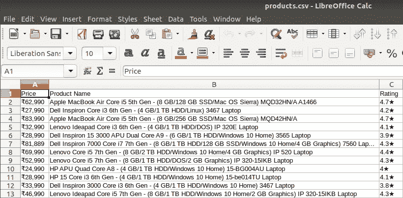

# 用 Python 学习网页抓取的入门指南！

> 原文：<https://medium.com/edureka/web-scraping-with-python-2cab6c16fd40?source=collection_archive---------1----------------------->


**用 Python 进行网页抓取**

想象一下，你必须从网站上获取大量的数据，并且你想尽可能快地完成它。如果不手动访问每个网站并获取数据，你会怎么做？嗯，“网络抓取”就是答案。网络抓取只是使这项工作更容易和更快。

在这篇关于使用 Python 进行 **Web 抓取的文章中，您将简要了解 Web 抓取，并通过演示了解如何从网站中提取数据。我将涉及以下主题:**

*   为什么要用网络抓取？
*   什么是网页抓取？
*   网络抓取合法吗？
*   Python 为什么对网页抓取有好处？
*   你如何从网站上收集数据？
*   用于网页抓取的库
*   网页抓取示例:抓取 Flipkart 网站

# 为什么要用网络抓取？

网络抓取用于从网站上收集大量信息。但是为什么一定要有人从网站上收集这么大的数据呢？为了了解这一点，让我们来看看网络抓取的应用:

*   **价格比较:**parse hub 等服务使用网络抓取从在线购物网站收集数据，并使用它来比较产品的价格。
*   **电子邮件地址收集:**许多使用电子邮件作为营销媒介的公司使用网络搜集来收集电子邮件 ID，然后发送大量电子邮件。
*   **社交媒体抓取:**网络抓取用于从 Twitter 等社交媒体网站收集数据，以了解流行趋势。
*   **研发:**网页抓取用于收集大量数据(统计、一般信息、温度等。)从网站上下载，对其进行分析并用于调查或研发。
*   **职位列表:**从不同的网站收集有关职位空缺、面试的详细信息，然后在一个地方列出，以便用户可以轻松访问。

# 什么是网页抓取？

网络抓取是一种用于从网站中提取大量数据的自动化方法。网站上的数据是非结构化的。Web 抓取有助于收集这些非结构化数据，并以结构化形式存储。有不同的方法来抓取网站，如在线服务、API 或编写自己的代码。在本文中，我们将看到如何用 python 实现 web 抓取。


# 网络抓取合法吗？

谈论网页抓取是否合法，有些网站允许网页抓取，有些不允许。想知道一个网站是否允许网页抓取，可以看看网站的“robots.txt”文件。您可以通过将“/robots.txt”附加到您想要抓取的 URL 来找到该文件。对于这个例子，我正在抓取 Flipkart 网站。所以，要看“robots.txt”文件，网址是[www.flipkart.com/robots.txt.](http://www.flipkart.com/robots.txt)

# Python 为什么对网页抓取有好处？

下面是 Python 的特性列表，这些特性使它更适合 web 抓取。

*   **易用性:** Python 编码简单。您不必添加分号“；”或花括号“{}”的任何位置。这使得它不那么凌乱，易于使用。
*   **大型库集合:** Python 拥有庞大的库集合，如 [Numpy](https://www.edureka.co/blog/python-numpy-tutorial/) 、 [Matlplotlib](https://www.edureka.co/blog/python-matplotlib-tutorial/) 、 [Pandas](https://www.edureka.co/blog/python-pandas-tutorial/) 等。，它为各种目的提供方法和服务。因此，它适用于 web 抓取和提取数据的进一步操作。
*   **动态类型化:**在 Python 中，你不必为变量定义数据类型，你可以在任何需要的地方直接使用变量。这样可以节省时间，让你的工作更快。
*   **易于理解的语法:** Python 语法易于理解主要是因为阅读 Python 代码与阅读英文语句非常相似。它富有表现力，易于阅读，Python 中使用的缩进也有助于用户区分代码中不同的范围/块。
*   **小代码，大任务:**使用网页抓取节省时间。但是你花再多时间写代码又有什么用呢？嗯，你不需要。在 Python 中，你可以编写小代码来完成大任务。因此，即使在编写代码时，您也节省了时间。
*   **社区:**写代码的时候卡住了怎么办？你不用担心。Python 社区有一个最大最活跃的社区，你可以在那里寻求帮助。

# 你如何从网站上收集数据？

当您运行 web 抓取代码时，会向您提到的 URL 发送一个请求。作为对请求的响应，服务器发送数据并允许您读取 HTML 或 XML 页面。然后，代码解析 HTML 或 XML 页面，找到数据并提取出来。

要通过 python 使用 web 抓取来提取数据，您需要遵循以下基本步骤:

1.  找到您想要抓取的 URL
2.  检查页面
3.  查找要提取的数据
4.  写代码
5.  运行代码并提取数据
6.  以要求的格式存储数据

现在让我们看看如何使用 Python 从 Flipkart 网站提取数据。

# 用于网页抓取的库

众所周知，Python 有各种各样的应用，不同的库有不同的用途。在我们的进一步演示中，我们将使用以下库:

*   **Selenium** : Selenium 是一个 web 测试库。它用于自动化浏览器活动。
*   **Beautiful Soup**:Beautiful Soup 是一个解析 HTML 和 XML 文档的 Python 包。它创建解析树，有助于轻松提取数据。
*   **Pandas** : Pandas 是一个用于数据操作和分析的库。它用于提取数据并以所需的格式存储数据。

# 网页抓取示例:抓取 Flipkart 网站

先决条件:

*   安装了 **Selenium** 、 **BeautifulSoup、pandas** 库的 Python 2.x 或 Python 3.x
*   谷歌浏览器
*   Ubuntu 操作系统

*我们开始吧！*

# 第一步:找到你想要抓取的网址

在这个例子中，我们将抓取 **Flipkart** 网站来提取笔记本电脑的价格、名称和评级。本页面网址为[https://www . flipkart . com/laptops/~ buy back-guarantee-on-laptops-/pr？sid = 6bo % 2Cb5g&uniqbstoreparam 1 = val 1&wid = 11 . product card . PMU _ V2](https://www.flipkart.com/laptops/~buyback-guarantee-on-laptops-/pr?sid=6bo%2Cb5g&uniqBStoreParam1=val1&wid=11.productCard.PMU_V2)。

**第二步:检查页面**

数据通常嵌套在标签中。因此，我们检查页面，看看我们想要抓取的数据嵌套在哪个标签下。要检查页面，只需右键单击元素，然后单击“检查”。


当你点击“检查”标签，你会看到一个“浏览器检查框”打开。


# 步骤 3:找到您想要提取的数据

让我们分别提取“div”标签中的价格、名称和评级。

# 步骤 4:编写代码

首先，让我们创建一个 Python 文件。为此，在 Ubuntu 中打开终端，并键入 gedit <your file="" name="">。py 扩展名。</your>

我将把我的文件命名为“web-s”。命令如下:

```
gedit web-s.py
```

现在，让我们在这个文件中编写代码。

首先，让我们导入所有必需的库:

```
from selenium import webdriver
from BeautifulSoup import BeautifulSoup
import pandas as pd
```

要配置 webdriver 使用 Chrome 浏览器，我们必须设置 chromedriver 的路径

```
driver = webdriver.Chrome("/usr/lib/chromium-browser/chromedriver")
```

请参考以下代码打开 URL:

```
products=[] #List to store name of the product
prices=[] #List to store price of the product
ratings=[] #List to store rating of the product
driver.get("[https://www.flipkart.com/laptops/~buyback-guarantee-on-laptops-/pr?sid=6bo%2Cb5g&amp;amp;amp;amp;amp;amp;amp;amp;amp;amp;uniq](https://www.flipkart.com/laptops/~buyback-guarantee-on-laptops-/pr?sid=6bo%2Cb5g&amp;amp;amp;amp;amp;amp;amp;amp;amp;amp;uniq)")
```

现在我们已经编写了打开 URL 的代码，是时候从网站中提取数据了。如前所述，我们想要提取的数据嵌套在

标签中。因此，我将找到具有相应类名的 div 标签，提取数据并将数据存储在一个变量中。请参考下面的代码:

```
content = driver.page_source
soup = BeautifulSoup(content)
for a in soup.findAll('a',href=True, attrs={'class':'_31qSD5'}):
name=a.find('div', attrs={'class':'_3wU53n'})
price=a.find('div', attrs={'class':'_1vC4OE _2rQ-NK'})
rating=a.find('div', attrs={'class':'hGSR34 _2beYZw'})
products.append(name.text)
prices.append(price.text)
ratings.append(rating.text)
```

# 步骤 5:运行代码并提取数据

要运行代码，请使用下面的命令:

```
python web-s.py
```

# 步骤 6:以所需的格式存储数据

提取数据后，您可能希望以某种格式存储它。这种格式根据您的要求而有所不同。在本例中，我们将以 CSV(逗号分隔值)格式存储提取的数据。为此，我将在代码中添加以下代码行:

```
df = pd.DataFrame({'Product Name':products,'Price':prices,'Rating':ratings}) 
df.to_csv('products.csv', index=False, encoding='utf-8')
```

现在，我将再次运行整个代码。

创建一个文件名“products.csv ”,该文件包含提取的数据。



我希望你们喜欢这篇关于“使用 Python 进行 Web 抓取”的文章。我希望这篇博客能给你提供信息，并增加你的知识价值。现在继续尝试网络抓取。尝试 Python 的不同模块和应用程序。

如果你想查看更多关于人工智能、DevOps、道德黑客等市场最热门技术的文章，你可以参考 Edureka 的官方网站。

请留意本系列中的其他文章，它们将解释 Python 和数据科学的各个方面。

> *1。*[*Python 中的机器学习分类器*](/edureka/machine-learning-classifier-c02fbd8400c9)
> 
> *2。*[*Python Scikit-Learn Cheat Sheet*](/edureka/python-scikit-learn-cheat-sheet-9786382be9f5)
> 
> *3。* [*机器学习工具*](/edureka/python-libraries-for-data-science-and-machine-learning-1c502744f277)
> 
> *4。* [*用于数据科学和机器学习的 Python 库*](/edureka/python-libraries-for-data-science-and-machine-learning-1c502744f277)
> 
> *5。*[*Python 中的聊天机器人*](/edureka/how-to-make-a-chatbot-in-python-b68fd390b219)
> 
> *6。* [*Python 集合*](/edureka/collections-in-python-d0bc0ed8d938)
> 
> *7。* [*Python 模块*](/edureka/python-modules-abb0145a5963)
> 
> *8。* [*Python 开发者技能*](/edureka/python-developer-skills-371583a69be1)
> 
> *9。* [*哎呀面试问答*](/edureka/oops-interview-questions-621fc922cdf4)
> 
> *10。*[*Python 开发者简历*](/edureka/python-developer-resume-ded7799b4389)
> 
> *11。*[*Python 中的探索性数据分析*](/edureka/exploratory-data-analysis-in-python-3ee69362a46e)
> 
> *12。* [*蛇与蟒蛇的游戏*](/edureka/python-turtle-module-361816449390)
> 
> *13。* [*Python 开发者工资*](/edureka/python-developer-salary-ba2eff6a502e)
> 
> *14。* [*主成分分析*](/edureka/principal-component-analysis-69d7a4babc96)
> 
> 15。[*Python vs c++*](/edureka/python-vs-cpp-c3ffbea01eec)
> 
> *16。* [*刺儿头教程*](/edureka/scrapy-tutorial-5584517658fb)
> 
> *17。*[*Python SciPy*](/edureka/scipy-tutorial-38723361ba4b)
> 
> 18。 [*最小二乘回归法*](/edureka/least-square-regression-40b59cca8ea7)
> 
> 19。 [*Jupyter 笔记本小抄*](/edureka/jupyter-notebook-cheat-sheet-88f60d1aca7)
> 
> 20。 [*Python 基础知识*](/edureka/python-basics-f371d7fc0054)
> 
> *21。* [*Python 模式程序*](/edureka/python-pattern-programs-75e1e764a42f)
> 
> *22。* [*网页抓取用 Python*](/edureka/web-scraping-with-python-d9e6506007bf)
> 
> *23。* [*Python 装饰器*](/edureka/python-decorator-tutorial-bf7b21278564)
> 
> *24。*[*Python Spyder IDE*](/edureka/spyder-ide-2a91caac4e46)
> 
> *25。*[*Python 中使用 Kivy 的移动应用*](/edureka/kivy-tutorial-9a0f02fe53f5)
> 
> *26。* [*十大最佳学习书籍&练习 Python*](/edureka/best-books-for-python-11137561beb7)
> 
> *27。* [*机器人框架与 Python*](/edureka/robot-framework-tutorial-f8a75ab23cfd)
> 
> *28。*[*Python 中的贪吃蛇游戏*](/edureka/snake-game-with-pygame-497f1683eeaa)
> 
> *29。* [*Django 面试问答*](/edureka/django-interview-questions-a4df7bfeb7e8)
> 
> *30。* [*十大 Python 应用*](/edureka/python-applications-18b780d64f3b)
> 
> *31。*[*Python 中的哈希表和哈希表*](/edureka/hash-tables-and-hashmaps-in-python-3bd7fc1b00b4)
> 
> *32。*[*Python 3.8*](/edureka/whats-new-python-3-8-7d52cda747b)
> 
> 33。 [*支持向量机*](/edureka/support-vector-machine-in-python-539dca55c26a)
> 
> 34。 [*Python 教程*](/edureka/python-tutorial-be1b3d015745)

*原载于 2019 年 9 月 18 日*[*https://www.edureka.co*](https://www.edureka.co/blog/add-python-to-path/)*。*