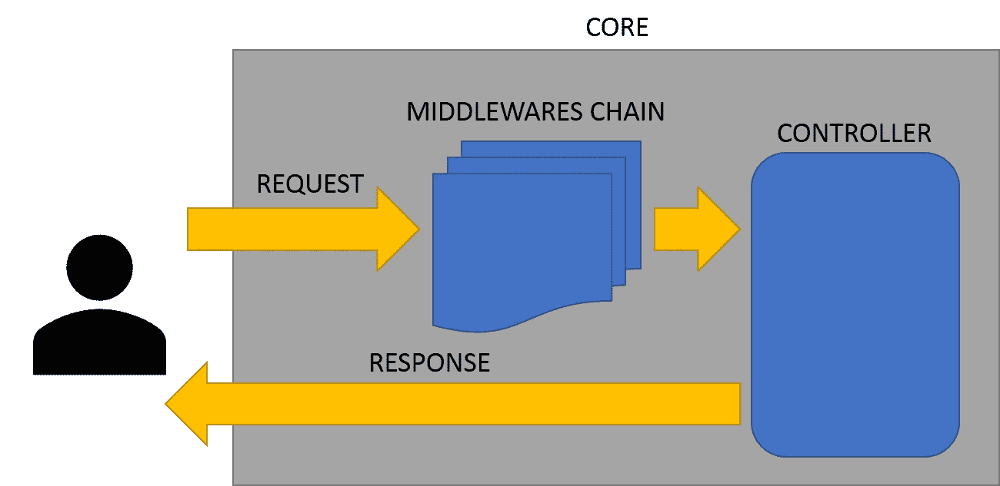
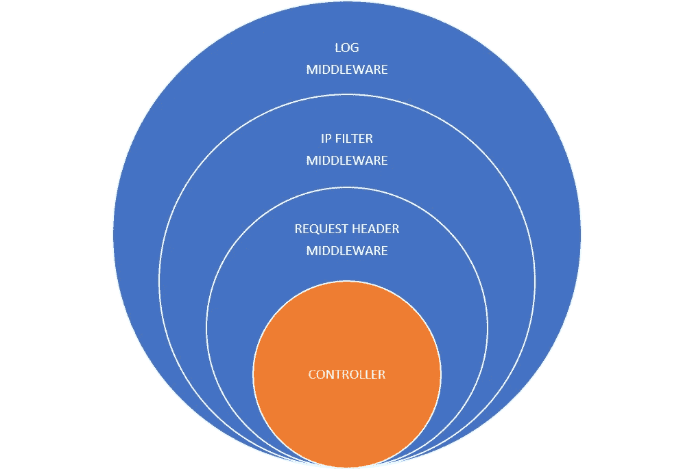
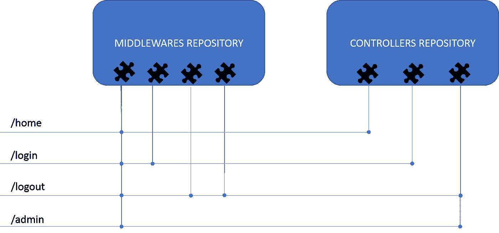
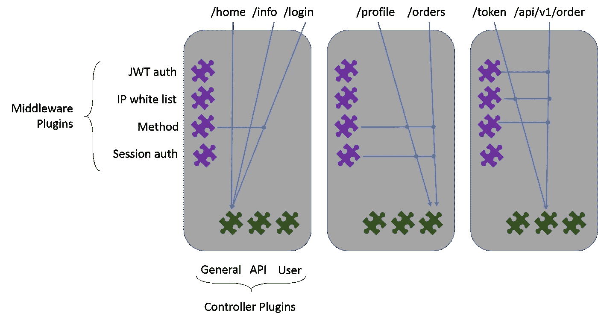

# 模块化 Web 服务与 GO Plug-in

> 原文：<https://medium.com/quick-code/web-service-modulari-con-go-plug-in-7f59d4b15d61?source=collection_archive---------0----------------------->


[*英文版!(T2) (T3)*](/quick-code/write-a-web-service-with-go-plug-ins-c0472e0645e6)

本文的目的是检查为什么以及如何创建一个模块化的 Web 服务。

在自动化驱动的环境中,有许多条件导致项目发展完全混乱,我遇到的一个原因是服务模块化程度低。

当您使用编译语言时,即使在微服务架构中,您也会遇到导致源代码重新编译的情况。其中包括修改项目单个部分的行为或优化终端节点的规模。

此外,一些主题不可避免地变得“不舒服”:

*   在多个服务中重用一个功能并不容易。
*   您可能只能使用一种编程语言。
*   如果你有一个团队,你必须分享整个项目的源代码(这对于离岸项目来说是非常敏感的)。

使用插件架构,您可以将服务开发为一组组件,使您能够:

*   有功能性的团队,只处理一个给定的范围。
*   独立分发组件(这也允许滚动更新策略)。
*   在不同的项目中重复使用组件。
*   通过配置要包含的组件自定义服务在扩展时的行为。
*   最后但并非最不重要的是,您可以使用编译库的任何语言开发组件(大多数语言都不是偶然的)!

# Architecture 项目

从 Web 服务的解剖分析开始,我们可以将我们的项目分为以下组件:

*   核心:核心部分将负责读取配置,加载插件,并管理 HTTP 服务。
*   控制器:生成要返回给客户端的内容的函数。
*   中间件:控制请求是否被授权访问控制器的组件。



这样,如果我们想通过插入 HTTPS 来更新我们的项目,我们只能重新分发与核心相关的文件(包含 http 通信处理)和*只用于需要此功能的服务!*同样,如果我们需要修改 JWT 插件的 ash 算法,我们可以重新分发插件并重新启动内核。

# Architecture 组件

## 控制器

控制器是一个“HTTP 处理程序函数”,它将逻辑应用于请求并返回给客户端的响应。

## 中间人 Middlewares

这种类型的对象源于需要在启动整个管理机制之前对请求应用过滤器或操作,从而避免不必要的服务器负载。

中间件的一个例子是 IP 过滤器:只允许特定的 IP 访问服务。当从服务器接收信息时,您可以直接检查源 IP 是否是白名单中可接受的 IP 之一。这样就不会加载其他组件,从而缩短响应时间,从而提高服务性能。

另一个好处是降低了在恶意行为发生时暴露数据的风险。



中间件的另一个例子是控制请求的 access header。通过将后者与前一个 IP 过滤器连接起来,只有经过授权且来自配置的 IP 之一的用户才能访问该服务。

因此,如果响应函数(控制器)的第一步是对 DB 进行查询以检索用户数据,则这些过滤器可以通过避免 SQL 注入来提高安全性,因为除非检查中间件中所有先前声明的条件,否则甚至不会初始化与数据库的通信。

## 核心

如前所述,在这个项目中,我们将使用[插件](https://golang.org/pkg/plugin/)的功能来分离组件。为此,核心组件将加载 Controllers 和 Middlewares 插件,通过配置文件将它们分配给不同的端点,并最终启动 HTTP 侦听器。

配置中的所有其他未映射的路由将返回“404 not found”。



Mapping middlewares and controller to an endpoint

这种独立性在云环境中特别受欢迎:



# 实施

现在我们开始编写代码,我们将从基本的*核心*组件和一个*控制器(HTTP 函数处理程序)开始,它将响应我们的主页:*

我们添加实现中间件所需的构造:

The middleware type

…and a Chain function that provide a mechanism to concatenate middlewares

现在我们构建一个示例中间件:方法中间件将检查请求的 HTTP 方法是否是允许的中间件之一。否则返回 400 Bad Request。

我们将传递一系列参数,在这种情况下,它们将是可接受的 HTTP 方法序列,以“pipe”(“|”)字符分隔:

然后我们绑定中间件(将其插入到 Chain 对象中),并传递我们希望允许的 HTTP 方法。

接下来,我们将把 Chain 对象传递给 HandlerFunc 这个简单的 HTTP 服务:

[所有的示例代码都在这里](https://github.com/Bebbolus/gomiddleware)

# Plugins

> 注:此功能目前仅适用于 Linux,但您可以将容器用作 workaround。

插件包必须是“Main”。不幸的是, *package 不能访问 package principle 的实体,例如“真实” main package 中的 type 和 function。因此,我建议尽可能保持“愚蠢”的插件(T9) 。*

在插件中,我们需要将符号导出到一个变量或函数,该变量或函数将在加载插件本身的模块中用作引用:

要构建插件,我们需要使用 -buildmode=plugin 标志并指定我们想要生成的文件的名称。

```
$go build -buildmode=plugin -o first.so first.go
```

> 你已经建立了你的第一个插件!

检查文件夹,你会发现 first.so 文件是一个**标准库,你可以导入到支持此功能的语言!(T6 )**

我们在 GO 中使用它:

我们创建一个新的 main.go 文件并加载新创建的库:

让我们添加代码以在库中查找符号:

现在我们可以在“main.go”中使用插件函数:

Run!

```
$ go run main.go
```

如果一切顺利,你会看到:

```
Hello FROM PLUGIN!!!
```

[这里的源代码](https://github.com/Bebbolus/gomiddleware)

现在,我们使用 GO“Oop 风格”开发项目,以便从插件中获取更多单个功能。

我们用一个类型修改 first.go 插件,通过它我们可以攻击方法。最后,我们将变量导出为类型对象的引用符号:

现在,我们需要在 main.go 中将导入更改为更安全的菜单:

# Plugins 的实施

在这一点上,你知道:

*   项目的目标是什么
*   我们希望在建筑层面上实现什么
*   什么是各种组件:核心,控制器,中间件
*   如何创建和使用 plugin

我们准备创建“控制器”插件!

在 repository 中,我们为 plugin 创建一个文件夹:

```
$mkdir plugins
```

在里面,我们再创建两个文件夹,一个用于中间件,一个用于控制器。

```
$cd plugins
$mkdir controller
$mkdir middlewares
```

## 创建 Controller

在 `plugins/controllers` 文件夹中,我们创建 `general.go`:

## 创建 Middleware

现在,我们将先前创建的方法中间件导出到插件中。

在 `plugins/middlewares` 下,我们创建 `method.so`:

建立 plugin:

```
$go build -buildmode=plugin -o plugins/middlewares/method.so plugins/middlewares/method.go$go build -buildmode=plugin -o plugins/controllers/genearal.so plugins/controllers/genearal.go
```

# 进口 Plugin

要导入插件,我们需要从配置文件中加载它们,以便将中间件和控制器映射到配置的路由。

文件`routes.json`应该看起来像这样:

通过以这种方式创建文件,我们可以将多个中间件附加到一条路径上,并在多个路径上使用一个中间件。

## 阅读 Configurations

现在,我们可以从文件中读取配置并将它们映射到结构(我发现使用这个[工具](https://mholt.github.io/json-to-go/)将源 json 转换为结构):

现在我们编写一个函数来读取 JSON:

## 加载 Plugins

由于我们将从内核中调用导出到库文件(插件)的类型,我们将不得不采用一些约定,我选择了以下约定:

*   控制器有 Fire() 方法。
*   中间件有 Pass() 方法。

通过滚动配置,我们可以动态链接库:

> From “plugin.Open” documentation: If a path has been opened, then the existing *Plugin is return it is safe for concurrent use by multiple goroutines. 如果路径已经被打开,那么现存的 *plugin 就返回了。

下载 Controller Plugin:

我们加载要附加到路线的中间件:

现在我们可以组装所有东西并启动我们的 Web 服务。

```
$go build -o start -v
```

您可以在这里看到完整的仓库[以及其他一些功能:](https://github.com/Bebbolus/gostron)

*   脚本创建一个 plugin 的骨架
*   makefile 用于构建和/或清理所有内容
*   测试标准实施。