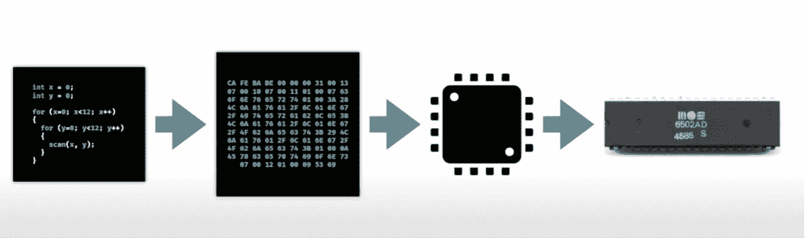
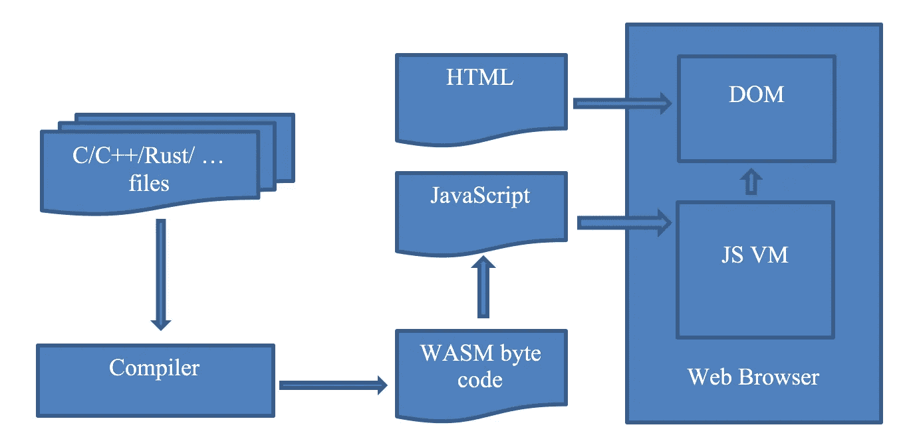
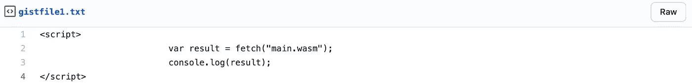
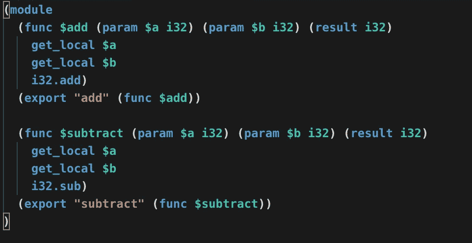
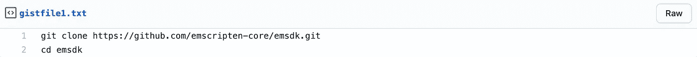
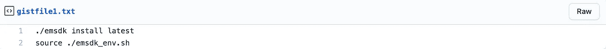
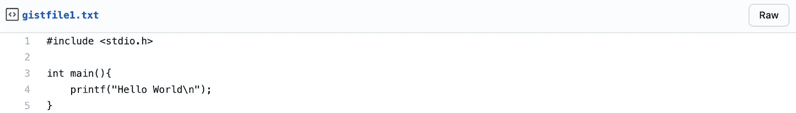
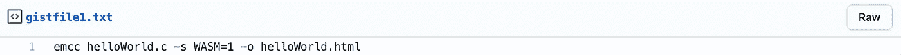
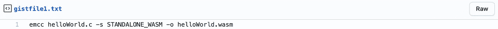
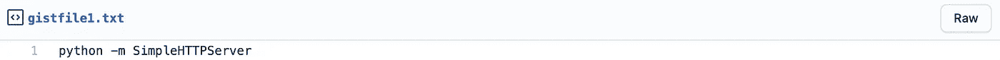

# WebAssembly |简介

> 原文：<https://medium.com/walmartglobaltech/webassembly-an-introduction-4a6b5b6b0e2b?source=collection_archive---------0----------------------->

[Photo Credit](https://soshace.com/introduction-to-webassembly-the-magic-of-native-code-in-web-apps/)

如果我告诉你，你现在可以用你最喜欢的语言写代码，并且它可以在网络上工作，那会怎么样？令人生畏，不是吗？我知道 JavaScript 有庞大的库和强大的支持系统；当谈到用 JavaScript 实现时，我们经历了相当多的挣扎。别忘了表演！

2017 年，当 WEB ASSEMBLY 公布时，它是我们都在等待的解决方案。将 C、C++等高级语言转换成机器代码，然后在浏览器上运行。听起来很神奇，不是吗？

让我们深入了解它，看看它是什么。

## **什么是 WebAssembly？**

WebAssembly 是一种低级的类似汇编的语言，以接近本机的性能运行。它可以看起来像这样——50% web 和 50% assembly，这意味着它是一种用于现代 web 浏览器的汇编语言。用最简单的术语来说，我们可以将汇编语言定义为一组指令，这些指令被转换成机器代码并提供超快的性能。Web Assembly 为 Web 带来了同样的功能。

[Compilation and Execution in Micro-Processors](https://www.youtube.com/watch?v=3sU557ZKjUs&t=1106s)

上图解释了高级语言代码如何在微处理器上执行。编写高级语言代码，编译并进一步转换成机器代码。然后，有一个抽象层，称为虚拟微处理器，它有自己的汇编语言，帮助代码在多个物理微处理器上运行。WebAssembly 对于浏览器来说也是同样的思路。任何高级语言，如 C/C++或 C#，代码都可以编译成 WebAssembly 字节码，并创建一个所有主流浏览器都可以运行和使用的文件。

**既然有 JavaScript，为什么还要 web assembly**

JavaScript 是一种非常强大的网络语言。历史上，网络平台只能加载 JavaScript。它易于编码，易于阅读。它有一个庞大的生态系统，提供强大的库、框架和工具。

尽管如此，JavaScript 中还是有一些具有挑战性的角落。它在 3D 游戏、音乐应用、图像/视频编辑或虚拟和增强现实中存在一些严重的性能问题。除此之外，JavaScript 文件在浏览器中执行之前需要下载、标记和解析。这个过程每次都会发生。是的，浏览器中有缓存，但这是一个影响浏览器中 JavaScript 性能的昂贵过程。

WebAssembly 解决了这个问题。可以禁止在浏览器中执行文件之前的所有预处理。编译是将任何高级语言代码转换成紧凑二进制格式所需的唯一预处理。因此，这种接近本机的性能与 JavaScript 有很大不同。

但是 WebAssembly 不是 JavaScript 的替代品。它旨在补充 JavaScript，允许 web 开发人员同时使用两者。WebAssembly 可以被认为是 JavaScript 中用于高效生成高性能函数的特性。WebAssembly JavaScript API 提供了创建模块、内存、表和实例的能力。一个可以导入到另一个中，并可以调用另一个中定义的方法。

[Interaction between files](https://www.fortinet.com/blog/threat-research/webassembly-101-bringing-bytecode-to-the-web)

以上是这些文件如何相互作用的一个基本例子。在目前的场景中，WebAssembly 不具备与 DOM 交互的功能，因此使用 JavaScript“粘合”代码来实现这一点。为了创建一个 web 组装模块，使用 fetch 并给出 WASM 文件的路径。然后，这个获取用于实例化流，流将异步检索模块。一旦模块被导入，就可以像 JavaScript 函数一样调用和使用方法。

**JavaScript web assembly API**

以下是加载 WASM 文件并在浏览器中执行所需的必要 API 列表:

1.  **fetch()浏览器 API** — fetch() API 用于加载 WASM 文件网络资源。它回报承诺。

[Source Link](https://gist.github.com/apoorva-11596/d6faa66f26f1bbb0dbf5c59c569fe46e)

2.**web assembly . compile(buffer)**—用于编译从 WASM 文件中取出的模块细节。WASM 文件中的代码必须转换成类型化数组或数组缓冲区，然后才能作为输入进行编译。这个 API 返回一个将编译模块的承诺。

**3。WebAssembly.instance** —这个 API 将为您提供已编译模块的可执行实例，可以进一步执行该实例以获得输出。返回值将是一个带有可执行的导出函数数组的对象。

**4。WebAssembly . instantiate streaming**—这负责从给定的 WASM 代码中编译和实例化 web assembly 模块。它将返回一个承诺，包含模块和实例的详细信息。

**关键概念**

组件

它是文件中的一个字节代码，扩展名为 WASM。它被浏览器编译成可执行的机器代码，具有导出的功能。它被认为是无状态的，因此可以在多个窗口和 web workers 之间共享。

记忆

WebAssembly 中的内存是一个数组缓冲区，用于保存指令以二进制代码读写的数据。您可以使用 JavaScript API web assembly . memory()来分配内存。

桌子

它是一个可调整大小的类型化引用数组，驻留在 WebAssembly 内存之外，具有方法的地址。

情况

实例是一个对象/模块，包含它在运行时使用的所有状态，包括内存、表和所有导入集。它是从 JavaScript 调用的，在浏览器内部执行。

堆垛机模型

WebAssembly 使用堆栈机器模型来执行指令。在 WASM，所有的指令都被压入堆栈。参数被弹出，结果被推回堆栈。

Code

以上是文本格式的 WASM 代码示例。一切都存在于模块中。并且可以被认为是容器。可以使用“func”关键字语法来声明函数。例如，add 函数将两个参数作为 32 位整数，并将它们的结果作为 32 位整数返回。要导出这些函数，使用“export”关键字。

当执行行“local.get $a”时，它将获得传递给 add 函数的第一个参数，并放入堆栈。执行“local.get $b”时也会发生同样的情况。当调用 add 时，它将从堆栈中弹出两个值，将它们相加并将结果放回堆栈中。

**使用 C/C++的 WebAssembly】**

对于要用 WebAssembly 编译的 C/C++代码，需要 emscripten 工具。它是一个低级虚拟机(LLVM ),获取从 C/C++生成的字节码，并将其编译成可以在浏览器中高效执行的 JavaScript

【Emscripten 工具的设置:

首先，克隆 Emscripten 工具的 git repo 并转到目录。

[Source Link](https://gist.github.com/apoorva-11596/7b43b45280278a56c5a92ce9771545d8)

运行以下命令，在当前终端中安装并激活路径和环境变量:

[Source Link](https://gist.github.com/apoorva-11596/a7a85f5fdad20914d60f536c6b806fdc)

【Hello World 入门:

假设我们有这个示例 C 代码，它在屏幕上显示“Hello World ”,文件保存为 helloWorld.c。

[Source Link](https://gist.github.com/apoorva-11596/a60b7d0c570fe27acca9bc0caba19510)

对于编译，在激活了 Emscripten 工具路径的同一终端中，移动到 C 代码文件所在的路径，然后运行以下命令创建 WASM 文件:

[Source Link](https://gist.github.com/apoorva-11596/5c160b90c9f8f3d8d8f88d64381d20eb)

命令参数被描述为:

1.-s WASM=1:这指定我们想要 WASM 输出

2.-o helloWorld.html:这表明我们希望有一个 HTML 文件也能在浏览器和 WASM 模块上运行，并有 JavaScript 粘合代码来编译和实例化 WASM，以便它能在 web 环境中使用

因此，运行此命令后，在您的当前目录中，将会创建三个新文件，其名称如下:

1.二进制 WASM 模块代码:helloWorld.wasm

2.一个 JavaScript 文件，包含可以与 WebAssembly 代码交互的胶水代码:helloWorld.js

3.在浏览器中加载、编译和显示输出的 HTML 文件:helloWorld.html

**注意**:如果你只想要 WASM 文件，并希望编写你自己的 HTML 模板和 JS 文件，那么你可以使用这个命令:

[Source Link](https://gist.github.com/apoorva-11596/70075eb3710a6be388a9b1b3d8ac92b8)

**在浏览器上加载 HTML:**

HTML 文件需要通过 HTTP 服务器才能加载到浏览器上，否则您会收到一条错误消息，指出异步和同步获取 WASM 失败。最简单的方法是在本地机器上安装 python，在所有这些文件所在的目录下，运行以下命令，在端口 8000 上运行一个简单的 python HTTP 服务器:

[Source Link](https://gist.github.com/apoorva-11596/9146121feb52b463aaf3a2134cb629a0)

服务器启动后，打开浏览器，进入 [http://localhost:8000/。](http://localhost:8080/)你会看到该目录中的所有文件都列在那里；点击 helloWorld.html。该文件将被加载到浏览器上，您可以看到“Hello World”打印在那里。

**参考文献:**

【https://developer.mozilla.org/en-US/docs/WebAssembly/ 

[https://emscripten.org/docs/getting_started/downloads.html](https://emscripten.org/docs/getting_started/downloads.html)

[https://webassembly.org/](https://webassembly.org/)

[https://wasmbyexample.dev/home.en-us.html](https://wasmbyexample.dev/home.en-us.html)