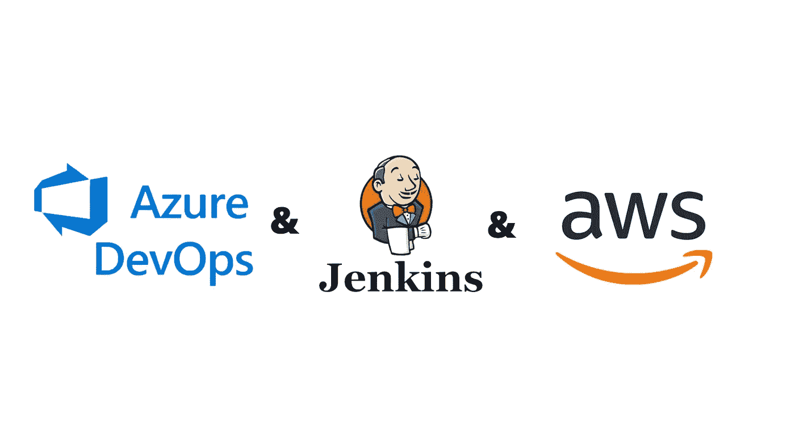

# 使用 Azure DevOps 和 Jenkins 的 Webhook 触发器

> 原文：<https://medium.com/globant/webhook-trigger-using-azure-devops-and-jenkins-75656c0c56c4?source=collection_archive---------0----------------------->

在本文中，我们将学习如何远程触发 Jenkins 作业。

# **简介-**

Azure DevOps 提供开发人员服务，允许团队规划工作、协作开发代码，以及构建和部署应用程序。

Jenkins 是一个开源自动化服务器，它使开发人员能够构建、测试和部署他们的软件。

触发器是执行作业的事件发生。Jenkins 中有五种类型的触发器:

1]远程构建触发器(即 webhook):当一个事件发生在一个端点 URL 上并且它需要一个认证令牌时触发。

2]在其他项目建立之后建立:如其所说，你需要指定其他项目的列表。当它们被构建时，当前项目开始构建。

3]定期构建:这就像一个 cron 任务。它在每个指定的时间间隔触发。

4]git SCM 轮询的 Github 钩子触发器:与 Github 钩子关联。

5]轮询 SCM:在被触发之前，它首先检查是否有任何变化。

在本文中，我们使用了第一个触发器。

轮询意味着向新事件发送请求，并等待端点对其做出响应。所以基本上当你使用 Poll SCM 时，它首先发送一个请求到一个端点来检查任何提交。如果有任何提交或新事件发生，那么只有它被触发。而 webhook 只有在端点发生新的提交时才会被触发。

本文将涵盖以下部分:

*   先决条件
*   履行
*   注意
*   结论

# **先决条件**

*   AWS 帐户
*   Azure DevOps 帐户

# **实现**

**步骤 1】****创建 Azure 资源库**

创建一个 Azure 存储库并添加一个 Jenkinsfile。下面是示例代码。

**步骤 2】****安装和配置 Jenkins**

通过 SSH 连接到您的 EC2 实例(使用公共 IP ),然后按照以下步骤安装 Jenkins，或者您可以在此处参考官方文档

状态应处于运行状态。

步骤 2a]在浏览器中粘贴公共 URL 并设置 Jenkins。

步骤 2b]连接到 EC2 实例并输入

*sudo cat/var/lib/Jenkins/secrets/initial admin password*

复制并粘贴密码，然后点击继续。并完成设置。

**步骤 3】创建服务挂钩**

在 Azure DevOps 中，转到项目设置–>服务挂钩–>创建订阅–>选择 Jenkins，然后单击下一步。选择要触发的事件并配置过滤器。

步骤 3a]在单击“下一步”之前，请转到 Jenkins –>单击右上角的用户名–>选择“配置”–>添加新令牌并将该令牌临时保存在其他地方并保存它。

步骤 3b]单击“下一步”并填写所需的详细信息。在 API 令牌下，粘贴上一步中创建的令牌。

步骤 3c]点击测试。如果它显示**成功，**那么我们就可以开始了，最后点击 Finish。

**步骤 4】创建和配置 Jenkins 管道**

创建新管道。

步骤 4a]要使用 Webhook 触发器，请选择远程构建触发器选项，并提供您的 Jenkins URL，如屏幕截图所示。

在 URL 的末尾，身份验证令牌可以是您选择的文本。

步骤 4b]运行脚本有两种方式，但我使用了第二种方式。

i]直接在管道中编写和嵌入脚本。

ii]通过给定来自 Azure DevOps 的 Git 凭证来访问 Jenkinsfile。

(转到 Azure DevOps 存储库–>点击克隆->生成 Git 凭证)

步骤 4c]保存管道。

步骤 4d]在 Jenkinsfile 中进行一些更改，并将更改推送到 repo 中。

几秒钟内，管道将自动触发。

# **注:**

在步骤 3 中，选择了代码推送触发器，因此当代码在回购中被推送时，管道被触发。类似地，您可以为构建完成、请求合并尝试和发布部署完成添加触发器。

# **结论:**

任务由 Webhook 和 Poll SCM 共同完成，虽然据统计，Poll SCM 浪费了近 98%的轮询，而 Webhook 以 100%的准确率完成操作。因此，Webhook 触发器是最有效的触发器。