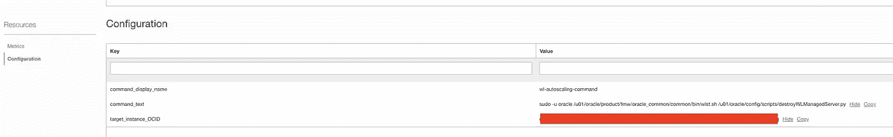

# OCI 上的 WebLogic 自动缩放

> 原文：<https://medium.com/oracledevs/weblogic-autoscaling-on-oci-a27a0c6608ad?source=collection_archive---------0----------------------->

# **简介**

客户迁移到云以利用云基础架构的优势。例如，如果您在 WebLogic 域中运行 java 应用程序，并且希望将 WebLogic 域迁移到其中一个云提供商(例如 OCI ),您可以在 OCI 上创建一个计算实例并安装 WebLogic 二进制文件，创建您的域，部署您的应用程序，最后在 WebLogic 集群前面提供一个应用程序负载平衡器，以在节点之间对流量进行负载平衡。

现在，您的应用程序迁移到了云中。但是你得到了什么好处呢？如果您的应用程序上的工作负载增加或减少会怎样。您能否自动扩展/纳入您的基础架构？

在本文中，我将解释如何在 OCI 计算自动伸缩的基础上提供 WebLogic 域(如果用户需要更改，可以自动扩展/扩展 WebLogic 域)。

# **建筑**

您可以创建 OCI 自动缩放来根据需求水平缩放您的应用程序。在我们的场景中，我们将配置 OCI 自动缩放，以便在流量增加时自动创建更多受管服务器并将其添加到 WebLogic 群集中，并在流量减少时停止受管服务器并将其从 WebLogic 群集中删除。

此图显示了 OCI 自动缩放如何与 Oracle WebLogic 配合使用。在此架构中，我们使用 OCI 文件存储作为共享存储来存储 WebLogic 二进制文件和 WebLogic 域配置。


这是该体系结构中的数据流:

1.  OCI 监视从自动扩展实例池中的实例收集利用率度量(CPU 或内存使用度量)。
2.  如果用户流量增加(例如平均 CPU 利用率超过%80)，OCI 监控会引发扩展事件。
3.  OCI 自动扩展将在实例池中存放新的计算实例。
4.  OCI 自动扩展将向 OCI 负载平衡器注册新的计算实例。
5.  新的计算实例装载文件存储。
6.  Linux systemd 服务将执行自定义 WLST 脚本(在实例成功启动后),以创建新的受管服务器并将其添加到 WebLogic 集群，然后启动受管服务器。
7.  如果用户流量减少(例如，平均 CPU 利用率低于%40)，OCI 监控会引发扩大事件。
8.  OCI 自动缩放将终止实例池中的一个实例(取决于实例池的最小大小)。
9.  实例终止事件将引发并执行 OCI 函数。
10.  OCI 函数将在 WebLogic 管理服务器实例中执行自定义脚本(使用 compute run 命令功能)以停止并从 WebLogic 集群中删除受管服务器。

> 在终止计算实例后(直接从 OCI 控制台启动终止或自动缩放启动终止)，我们不能在计算实例内执行任何自定义脚本(在我们的场景中，自定义脚本用于从 WebLogic 集群中删除受管服务器)。此功能(在实例终止前在计算实例内执行自定义脚本)将在未来的 OCI 版本中提供，但在我们的架构中，要从 WebLogic 集群中删除受管服务器，我必须使用 OCI 事件、OCI 函数和计算“运行命令”功能的组合来实现一个变通解决方案(我将详细解释该解决方案)。后来)。

# **实施步骤**

您可以使用以下步骤在 OCI 租赁中实现此架构(我假设您已经创建了所有网络先决条件，包括创建 VCN、子网、安全列表和路由表。我们需要非常简单的网络设计，包括一个 VCN，一个托管 WebLogic 域的专用子网，一个托管公共负载平衡器的公共子网和一个托管堡垒服务器的公共子网。请参考上面的架构图)。

> 您可以在这个 [git 资源库](https://github.com/omidizadkhasti/oci-weblogic-autoscaling)中找到本文使用的所有脚本(您需要根据您的环境更新 managedServer.properties 文件中的 WebLogic 参数)。

WebLogic 自定义脚本:

*   ***start services . sh****:*该脚本由 wl_server.service systemd 服务执行，并将执行 startWLServer.sh 脚本。
*   ***startwlserver . sh***:该脚本执行 startNM.sh 和 createWLManagedServer.py python 脚本，启动节点管理器，创建并启动 WebLogic 托管服务器。
*   ***createwlmanagedserver . py***:该脚本在实例预配并成功启动后执行，将创建新的 WebLogic 计算机和 WebLogic 托管服务器。创建受管服务器后，将启动受管服务器(此脚本使用计算 OCID 的最后 5 个字符来生成受管服务器名称)。
*   ***sttopwlserver . sh***:此脚本在实例关闭前执行，将在您关闭(不是终止)计算实例时执行 stopNM.sh 和 stopWLManagedServer.py python 脚本来停止节点管理器和 WebLogic 托管服务器。
*   ***stopwlmanagedserver . py***:该脚本将关闭在计算实例内部运行的 WebLogic 托管服务器。
*   ***startnm . sh****:*该脚本将节点管理器监听地址更改为 nodemanager.properties 文件中的计算机主机名，并将启动节点管理器(节点管理器 home 已设置为/opt/WLS-auto scaling/node manager 文件夹)。
*   ***stopnm . sh****:*这个脚本停止节点管理器。
*   ***destroywlsmanagedserver . py***:该脚本在管理服务器计算实例中执行，将在实例池中的计算实例终止后停止并删除受管服务器。该脚本还删除 WebLogic 计算机。

1.  **为 WebLogic 管理服务器预配计算实例。**


**2。提供文件存储(包括文件系统和安装 WebLogic 二进制文件和域的目标点)。**


**3。在管理服务器计算中挂载共享文件系统**

您需要执行以下命令:

WebLogic 文件夹结构(根据 Oracle 企业部署指南):

```
/u01/oracle/product contains binary files/u01/oracle/config contains domain files
```


**4。在/u01/oracle/product/fmw 文件夹(或您选择的文件夹)下安装 WebLogic 12.2.1.4 二进制文件**

**5。在/u01/oracle/product/jdk 文件夹(或您选择的文件夹)下安装 JDK 1.8。**

6。提供稍后将在“实例池”创建中使用的公共负载平衡器。


7。创建自定义图像

在 OCI 配置自动伸缩资源之前，我们需要创建自定义 Linux 映像，我们将使用它来配置实例池中的实例。

要创建此自定义映像，请使用 Oracle Linux 映像预配新的计算实例(最好使用与管理服务器计算实例相同的映像)。

在提供新的计算实例后，安装所有必需的包(如有必要，与 Python 3、OCI CLI 等相同)。)，创建 oracle 用户和组，并创建与管理服务器计算相同的文件夹(例如/u01/..)并将此文件夹挂载到在步骤 2 中调配的 OCI 文件存储(与管理服务器计算相同)。

您应该执行与 WebLogic 管理服务器计算相同的命令。

另外，在下面的路径中创建一个新文件夹，并将 git 存储库中的所有脚本复制到这个文件夹中。

```
/opt/wls-autoscaling
```


将*/opt/WLS-auto scaling/scripts*文件夹中的 wls_server.service 复制到 */etc/systemd/system* 文件夹，以 root 用户身份执行以下命令，将该脚本安装为 systemd 脚本(该脚本将在计算启动后执行)。

```
*sudo systemctl enable wls-server**# You can use following command to start or stop the service**sudo systemctl [start/stop/restart/status] wls-server*
```

此外，使用 root 用户创建以下防火墙规则(用于托管服务器和节点管理器端口)。

完成上述所有步骤后，您应该通过选择计算实例详细信息页面中的“创建自定义映像”选项来创建自定义映像。


8。使用自定义图像创建模板计算实例

在此步骤中，我们将使用在步骤 7 中创建的自定义映像来调配新的计算实例。


**9。从模板计算实例创建实例配置**

在此步骤中，我们将使用在步骤 8 中提供的模板实例来创建实例配置。为此，导航到实例详细信息页面，并从更多操作菜单中选择“创建实例配置”。


选择隔离专区，然后选择实例配置名称。


> 实例配置允许您定义创建计算实例时要使用的设置，您将在自动缩放实例池中使用这些计算实例。

10。创建实例池

创建实例配置后，我们可以通过导航到“实例配置详细信息”页面并选择“创建实例池”来创建实例池(或者您可以导航到 OCI 控制台中的“计算”->“实例池”并创建新的实例池，然后选择我们在步骤 9 中创建的实例配置)。


在下一个屏幕中，填充隔离专区、实例池名称，选择实例配置并设置池中实例的目标数量。


在下一个屏幕中，填充可用性域、容错域、VCN 和子网，以在实例池中配置实例(如果您所在的区域有多个 AD，您可以选择另一个 AD 来配置实例)。

最后，连接您在步骤 6 中设置的负载平衡器，并选择后端集和托管服务器监听端口。


创建实例池后，将提供新的计算实例(取决于实例数量的值)，并且 WebLogic 脚本将自动创建。并在计算实例启动后向 WebLogic 集群启动新的受管服务器(自定义脚本将使用 WLS- <last five="" character="" of="" compute="" ocid="">作为受管服务器名称)。</last>

您可以连接到 WebLogic 管理服务器来验证受管服务器的创建。


此外，您可以使用负载平衡器公共 IP 地址来验证配置。

```
[*http://<<Load Balancer Public IP>>/sample/*](http://168.138.7.87/sample/)
```

**11。创建自动缩放配置**

最后，我们将创建自动扩展配置，允许您自动调整实例池中计算实例的数量或生命周期状态。

导航到 OCI 控制台中的计算->自动扩展配置，然后选择创建新的自动扩展配置。


在下一个屏幕中，我们将使用性能指标创建自动扩展策略来添加/删除实例。在我们的场景中，我创建了一个策略，如果平均 CPU 利用率超过 80%,就向实例池添加新实例，如果平均 CPU 利用率低于 50%,就终止一个实例。


**12。创建 OCI 事件规则**

在接下来的几个步骤中，我将配置 OCI 事件规则、OCI 函数和计算机运行命令，以便在实例终止时从 WebLogic 集群中删除受管服务器和计算机。

导航到 OCI 控制台中的事件并创建新的事件规则。为事件类型“实例—终止开始”创建新规则，将 compartmentid 属性设置为包含计算实例的隔离专区 OCID。


为事件添加新操作，以便在事件引发时执行 OCI 函数(您可以添加另一个操作，以便在实例终止事件引发时发送通知电子邮件)。


13。创建 OCI 函数以在 WebLogic 管理服务器上执行命令

最后，我们需要创建新的 OCI 函数，以便在自动缩放策略引发实例池中的实例终止事件时执行。此函数从事件有效负载中获取实例 OCID，该事件有效负载将其传递给在 WebLogic 管理服务器实例中执行命令(destroyWLManagedServer.py 脚本)的函数(将实例 OCID 作为参数传递给自定义脚本)，以便在实例终止后从 WebLogic 域中删除受管服务器和计算机。

以下是实例终止事件引发时的 OCI 事件负载示例:

您可以在 git 资源库中找到 OCI 函数的源代码。

以下是创建和部署新 OCI 函数的步骤:

首先，您需要导航到 OCI 控制台中的开发人员服务->应用程序，并创建新的应用程序。


然后，您需要在应用程序中创建函数(首先，您需要创建函数 docker 映像，并将映像导入 OCI 注册表)。


此外，您需要创建以下功能配置:



***command_text*** :您要在目标实例中执行的命令。

***目标实例 OCID*** :要执行命令的目标实例的 OIC(在我们的场景中是 WebLogic 管理服务器计算 OICD)。

> 您可以按照本文档[从您的本地机器将该功能部署到 OCI 租赁。](https://docs.oracle.com/en-us/iaas/Content/Functions/Tasks/functionsuploading.htm)

最后，您需要更新事件动作中的函数信息，以便在事件引发时执行该函数。

**13。创建 OCI 动态组和策略**

OCI 函数需要在计算实例中创建命令的权限。

要创建这个权限，我们首先需要创建一个包含我们函数的动态组。导航到身份与安全->动态组，并创建新的动态组。


该动态组包括特定车厢内的所有功能(匹配车厢 OCID)。

然后，我们需要创建新策略，以允许我们创建的动态组在包含计算实例的隔离专区中管理实例-代理-命令-系列。

```
***Allow dynamic-group omid-fn-dg to manage instance-agent-command-family in compartment <<compartment that include compute instance>>***
```

*我关于 OCI WebLogic 自动缩放的文章到此结束。我只想强调这是在 OCI 或任何其他云提供商上实现 WebLogic 自动伸缩的解决方案之一(我们可以使用 WebLogic 动态集群，使用 WebLogic operator 在 Kubernetes 上配置 WebLogic，等等。).我还想鼓励在将工作负载迁移到云时使用云原生解决方案(而不是简单地将工作负载转移到云)。*

# 参考

*   [https://docs . Oracle . com/en-us/iaas/Content/Compute/Tasks/autoscalinginstancepools . htm](https://docs.oracle.com/en-us/iaas/Content/Compute/Tasks/autoscalinginstancepools.htm)
*   [https://docs . Oracle . com/en-us/iaas/Content/Events/Concepts/Events overview . htm](https://docs.oracle.com/en-us/iaas/Content/Events/Concepts/eventsoverview.htm)
*   [https://docs . Oracle . com/en-us/iaas/Content/Functions/Concepts/Functions overview . htm](https://docs.oracle.com/en-us/iaas/Content/Functions/Concepts/functionsoverview.htm)
*   [https://docs . Oracle . com/en-us/iaas/Content/Compute/Tasks/running commands . htm](https://docs.oracle.com/en-us/iaas/Content/Compute/Tasks/runningcommands.htm)