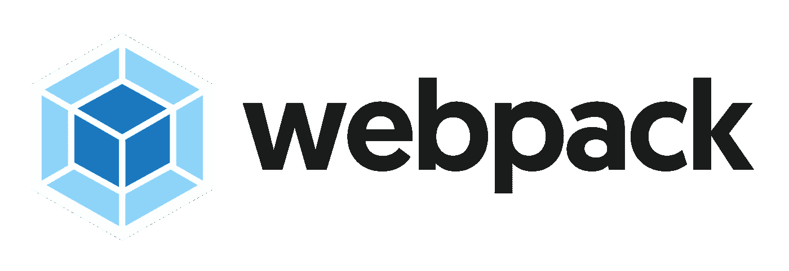

# webpack 优化—案例研究

> 原文：<https://medium.com/walmartglobaltech/webpack-optimization-a-case-study-92b130334b6c?source=collection_archive---------0----------------------->



S 自从我们从 [@WalmartLabs](https://medium.com/u/c884135151a4?source=post_page-----92b130334b6c--------------------------------) 开源了[电极](http://electrode.io)平台的一部分，我们已经对我们的 [NodeJS 和 ReactJS 原型](https://github.com/electrode-io/electrode/blob/0d7942ac91798cc7b48563e6c5cb67757c294bbc/docs/chapter1/intermediate/app-archetype/what-are-archetypes.md)模块做出了很多贡献，包括错误修复、新功能以及更新到 [*webpack*](https://github.com/webpack/webpack) 2.0。为了利用这些优势，我们正在迁移我们的内部应用程序以使用 OSS 版本。我们做的第一个应用是服务于[http://www.walmart.com](http://www.walmart.com)登陆页面的*主页*。在这篇博客中，我将谈谈我们在现实世界应用中使用最新原型发现的一些问题，以及我们实现的解决方案。

# **更新电极原型**

转换我们的*主页*应用程序以使用我们最新的 OSS 原型是相对简单的，因为我们已经在次要功能上保持我们内部的大部分同步。这个过程包括更新 *npm* 包和代码中的几个`require`调用，一切顺利。在那之后，通常的烟雾测试看起来都很好。开发模式启动时没有错误，并且本地提供了 walmart.com 的副本。生产构建也顺利完成。*到目前为止一切顺利，它还加强了我们原型的设计目标和灵活性——只需更新依赖关系，即可获得应用程序和 webpack 1.0 到 2.0 的所有新功能。*

我们提交了一份变更的 PR，希望它能通过 CI 和回归测试。然而，我们的主页技术负责人 Arunesh Joshi 在查看后发现了一些问题。原型中有一些小问题，比如林挺，很快就被修复了，但是 Arunesh 注意到捆绑的 CSS 和 JS 文件的大小显著增加了 30%以上。是时候做些调查了。

[在](https://medium.com/u/e53a2da4253b?source=post_page-----92b130334b6c--------------------------------) [@WalmartLabs](https://medium.com/u/c884135151a4?source=post_page-----92b130334b6c--------------------------------) 的电极团队成员盛迪，对 Arunesh 提出的问题做了一些调查工作，她在这里打开了 [PR 来解决棉绒问题。她发现增加的 CSS 大小是因为我们在更新到 *webpack* 2.0 时错误地删除了优化插件。她打开](https://github.com/electrode-io/electrode/pull/353)[这个 PR](https://github.com/electrode-io/electrode/pull/355) 来修复。关于 JS 包的大小，她检查了 *webpack* 的统计数据，发现来自`[**node-libs-browser**](https://github.com/webpack/node-libs-browser)`的一些模块在 *webpack* 2.0 对 1.0 中的大小有所增加。她还找到了[关于堆栈溢出](https://stackoverflow.com/questions/40467141/webpack2-node-libs-browser-exclude)的一个相关问题。这是一个很好的线索，也是深入挖掘的时间。

# **学习**学习`**NodeSourcePlugin**`

在我们试图找出为什么`[**node-libs-browser**](https://github.com/webpack/node-libs-browser)`代码的大小增加之前，更令人困惑的问题是，为什么我们还要从中提取代码？为了找出 JS 代码需要什么，对所有 JS 文件上的字符串`node-libs-browser`进行简单的递归 grep，包括那些在`**node_modules**`下的文件，得到了答案。下面是我使用的命令:

```
$ find . -type f -name "*.js*" | grep \.js[x]*\$ |  grep -v \/test\/ | grep -v \/example\/ |  grep -v \/dist\/ | xargs -n 20 grep node-libs-browser | less
```

**结果:**

```
./node_modules/webpack/lib/node/NodeSourcePlugin.js:const nodeLibsBrowser = require("node-libs-browser");./node_modules/webpack/lib/node/NodeSourcePlugin.js:                            return require.resolve(`node-libs-browser/mock/${module}`);./node_modules/webpack/lib/node/NodeSourcePlugin.js:                            return require.resolve("node-libs-browser/mock/empty");
```

在所有的**JS 代码中，只有一个来自 *webpack* 的文件`[**NodeSourcePlugin.js**](https://github.com/webpack/webpack/blob/2ba04991056475509a4e45599a1f42e91cce6233/lib/node/NodeSourcePlugin.js)`引用了`[**node-libs-browser**](https://github.com/webpack/node-libs-browser)`。为什么这会导致它被捆绑到我们的应用程序中？这让我开始研究 *webpack 的*文档和代码。**

****这是我发现的:****

*   ***webpack 的* [目标配置默认为](https://webpack.js.org/configuration/target/) `[web](https://webpack.js.org/configuration/target/)`**
*   **`web`目标默认[应用](https://github.com/webpack/webpack/blob/60824f1bab53aa7ffc74495ac9cee7a979a7983d/lib/WebpackOptionsApply.js#L75)一个内部插件`[**NodeSourcePlugin**](https://github.com/webpack/docs/wiki/internal-webpack-plugins#nodenodesourcepluginoptions)`，通过`[**node-libs-browser**](https://github.com/webpack/node-libs-browser)`自动使 NodeJS 内置模块可供浏览器使用。**

# **言归正传**

**我尝试的第一件事就是去掉`[**NodeSourcePlugin**](https://github.com/webpack/docs/wiki/internal-webpack-plugins#nodenodesourcepluginoptions)`。然而，在浏览了 *webpack 的*文档和代码后，似乎没有一种简单的方法可以用一个开关禁用它。我在这里提出了一个[问题](https://github.com/webpack/webpack/issues/4976)，在与 *webpack 的* [Tobias Koppers](https://medium.com/u/cccc522e775a?source=post_page-----92b130334b6c--------------------------------) 讨论之后，我们决定允许 [*webpack 的*](https://github.com/webpack/webpack/pull/4995) `[node](https://github.com/webpack/webpack/pull/4995)` [选项接受一个](https://github.com/webpack/webpack/pull/4995) `[false](https://github.com/webpack/webpack/pull/4995)` [配置](https://github.com/webpack/webpack/pull/4995)。**

**随着`[**NodeSourcePlugin**](https://github.com/webpack/docs/wiki/internal-webpack-plugins#nodenodesourcepluginoptions)`被禁用，我们依赖于它的代码全部失败，我能够在我们的数百个组件中精确定位，查看哪一个。**

**我发现一些只有服务器端行为的组件通过 [exenv](https://www.npmjs.com/package/exenv) 提供的运行时标志来实现它，就像这样:**

```
import { canUseDOM } from "exenv"function foo() { if (**!canUseDOM**) { const crypto = require("crypto") // do something with crypto
  }
}
```

**想法很简单，如果代码不在浏览器上执行，那么只使用`crypto`模块在服务器端做一些事情。遗憾的是， *webpack* 只做静态分析，找出需要捆绑哪些代码。这意味着 NodeJS `crypto`被包括在内，尽管它只是服务器端需要的。甚至在我们使用 webpack 1.0 的时候，这一点已经被忽视了一段时间。**

# ****解决方案****

**为了解决这个问题，我将所有服务器端代码提取到另一个 *npm* 模块中。在它的`package.json`中，我将`**browser**`字段指向一个包含空函数的虚拟 JS 文件，将`**main**`字段指向真正的实现。*最终结果是在优化的包中减少了* `*100K*` *。***

**我们还有一些引用 NodeJS 内置模块的组件，比如`path`和`util`。即使它们很小，我仍然计划重构它们，这样我们就可以不再依赖`[**NodeSourcePlugin**](https://github.com/webpack/docs/wiki/internal-webpack-plugins#nodenodesourcepluginoptions)`。在我们下一个主要的原型版本中，我将默认关闭它，以防止任何代码引入大量的服务器端代码。如果`[**NodeSourcePlugin**](https://github.com/webpack/docs/wiki/internal-webpack-plugins#nodenodesourcepluginoptions)`允许将 NodeJS 内置切换到仅白名单模式而不是默认启用的所有模式，那就太好了。**

# ****结论****

**由于 *webpack 的*默认包含了`[**NodeSourcePlugin**](https://github.com/webpack/docs/wiki/internal-webpack-plugins#nodenodesourcepluginoptions)`，有一个副作用是，如果你的服务器端代码只被运行时标志关闭，它们将被捆绑。当您有大型项目，有许多团队在数百个组件上工作时，这是很难跟踪的。我们遇到了这个问题，我们的捆绑包无意中包含了`100K`精简代码。我用 *webpack 对`package.json`中`**browser**`字段的*支持修复了它。我建议你也在你的应用程序中仔细检查这一点。我计划在原型模块中默认关闭插件，以便更容易发现这个问题。**

# ****喊出****

**非常感谢[@ walmartlab](https://medium.com/u/c884135151a4?source=post_page-----92b130334b6c--------------------------------)*主页*技术负责人 [Arunesh Joshi](https://medium.com/u/f034b4cfef9f?source=post_page-----92b130334b6c--------------------------------) 总是第一个帮助我们开发新功能，[电极](http://electrode.io)团队成员[盛迪](https://medium.com/u/e53a2da4253b?source=post_page-----92b130334b6c--------------------------------)为平台和此次更新所做的出色工作，当然还有令人惊叹的 *webpack* 贡献者，特别是 [Tobias Koppers](https://medium.com/u/cccc522e775a?source=post_page-----92b130334b6c--------------------------------) 所做的一切。**

**当然还有[戴夫·史蒂文斯](https://medium.com/u/9f42c93e61de?source=post_page-----92b130334b6c--------------------------------)对此的评论。**