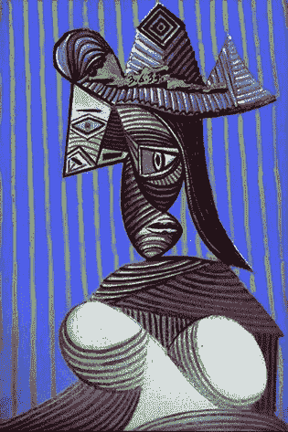
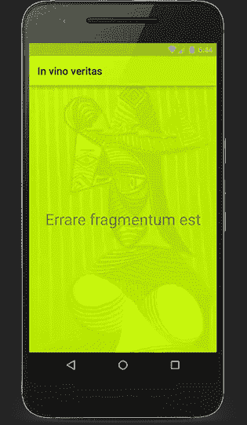
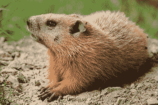
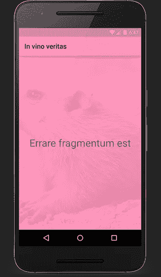
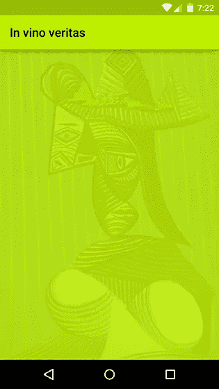
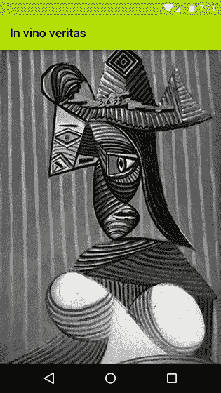
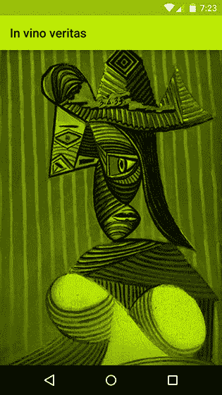
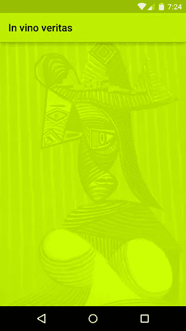
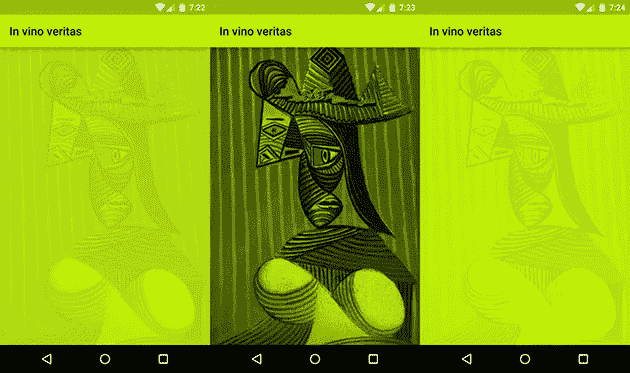

# 欢迎来到(彩色)矩阵

> 原文：<https://medium.com/square-corner-blog/welcome-to-the-color-matrix-64d112e3f43d?source=collection_archive---------2----------------------->

## 结合毕加索和色彩矩阵来转换图像。

*作者写的*[](https://twitter.com/Piwai)**。**

> *注意，我们已经行动了！如果您想继续了解 Square 的最新技术内容，请访问我们的新家[https://developer.squareup.com/blog](https://developer.squareup.com/blog)*

**这篇文章以分享一个很酷的技巧的内部邮件帖子开始。我对下面描述的问题没有什么正式的了解，并且采取了一种经验主义的方法。欢迎在评论中反馈！**

# *规范*

*我正在开发一个新的屏幕，上面显示一个下载的图片，上面有一个标题和以下限制:*

*   *屏幕应该用运行时确定的颜色为主题；*
*   ***图像应着色为该颜色**；*
*   *顶部的文本应该**可读**并且图像不应该窃取用户的注意力；和*
*   *图像的细节应该仍然可见。*

*一位设计师给我发了一些样品:*

## *示例背景图像*

**

## *主题颜色#beef00 的预期结果*

**

## *示例背景图像*

**

*来源:[维基百科](https://commons.wikimedia.org/wiki/File:Marmota_monax_UL_04.jpg)，许可:[Attribution-Share like 3.0 未发布](https://creativecommons.org/licenses/by-sa/3.0/deed.en)*

## *主题颜色#ff93b9 的预期结果*

**

*我们如何动态地给这些图像着色？*

# *覆盖物*

*我的第一个直觉是**添加一层目标颜色**在图像上面，透明度为**alpha**。*

*用 [Picasso:](http://github.com/square/picasso/) 加载和转换图像很容易*

```
*Picasso**.**with**(this)**
    **.**load**(**imageUrl**)**
    **.**fit**()**
    **.**centerCrop**()**
    **.**transform**(new** **ColorLayer(**0xffbeef00**))**
    **.**into**(**imageView**);***
```

*下面是如何在位图上绘制颜色:*

```
***public** **class** **ColorLayer** **implements** Transformation **{**
  **private** **final** **int** destinationColor**;** **public** **ColorLayer(int** destinationColor**)** **{**
    **this.**destinationColor **=** destinationColor**;**
  **}** @Override **public** Bitmap **transform(**Bitmap source**)** **{**
    Canvas canvas **=** **new** **Canvas(**source**);**
    **int** dr **=** Color**.**red**(**destinationColor**);**
    **int** dg **=** Color**.**green**(**destinationColor**);**
    **int** db **=** Color**.**blue**(**destinationColor**);**
    canvas**.**drawColor**(**Color**.**argb**(**220**,** dr**,** dg**,** db**));**
    **return** source**;**
  **}** @Override **public** String **key()** **{**
    String hexColor **=** String**.**format**(**"#%08x"**,** destinationColor**);**
    **return** "color-layer(destinationColor=" **+** hexColor **+** ")"**;**
  **}**
**}***
```

**

*还可以，但不是很棒。原始图像中的**颜色**是中的**出血，例如，你可以看到女人脸上红色的暗示。***

*我和设计师坐下来了解模型是如何组装的。他使用混合模式将图像与一个彩色层合并——带有一定程度的不透明度。他调整了每个例子，以找到完美的模式和值，使结果看起来很好。*

*虽然这是一个很好的经验方法，但是很难转化为代码。我们尝试了更多的例子，但始终无法找到适合所有情况的通用模式和值。*

*让我们后退一步:我们想给一幅图像着色。我们可以先建立一个图像的灰度版本，然后给它上色(感谢罗曼·盖伊的主意!)).*

# *灰度等级*

*在灰度中，像素的 RGB 通道共享相同的值。一种常见的方法是将亮度计算为偏向绿色的加权平均值，因为人眼对绿色更敏感。*

```
***int** color **=** Color**.**CYAN**;**
**int** grayChannel **=** **(int)** **(**0.2126f ***** Color**.**red**(**color**)** *//* 
    **+** 0.7152f **+** Color**.**green**(**color**)** *//*
    **+** 0.0722f ***** Color**.**blue**(**color**));**
**int** colorInGrayscale **=** Color**.**rgb**(**grayChannel**,** grayChannel**,** grayChannel**);***
```

*我们可以在每个像素上循环，如[之前的帖子](http://corner.squareup.com/2013/01/transparent-jpegs.html)所示，但那不会很有效率。相反，我们将使用一个[颜色矩阵](http://developer.android.com/reference/android/graphics/ColorMatrix.html)用颜色过滤器在画布上绘制。*

## *ColorMatrix Javadoc*

*用于转换位图的颜色和 alpha 分量的 4x5 矩阵。矩阵可以作为单个数组传递，处理方式如下:*

```
*[ a, b, c, d, e,
    f, g, h, i, j,
    k, l, m, n, o,
    p, q, r, s, t ]*
```

*当应用于颜色[R，G，B，A]时，结果颜色计算如下:*

```
*R’ = a*R + b*G + c*B + d*A + e
   G’ = f*R + g*G + h*B + i*A + j
   B’ = k*R + l*G + m*B + n*A + o
   A’ = p*R + q*G + r*B + s*A + t*
```

*让我们应用我们的灰度公式。这是我们想要的:*

```
*R’ = 0.2126*R + 0.7152*G + 0.0722*B
   G’ = 0.2126*R + 0.7152*G + 0.0722*B
   B’ = 0.2126*R + 0.7152*G + 0.0722*B
   A’ = 1*
```

*所以我们的颜色矩阵应该是:*

```
*[ 0.2126, 0.7152, 0.0722, 0, 0,
    0.2126, 0.7152, 0.0722, 0, 0,
    0.2126, 0.7152, 0.0722, 0, 0,
    0, 0, 0, 0, 1 ]*
```

*我们可以通过使用带有颜色矩阵颜色过滤器的画图将位图绘制到画布上来应用颜色矩阵:*

```
***public** **class** **Grayscale** **implements** Transformation **{**
  @Override **public** Bitmap **transform(**Bitmap source**)** **{**
    **float** lr **=** 0.2126f**;**
    **float** lg **=** 0.7152f**;**
    **float** lb **=** 0.0722f**;** ColorMatrix matrix **=** **new** **ColorMatrix(new** **float[]** **{**
        lr**,** lg**,** lb**,** 0**,** 0**,** *//*
        lr**,** lg**,** lb**,** 0**,** 0**,** *//*
        lr**,** lg**,** lb**,** 0**,** 0**,** *//*
        0**,** 0**,** 0**,** 0**,** 255**,** *//*
    **});** ColorMatrixColorFilter filter **=** **new** **ColorMatrixColorFilter(**matrix**);**
    Paint paint **=** **new** **Paint();**
    paint**.**setColorFilter**(**filter**);**

    **int** width **=** source**.**getWidth**();**
    **int** height **=** source**.**getHeight**();**
    Bitmap destination **=** createBitmap**(**width**,** height**,** ARGB_8888**);** Canvas canvas **=** **new** **Canvas(**destination**);**
    canvas**.**drawBitmap**(**source**,** 0**,** 0**,** paint**);**
    source**.**recycle**();**
    **return** destination**;**
  **}** @Override **public** String **key()** **{**
    **return** "grayscale()"**;**
  **}**
**}***
```

**

# *色彩*

*要应用色调，我们只需将每个通道乘以色调中相应的通道。*

```
*Rtint = red(tint) / 255
   Gtint = green(tint) / 255
   Btint = blue(tint) / 255 R’ = Rtint * (0.2126*R + 0.7152*G + 0.0722*B)
   G’ = Gtint * (0.2126*R + 0.7152*G + 0.0722*B)
   B’ = Btint * (0.2126*R + 0.7152*G + 0.0722*B)
   A’ = 1*
```

*换句话说，我们需要将灰度矩阵与下面的色调矩阵连接起来:*

```
*[ Rtint, 0, 0, 0, 0,
    0, Gtint, 0, 0, 0,
    0, 0, Btint, 0, 0,
    0, 0, 0, 0, 1 ]*
```

*下面是它如何翻译成代码:*

```
***public** **class** **Tint** **implements** Transformation **{**
  **private** **final** **int** destinationColor**;** **public** **Tint(int** destinationColor**)** **{**
    **this.**destinationColor **=** destinationColor**;**
  **}** @Override **public** Bitmap **transform(**Bitmap source**)** **{**
    **float** lr **=** 0.2126f**;**
    **float** lg **=** 0.7152f**;**
    **float** lb **=** 0.0722f**;** ColorMatrix grayscaleMatrix **=** **new** **ColorMatrix(new** **float[]** **{**
        lr**,** lg**,** lb**,** 0**,** 0**,** *//*
        lr**,** lg**,** lb**,** 0**,** 0**,** *//*
        lr**,** lg**,** lb**,** 0**,** 0**,** *//*
        0**,** 0**,** 0**,** 0**,** 255**,** *//*
    **});**

    **int** dr **=** Color**.**red**(**destinationColor**);**
    **int** dg **=** Color**.**green**(**destinationColor**);**
    **int** db **=** Color**.**blue**(**destinationColor**);**
    **float** drf **=** dr **/** 255f**;**
    **float** dgf **=** dg **/** 255f**;**
    **float** dbf **=** db **/** 255f**;** ColorMatrix tintMatrix **=** **new** **ColorMatrix(new** **float[]** **{**
        drf**,** 0**,** 0**,** 0**,** 0**,** *//*
        0**,** dgf**,** 0**,** 0**,** 0**,** *//*
        0**,** 0**,** dbf**,** 0**,** 0**,** *//*
        0**,** 0**,** 0**,** 1**,** 0**,** *//*
    **});** tintMatrix**.**preConcat**(**grayscaleMatrix**);** ColorMatrixColorFilter filter **=** **new** **ColorMatrixColorFilter(**tintMatrix**);**
    Paint paint **=** **new** **Paint();**
    paint**.**setColorFilter**(**filter**);** **int** width **=** source**.**getWidth**();**
    **int** height **=** source**.**getHeight**();**
    Bitmap destination **=** createBitmap**(**width**,** height**,** ARGB_8888**);** Canvas canvas **=** **new** **Canvas(**destination**);**
    canvas**.**drawBitmap**(**source**,** 0**,** 0**,** paint**);**
    source**.**recycle**();** **return** destination**;**
  **}** @Override **public** String **key()** **{**
    String hexColor **=** String**.**format**(**"#%08x"**,** destinationColor**);**
    **return** "tint(destinationColor=" **+** hexColor **+** ")"**;**
  **}**
**}***
```

**

*图像按照预期着色，但是结果仍然不太好。我们希望顶部的文本是可读的，并且不希望它下面的图像偷走用户的注意力。*

*Roman Nurik 写了一篇很棒的文章，讲述了他是如何为 Muzei 设计出模糊壁纸图像的，我想我们可以试试模糊技术。然而，我们的设计团队希望图像细节是可见的。*

# *对比*

*这是怎么回事？有太多的黑色和太多的对比。*

*每个像素的亮度在 0(黑色)和 255(白色)之间，我们将它乘以通道颜色(比如红色)。因此，我们有效地将其缩放到[0，通道值]，这意味着黑人将保持黑色，而白人将变成我们的目标颜色。*

*仔细想想，我们实际上想要的是每个像素都是自定义的颜色，加上/减去一些变化，让图像细节通过对比在背景中显现出来。*

*换句话说，我们希望重新调整灰度图像，使其具有较低的对比度，并将其色调转移到目标颜色的中心。*

*例如，如果我的自定义颜色为红色= 100，而我希望对比度幅度仅为 20%，我们希望将[0，255]红色通道转换为仅 0.2 * 255 = 51 个以 100 为中心的值(即，我们应该将红色通道从[0，255]转换为[75，126])。*

*让我们应用这个比例，并转化为我们的颜色矩阵:*

```
***public** **class** **Scaled** **implements** Transformation **{**
  **private** **final** **int** destinationColor**;** **public** **Scaled(int** destinationColor**)** **{**
    **this.**destinationColor **=** destinationColor**;**
  **}** @Override **public** Bitmap **transform(**Bitmap source**)** **{**
    **float** lr **=** 0.2126f**;**
    **float** lg **=** 0.7152f**;**
    **float** lb **=** 0.0722f**;** ColorMatrix grayscaleMatrix **=** **new** **ColorMatrix(new** **float[]** **{**
        lr**,** lg**,** lb**,** 0**,** 0**,** *//*
        lr**,** lg**,** lb**,** 0**,** 0**,** *//*
        lr**,** lg**,** lb**,** 0**,** 0**,** *//*
        0**,** 0**,** 0**,** 0**,** 255**,** *//*
    **});** **int** dr **=** Color**.**red**(**destinationColor**);**
    **int** dg **=** Color**.**green**(**destinationColor**);**
    **int** db **=** Color**.**blue**(**destinationColor**);**
    **float** drf **=** dr **/** 255f**;**
    **float** dgf **=** dg **/** 255f**;**
    **float** dbf **=** db **/** 255f**;** ColorMatrix tintMatrix **=** **new** **ColorMatrix(new** **float[]** **{**
        drf**,** 0**,** 0**,** 0**,** 0**,** *//*
        0**,** dgf**,** 0**,** 0**,** 0**,** *//*
        0**,** 0**,** dbf**,** 0**,** 0**,** *//*
        0**,** 0**,** 0**,** 1**,** 0**,** *//*
    **});** tintMatrix**.**preConcat**(**grayscaleMatrix**);** *// Contrast amplitude of 20%*
    **float** scale **=** 0.2f**;**
    **float** translate **=** 1 **-** scale ***** 0.5f**;** ColorMatrix scaleMatrix **=** **new** **ColorMatrix(new** **float[]** **{**
        scale**,** 0**,** 0**,** 0**,** dr ***** translate**,** *//*
        0**,** scale**,** 0**,** 0**,** dg ***** translate**,** *//*
        0**,** 0**,** scale**,** 0**,** db ***** translate**,** *//*
        0**,** 0**,** 0**,** 1**,** 0**,** *//*
    **});** scaleMatrix**.**preConcat**(**tintMatrix**);** ColorMatrixColorFilter filter **=** **new** **ColorMatrixColorFilter(**scaleMatrix**);**
    Paint paint **=** **new** **Paint();**
    paint**.**setColorFilter**(**filter**);** **int** width **=** source**.**getWidth**();**
    **int** height **=** source**.**getHeight**();**
    Bitmap destination **=** createBitmap**(**width**,** height**,** ARGB_8888**);** Canvas canvas **=** **new** **Canvas(**destination**);** canvas**.**drawBitmap**(**source**,** 0**,** 0**,** paint**);**
    source**.**recycle**();**
    **return** destination**;**
  **}** @Override **public** String **key()** **{**
    String hexColor **=** String**.**format**(**"#%08x"**,** destinationColor**);**
    **return** "scaled(destinationColor=" **+** hexColor **+** ")"**;**
  **}**
**}***
```

*[Jed Parson](http://jedparsons.com/) 指出，对于暗的目标颜色，对比度感觉更柔和，他建议对比度幅度应该根据目标颜色的相对亮度而变化。*

*我将比例因子改为 1 减去目标颜色的亮度:*

```
***public** **class** **ScaledConstrast** **implements** Transformation **{**
  **private** **final** **int** destinationColor**;** **public** **ScaledConstrast(int** destinationColor**)** **{**
    **this.**destinationColor **=** destinationColor**;**
  **}** @Override **public** Bitmap **transform(**Bitmap source**)** **{**
    **float** lr **=** 0.2126f**;**
    **float** lg **=** 0.7152f**;**
    **float** lb **=** 0.0722f**;** ColorMatrix grayscaleMatrix **=** **new** **ColorMatrix(new** **float[]** **{**
        lr**,** lg**,** lb**,** 0**,** 0**,** *//*
        lr**,** lg**,** lb**,** 0**,** 0**,** *//*
        lr**,** lg**,** lb**,** 0**,** 0**,** *//*
        0**,** 0**,** 0**,** 0**,** 255**,** *//*
    **});** **int** dr **=** Color**.**red**(**destinationColor**);**
    **int** dg **=** Color**.**green**(**destinationColor**);**
    **int** db **=** Color**.**blue**(**destinationColor**);**
    **float** drf **=** dr **/** 255f**;**
    **float** dgf **=** dg **/** 255f**;**
    **float** dbf **=** db **/** 255f**;** ColorMatrix tintMatrix **=** **new** **ColorMatrix(new** **float[]** **{**
        drf**,** 0**,** 0**,** 0**,** 0**,** *//*
        0**,** dgf**,** 0**,** 0**,** 0**,** *//*
        0**,** 0**,** dbf**,** 0**,** 0**,** *//*
        0**,** 0**,** 0**,** 1**,** 0**,** *//*
    **});** tintMatrix**.**preConcat**(**grayscaleMatrix**);** **float** lDestination **=** drf ***** lr **+** dgf ***** lg **+** dbf ***** lb**;**
    **float** scale **=** 1f **-** lDestination**;**
    **float** translate **=** 1 **-** scale ***** 0.5f**;** ColorMatrix scaleMatrix **=** **new** **ColorMatrix(new** **float[]** **{**
        scale**,** 0**,** 0**,** 0**,** dr ***** translate**,** *//*
        0**,** scale**,** 0**,** 0**,** dg ***** translate**,** *//*
        0**,** 0**,** scale**,** 0**,** db ***** translate**,** *//*
        0**,** 0**,** 0**,** 1**,** 0**,** *//*
    **});** scaleMatrix**.**preConcat**(**tintMatrix**);** ColorMatrixColorFilter filter **=** **new** **ColorMatrixColorFilter(**scaleMatrix**);**
    Paint paint **=** **new** **Paint();**
    paint**.**setColorFilter**(**filter**);** **int** width **=** source**.**getWidth**();**
    **int** height **=** source**.**getHeight**();**
    Bitmap destination **=** createBitmap**(**width**,** height**,** ARGB_8888**);** Canvas canvas **=** **new** **Canvas(**destination**);** canvas**.**drawBitmap**(**source**,** 0**,** 0**,** paint**);**
    source**.**recycle**();**
    **return** destination**;**
  **}** @Override **public** String **key()** **{**
    String hexColor **=** String**.**format**(**"#%08x"**,** destinationColor**);**
    **return** "scaled-contrast(destinationColor=" **+** hexColor **+** ")"**;**
  **}**
**}***
```

**

# *文本*

*我们现在需要做的就是在我们的图像上添加一个带有正确文本颜色的 TextView。幸运的是，支持库提供了 ColorUtils 来做到这一点。*

*这是一个受 Palette 启发的简单实现。swatch . ensuretextcolorsgenerated():*

```
***private** **int** **computeTitleColor(int** destinationColor**)** **{**
  **int** titleAlpha **=** ColorUtils**.**calculateMinimumAlpha**(**Color**.**WHITE**,** destinationColor**,** 3.0f**);**
  **int** titleColor**;**
  **if** **(**titleAlpha **!=** **-**1**)** **{**
    titleColor **=** ColorUtils**.**setAlphaComponent**(**Color**.**WHITE**,** titleAlpha**);**
  **}** **else** **{**
    titleAlpha **=** ColorUtils**.**calculateMinimumAlpha**(**Color**.**BLACK**,** destinationColor**,** 3.0f**);**
    titleColor **=** ColorUtils**.**setAlphaComponent**(**Color**.**BLACK**,** titleAlpha**);**
  **}**
  **return** titleColor**;**
**}***
```

**

# *结论*

**

*通过将 Picasso 与颜色矩阵相结合，我们能够快速迭代我们的图像转换，以获得符合我们需求的输出。*

*欢迎在评论中提供反馈和更多见解！*

*[](https://twitter.com/Piwai) [## 皮埃尔-伊夫·里考(@皮瓦伊)|推特

### Pierre-Yves Ricau (@Piwai)的最新推文。安卓贝克@广场。巴黎/旧金山

twitter.com](https://twitter.com/Piwai)*