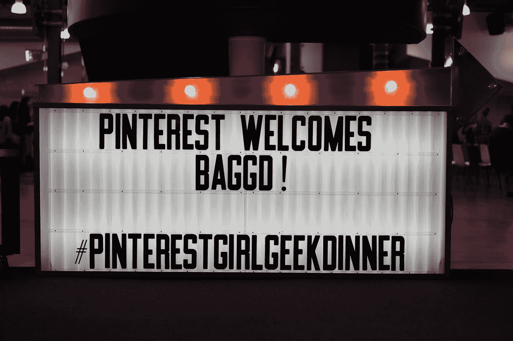
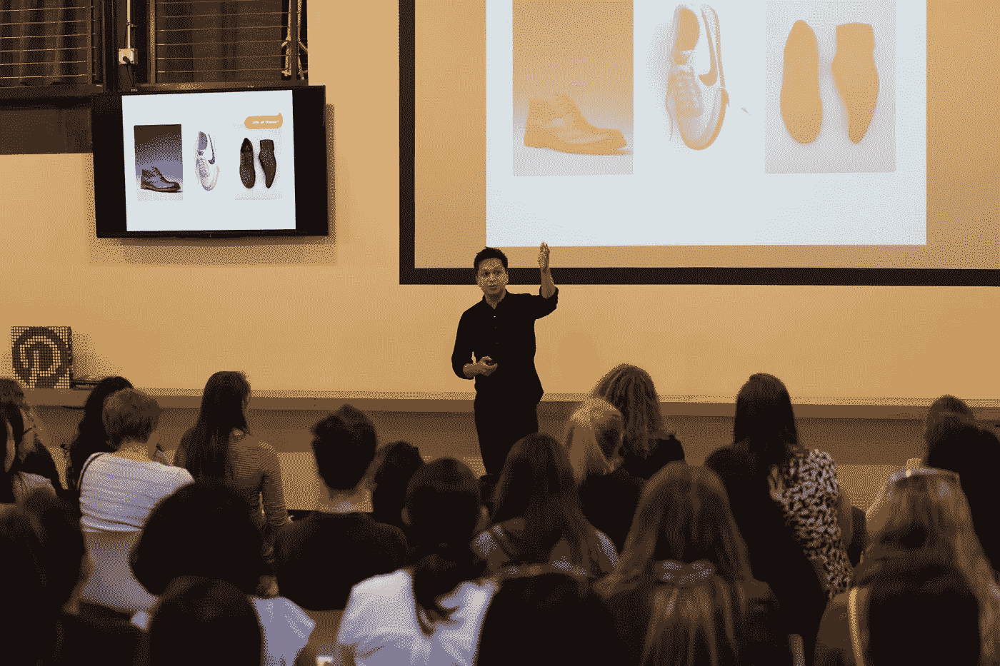
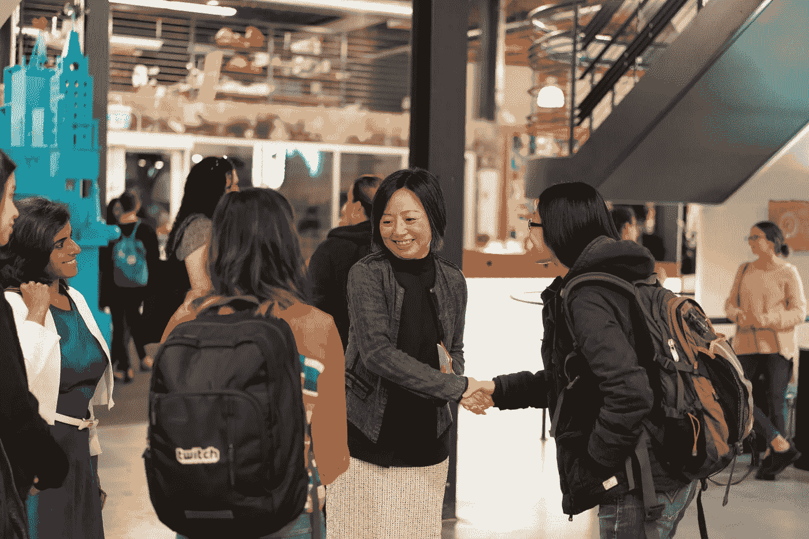
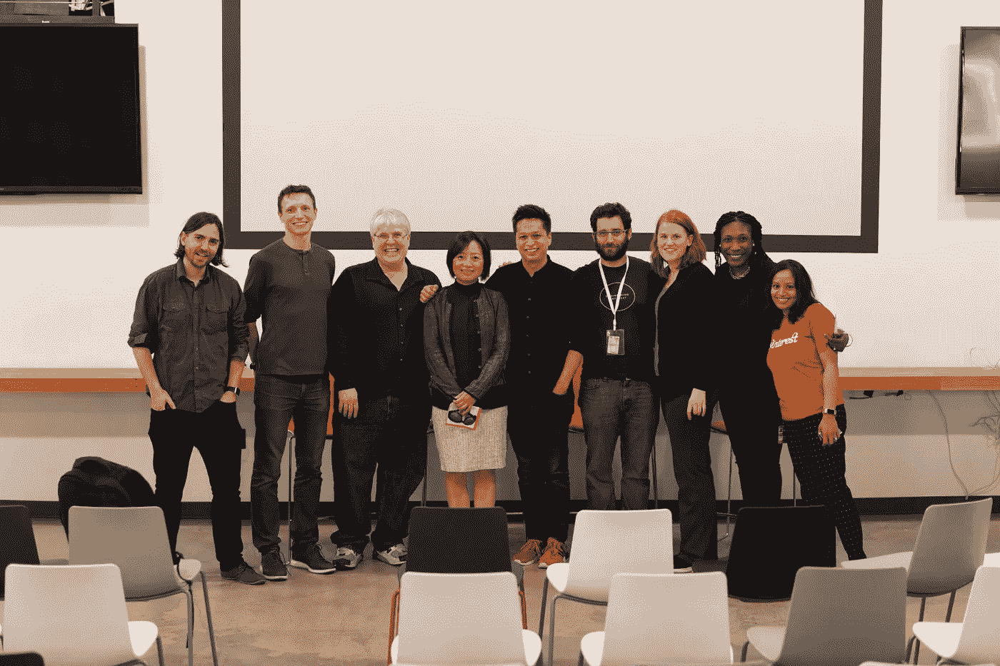
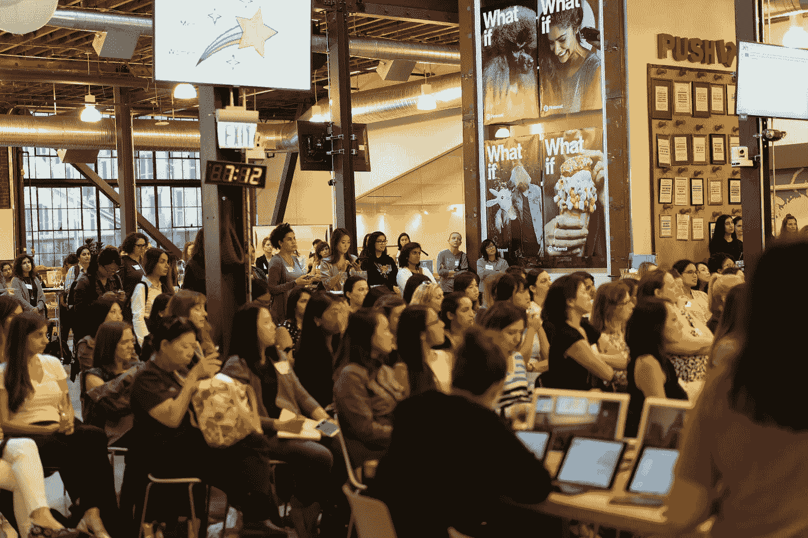
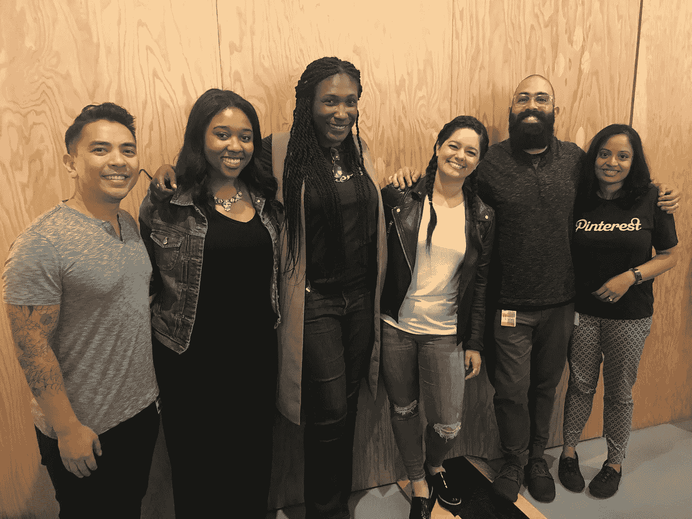

# 欢迎湾区女孩参加 Pinterest 的极客晚宴

> 原文：<https://medium.com/pinterest-engineering/welcoming-bay-area-girl-geek-dinner-to-pinterest-dccdaaf6a979?source=collection_archive---------7----------------------->

Kinnary Jangla | Pinterest 工程师，发现

*“赋权女性赋权女性！”*在 Pinterest，我们坚信这一点！无论你是谁，无论你做什么，无论你的身份如何，你都有权属于任何行业。你的天赋和技能不是由你的性别或信仰决定的。我们一直在努力确保在 Pinterest 工作的每个人都有一个属于自己的安全和赋权的地方，这就是为什么我们最近很自豪地接待了 200 多名科技界女性，作为湾区女孩极客晚宴的一部分。

作为 Pinterest 的一名女工程师，我觉得我的工作非常有价值，而且大部分是从领导层开始的。我们的联合创始人兼首席执行官本·希伯尔曼开启了这个夜晚，并分享了 Pinterest 早期的故事以及如何建立一个强大而包容的团队。任何工程机构都是找人才的，但是当人才和同理心、公平、平等结婚的时候，神奇的事情就发生了！

在 Ben 之后，范丽工程部负责人、首席技术官 Vanja Josifovski 以及包容性和多样性部负责人 Candice Morgan 在一个专题小组中就从消除工作场所的性别偏见到技术挑战等主题进行了发言。

工程师 Zhefei Yu 后来讨论了 Pinterest 的视觉搜索，包括镜头和物体检测，并深入研究了该团队如何使用计算机视觉和深度学习技术构建我们的最新功能。她还谈到了产品如何发展，包括技术努力和产品设计，以更好地帮助我们的用户。看下面视频里她的谈话。

此外，产品经理 Frances Haugen 讨论了减轻机器学习中的偏见。她讲述了机器学习如何只在我们有意设计我们的系统时才是客观的，以及我们必须如何意识到通过历史参与模式和训练数据选择引入我们系统的偏见。

每一个这样的事件发生时，当这么多的妇女聚集在一起，它会让这个世界更加强大。它为妇女多年来面临的现有问题提供了视角，并继续与这些问题作斗争。它启迪了如此多的人，激励了许多其他人。

我们致力于让 Pinterest 成为一个非常多元化、公平和有趣的工作场所。感谢 BAGGD 让我们成为他们工作的一部分！

*随时关注 Pinterest 上的工程事件和新闻* [*Pinterest 上的*](https://www.pinterest.com/malorie/pinterest-engineering-news/)*[*脸书*](https://www.facebook.com/pinterestengineering/) *和* [*推特*](https://twitter.com/PinterestEng) *。想加入我们吗？查看我们的* [*招聘页面*](https://careers.pinterest.com/careers/engineering) *。**

********

*Big thank you to the team that made this happen!*