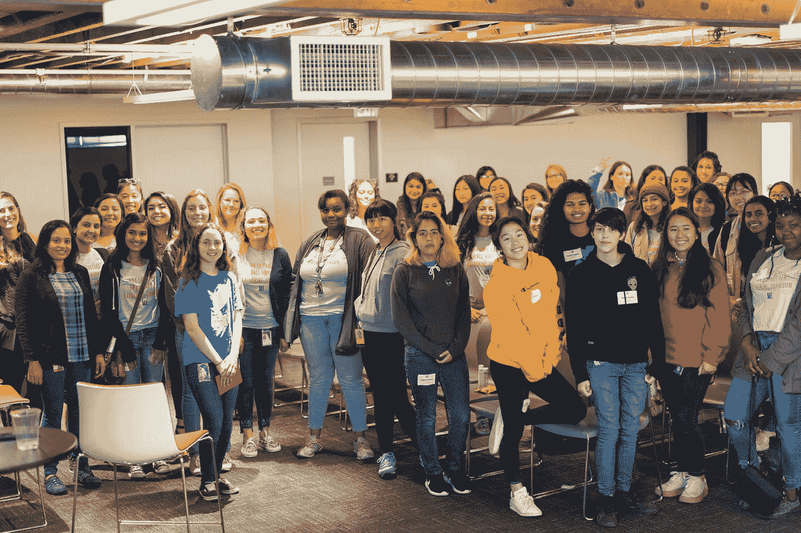
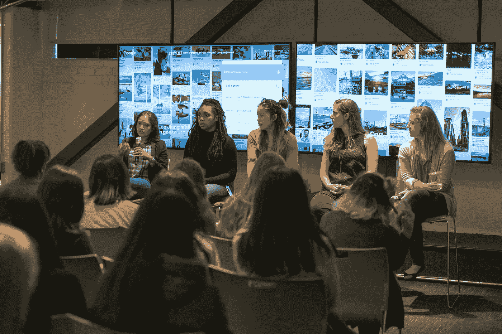
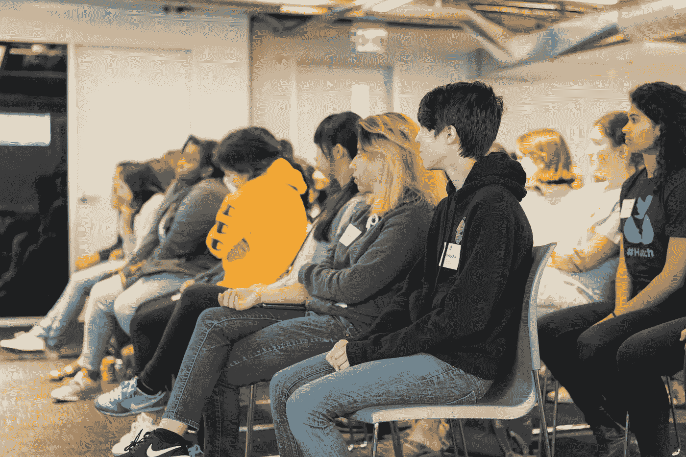

# 欢迎在 Pinterest 写代码的女孩

> 原文：<https://medium.com/pinterest-engineering/welcoming-girls-who-code-at-pinterest-29b16f076252?source=collection_archive---------6----------------------->

悉尼·布伦森|多元化项目专家

在过去的三个夏天里，我们主办了[编程女孩暑期浸入式项目](https://girlswhocode.com/summer-immersion-programs/)，该项目鼓励初高中学生利用暑期学习如何编程。今年，46 名学生参加了 Pinterest 工程师为期一天的活动，包括简历制作会议、编码研讨会和面试培训。

这一天以 Pinterest 工程师小组讨论他们的个人和职业旅程而结束。小组成员包括 Kinnary Jangla(发现工程)、Elsa Birch(合作伙伴工程)、Zaria Howard(工程实习生)、Christina Lee (Android 工程师)和 Michelle Vu(核心体验工程)。

## 看了一天

From left to right: Kinnary Jangla, Zaria Howard, Michelle Vu, Christina Lee, Elsa Birch

*“我从小就没有野心。我认为在成长过程中没有野心也没关系。只要你追随自己的激情，生活会过得很好。”*她还分享道，*“你不需要数学就能成为一名计算机科学家。你需要想当侦探、想解决问题的欲望。”* — Kinnary Jangla，Pinterest 工程师

*“重要的一点是你有多少种方法可以让科技‘正确’几乎没有一个小组成员有传统的技术背景。看到人们以多种不同的方式接触技术，以及他们如何将技术变成他们自己的，利用以前的经验，利用他们的个人优势为他们的团队做出贡献，这是令人鼓舞的。当看着这些来自 GWC 的女孩时，我很兴奋她们面前有各种不同的方式来度过她们的大学时光，以及她们会说些什么，这些经历如何在另一个 10 年里塑造了她们，回顾像她们一样的年轻女孩。克里斯蒂娜·李，Pinterest 的工程师*

*“我很高兴我们有机会挑战围绕软件工程的一些刻板印象，比如如何在大学里寻找真实世界的学习经历，真正需要多少数学知识，以及我们从第一份工作中学到了什么。”* — Michelle Vu，Pinterest 工程师

*“专家小组提出了他们对编码感兴趣的各种原因，我很高兴地说，这与我们(专家小组成员)在 Pinterest 发展技术的各种途径相匹配。”* — Elsa Birch，Pinterest 工程师

“像这样有机会见到年轻人是我早上起床的主要原因。对于我能给这些女孩的每一点建议，我都收到了十倍于此的清晰的解释，为什么我在这里，努力做好我的工作。他们提醒我，我希望我们的行业有一个未来，建设这个未来需要专注的注意力和一点勇敢的勇气。” —克里斯蒂娜·李

我们每年都期待着这个项目，并很高兴能继续与这个令人惊叹的非营利组织合作。

[学习](https://girlswhocode.com/)如何和编代码的女生交往！