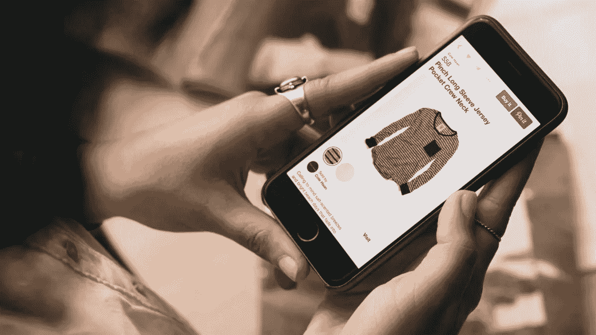

# 欢迎新的广告和商业团队加入 Pinterest

> 原文：<https://medium.com/pinterest-engineering/welcoming-new-ads-and-commerce-teams-to-pinterest-8684e728988c?source=collection_archive---------3----------------------->

Pinterest 的神奇之处在于，当你发现自己喜欢的东西时，你甚至不知道它的存在。我们称之为“构建意外收获”，这一切都由世界一流的工程提供动力，确保正确的 pin 在正确的时间被正确的 Pinner 发现。今天，我们正在通过收购[狩猎](https://www.thehunt.com/)和 [Pext](http://www.pext.me) 来加强我们将 Pinners 与偶然发现的 pin 和产品联系起来的能力，其中包括移动购物、广告和图像索引技术方面的一些最优秀的人才。

## 《狩猎》

在过去的两年里，狩猎已经建立了一个社区动力服务来寻找产品。狩猎联合创始人兼首席执行官蒂姆·韦恩加滕(Tim Weingarten)和一些核心产品团队带来了丰富的移动购物和发现产品经验，这些产品是 Pinterest 的一个受欢迎的补充，因为我们继续建立一个发现引擎，帮助人们发现、保存和购买他们喜欢的东西。欢迎，狩猎！

## Pext

Pext 是 OMG Labs 开发的一款应用，通过帮助用户即时发现与其信息相关的图片，将文本信息转化为模因。Pext 联合创始人 Harsh Goel 加入 Pinterest 时，在构建图像索引和广告技术、移动应用和发现产品方面拥有丰富的经验。欢迎你，Pext！

## 展望未来

随着超过 1 亿人使用 Pinterest 来规划他们的日常生活，我们有一个独特的机会来帮助 Pinners 发现对他们来说重要的想法和产品——从家居改造到最新风格再到礼物创意。Pinterest 上保存的所有内容中有 75%来自商业网站(零售商、出版商等)。)，品牌是发现过程的重要组成部分。无论是[推广的 Pin](https://business.pinterest.com/en/promoted-pins) 还是[可购买的 Pin](https://engineering.pinterest.com/blog/building-security-buyable-pins) 我们相信这些都会像平台上的数十亿有机 Pin 一样有趣和相关。随着狩猎和 Pext 产品团队核心成员的加入，我们可以更好地应对商业和货币化工程中的重大挑战和机遇。

如果您对解决商业和货币化挑战感兴趣，请加入我们！