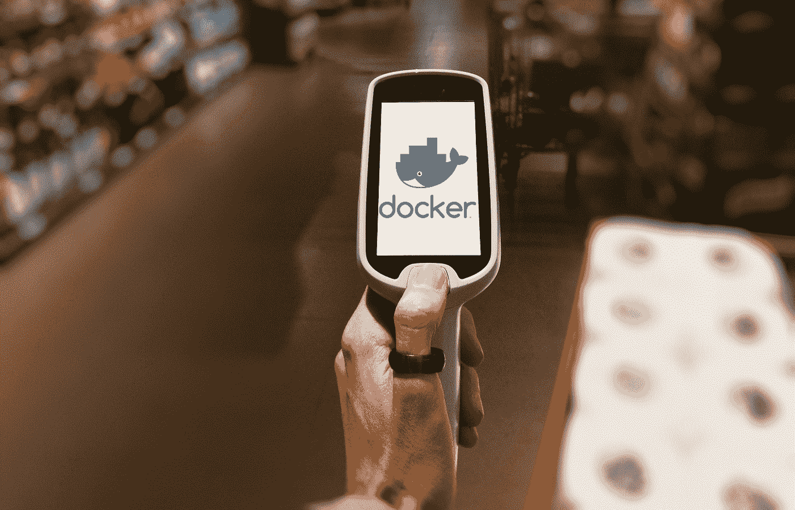
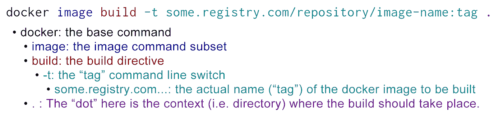

# 杂货店中的鲸鱼 Docker 文件和 Docker 图像介绍

> 原文：<https://medium.com/capital-one-tech/whale-in-the-grocery-store-an-introduction-to-docker-and-docker-images-311319688692?source=collection_archive---------0----------------------->



在我的上一篇文章 [*冰箱里的鲸鱼*](/capital-one-tech/the-whale-in-the-refrigerator-80f659fea1a4) 中，我介绍了 Docker，并介绍了从 Docker 注册表中提取图像和运行基本 web 服务器的基础知识。但愿那篇教程会让你问，*“那个码头工人的形象到底是从哪里来的？”*这就是我们将在本文中讨论的，构建并使用 Docker 图像。

# 更多鲸语

在上一篇文章中，我介绍了 Docker 词典的两个部分，**图像**(或**容器图像**)和**容器**。为了建立我们自己的码头工人形象，我们必须学习更多的术语。

*   **Dockerfile** :包含构建 Docker 映像所需的一组指令的文本文件。
*   **Docker Registry** :用于存储和分发 Docker 图像的存储库。
*   **Docker Hub** : Docker Inc .官方 [Docker 图片注册](https://hub.docker.com/)。

这些是相当简单的定义，但是它们的简单掩盖了它们的力量。

# 形象就是一切

Docker 容器图像是你可以用 Docker 做任何事情的基础，但是什么，*真正的*，是 Docker 图像呢？好吧，码头工人的形象是你想要的任何形象…但这仍然不是一个好的答案。

在上一篇文章中，我将运行 Docker 的计算机比作冰箱，指出了将食品容器放入冰箱和用 Docker 运行容器之间的相似之处。坚持食物的比喻，让我们从厨房转移到杂货店。


在杂货店，你通常从货架上买食物。所有相似类型的食物和/或配料被分组在一起(牛奶与牛奶、鸡蛋与鸡蛋、啤酒与啤酒等)。)然后你选择你想要的选项。当你站在一个特定的货架前时，你可能会拉下一个食物容器，看看它是否是你想要的东西，检查它是否有损坏，检查保质期，检查腐败，检查成分(有人对食物过敏吗？)，查看营养信息，甚至检查容器内是否有缺失的物品(谁想带着 11 个鸡蛋而不是 12 个回家？).如果商品符合您的标准，您可以将其放入购物车。当你找到所有你想要的东西时，你购买它们，把它们带回家，并最终把它们组合成一顿饭。

所有这些想法都适用于 Docker 图像。您可以使用 Docker Hub 购买 Docker 映像的基本成分。一旦你找到了一些合适的基础图片，你就把它们拉出来检查。明智的做法是检查 Docker 映像，看看它是否适合您的用例，检查潜在的安全漏洞，看看您需要添加什么来使您的用例工作，并确保映像中包含的软件是最新的。一旦你决定了一个基本图像，你就可以根据这些成分来构建你的 Docker 图像。

# 建造鲸鱼…成为鲸鱼

要建立一个新的码头工人形象，你需要几样东西。你首先需要的是 Docker(咄！).命令`docker image build…`用于构建实际的映像，但是首先您需要一个 Dockerfile 文件。

# 深度文档

Dockerfile 文件非常简单。它使用领域特定语言(DSL)来指示 Docker 在新生的 Docker 映像中做一些事情，例如将文件从主机复制到映像中的某个位置，或者运行 shell 命令。尽管如此，展示 docker 文件可能比描述一个 docker 文件更容易。

## 基本 Dockerfile 文件

```
FROM nginx:latest
ENV build_date='2019–03–29'
RUN mkdir -p /usr/share/nginx/html/
COPY index.html /usr/share/nginx/html/
EXPOSE 80
CMD ["nginx", "-g", "daemon off;"]
```

要处理的代码太多了，所以让我们一行一行地看一遍。

## `FROM nginx:latest`

FROM 命令对于每个 Docker 文件都是必需的，它告诉 Docker 新 Docker 映像的基础映像是什么——它实际上告诉 Docker 从哪里开始。这可以是您作为用户可以访问的任何以前存在的映像，包括您以前构建的映像。还有一种称为`[scratch](https://hub.docker.com/_/scratch)`的保留虚拟基础映像，它几乎不包含任何内容，用于构建基础映像或最小映像。

如果`FROM …`行中指定的映像不在构建 Docker 映像的系统中，Docker 将尝试从 Docker Hub 或指定的 Docker 注册表中`pull`该映像(稍后将详细介绍注册表)。如果 Docker 无法提取指示的图像，构建将会失败。出于这个原因，我发现在编写 Docker 映像构建脚本时预提取我的`FROM …`映像很方便。

## ENV build _ date = ' 2019–03–29 '

运行时,`ENV`命令在 Dockerfile 的上下文中和容器中设置一个环境变量。在这种情况下，如果我运行一个基于这个图像的容器并执行`echo $build_date`，它将返回`2019–03–29`。

***安全说明*** *:在构建时，不要使用* `*ENV*` *命令***将密码或其他秘密插入 Docker 映像，因为很容易从映像中检索到。有一些模式和工具可以在运行时检索 Docker 容器的秘密，但是这些超出了本文的范围。* [*如果你想了解更多关于集装箱安全的知识，这里有一篇极好的文章*](/capital-one-tech/secure-docker-containers-require-secure-applications-75eb358abef9) *。**

## *运行 mkdir -p /usr/share/nginx/html/*

*`RUN`命令可能是 docker 文件中最有用的命令之一。该命令在新生映像中执行 shell 命令。这个特殊的命令创建了一个目录`/usr/share/nginx/html/`，但是它的用途远不止于此。Docker 映像中可用的任何命令都可以在这里执行。*

*为了保持最终 Docker 映像的大小尽可能小，建议您使用`&&`或`;`将 shell 命令链接在一起，并尽量减少 Docker 文件中的`RUN`行。关于你为什么要这么做的更多细节，Docker 官方文档有一篇关于 Docker 文件最佳实践的文章。下面是一个示例运行行，显示了链接的命令:*

```
*RUN mkdir -p /usr/share/nginx/html/ && \
    adduser user && \
    chown -R user /usr/share/nginx/html*
```

*这个`RUN`命令非常强大，我仅仅触及了它的皮毛。你可以从[官方文档](https://docs.docker.com/engine/reference/builder/#run)中了解更多关于`RUN`命令的信息。*

## *复制 index.html/usr/share/nginx/html/*

*这一行告诉 Docker 将文件`index.html`从主机文件系统复制到我们正在构建的映像中的`/usr/share/nginx/html/` *。在这个例子中，我们将一个 html 文件(index.html)复制到默认 Nginx 图像中的默认网站代码位置。`COPY`指令也支持通配符和目录的递归复制。要使用通配符模式进行复制，请使用如下的`*.pattern`符号:`COPY *.html /usr/share/nginx/html/`。要复制一个目录及其所有内容，请确保目录名后面有一个斜杠(/)，如下所示:`COPY html/ /usr/share/nginx/html/`。**

## *暴露 80*

*`EXPOSE`指令是一个有趣的例子。根据[官方 Docker 文件引用](https://docs.docker.com/engine/reference/builder/)，`EXPOSE`通知 Docker，当这个镜像被实例化为容器时，*将在引用的端口上监听*，在本例中是 80。但是，当容器运行时，该端口不会自动*发布*(即对外开放)。您可能还记得在第一篇文章中，端口的实际发布是在执行`docker run`时用`-p`标志完成的。*

*相反，`EXPOSE`指令充当了映像构建者和从该映像运行容器的人之间的一种文档。换句话说，如果我在 other 文件中看到一个图像的`EXPOSE 80`，我知道在运行该容器时要在命令行中包含一个`-p 80:80`。*

*`EXPOSE`默认为 TCP，但也可以像这样指定 UDP`EXPOSE 10000/udp`。*

## *CMD ["nginx "，"-g "，"守护程序关闭；"]*

*Dockerfile 的最后一行是在实例化容器时，默认情况下应该在容器中运行的命令。在这个例子中，我们对`CMD`命令使用了所谓的 *exec* 表单。在 exec 形式中，我们为 CMD 命令提供了一个命令、命令行开关和参数的数组(`["nginx", "-g", "daemon off;"]`)。这种形式的优点是它*不执行命令周围的 shell* ，它直接执行命令。换句话说，它在运行时实际上执行`nginx -g daemon off;`。*

*该命令还有另一种形式，称为*外壳*形式。上面命令的 shell 形式类似于这样:`CMD nginx -g daemon off;`。这里的区别是 Docker 实际上是在你运行容器的时候执行`sh nginx -g daemon off;`，因此得名 *shell* form。使用 shell 形式的主要原因是，如果您需要将环境变量作为 CMD 命令的一部分进行评估。*

# *但是等等，还有呢！*

*这只是对 Dockerfiles 的一点尝试，我鼓励你学习更多。你可以随时查阅官方 Dockerfile 文档，但是了解 Dockerfiles 的另一个很好的资源是看看其他人用它们做了什么。如果你在 [Docker Hub](https://hub.docker.com/) 上找到一个有趣的 Docker 图片，通常会有一个链接指向用来构建该图片的 Docker 文件，以及它所属的 GitHub 库。此外，在这种情况下，谷歌确实是你的朋友。*

# *建立形象*

*现在我们有了一个 docker 文件，但是我们用它做什么呢？为了实际构建一个 Docker 映像，我们使用了`docker image build…`命令。在这种情况下，该命令类似于:*

**

*在这种情况下，我们指示 Docker 构建一个名为`image-name`的映像，其版本`tag`可以被推送到存储库`repository`中的`some.registry.com`。这就是`-t`标志所指示的，上面的示例命令演示了正确的命名方案。*

*这里有几个细节需要我们强调。首先出场的是`some.registry.com`。图像名称的这一部分是可选的。如果您关闭它并尝试推送图像，Docker 将尝试将图像推送到 Docker Hub，如前所述，Docker Hub 是 Docker Inc .的官方图像注册表。*

*接下来是名字的`/repository/`部分。如果您要将映像推送到 Docker Hub，这应该是您的 Docker Hub 用户名，也称为 DockerID，除非您有意将映像推送到共享存储库，在这种情况下，这应该是共享存储库的名称。如果您正在推进到另一个注册中心，比如一个内部托管的注册中心，您应该遵循该注册中心的 Docker 映像组织指南。*

*`image-name:`部分是你实际“命名”你的图像的地方。请务必注意，每个*Docker 映像都有一个唯一的映像 ID，它是在构建映像时生成的。然而，你可以给一个 Docker 图像起一个你想要的名字。我建议这个名称应该描述 Docker 图像的功能，但是如果您想将您的图像命名为 Bob，那就继续吧。**

*`:tag`部分是 Docker 术语中更强大的特性之一。名称的这一部分是自由格式文本，就像`image-name:`部分一样，但是通常用于跟踪某种版本。给定的 Docker 图像可以有许多标签。例如，我可以有一个标题为`my-repository/web-app:2019–02–06_0915`的图像，该图像的另一个版本标题为`my-repository/web-app:2019–02–15_1350`，第三个版本标题为`my-repository/web-app:2019–02–16_1500`。这些 Docker 映像中的每一个都有不同的映像 id，因为正如标签所暗示的，它们是不同的构建。*

*Docker 允许给定的图像 ID 有多个名称——可以把它们想象成别名。我有我的官方建筑名称`my-repository/web-app:2019–02–16_1500`，但我可以给这个图像命名为`my-repository/web-app:latest`。这两个名称将具有完全相同的图像 ID，并且根据定义还将包含完全相同的代码(事实上，图像数据在磁盘上没有复制，这两个图像名称指向磁盘上的相同位)。这里的巧妙之处在于 Docker 将`latest`标签视为默认标签，因此如果我`docker pull my-repository/web-app`，它将拉取`my-repository/web-app:latest`，即当前与`my-repository/web-app:2019–02–16_1500`相同的。*

**

*现在，假设我重新构建了我的 web 应用程序。构建系统创建映像`my-repository/web-app:2019–02–27_0950`和*，同时*将该映像重新标记(别名)为`my-repository/web-app:latest`，并将这两个映像名称推送到注册表中。这将覆盖图像`my-repository/web-app:latest`以指向`my-repository/web-app:2019–02–27_0950`的图像 ID，因此如果我`docker pull my-repository/web-app:latest`，我将得到`my-repository/web-app:2019–02–27_0950`。您还可以使用其他标签，如`:release`或`:qa`，它们也是最新版本的别名。这允许非常强大的发布自动化，包括非常容易的发布回滚以及金丝雀测试之类的事情。*

*该命令中另一个需要注意的细节是最后的`.`。最后一部分是“构建环境”——如果你喜欢的话，是“来自”。这将是 Docker 映像构建过程的根目录。非常重要的一点是，构建上下文*下的任何文件或目录都有可能在您的 Docker 映像*中结束。正是因为这个原因，你应该**永远不要**将`/`作为构建上下文，否则你可能会将整个硬盘复制到 Docker 镜像中！您甚至可能希望将 docker 文件保存在源目录之上的目录中。例如，假设您将 Docker 文件保存在存储库的根目录中，将实际的源代码保存在`./src`中，您将把`./src`作为构建的上下文，并传递命令行开关`-f ./Dockerfile`(以明确地告诉 Docker 在哪里可以找到您的 Docker 文件)。至少，这避免了意外地将 Docker 文件复制到 Docker 映像中。*

# *注册推送*

*这个链条的最后一环是 Docker 注册中心。我前面提到了注册表，但是需要注意的是 Docker 注册表是你分发 Docker 图片的方式。*

# *码头枢纽*

**

*Docker Inc .运营着一个名为 [Docker Hub](https://hub.docker.com/) 的注册中心。Docker Hub 是你可以找到软件开发者发布的“官方”Docker 图片的地方。这些官方映像分为几个类别，包括基础操作系统(Ubuntu、Debian、Alpine、CentOS、Fedora 等)、基础设施(Apache、Nginx、Registry、Kafka、RabbitMQ 等)。)，以语言为中心(Python，Go，Node.js，Java 等。)和数据库(MongoDB、Couchbase、Redis、PostgreSQL 等)。还有无数*非官方* Docker 图片可用。出于安全原因，我个人不建议使用非官方的图片。或者，我建议，如果你找到一个你喜欢的非官方图片，而不是拉图片，你应该找到基础 Github repo，看看他们的 Dockerfile。然后根据您的需要修改 docker 文件，并自己运行`docker image build…`。*

*如果你想把自己的图片推送到 Docker Hub，你必须注册一个账户，就像你在 GitHub 或其他类似服务上注册一个账户一样。注册后，您应该发出命令`docker login`,提示您输入 Docker Hub 用户名和密码。*

*登录 Docker Hub 后，您可以将图像推送到自己的存储库中。你还记得我说过，如果你要推 Docker Hub，你的 Docker Hub 用户名应该是你创建的任何 Docker 图片的`/repository/`部分吗？这就是为什么。*

> **如果您在映像名称的这一部分添加了 Docker Hub 用户名以外的内容，当您尝试推送您的映像时，可能会出现“拒绝访问”错误，因为您实际上是在尝试将 Docker 映像推送到其他人的存储库中。**

*`docker login`命令还有另一个用途。如果您或您的工作场所拥有一个内部 Docker 注册中心，您可以使用命令`docker login my.dockerregistry.com`登录该注册中心。然后，它将通过相同的用户名/密码提示，让您登录到您的内部 Docker 注册表。*

# *使劲推*

*现在我们已经完成了所有这些，我们终于可以将我们闪亮的新 Docker 图像推送到 Docker 注册中心了。执行`docker image push some.registry.com/repository/image-name:tag`。假设您已经登录并拥有推送权限，您将看到 Docker 连接到注册表并推送图像。真的没有更多的`docker push`。*

*一旦推送完成，您可以通过运行`docker image pull some.registry.com/repository/image-name:tag`将相同的映像拉至另一台计算机。*

# *我们建立了这个图像*

*在这篇文章和我的前一篇文章之间，我已经向你展示了所有基本的 Docker 函数。这包括`image pull`、`image push`、`image build`、`image rm`、`container run`、`container stop`和`container rm`。虽然关于 Docker 还有很多内容需要了解，但是您现在应该已经掌握了运行 Docker 容器和构建自己的定制容器映像的技能和足够的知识。如果你想继续学习更多关于 Docker 的知识，我建议你阅读关于优化 Docker 图像大小的文章，并开始研究多容器应用程序和 Docker 合成。另外，请关注我的下一篇文章！*

> *献给我的父亲尤金·穆恰罗内，在我写这篇文章的时候，他去世了。你总是推动我去超越，这就是结果。*

## *相关:*

*   *[安全 Docker 容器需要安全应用](/capital-one-tech/secure-docker-containers-require-secure-applications-75eb358abef9)*
*   *[使用多阶段构建来简化和标准化构建流程](/capital-one-tech/multi-stage-builds-and-dockerfile-b5866d9e2f84)*
*   *[冰箱里的鲸鱼 Docker 简介](/capital-one-tech/the-whale-in-the-refrigerator-80f659fea1a4)*

*披露声明:2019 首创一。观点是作者个人的观点。除非本帖中另有说明，否则 Capital One 不隶属于所提及的任何公司，也不被这些公司认可。使用或展示的所有商标和其他知识产权是其各自所有者的财产。*