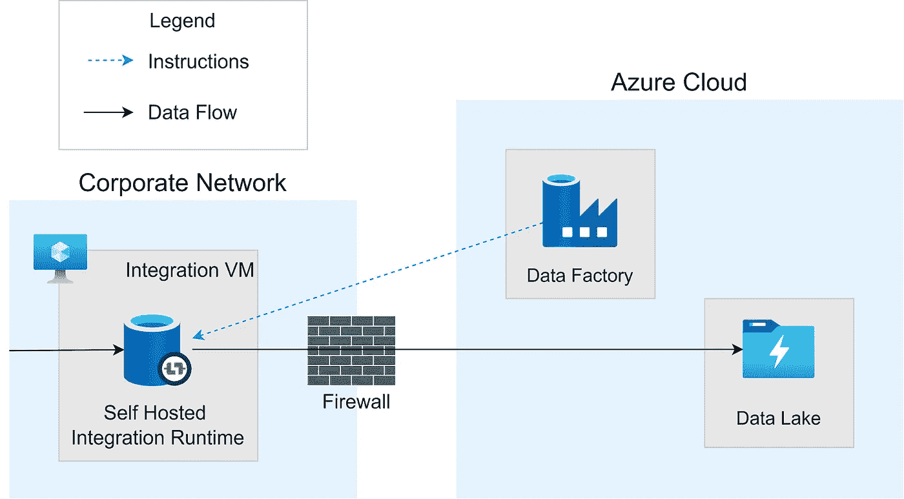
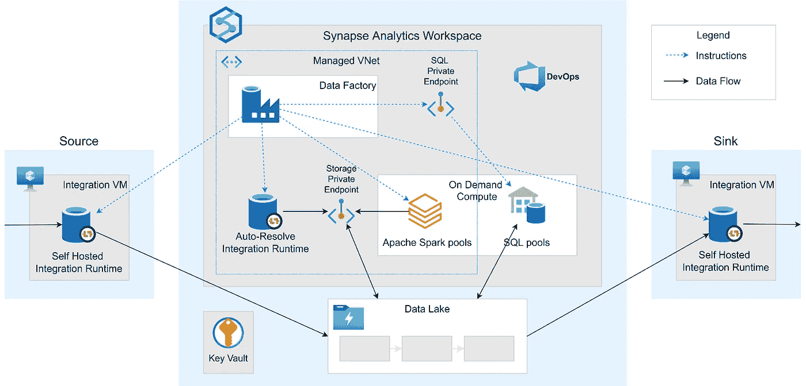

# 什么是集成运行时？

> 原文：<https://medium.com/version-1/what-are-integration-runtimes-da7d24db1174?source=collection_archive---------0----------------------->

## Azure 服务数据工厂、权限和 Synapse Workspace 都需要在您的网络中安装自托管集成运行时，它是什么，为什么我必须在本地安装它？

Photo by [JJ Ying](https://unsplash.com/@jjying?utm_source=unsplash&utm_medium=referral&utm_content=creditCopyText) on [Unsplash](https://unsplash.com/s/photos/pipeline?utm_source=unsplash&utm_medium=referral&utm_content=creditCopyText)

# 为什么我需要集成运行时？

当在云中部署需要来自现有内部网络的数据的服务时，您需要将该数据移动到云中，或者使其从当前位置对新的云服务可用。

任何网络都有防火墙来限制外部服务的连接，如果被授权移动数据，那些被允许访问网络的人必须得到网络身份服务的信任。

在实践中，如果数据移动发生在网络内部，它给予管理员更大的控制权，并允许更强的治理，使用组织内部控制的身份进行身份验证。

这就是集成运行时所提供的:计算能力，在您的网络中运行，被授予对数据源的适当访问权，并与控制它的云服务有信任关系。

云服务将指令传递给集成运行时，但是是集成运行时连接、认证和进行数据操作和移动。

除了解决网络和身份管理挑战之外，将该计算放在本地网络中还可以提高性能，并确保符合任何地理数据监管政策。

# **如何使用？**

在 Azure 中，数据工厂是最常用的数据移动服务，由针对数据运行活动的管道组成。“管道”这个名字可能会让你看到流经管道的数据。事实上，管道是一系列编排好的活动，它们实际上跨多个集成运行时运行。

数据工厂向负责数据操作和移动的集成运行时发出指令。

Integration Runtime moving the data

一个重要的安全考虑是如何输入每个数据源的凭证，以及它们存储在哪里。正如我们所期待的那样，微软对此处理得很好，在发布管道时，使用 Windows 数据保护应用程序编程接口(DPAPI)对凭据进行加密，然后本地保存到托管集成运行时的虚拟机。

数据工厂不是使用集成运行时的唯一服务。
权限是一个数据目录，需要收集每个数据源的元数据。这可以被认为是数据工厂的一个专业实现，其中唯一移动的数据是元数据。因为这是每种类型数据源的标准，所以除了设置集成运行时之外，不需要进一步的配置。

# 我需要多少？

答案一般和你有多少网络一样。更准确地说，考虑到大多数数据移动是在网络之间进行的，因此每个集成运行时都需要访问它所负责的任务的源和接收器。

用一些视觉效果来解释这一点要容易得多，所以让我们假设您正在将数据从本地网络转移到一个新的云环境中。与所有数据移动一样，您可能需要在途中进行一些转换或验证。为此，我们使用 Azure Synapse AnalyticsSynapse 是几个 Azure 服务(包括数据工厂)组合成一个平台，用于移动和操作数据。

Synapse Workspace highlighting Data Factory and the Integration Runtimes

在这里，您可以看到有一个集成运行时安装在:

1.  提取数据的源网络。
2.  汇聚网络将数据移动到其目的地。
3.  任何转型活动的 Synapse 分析网络。这被称为自动解决，因为它不需要单独管理。

即使接收器在云中，它也会在防火墙后面的离散网络中，因此仍然需要集成运行时，以便数据工厂访问它。

# 它能连接到任何东西吗？

集成运行时支持的数据源&服务[有一个庞大的列表](https://docs.microsoft.com/en-us/azure/data-factory/copy-activity-overview#supported-data-stores-and-formats),但是在安装这些软件的虚拟机上可能需要一些额外的软件，例如:

*   Oracle 数据访问组件(ODAC)
    如果需要与 Oracle 数据库交互
*   【Java 运行时环境(JRE)如果需要读/写拼花文件格式

# **如果我们需要规模怎么办？**

如果有大量数据要移动，或者有一个时间紧迫的要求，那么可能需要增加集成运行时的计算能力，为此有几个选项:

*   通过跨多达 4 台机器(节点)部署来共享负载，从而横向扩展集成运行时。
*   纵向扩展主机虚拟机 CPU 或 RAM。
*   通过允许更多作业并发运行，提高集成运行时级别。

具体选择取决于数据量、数据源数量和移动频率，但是您还必须考虑数据源提供数据的能力。如果数据源受到约束，那么增加集成运行时的容量将不会带来什么回报。

**关于作者**

*Carl Follows 是版本 1 的数据分析解决方案架构师。关注我们的媒体出版物，了解更多数据博客，或访问*[*www.version1.com*](http://www.version1.com)*了解更多关于我们服务的信息。*